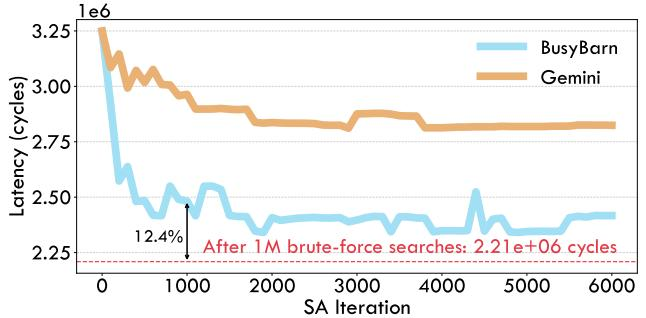

# E. End-to-End Performance

We select six popular models for our end-to-end latency evaluation: GPT-NeoX-20B, OPT-30B, Qwen3-MoE-30B, Qwen3-32B, Qwen2-MoE-57B, and Llama-3-70B. The first two models adopt conventional decoder architectures with multi-head attention blocks [69], while the latter four use RMS-Norm and group-query attention blocks to reduce computation overhead [21]. As target wafer-scale systems, we use three hardware topologies with different die counts and shapes: HW1 with a  $5\times5$  mesh similar to Dojo [65], HW2 with a 7×12 mesh similar to Cerebras [44], and HW3 with an  $8\times8$  mesh of our own design. We test three sequence lengths— 512, 2048, and 8192—to cover both prefill and decode stages, which exhibit very different computation and communication patterns. The system configurations are summarized in Table I. The baseline combines Tangram's ZigZag inter-die mapping, Gemini's intra-die mapping, and XY-YX-FT routing; results are shown in Fig. 12.

BusyBarn achieves  $1.17-1.84 \times$  end-to-end latency speedup over the baseline on HW1,  $1.08-2.14 \times$  on HW2, and 1.17-

Fig. 13: Comparison of convergence behavior. The dashed red line indicates the strong reference value obtained from one million random search attempts, and the black arrow marks BusyBarn's performance after 1,000 iterations.

 $1.88\times$  on HW3. The results show that BusyBarn adapts effectively to different hardware configurations and consistently achieves lower end-to-end latency. The speedup is significant for both small and large models: the proposed mapping considers both communication distance and device workload, while BALD further reduces communication overhead. The geometric mean speedup over the baseline is  $1.40\times$  on HW1,  $1.35\times$  on HW2, and  $1.45\times$  on HW3 across all models and sequence lengths, with an overall geometric mean of  $1.40\times$ .

#### F. Convergence and Performance Comparison

To evaluate convergence and the gap to a strong reference, we conduct a convergence experiment using Qwen2.5-7B on a small-scale topology and compare against a reference obtained via random search. The target die is organized as a  $2\times 2$  mesh. Even when partitioning the FFN with degree 16, the resulting four operators yield a search space of  $(4!)^{16}\approx 1.21\times 10^{22}$ . Since exhaustively solving an NP-hard problem of this size is intractable, we perform one million random samples and take the best as a strong reference. As shown in Fig. 13, Busy-Barn comes within 12.4% of this reference after only 1,000 iterations, demonstrating faster and more stable convergence thanks to its well-designed loss function.

#### G. Ablation Study

To further investigate the benefits of mapping and communication scheduling, and to expose practical bottlenecks in end-to-end inference, we perform ablation studies on a DOJO-style WSC-LLM hardware platform. The system consists of a  $6\times 8$  array of dies, where each die contains a  $16\times 16$  compute layout and delivers 1.02 TFLOPs of BF16 throughput. Each die occupies a physical area of 21.29 mm  $\times$  22.81 mm [73], and every edge of a compute die supports 1.5 TB/s of die-to-die interconnect bandwidth. Using this platform, we evaluate the inference performance of Qwen2.5-32B at a sequence length of 4096, as shown in Fig. 14.

To highlight the role of communication overhead during inference, we compare our proposed dataflow-based design against a bulk-synchronous execution mode. Under bulk-synchronous execution, dependent computation and communication operations are strictly serialized and cannot overlap.

Fig. 14: Ablation study of BusyBarn.

This comparison directly quantifies the end-to-end performance gains enabled by communication—computation overlap. For instance, after tensor-parallel (TP) computation, the dataflow-based scheme allows reduce-scatter to start as soon as the partial sums produced by an individual compute tile become available, whereas under bulk-synchronous execution the reduce-scatter operation is delayed until the entire matrix multiplication has completed.

First, comparing the communication breakdowns between the dataflow-based and bulk-synchronous modes reveals that blocking communication significantly increases the fraction of time spent solely on communication. The green region in Fig. 14 represents the pure-communication ratio, i.e., the portion of execution time during which no compute units are active. Even under bulk-synchronous execution, certain communication operations can still overlap with computations that are free of dependency constraints; for example, during attention computation, the broadcast of the K weights can overlap with the computation of Q. Consequently, the actual communication cost must be evaluated by accounting for both the overlapped and the pure-communication portions.

We further analyze the results across four mapping/routing combinations. From left to right, the configurations are Gemini Mapping + XY routing (G+XY), BusyBarn Mapping + XY routing (B+XY), Gemini Mapping + BALD routing (G+BALD), and BusyBarn Mapping + BALD routing (B+BALD). Under our ablation setting, BALD's communication optimization reduces overhead and end-to-end latency more substantially than mapping improvements alone. Although the fraction of pure communication time appears relatively small —and removing it alone may therefore seem to have limited impact—inference is governed by a computation DAG of many interdependent computation and communication operators. Optimizing communication shortens the communication stages on the critical path, enabling downstream computation to start earlier and ultimately reducing the overall inference cost.

These results indicate that communication optimization is critical for LLM inference on wafer-scale systems. While the mapping objective tends to minimize overall communication distance and thus reduces the headroom available to communication scheduling, further optimizing communication on top of a strong mapping remains both necessary and effective,

Fig. 15: Runtime Breakdown for BusyBarn. The gray arrow indicates the program execution order.

providing additional performance benefits.

#### H. Runtime Breakdown

We present the runtime breakdown for the ablation experiment in Sec. VI-G, totaling 1225.3 seconds on a single Intel(R) Xeon(R) Gold 6348H core, as shown in Fig. 15. For path profiling, we process paths in descending order of length, reusing intermediate results from longer paths to avoid redundant iterations for shorter ones. The mapping stage accounts for 79% of the total runtime, while backend simulation contributes 14.3%. Mapping dominates execution time for small topologies, but as the topology scales, path profiling and backend overhead grow significantly due to the increasing number of events and devices.

#### VII. RELATED WORK

**LLM Parallelism.** Hybrid parallelism is a key strategy for scaling LLMs across thousands of devices, combining data, tensor (model), pipeline, sequence, and context parallelism for efficient training and inference. Systems such as Megatron-Turing NLG [63], DeepSpeed [2], Colossal-AI [39], and MegaScale [30] show that these hybrid strategies can jointly optimize memory footprint, communication, and throughput. For example, 3D parallelism [62] integrates data, model, and pipeline parallelism to balance load and reduce idle time, while sequence parallelism partitions long sequences to better utilize memory in attention layers. However, specifying and deploying hybrid parallelism remains challenging, especially on emerging platforms such as wafer-scale systems, where rigid mesh topologies and high inter-die communication costs constrain flexible parallel patterns. Alpa [80] proposes a general tensor-splitting framework, but its fixed communication templates are not adaptive to hardware geometry, limiting efficiency on topologically constrained or irregular systems. As a result, the description, optimization, and hardware-aware mapping of hybrid parallelism remain open research problems.

**Operator Mapping.** Mapping tens of thousands of operators onto thousands of cores is NP-hard, making high-quality solutions difficult to obtain under tight time constraints. Prior work [19], [45], [66], [82] focuses on finely tuned dataflows for systolic arrays at the matrix-multiplication level. Other systems, such as Gamma [31] and Gemini [10], use heuristics such as Genetic Algorithms (GA) and Simulated Annealing (SA) to map operators on many-core architectures, achieving

good performance but largely ignoring the parallelism granularity of LLMs, which yields a much larger search space. Approaches such as CoSA [27], Klotski [5], and Alpa [80] formulate mapping as an Integer Linear Programming (ILP) problem, but are easily limited by search-space size and problem complexity. Reducing the search space and improving mapping efficiency therefore remain central challenges for LLM implementation.

Communication Optimization. For LLMs with over 100B parameters deployed on hundreds or thousands of devices (GPUs or dies), optimizing collective communication is a major bottleneck [26], [37], [42], [56], [70]. TTO [37], 2D AllReduce [77], and TidalMesh [42] target AllReduce on 2D meshes to maximize effective bandwidth, but are specialized to AllReduce and do not handle faults. Topology-agnostic schemes such as MultiTree [26] and TACOS [70] also focus primarily on AllReduce rather than All-to-All or general multicast traffic. Many hardware platforms instead rely on redundant logic for fault tolerance [44], incurring substantial area and resource overhead. Consequently, a topology-agnostic communication algorithm that jointly handles collective and multicast traffic with fault tolerance is still needed for wafer-scale LLM deployment.

#### VIII. CONCLUSION

In this work, we focus on achieving efficient and faulttolerant LLM inference on wafer-scale systems. We propose a hierarchical mapping strategy that jointly optimizes inter- and intra-die parallelism, reducing search complexity by simultaneously considering communication and computation latencies. To further reduce communication overhead under faults, we introduce BALD, a flexible routing algorithm that leverages dataflow techniques to tolerate both node and link faults. We develop a topology-agnostic framework that employs LR notation to cleanly represent slicing and dependency relationships among LLM operators. Our methods are evaluated with a cycle-level event-driven simulator, and the results show significant performance gains: BALD achieves the highest effective bandwidth among collective-communication baselines, and BusyBarn as a whole delivers a maximum end-to-end speedup of  $2.14\times$  and a geometric-mean speedup of  $1.40\times$ over state-of-the-art baselines.

#### ACKNOWLEDGEMENTS

We thank the anonymous reviewers for their valuable comments and suggestions. We sincerely thank Yanhua Chen for his help in data processing and figure preparation. This work was supported in part by the National Key R&D Program of China (No. 2024YFB4505800), the National Natural Science Foundation of China (No. 62402411), the Guangdong Basic and Applied Basic Research Foundation (No. 2023A1515110353), the Guangdong Science and Technology Department (No. 2025A0505000023), and the Guangdong Provincial Project (No. 2023QN10X252).

