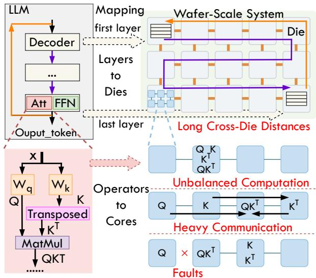

# I. INTRODUCTION

Large Language Models (LLMs) [8], [16], [74], [75] have become pivotal across a wide spectrum of applications, from generative tasks [18], [46], [52] to complex multimodal [36], [48], [60], [71] and reasoning workloads [16]. To achieve state-of-the-art performance, LLMs continue to scale their model sizes, exemplified by Llama 3.1 [21] with 405 billion parameters and Pangu Ultra [76] with 135 billion parameters, requiring thousands of GPUs [13], [16] or NPUs [54], [78] for training and inference. For LLM inference, throughput and efficiency are bounded by limited High-Bandwidth Memory (HBM) capacity and the interconnect performance of individual accelerators. Scaling via conventional switch-based GPU systems faces diminishing returns: sharded activations and an ever-growing KV cache induce substantial multi-hop traffic and fabric oversubscription, pressures amplified by long-context and LLM agent workloads [72] that demand substantially higher memory capacity and bandwidth.

To address these challenges, wafer-scale integration (WSI) offers a revolutionary approach, providing significantly more

Fig. 1: Challenges in wafer-scale LLM deployment. Inter-die mapping (layers to dies) may induce long-distance communication during decoding (yellow arrow). Intra-die mapping (operators to cores) may cause unbalanced computation work load, heavy communication load, and unreachable cores under faults (red crosses).

computation and memory resources through a unified substrate with high-density, low-latency mesh interconnects. WSI can be achieved through different methods. One approach involves fabricating a large processor monolithically on an entire silicon wafer, such as the Cerebras Wafer-Scale Engine (WSE), which integrates hundreds of thousands of AI-optimized cores and large amounts of SRAM [44]. The alternative, and the focus of this work, is wafer-scale chiplet integration. This approach leverages advanced packaging technology to fabricate wafer-scale processors with high compute density [73], using densely packed arrays of interconnected known-good compute and memory dies. We adopt this design as our target platform.

Deploying LLMs on wafer-scale systems demands finegrained parallelism strategies such as tensor and pipeline parallelism [62]. These strategies rely on precise data partitioning, mapping, and scheduling across massive core arrays, posing significant scalability and efficiency challenges. Prior work has explored various optimizations in modeling, mapping, and scheduling [5], [9], [10], [19], [45], [66], [82], but these techniques are not tailored to the unique partitioning and communication characteristics of Transformer-based LLMs, particularly the intensive, recursive data dependencies of autoregressive decoding. This mismatch results in substantial performance loss. As shown in Fig. 1, the long inter-die communication distance between the last and first layers during decoding induces significant overhead and contention. Furthermore, the complex structure of the decoder also brings challenges to intra-die mapping and communication optimization.

Wafer-scale chips also face inherent reliability challenges due to their massive scale, where manufacturing defects and runtime faults are common. For example, both NVIDIA H100 and Cerebras WSE-3 exhibit defect rates around 0.001 per mm2 [35].While redundancy is a typical approach for fault tolerance, such as spare core and interconnects in Cerebras WSE [11], it incurs substantial hardware overhead. Communication-path-based methods, such as traffic rerouting in Google TPUv4 [83], are thus appealing as they minimize additional manufacturing overhead while enabling defective chips to approach nominal performance.

However, existing communication optimizations for LLM inference focus primarily on latency or bandwidth reduction, neglecting the joint need for efficiency and fault tolerance—both critical for wafer-scale systems. Methods like TidalMesh [42] and WaferLLM [24] perform well only on ideal, symmetric networks. They falter once failures break mesh regularity, and the carefully optimized mappings adopted to recover performance themselves introduce complex, nonuniform point-to-point and multicast traffic patterns that further compound the problem. Therefore, a critical opportunity remains to optimize LLM mapping and communication strategies on wafer-scale systems. Effective deployment requires jointly optimizing inter-layer (pipeline) and intra-layer (hybrid parallelisms in Section II-A) mappings to maximize massive core utilization and minimize communication overhead. Additionally, link allocation must achieve both high communication performance and robust fault tolerance in the presence of manufacturing defects and runtime errors.

To address these integrated challenges, we introduce Busy-Barn, a comprehensive framework featuring novel mapping and communication optimizations to enable efficient and faulttolerant LLM inference on wafer-scale systems. BusyBarn introduces a hierarchical simulated annealing (SA) mapping methodology and the Balanced Allocation with Load and Distance awareness (BALD) algorithm for communication optimization. Our key contributions are summarized as follows:

- We propose a hierarchical simulated annealing strategy that jointly optimizes inter-die and intra-die mapping. This method explicitly considers the autoregressive decoding nature of LLMs at the inter-die level to reduce long-distance communication and leverages hybrid parallelism at the intra-die level to maximize core utilization.
- We introduce the Balanced Allocation with Load and Distance awareness (BALD) algorithm, which optimizes general point-to-point and multicast by balancing network load and minimizing distance. It supports standard col-

- lective operations and irregular communication patterns, simultaneously optimizing latency and throughput while naturally enhancing fault tolerance.
- We conduct comprehensive evaluation across multiple wafer-scale configurations, demonstrating that our approach achieves up to 2.14× speedup over state-of-the-art techniques, delivering both robust fault tolerance and high communication efficiency.

