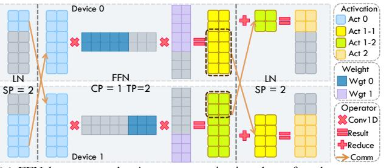

# III. BUSYBARN FRAMEWORK

This section introduces the BusyBarn framework, beginning with Location Relationship notation, a formal dataflow representation of the computation and communication dependencies in LLMs. We then provide a framework overview, describing the multi-stage pipeline used to transform model parameters

(a) FFN layer example. Act means activation data of each operator, while Wgt means weight data of Conv1d.

(b) FFN layer event timeline. Comm indicates communication here. Each gray box represents execution sequences on a device/link.

Fig. 3: FFN data notation and event example.

and hardware topologies into optimized, fault-tolerant execution schedules.

