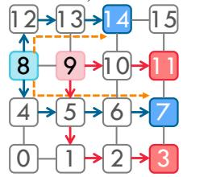
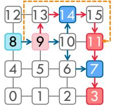

# V. COMMUNICATION SCHEDULING

Wafer-scale chips with a hierarchical 2D mesh interconnect pose distinct challenges for LLM deployment compared to GPU clusters. Irregular node degrees [14] and heterogeneous on-/off-die bandwidths break symmetry for collective communication. Under hybrid parallelism, communication is dominated not by global collectives but by region-restricted collectives and multicast (i.e., localized point-to-point and regional broadcast exchanges). Standard XY routing handles these poorly, causing contention and costly detours, especially under faults. This necessitates link-allocation algorithms specifically optimized for such point-to-point and multi-group multicast patterns to achieve a balanced LLM deployment.

#### A. Case Study

We conduct a case study on a  $4\times4$  mesh topology to illustrate the challenges of scheduling two concurrent multicast communications. The two simultaneous communication events are shown in Fig. 7. Task 1 originates at node 8 and targets nodes 14 and 7, while Task 2 originates at node 9 and targets nodes 11 and 3. We assume that the two tasks carry the same amount of data and have no dependencies on one another.

The XY routing sends data first along the x-axis and then along the y-axis. In Fig. 7a, the shared use of links (9,10),

(a) X-Y routing (L-shape block in orange indicates hot-spot area with contention)

(c) Multipath routing (two orange lines show routing paths for 8→14 and 8→7)

(b) Detour routing (orange line refers to non-minimal path for 9→11 routing)

(d) A better routing which brings balanced traffic with minimal paths

Fig. 7: Two multicasts on a 4×4 mesh: one from node 8 to nodes 7 and 14, and another from node 9 to nodes 3 and 11.

(10,11), and (11,7) causes contention and increased latency. Although XY routing is general-purpose and shortest-pathbased for mesh topologies, identical or overlapping paths among tasks can cause severe bandwidth contention.

Introducing detours [1] avoids link conflicts via global path planning or local next-hop decisions. As shown in Fig. 7b, Task 2 avoids the conflict by taking a different path that bypasses (9,10) and (10,11). Since (11,7) is still required, Task 1 also detours at node 10 via (10,6) and (6,7) instead of (10,11) and (11,7). Detouring rebalances traffic across alternative paths, improving bandwidth utilization [68], but at the cost of increased path length and potentially higher latency.

Multipath routing (Fig. 7c) mitigates multicast contention by using diverse paths instead of reusing links [17]. It improves robustness by localizing contention without sacrificing overall throughput. However, it is best suited for small-scale multicasts. With many targets, the source node's ports may saturate, leading to network-wide contention.

