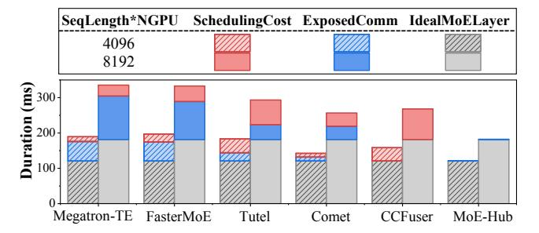
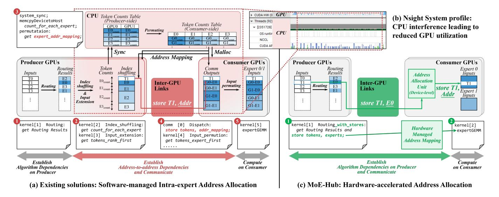

# *A. MoE Structure and Expert Parallelism*

MoE model replaces the dense Transformer feed-forward network (FFN) with a set of experts and a router that sparsely activates only a small subset of experts per token, enabling substantial capacity scaling with bounded per-token compute [12], [13], [31], [53], [56]. The architecture is widely recognized by the research community [2], [16], [18]–[20], [23], [26], [32], [34], [52], [57], [61], [67], industry [4], [9], [36], [49], [50], [69], and hardware vendors [3], [41], [42], [46] as a promising approach for scaling LLMs. MoE scaling relies on expert parallelism (EP), which shards experts across GPUs or nodes to manage growing parameters. This introduces all-to-all collectives whose efficiency becomes the bottleneck limiting end-to-end throughput at scale.

Fig. 2 illustrates a typical execution of a distributed MoE layer, consisting of five essential steps in the algorithm [61]: 1 Routing. The output token sequence from the attention module is partitioned and distributed across GPUs along the sequence dimension. These tokens first pass through a routing network to determine expert assignments, typically involving a gating network to compute token–expert scores, followed by normalization and selection of the top-k experts [13], [55], [56]. 2 All-to-All Dispatch. Each token is dispatched to the selected experts, with the dispatch phase in EP forming a nonuniform all-to-all communication across GPUs. 3 Experts Computation. Each expert performs computation on its tokens, including two GEMM operations with an activation function in between. 4 All-to-All Combine. The reverse of dispatch that transfers tokens back to their original positions, forming another all-to-all communication in EP. 5 Scaling. Each token aggregates outputs from experts through a weighted sum, with weights from the expert scores computed during routing.

TABLE I: Coding Effort: SOTA vs. MoE-Hub.

| MoE Systems   | Address Resolution | Scheduling (host / device) | Communication (host / device) |
|------------------|-----------------------|-------------------------------|----------------------------------|
| CCFuser [61]     | CPU                   | 603 / 211                     | 24 / 34                          |
| Comet [67]       | CPU                   | 6347 / 5589                   | 1197 / 1305                      |
| DeepEP [69]      | CPU                   | 1604 / 3326                   | 498 / 1899                       |
| FlashDMoE [2]    | GPU                   | 720 / 1706                    | 513 / 1137                       |
| Primus-Turbo [3] | GPU                   | 1341 / 853                    | 386 / 2260                       |
| MoE-Hub (ours)   | GPU                   | 0                             | <10 (store insts.)               |

Fig. 3: MoE performance gap to ideal (Mixtral-8 $\times$ 7B on 8  $\times$  H800), dominated by software scheduling and exposed communication.

#### B. The Challenge of Overlapping in Expert Parallelism

Costly dispatch and combine communications across devices significantly degrade MoE model performance. A common strategy to mitigate communication latency is to overlap it with computation. Existing approaches broadly fall into two categories, each with inherent limitations when applied to the dynamic and irregular patterns of MoE models.

- 1) Coarse-Grained Overlap: Early efforts achieve overlap at the computation-graph level by pipelining tensor slices [16], [19], [57], [68], where input tensors are partitioned into smaller slices and processed in a pipelined manner, enabling the computation and communication of different slices to proceed concurrently. However, MoE's dynamic routing mechanism causes varying expert selections for each input, leading to fluctuating communication volumes and changing expert computation workloads. Unlike static scheduling in other parallelisms, such as tensor or pipeline parallelism, where coarse-grained computation and communication can be effectively overlapped, this inherent variability often introduces pipeline bubbles in tensor-slicing pipelines. With kernel launch overhead limiting the number of slices, the bubble problem can become significant and cause severe resource under-utilization.
- 2) Fine-Grained Overlap: Recent studies demonstrate a trend toward finer-grained overlap, where scheduling occurs at the tile or instruction level. These works can be further divided into two sub-categories by implementation strategy.
- a) Kernel Fusion with Software-Managed Pipelines: This approach coordinates computation and communication within fused kernels through software-managed pipelines [2], [61]. Programmers typically rely on a global address space abstraction and implement fine-grained inter-device communication using low-level memory access semantics, such as one-sided communication APIs provided by libraries (e.g.

NVSHMEM [47]), or issuing direct peer-to-peer (P2P) memory requests between supported devices [40].

b) Tile-Level Scheduling with Dedicated Resources: Another line of work seeks to avoid repeatedly re-implementing low-level communication details by scheduling computation-communication overlap at the tile level [67]. A common approach is to dedicate a subset of streaming multiprocessors (SMs) exclusively to communication, while the remaining SMs perform computation, with synchronization signals manually implemented between the two groups.

While these fine-grained methods represent a significant advance over coarse-grained pipelining, they impose substantial software complexity and non-negligible performance overheads, which we analyze in depth in the next section.

#### C. Analysis of Existing Solutions and Their Limitations

Before analyzing existing solutions, we define an *ideal MoE layer* as performing only the essential operators on local tokens (routing, expert computation, and scaling), with dispatch and combine communication fully hidden and no additional steps. This allows us to separate the core algorithmic requirements from the implementation-specific overheads.

- 1) Heavy Software Engineering Burden: To quantify the software engineering burden, Table I analyzes the lines of code (LoC) dedicated to scheduling and communication in state-ofthe-art systems, excluding the core MoE operations of an ideal MoE layer. The results show that scheduling overlap pipelines, involving SM coordination, memory barriers, and kernel launch ordering, require substantial code, with even leaner systems needing hundreds of lines. Furthermore, fine-grained communication is inherently complex, as demonstrated by DeepEP [69], a dedicated All-to-All communication library, which requires extensive device code to ensure efficient inter-GPU data movement. In stark contrast, our proposed MoE-Hub requires almost no scheduling code and only minimal communication instructions, demonstrating the potential of a hardware-native abstraction to drastically reduce software complexity and improve portability.
- 2) Intrinsic Performance Overhead: Beyond development cost, the runtime overhead of software scheduling imposes a performance ceiling. Fig. 3 decomposes the end-to-end performance gap between state-of-the-art systems and ideal implementation with *ideal MoE layers*, highlighting two key observations. First, a large portion (in red) is attributed to algorithm-unrelated software scheduling overhead, including extra data manipulations, synchronization between devices, and multiple kernel launch latencies. Second, a substantial fraction (in blue) remains as exposed communication that cannot be fully overlapped due to the inflexibility of software pipelines in handling dynamic, fine-grained data flows. Collectively, these overheads account for over 24% of the total MoE layer time, even in highly optimized implementations. It is not merely an implementation artifact but a direct consequence of fundamental misalignment between MoE algorithms and modern GPU communication model. As system scale and

Fig. 4: From software-mediated address resolution (a, b) to hardware method (c), MoE-Hub eliminates heavy software overheads.

model heterogeneity grow, this overhead will amplify, limiting the efficiency and scalability of MoE models.

