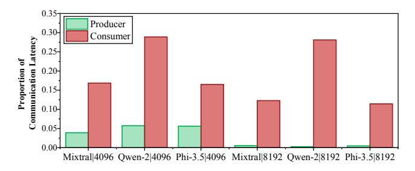

# C. Design Philosophy

Guided by these insights, our design philosophy is to offload the root causes of overhead into a dedicated hardware substrate, thereby introducing a new communication abstraction that is native to the MoE workload.

The cornerstone of this philosophy is a shift from an address-centric to a destination-agnostic communication

Fig. 6: Proportion of communication latency on both producer and consumer sides of dispatch phase.

paradigm. As illustrated in Fig. 4(c), we decouple data transfer from address allocation. This allows a producer to initiate a transfer immediately upon obtaining a token's routing result Expert ID, along with the GPU ID hosting that expert, without knowing its final memory address. The consumer's hardware then dynamically allocates a local address upon the data's arrival. This decoupling alone eliminates the mediation phase previously required for address resolution.

However, to make this core abstraction efficient and transparent, the hardware substrate must be extended with three key capabilities, which form the pillars of our co-design stack:

- A logical addressing and on-demand allocation mechanism to manage the dynamic mapping from routing results to memory addresses on the consumer side.
- A runtime packet management unit on the producer side to schedule the fine-grained, irregular traffic.
- A hardware signaling mechanism on the consumer side to replace software polling by automatically triggering computation once its required data arrives.

By co-designing the instruction set, the microarchitecture, and the runtime system around these pillars, MoE-Hub enables transparent, fine-grained overlap without requiring low-level software orchestration, directly addressing the aforementioned semantic mismatch and management inefficiencies.

## D. Architectural Pillars

Translating our design philosophy into a practical architecture relies on three co-designed pillars that collectively decouple communication from address allocation and manage fine-grained data flows transparently. These pillars form the core of our hardware innovations.

- Destination-Agnostic Communication ISA: This pillar breaks conventional ISAs' address-centric limitation by introducing a new store instruction that encodes a logical destination (e.g., Expert ID), coupled with a consumerside Address Allocation Unit (AAU) for hardware-based address assignment upon data arrival. This co-design eliminates the costly mediation phase, enabling smooth and low-overhead producer-consumer data transfers.
- Hardware-Accelerated Packet Management: This pillar tackles the inefficiency of fine-grained, irregular token emissions through a hardware-based Runtime Packet Manager (RPM). This unit reshapes the outgoing traffic

- by partitioning packets by destination, coalescing them into interconnect-friendly bursts, and scheduling transmissions to balance load while prioritizing critical data, transforming irregular streams into efficient flows.
- Fine-Grained Hardware Signaling: This pillar replaces software polling with a hardware-based *Data Availability Manager (DAM)*. The DAM tracks fine-grained data dependencies and uses write acknowledgments to dispatch consumer thread blocks immediately upon data arrival, eradicating polling overhead and freeing valuable compute resources.

