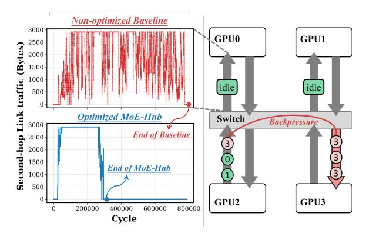

# III. INSIGHTS AND DESIGN PHILOSOPHY

Our analysis in Sec II reveals that software-based overlap techniques incur heavy overhead. We identify that this overhead stems from two fundamental sources: a semantic mismatch between the algorithmic and hardware communication models, and the inherent inefficiency of software in managing fine-grained, dynamic data flows. In this section, we distill these problems into core insights and present the overarching design philosophy of MoE-Hub, which guides our holistic hardware-software co-design.

## *A. Insight I: Mismatch in Producer-Consumer Abstraction*

The root cause of software complexity lies in a fundamental semantic mismatch between the *dynamic, irregular* tokento-expert dependencies in MoE algorithms and the *static, address-to-address* communication model enforced by GPU hardware. The MoE routing algorithm only determines which expert on which GPU should process a token; it does not specify the token's exact position within the expert's input tensor. However, inter-GPU communication, which operates on a direct memory access model with load/store semantics, requires the producer to know the precise destination memory address before any data transfer can occur.

The mismatch forces a costly software mediation phase to compute memory addresses before initiating an All-to-All dispatch. Fig. 4(a) illustrates a CPU-coordinated example. Although the routing result is already available, e.g., token T1 should be sent to expert E0 on GPU2, the token still cannot be transmitted immediately, because its exact destination address in remote GPU remains unknown. Computing this address forces a complex procedure: all tokens synchronize, shuffle, and await CPU-driven memory layout before deriving per-token offsets. With the root cause being the need to resolve addresses at runtime, this tortuous data flow creates software complexity and overhead, as profiled in Fig. 4(b).

An alternative is to adopt a fully GPU-resident mediation stack, e.g., back-to-back index all-gather and data all-to-all collectives like Primus-Turbo [3], or fused kernels like FlashD-MoE [2]. However, these approaches still require dynamic address coordination and merely shift the aforementioned software complexity to CUDA code. For example, the second all-to-all phase in back-to-back designs cannot utilize a standard library operator and must be hand-crafted for irregular, runtime-dependent message sizes and issue timing, complicating communication overlap. As shown in Table I, software mediation increases development effort, reduces portability, and may still incur non-trivial overhead. These overheads persist because routing results vary per input, dynamically changing each token's expert assignment and each expert's incoming token set and load, preventing any precomputed static address mapping from being directly used.

In summary, under the existing address-to-address communication model, the dynamics of MoE routing necessitate a convoluted runtime address resolution before data movement can begin. Consequently, even with routing results in hand, data transmission is blocked, preventing immediate overlap. All existing software solutions attempting to manage this mismatch incur significant orchestration overhead, as analyzed in Sec. II-C.

Insight-1: The dependency for communication is the expert ID, NOT the memory address. By decoupling these two, we can eliminate the complex softwaremediated address resolution phase.

## *B. Insight II: Inefficiency in Fine-Grained Data Management*

Software scheduling is further hampered by its inability to efficiently manage the fragmented and out-of-order data flows inherent to MoE, impacting both producers and consumers.

Fig. 5: MoE's dynamic, irregular routing often causes traffic bursts and congestion, degrading bandwidth utilization.

**Producer-Side Transmission Inefficiency:** Eliminating software address coordination enables earlier data communication, but this advantage is challenged by the intrinsic dynamics in MoE routing stages. The stochastic nature of MoE routing causes each producer to generate a flood of finegrained, out-of-order remote memory requests that dispatch tokens to arbitrary GPUs. This results in highly irregular traffic patterns that, without proper hardware orchestration, degrade performance in two critical ways. First, on the producer side, traffic bursts and routing randomness lead to congestion on specific consumer GPU \$\iff Switch links. This congestion creates backpressure to the producer GPU, which in turn impedes data transmission to other consumers, ultimately reducing overall bandwidth utilization, as illustrated in Fig. 5. Second, on the consumer side, the arrival of incomplete or misordered tokens, misaligned with the consumer's computation granularity, delays the initiation of expert kernels. Managing such packetlevel interleaving in software is infeasible in real time without introducing costly global synchronization.

Consumer-Side Polling Overhead: On the consumer side, the fine-grained arrival of tokens forces expert kernels to continuously poll for data availability. As shown in Fig. 6, this polling can consume a significant portion of consumer execution, occupying memory bandwidth and compute cycles, as numerous warps remain active solely to check semaphores. This "busy-waiting" problem intensifies as communication granularity shrinks, directly stealing resources from actual computation.

**Insight-2**: Managing fine-grained, dynamic data flows requires hardware-level support for real-time packet management and signaling mechanism to achieve seamless overlap.

