# IV. MOE-HUB DESIGN

MoE-Hub embodies the design philosophy outlined in Section III by implementing a unified hardware substrate within the GPU hub. The architecture realizes the three codesigned pillars introduced earlier, including a destinationagnostic communication paradigm, hardware-accelerated runtime packet management, and fine-grained hardware signaling. Fig. 7 illustrates the overall architecture of MoE-Hub. The major newly introduced hardware modules are integrated into the GPU hub, including AAU, RPM, and DAM.

## *A. A Destination-Agnostic Communication Paradigm*

The cornerstone of MoE-Hub is a new communication abstraction that directly addresses the semantic mismatch identified in Section III-A. Current inter-GPU communication, built upon Unified Virtual Address (UVA) [40], is fundamentally address-centric. The producer initiates remote writes using the same store instructions as for local memory accesses (Fig. 8(a)). After address lookup in the local TLB, remote store requests are routed not to the L2 cache or local DRAM but to the transmission unit hub for delivery to other devices. While unifying memory spaces, this mechanism requires the producer to know the exact requested address in the consumer's memory to issue the instruction. In MoE models, this necessitates

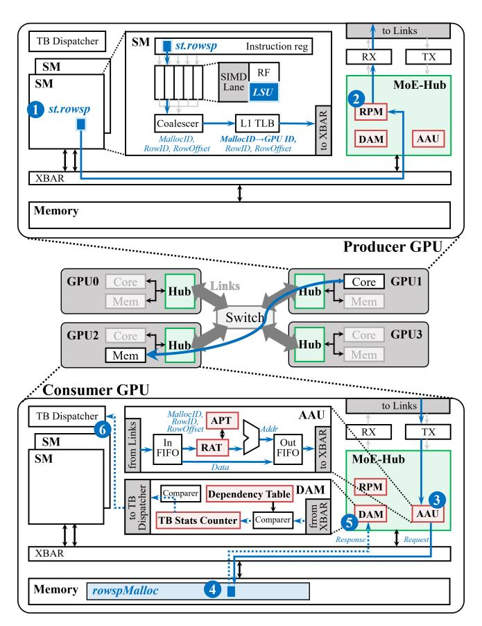

Fig. 7: MoE-Hub overview: hub-side extensions and datapath integration.

complex, software-mediated phases prior to communication to establish these address mappings across GPUs.

*Our key insight is that the true dependency for communication is the logical destination (Expert ID), not the underlying memory address.* We therefore introduce a destination-agnostic paradigm that decouples data transfer from address allocation, allowing communication to begin as soon as a token's routing result is available.

*1) ISA Extensions:* As shown in Fig. 8b, we introduce a new row-sparse store instruction, st.rowsp, where a *row* corresponds to one token in the activation tensor. Similar to a conventional store, st.rowsp employs one register for the destination, but that register contains three fields to specify a logical destination:

- RowID: A globally unique index assigned by programmer to identify a token row across GPUs and encode a desired transmission ordering among outstanding rows.
- RowOffset: As the row size is typically larger than the size of a memory request, a row is transmitted as multiple packets, with each up to 128 B over NVLink [7], [37], [38]. RowOffset specifies the offset within the row.
- MallocID: An identifier for a memory region allocated for dynamic address assignment. It encodes both the target GPU identifier and a region-specific identifier.

Apart from the logical destination, the new instruction

follows the same semantics as a conventional GPU store instruction. To further manage traffic priority, the ISA is extended with a .nop suffix (e.g., st.rowsp.nop) for non-critical-path data transfers. The transmission order among all priority requests is controlled by the programmer via the RowID, to avoid excessive tail latency for partial data within a token row.

*Datapath:* st.rowsp allows a producer to initiate a transfer as soon as a token's routing result (i.e. Expert ID) is known. Fig. 7 illustrates the end-to-end datapath of the proposed destination-agnostic instruction, which shares the same datapath with existing memory requests. Issued by producer SMs 1 , they are processed by the SIMD lane load/store units, coalesced into transactions, and get the target peer-GPU identifier resolved from the logical destination in TLB. Transactions generated by st.rowsp are then forwarded to MoE-Hub, where the Runtime Packet Manager (RPM) 2 processes them before interconnect transmission. On the consumer side, incoming destination-agnostic requests are handled by the Address Allocation Unit (AAU), which allocates store addresses on arrival within the pre-allocated region indexed by MallocID 3 . In contrast, conventional remote stores bypass the AAU. The request is then forwarded to the consumer memory system 4 . Similar to conventional remote stores, it first undergoes address translation via the IOMMU at the interface, then passes through the crossbar to reach the target memory and complete the write operation. Finally, write acknowledgments are captured by the Data Availability Manager (DAM) 5 , which uses them to guide the TB dispatcher 6 for consumer thread-block scheduling.

*2) Runtime API:* A new runtime API, rowspMalloc (Fig. 8c), allocates a region of device memory for on-demand consumer-side address assignment and returns a MallocID to be used by st.rowsp instruction. This API performs two operations: (i) It registers the memory region's metadata, including the base address (BaseAddr) and row size (RowSize ), directly in the target GPU's hub via memory-mapped I/O (MMIO), reusing the standard GPU driver programming interface for controlling device engines and state registers (e.g., engine setups and interrupt controls) to configure the AAU. (ii) It generates a MallocID that both identifies the target GPU and points out allocated memory regions. At runtime, st.rowsp uses MallocID to indicate routing destination in the producer and perform address allocation in the consumer. The resolution of MallocID to GPU identifier occurs in the L1 TLB of producer SMs. Unlike conventional remote stores that depend on TLB lookups to derive the peer GPU from a virtual address, the new instruction is routed via lightweight logic gated by an instruction flag, avoiding interfering with the standard address translation process. The address allocation within the pointed out region is performed in consumer AAU, as shown in Fig. 7.

The API rowspMalloc mainly serves as an interface to the GPU memory-management system. It exposes a region-based provisioning abstraction that allocates a devicememory region for on-arrival placement. Since MoE-Hub's

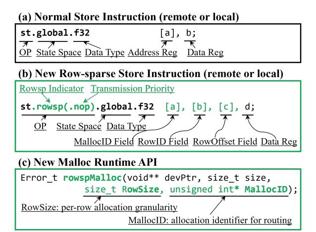

Fig. 8: ISA and runtime API extensions.

focus is on communication-model optimization, it employs a static memory management model, pre-allocating conservative expert-input regions to prevent token overflow. Behind the rowspMalloc API, a more advanced memory management scheme (e.g., paging-style KV-cache management or emerging GPU-side proposals [8], [15], [30], [33]) can be integrated to improve memory utilization, provided that two conditions are met: (i) st.rowsp requests are routed correctly, and (ii) onarrival address allocation is computed correctly. We leave such extensions for future work.

- *3) Architecture Support:* The logical abstraction of st.rowsp is translated into concrete addresses in hardware by the Address Allocation Unit (AAU) on the consumer side. The AAU is responsible for the on-demand, contention-free translation of logical (MallocID, RowID) tuples into real addresses, which comprises two key structures:
  - Row Allocation Table (RAT): A tag-RAM that caches the mapping from (MallocID, RowID) to a locally allocated LocalRowID.
  - Allocation Pointer Table (APT): A small CAM that tracks the next available LocalRowID for each MallocID using a RowPointer.

The two components jointly perform address allocation on the consumer GPU. Upon packet arrival at the destination hub, the AAU looks up the RAT for an existing LocalRowID corresponding to the same (MallocID, RowID). If a valid entry is found, the packet reuses the cached LocalRowID. On a RAT miss, AAU checks whether the entry was previously allocated. For entries that have never been allocated, a new LocalRowID is assigned using the RowPointer in the APT, which is then atomically incremented to ensure contiguous, conflict-free allocation. For evicted entries, the mapping is restored from memory. Final memory address is computed as BaseAddr + LocalRowID \* RowSize + RowOffset. This mechanism ensures that tokens from all producers are densely packed in the consumer's memory based on their arrival order, without synchronization between devices. The st.rowsp instruction also supports local token

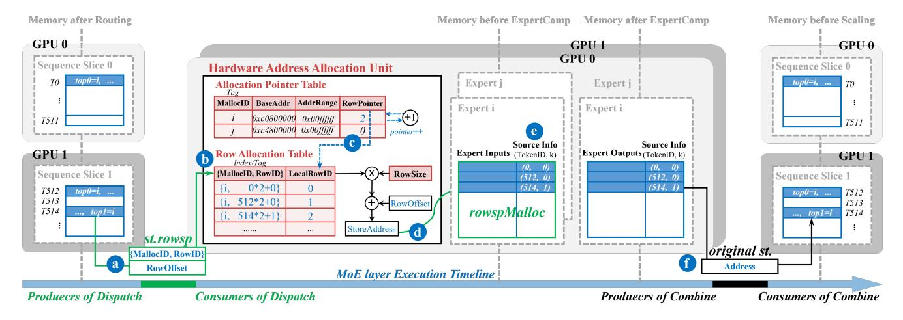

Fig. 9: Illustration of MoE layer dataflow under the destination-agnostic communication paradigm.

storage within local experts, maintaining a unified address mapping strategy for both remote and local tokens.

*Eviction Mechanism:* The eviction policy in MoE-Hub is triggered when a new entry needs to be allocated but the RAT table is full. Each RAT entry only needs to be retained briefly, until all packets for its corresponding row have arrived. Once a row is fully received, the mapping between (MallocID, RowID) and LocalRowID becomes unnecessary and can be safely evicted. Because smaller RowIDs are prioritized by the RPM on the producer side (detailed in IV-B), packets for the same row arrive at the receiver in quick succession, prompting the use of a first-in-first-out strategy to facilitate evicting entries that are no longer needed. Evicted mappings are spilled to device memory. If a late packet arrives after eviction, the mapping is recovered on demand, ensuring that all packets of the row resolve to the same LocalRowID. The RAT/APT is flushed only when the rowspMalloc region is either freed or reinitialized. These operations are confined to hub metadata and do not require any changes to global coherence or memory consistency mechanisms.

- *4) All-to-All Communication Workflow:* Figure 9 illustrates the end-to-end MoE layer workflow across two GPUs, enabled by the hardware and software support of MoE-Hub.
- *a) All-to-All Dispatch:* The producer (routing kernel) initiates st.rowsp write requests to the target expert's GPU based on the logical routing computation results a . Upon reaching the target device's hub, the logical address of the request is translated by the AAU b . If no corresponding mapping exists, a new entry is allocated using the RowPointer stored in APT c , with the pointer then self-incremented. After obtaining *LocalRowID*, storage address is computed d . The st.rowsp request is queued for transfer through the on-chip XBAR to the L2 cache and memory for the actual write.
- *b) All-to-All Combine:* This process involves communication in the opposite direction of dispatch. During dispatch, additional source information for the token is provided to ensure the token can be accurately routed back to its original location. Implemented as an extra column in the expert input activation tensor e , the source information undergoes

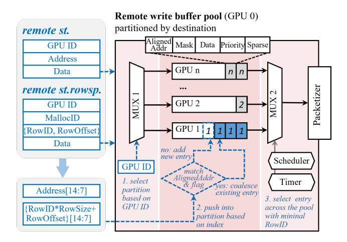

Fig. 10: Runtime Packet Manager microarchitecture.

logical address translation along with the token data, yet it is transferred using the st.rowsp.nop instruction, as it lies off the critical path. At the end of the expert's final GEMM, the expert can read this source metadata to initiate combine via conventional stores f .

## *B. Producer: Runtime Packet Manager*

While the new communication paradigm enables immediate data transfer, the fine-grained, irregular communication pattern inherent in MoE workloads poses a fundamental challenge to interconnect efficiency. To this end, we introduce the Runtime Packet Manager (RPM) at the hub's egress point, which is specifically designed to mitigate the bandwidth underutilization identified in Section III-B. The RPM transforms bursts of small, out-of-order packets into a structured stream.

*1) Microarchitecture:* The manager's front-end is a Remote Write Buffer Pool, structured as a set of fully-associative SRAM partitions, each dedicated to an active peer GPU in the link fabric. The peer set is fixed at job initialization and bounded by the physical topology (e.g., 8–16 peers in current systems [44]). This design is critical for isolating and managing traffic on a per-link basis. Fig. 10 illustrates the microarchitecture design and workflow for instructions. When a remote st. or st.rowsp request arrives, it is first routed to its corresponding destination partition.

- For remote st. requests, the request is indexed by its cache-line-aligned address. The buffer checks for an existing entry with a matching address.
- For remote st.rowsp requests, the request is indexed by its (RowID, RowOffset) tuple, treating the logical row as its own "address space" for packet merging.

If a matching entry is found and the priority flags (e.g., standard vs. .nop) concur, the new request is merged into the existing entry by updating its validity mask. This minimizes protocol overhead by favoring the generation of interconnectfriendly packets (e.g., 128-byte cache lines).

- *2) Packet Scheduling:* The buffer pool's back-end is a Packet Scheduler responsible for arbitrating which merged requests are transmitted onto the interconnect and when. Its scheduling policy is multi-faceted, being both congestionaware and consumer-aware.
- *a) Congestion-Aware Emission Strategy:* The scheduler uses a round-robin polling mechanism across buffer partitions for each destination GPU, smoothing traffic to prevent routinginduced sudden bursts toward a single GPU which would increase queueing latency in the interconnect and slow down overall transmissions, as shown in Fig. 5, thereby maintaining balanced utilization across links. It also optimizes transmission efficiency by prioritizing entries with fully set validity masks, which indicate maximum granularity merge. A timer-based bypass mechanism is incorporated to prevent poorly merged entries from stalling indefinitely in the buffer, maintaining system-wide robustness and ensuring forward progress.
- *b) Consumer-Aware Priority Policy:* Within each destination buffer partition, the scheduler considers two levels of priority. First, it consistently prioritizes sending highpriority requests ahead of non-priority requests such as st.rowsp.nop. Second, within high-priority requests, it further prioritizes entries based on their RowID, sending the entry with the smallest RowID first. This ensures that entire rows of data for a specific token are transferred contiguously, allowing consumer-side expert computations to begin early on completed rows without waiting for the entire transfer to finish. This is particularly beneficial for long sequences, effectively hiding communication latency behind computation.

## *C. Consumer: Data Availability Manager*

While the RPM optimizes data transmission from the producer side, the Data Availability Manager (DAM) addresses the complementary challenge on the consumer side. The DAM replaces the costly software polling mechanism described in Section III-B with a hardware-managed, event-triggered signaling system, as illustrated in Fig. 11.

*1) Fine-Grained Dependency Tracking:* At the core of the DAM is a content-addressable memory (CAM)-based structure called the Dependency Table, which maps memory address ranges to sets of dependent Thread Blocks (TBs). This table is populated by the compiler through static analysis of the

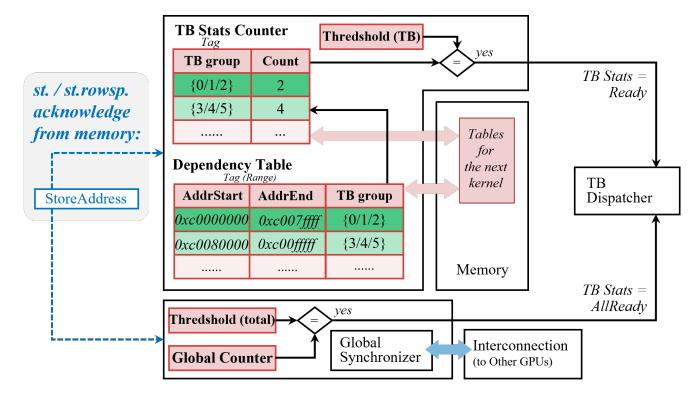

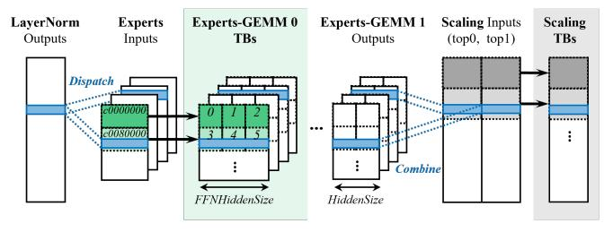

Fig. 11: Data Availability Manager microarchitecture and its role in managing dependencies between data and threadblocks.

consumer kernel. These dependencies stem from the consumer kernel's static tiling scheme and are not subject to the dynamic token order. Specifically, a TB that computes an output tile depends on the corresponding slice of the input activation matrix. Once that slice has received enough newly arrived token rows, the DAM can notify the TB scheduler to release the associated TB group. Fig. 11 illustrates this mapping between data address ranges and TB groups. For each model defined by its HiddenSize and FFNHiddenSize, and target hardware, the Dependency Table is generated once with auto-tuned tiling scheme and cached for reuse.

- *2) Event-Triggered Thread Block Scheduling:* For each unique TB group recorded in the Dependency Table, a TB Status Counter is maintained. When a write acknowledgment (from a regular remote store st. or a st.rowsp) returns to the hub, the DAM performs a range lookup in the Dependency Table. For every matching entry, the corresponding TB Status Counter is incremented. Once a counter reaches a predefined threshold, indicating that all data required by the associated TB group is available in local memory, the DAM issues a Ready signal for that TB group to the GPU's thread block scheduler. These TBs then become immediately eligible for dispatch onto available Streaming Multiprocessors (SMs). By replacing software polling with hardware-managed readiness signaling, the DAM eliminates busy-waiting, freeing compute resources and memory bandwidth for productive computation.
- *3) Runtime Adaptation to Dynamic Workloads:* The dynamic token routing in MoE models implies that the actual number of tokens processed by each expert is not known statically. To prevent resource under-utilization or

TABLE II: MoE model Configurations used in evaluation.

| Model Name     | Layer | Hidden Size | FFN Hidden Size | TopK / Experts |
|----------------|-------|-------------|-----------------|----------------|
| Mixtral 8x7B   | 32    | 4096        | 14336           | 2 / 8          |
| Qwen2-MoE-2.7B | 24    | 2048        | 1408            | 4 / 64         |
| Phi-3.5-MoE    | 32    | 4096        | 6400            | 2 / 16         |

oversubscription, the DAM incorporates a global completion detection mechanism. A Global Counter tracks the total number of write acknowledgments expected for a consumer kernel (e.g., <code>HiddenSize \* SequenceLength \* k</code>). When this counter reaches its target, an <code>AllReady</code> signal is generated. This signal enables the system to identify and deallocate TBs whose corresponding counters remain at zero. These TBs, spawned as a result of the compiler's conservative allocation strategy, are never scheduled, thereby avoiding unnecessary consumption of SM resources. This runtime adaptation is essential for handling the variable workloads typical of MoE experts, ensuring that hardware resources are dedicated strictly to useful computation.

#### V. EXPERIMENTAL METHODOLOGY

#### A. Hardware Configuration

We model multi-GPU systems using an extended version of Accel-Sim [29], following the methodology of prior work [28], [51]. Our baseline configuration consists of 8 GPUs connected through 4 NVSwitch chips, emulating the NVIDIA DGX-H800 architecture features and topology.

The multi-GPU interconnect is simulated using a modified BookSim2 [25] that replicates NVLink's design, featuring full-duplex links, 16B flits, and single-flit headers. The network supports full-to-full routing and switch-level forwarding. Each GPU is configured with 400 GB/s bandwidth, and the unidirectional latency between GPUs and switches is set to 250 ns, resulting in an approximate round-trip latency of 1 µs. We calibrated both the bandwidth and latency of the simulated interconnect against real hardware measurements. Across message sizes ranging from 0.5 MB to 256 MB, the simulated All-to-All communication time exhibits an average error of 4.36% compared to physical system results.

## B. Workloads

We evaluate MoE-Hub using three representative MoE models, summarized in Table II. To manage simulation complexity, we focus on a single MoE layer; other end-to-end overheads are extrapolated from runtime breakdowns measured on real H800 systems. Expert GEMM operations are implemented using CUTLASS [43] kernels.

#### C. Baseline

We compare MoE-Hub against five state-of-the-art MoE systems and an idealized upper bound. All baselines are implemented on top of Megatron-LM [59], a widely adopted transformer training framework that supports MoE models.

1) **Megatron-TE** [59] is a non-overlapping MoE implementation that integrates NVIDIA's Transformer Engine [48] for optimized transformer kernels.

- FasterMoE [16] improves MoE performance through optimized All-to-All and graph-level overlap between communication and expert computation.
- Tutel [19] implements adaptive parallelism, pipelining, and a hierarchical 2D All-to-All algorithm to improve MoE scalability.
- 4) **Comet** [67] achieves fine-grained overlap between expert GEMM and All-to-All using tile-level dependency analysis, task rescheduling, and adaptive SM allocation.
- 5) **CCFuser** [61] fuses expert GEMM and All-to-All via inter-GPU shared memory access and improves GPU utilization through dynamic expert reassignment.
- 6) **Ideal MoE layer** represents the execution time with *ideal MoE layers* (Section II-C) consisting only of local routing, local expert computation, and local scaling.

#### VI. RESULTS

#### A. End-to-end Speedup

We evaluate MoE-Hub against five state-of-the-art MoE systems and an idealized lower bound across three representative models under varying GPU counts (NGPU) and sequence lengths. As all baselines share the same attention module implementation, performance differences arise solely from the MoE layer execution, including overhead from the address resolution phases (e.g. system synchronization).

Fig. 12 summarizes the end-to-end speedups. MoE-Hub achieves average speedups of 1.625×, 1.984×, 1.506×, 1.209×, and 1.278× over Megatron-TE, FasterMoE, Tutel, Comet, and CCFuser, respectively. Since the attention is identical across baselines, these gains on the pure MoE layer are further amplified to 2.195×, 3.082×, 2.014×, 1.400×, and 1.542×.

Megatron-TE and FasterMoE exhibit the lowest performance, as the former lacks computation-communication overlap while the latter relies on coarse-grained dataflow scheduling with limited model support. Tutel improves performance through graph-level overlap and adaptive parallelism. Comet and CCFuser, which employ fine-grained software optimizations, outperform the graph-level approaches. Nonetheless, MoE-Hub consistently surpasses all software-based systems, achieving 96.8% of the performance of the theoretical ideal MoE layer, which assumes no scheduling overhead or exposed inter-GPU communication.

Overall, the performance benefits of MoE-Hub primarily arise from two factors: (1) elimination of address resolution phases, including synchronization between devices and additional data shuffling, thereby reducing the intrinsic overhead of routing stages. (2) hardware-managed dataflow orchestration, removing software scheduling costs for fine-grained pipeline coordination using memory barriers, and for data availability tracking that would incur substantial polling overhead. While prior work has partially addressed the second aspect, MoE-Hub is the first to identify the root cause of the first issue and propose a thorough solution, enabling seamless and efficient fine-grained overlap.

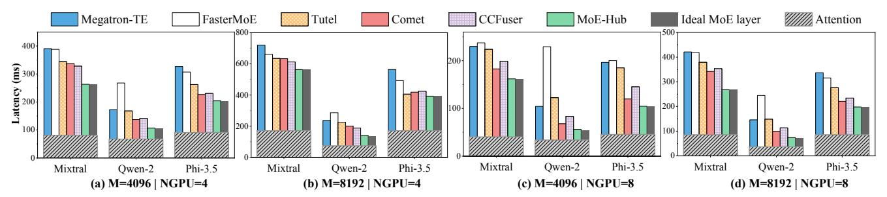

Fig. 12: End-to-end latency evaluation. Total token count is  $M = \text{SeqLength} \times \text{NGPU}$ , where NGPU is the number of devices.

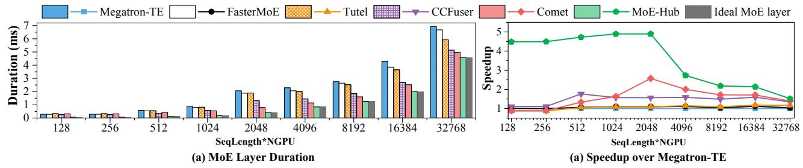

Fig. 13: Layer duration and speedup with varying total token count on 8 GPUs. Other parameters follow Mixtral 8×7B.

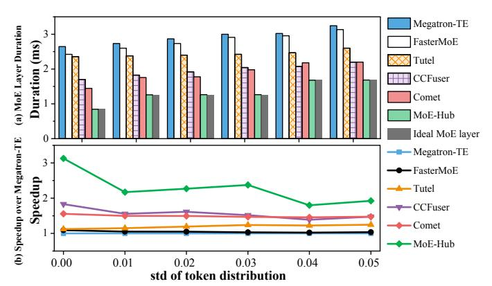

Fig. 14: Layer duration and speedup with a total token count of 8192 on 8 GPUs. Other parameters follow Mixtral 8×7B.

#### B. Single MoE layer analysis

We further analyze a single MoE layer to evaluate the adaptability of MoE-Hub across different scenarios.

a) Varying Sequence Length: Fig. 13 reports MoE-layer execution time on 8 GPUs as the total number of input tokens increases from 128 to 32,768, along with the speedup over the non-overlapping Megatron-TE baseline. MoE-Hub delivers an average speedup of 4.70× for small batches (128–2,048 tokens) and 2.14× for larger batches (4,096–32,768 tokens), with an overall average of 3.56× across the full range. At small token counts where communication volume is low, the layer is dominated by exposed per-step control-plane overhead rather than bulk data movement. Consequently, software approaches that primarily target overlapping communication provide limited benefit. MoE-Hub reduces these overheads by removing software-mediated scheduling and dataflow orchestration, resulting in substantially lower latency and higher speedup relative to other baselines. For large-batch

scenarios, expert GEMM occupies an increasing fraction of the layer execution time as token count grows, diminishing the relative benefit of effective communication overlap, and thus the speedups of fine-grained overlap works start to decline. Even in this regime, MoE-Hub continues to outperform prior approaches by eliminating data shuffling and other routinginduced operations whose cost scales with sequence length.

b) Varying Token Distribution: A key challenge for MoE-Hub is handling scheduling inefficiencies caused by dynamic producer-consumer relationships and irregular data flows in MoE models. We evaluate its performance under varying degrees of irregularity, quantified by the standard deviation (std) of token counts across experts. In typical training workloads, the average std is around 0.032 [67]. Fig. 14 presents results for std values from 0 to 0.05. Although latency increases with higher imbalance for all implementations, MoE-Hub maintains a consistent performance advantage across all std values, demonstrating robustness under different load imbalance conditions.

#### C. Ablation study

We analyze the effectiveness of the proposed optimization techniques by comparing four MoE-Hub variants against Comet as the baseline:

- MH-Base: Base MoE-Hub with the destination-agnostic paradigm, where dataflow orchestration is softwaremanaged.
- MH-PKT: MH-Base with hardware packet management.
- MH-DEP: MH-Base with hardware signaling for dependency-driven thread block dispatch.
- MH: Full MoE-Hub design incorporating both hardware packet management and hardware signaling.

We compare these four variants against Comet across three models and sequence lengths ranging from 4,096 to 16,384.

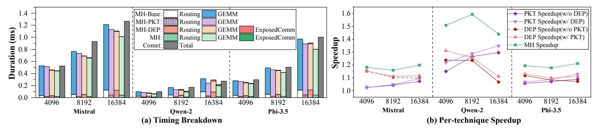

Fig. 15: Comparison of four MoE-Hub variants with Comet from routing to expert GEMM1, and speedups achieved by Runtime Packet Management, Hardware Signaling, and the full design.

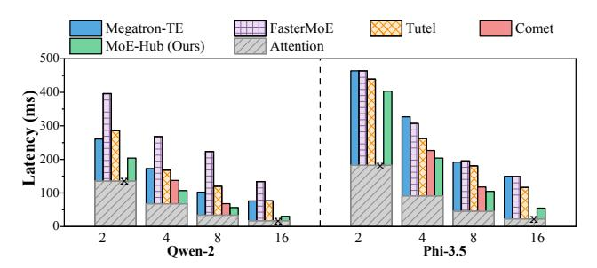

Fig. 16: End-to-end latency evaluation on Qwen-2 and Phi-3.5 across 2–16 GPUs, with a total token count of 8192.

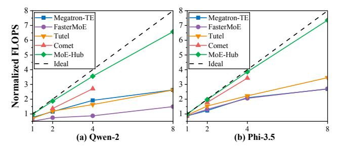

Fig. 17: Normalized FLOPS for 1x, 2x, 4x, and 8x GPU scaling, with the dashed line indicating ideal FLOPS scaling.

Our analysis focuses on the interval from routing to the end of the first expert GEMM (GEMM1), which is the most sensitive window for dataflow techniques. Because the routing phase is short and leaves limited compute slack, any exposed communication or orchestration overhead directly delays GEMM1.

As shown in Fig. 15, hardware packet management (PKT) consistently improves performance, achieving an average speedup of 1.13×. Its benefit grows with sequence length, regardless of whether **DEP** is applied. As sequence length increases, communication volume rises. Without packet management, transfers become burstier and less ordered, amplifying interconnect queuing and prolonging the routing to GEMM1 window. This effect is especially pronounced for models with smaller experts (e.g., Qwen-2), where locally available tokens alone cannot saturate the GPU, and delayed remote token arrivals directly translate into exposed stalls. **PKT** reduces All-to-All latency, smooths arrivals and pushes execution closer to seamless overlap.

Hardware signaling (**DEP**) achieves an average speedup of 1.14× as shown in Fig. 15. In contrast to **PKT**, **DEP** yields

the largest relative gain at smaller sequence lengths, gradually tapering as sequence length increases, regardless of whether **PKT** is applied. In software approaches, the consumer kernel relies on repeated atomic polling to detect data readiness, which adds control overhead and can expose communication time in the critical window. **DEP** replaces polling with hardware-managed dependency tracking, reducing this perstep control cost. As token count increases, larger GEMM workload amortizes the control overhead, so the benefit of signaling becomes less pronounced, while remaining consistently positive across models.

#### D. Scalability

Fig. 16 presents the scalability of MoE-Hub across 2 to 16 GPUs. In all configurations, MoE-Hub surpasses the baseline implementations. Owing to the high simulation cost, we did not extend the evaluation to larger GPU clusters. Instead, we normalized computational performance to highlight the effective throughput scaling trends as the number of GPUs increases. The results in Fig. 17 demonstrate that MoE-Hub maintains strong scalability across model configurations of both Qwen and Phi, achieving performance closer to the theoretical scaling curve than all baselines. This is attributed to MoE-Hub's elimination of operations that impede scalability, such as CPU interference or inter-device synchronization, thereby enabling near-linear performance growth as system size increases.

#### E. Hardware Overhead

We evaluate hardware overhead using TSMC's 7 nm technology. As shown in Fig. 7, MoE-Hub's major hardware modifications are centralized extensions to the GPU's existing hub unit. Within the hub, the Row Allocation Table accounts for the majority of area and is implemented as a 16-bank SRAM with dual ports. Outside the hub, building upon the existing store instruction datapath, integration into GPU pipeline adds only lightweight logic for decoding and routing the new instruction, along with the logic required to trigger the thread block dispatcher. In total, all hardware support occupies just 0.49 mm², accounting for less than 0.06% of an H800 GPU's die area, demonstrating that the proposed design is both feasible and area-efficient.

## VII. DISCUSSIONS

## *A. Compatibility with MoE optimizations*

MoE-Hub targets the communication and data-movement orchestration overhead induced by MoE routing dynamics. This communication-centric focus is complementary to computation-oriented MoE optimizations [5], [14], [39], [52], [63], [65], [66], including parallelism strategies and expert imbalance mitigation.

- *1) EP+TP Hybrid Parallelism:* Large-scale training and inference often combine tensor parallelism (TP) with expert parallelism. MoE-Hub can directly support such scenarios, where dynamic routing still leads to runtime-determined address layouts. Specifically, an expert is sharded across a TP group in the TP+EP configuration. For each token and selected expert, the input data should be delivered to all GPUs in the TP group. MoE-Hub treats each TP shard as a distinct consumer endpoint, issuing one rowspMalloc per shard (i.e. one MallocID per GPU in the TP group) and emitting st.rowsp requests accordingly for each MallocID. The same hub-managed dataflow orchestration is retained.
- *2) Cooperation with Load Balancing Mechanisms:* Modern MoE systems mitigate load imbalance via expert replication and dynamic expert placement [5], [39], [63], [65], [66]. Dynamics of routing and scheduling complexity of data movement persist under these optimizations. MoE-Hub's core mechanism can likewise accelerate these scenarios. The key difference is that the static one-to-one expert-to-device mapping is turned into a dynamic one-to-many mapping. This changes how a logical destination resolves to a consumer endpoint. MoE-Hub can be extended to manage these complex relationships in hub-local tables (e.g., by extending APT) and to support selection policies between endpoints (e.g., round-robin or load-aware policy). Furthermore, MoE-Hub expands the design space for MoE optimizations, enabling mechanisms that were previously impractical (e.g., expert migration is limited to a coarse granularity due to heavy software overhead [39], [65], [66]). We leave these extensions to future work.

## *B. Beyond MoE*

MoE-Hub's core destination-agnostic communication paradigm and hub-centric design are applicable to other workloads with runtime-dependent sparse or dynamic communication patterns. An emerging example is distributed KV-cache exchanges [24], [35], [64], where sparse blocks are exchanged across devices based on runtime results. While these workloads share the same motivating characteristics, supporting them requires detailed refinements and further explorations. As models become increasingly sparse and dynamic, hub-managed, destination-agnostic abstractions can provide a general substrate for sustaining efficiency beyond dense, static workloads.

