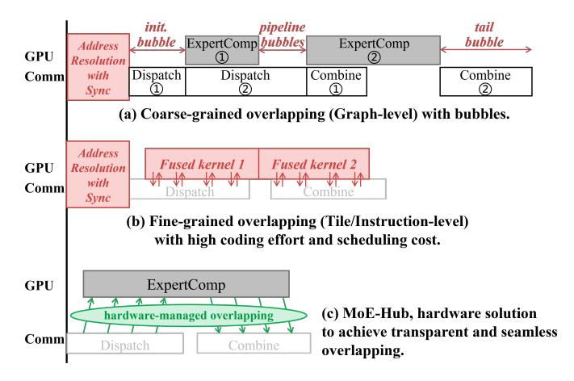
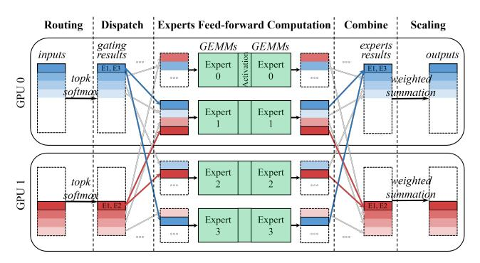

# MoE-Hub: Taming Software Complexity for Seamless MoE Overlap with Hardware-Accelerated Communication on Multi-GPU Systems

Zhuoshan Zhou1 , Chen Zhang1\* , Shuyi Zhang1 , Qijun Zhang1† , Haibo Wang2 , Zhe Zhou2 , Zhipeng Tu2 , Guangyu Sun3 , Yijia Diao1 , Zhigang Ji1 , Jingwen Leng1,4 , Guanghui He1 , Minyi Guo1 Shanghai Jiao Tong University1 , Huawei Technologies Co. Ltd.2 , Peking University3 , Shanghai Qi Zhi Institute4

{zs.zhou, chenzhang.sjtu, sy.zhang, diao yijia, zhigangji, guanghui.he}@sjtu.edu.cn, qijunzhang2000@gmail.com, {wanghaibo33, zhouzhe22, tuzhipeng3}@huawei.com, gsun@pku.edu.cn, {leng-jw, guo-my}@cs.sjtu.edu.cn

*Abstract*—The Mixture-of-Experts (MoE) architecture is crucial for scaling large language models, but its scalability is severely limited by inter-GPU communication bottlenecks in multi-GPU systems. Although overlapping communication with computation is a widely recognized optimization, its effective deployment still remains challenging, both in terms of performance and programmability. In this work, we identify the root cause as a fundamental abstraction mismatch between MoE's dynamic, irregular token-to-expert mapping and the static, address-centric communication model of modern GPUs, which necessitates a complex software mediation phase to resolve addresses before data transfers, limiting performance and software flexibility. To resolve this, we propose MoE-Hub, a hardware-software co-design that introduces a destination-agnostic communication paradigm. MoE-Hub decouples data transmission from address management, allowing producers to send data immediately after routing using only a logical destination, while address allocation and data-flow orchestration are handled transparently by lightweight hardware in the GPU hub. By hardware-accelerating the entire communication control plane, MoE-Hub enables seamless and transparent overlap. Our evaluation shows that MoE-Hub achieves 1.40×–3.08× per-layer and 1.21×–1.98× end-to-end speedup over state-of-the-art systems.

*Index Terms*—Multi-GPU Architecture, Mixture-of-Experts (MoE), Fine-grained Overlap

## I. INTRODUCTION

The scaling law for large language models (LLMs) has demonstrated that model capability correlates strongly with parameter count and training data size [27]. However, the computational burden of dense Transformer models grows prohibitively with scale, outpacing the capabilities of modern accelerators. The Mixture-of-Experts (MoE) architecture has emerged as a transformative solution to this challenge [12], [13], [31], [53], [56]. By replacing the dense feed-forward network (FFN) in a Transformer layer with a sparse layer comprising multiple experts and dynamically routing each token to only a small subset (e.g., Top-K), MoE models achieve the capacity of trillion-parameter networks while incurring only a

Fig. 1: Comparison of computation-communication overlap strategies in MoE systems.

fraction of the computational cost [12], [13], [22], [55]. This approach has been validated by state-of-the-art models such as Mixtral-8x7B [22], DeepSeek [9]–[11], GPT [49], [50], Llama 4 [36], DBRX [54] and others [1], [4], [45], [60], firmly establishing MoE as a crucial component in modern LLMs.

To accommodate the massive parameter footprint of these models, expert parallelism is required with experts distributed across the memory of multiple GPUs. While this alleviates memory pressure, it introduces a significant performance challenge owing to the extensive inter-GPU communication required. The forward pass of popular MoE models can spend an average of 47% of its execution time on deviceto-device data exchange during the All-to-All dispatch and combine phases [67], shifting the bottleneck from computation to communication.

A canonical strategy to mitigate communication overhead is to overlap it with computation. Prior works have explored this along two primary trajectories, as summarized in Fig. 1. Coarse-grained methods pipeline tensor slices at the computation-graph level [16], [19], [57], [58], [68], but they suffer from pipeline bubbles due to unpredictable com-

\* Chen Zhang is the corresponding author.

† Qijun Zhang participated in this project during his internship at Shanghai Jiao Tong University.

munication and compute loads caused by MoE's dynamic routing, which changes token-to-expert mappings with each input. On the other hand, fine-grained approaches seek to fuse All-to-All communication with expert computation within dedicated kernels, scheduling at the tile or instruction level [2], [61], [67]. While these methods improve overlap, they incur significant software scheduling overhead, requiring complex, hardware-specific orchestration of synchronization and memory accesses, limiting performance and portability. Both approaches struggle to deploy MoE models efficiently.

Our analysis reveals that these overheads are not mere implementation shortcomings but symptoms of a deeper, fundamental abstraction mismatch. The MoE algorithm specifies a *dynamic, irregular mapping* from tokens to experts, whereas GPU interconnects rely on a *static, address-centric* communication paradigm requiring explicit underlying memory addresses as destinations. This mismatch forces a costly software-mediated coordination that inter-device synchronizations are required before communication can even begin, to collectively determine the address mappings for all tokens on consumer GPUs. The prerequisite synchronization, along with the ensuing software complexity for managing fine-grained data, severely limits the efficacy and transparency of overlap, creating a significant gap between the performance of stateof-the-art systems and the theoretical performance limit.

In this paper, we propose MoE-Hub, a hardware-software co-design that introduces a new communication abstraction to resolve this mismatch. The core idea is to shift from an *address-centric* to a *destination-agnostic* communication paradigm, decoupling data movement from address allocation. This allows producers to initiate data transfers immediately upon obtaining a token's routing result, without knowing its final memory address, while address placement is handled transparently by hardware on the consumer side. Moreover, we accelerate the entire data flow through hardware enhancements to achieve high-performance overlap, including congestionand consumer-aware packet management for producers, and a lightweight producer-consumer signaling mechanism that triggers consumer computation when data becomes available.

In this work, we make the following contributions:

- We identify and formalize the semantic mismatch between the producer-consumer model of MoE algorithms and the communication abstraction of modern GPUs as the root cause of inefficiency in expert parallelism.
- We propose MoE-Hub, a holistic design that integrates three key techniques: (i) ISA and microarchitectural support for destination-agnostic communication paradigm; (ii) a runtime packet manager to optimize bandwidth efficiency and transmission order; and (iii) a data availability manager to provide a hardware signaling mechanism between producers and consumers.
- We implement MoE-Hub on a cycle-accurate multi-GPU simulator and evaluate it using three representative MoE models. MoE-Hub achieves a 1.40×–3.08× speedup per MoE layer and 1.21×–1.98× end-to-end speedup over state-of-the-art software methods.

Fig. 2: Exemplary Execution of a 4-expert MoE layer distributed across 2 GPUs (Top-2 routing).

The rest of this paper is organized as follows: Section II provides background and a quantitative analysis of existing work's limitations. Section III presents our key insights and design philosophy. Section IV details the MoE-Hub architecture. Sections V and VI describe our methodology and present a comprehensive evaluation. Finally, we discuss extensions of the proposed mechanism in Section VII, related work in Section VIII, and conclude in Section IX.

## II. BACKGROUND AND ANALYSIS

