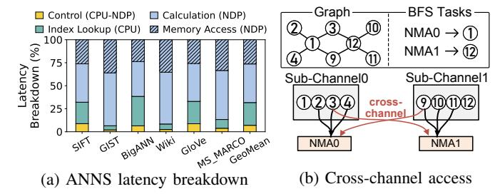
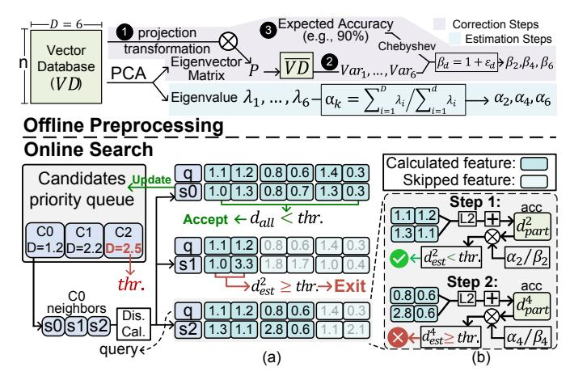
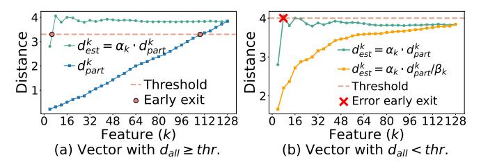
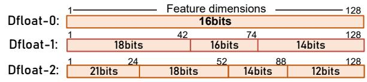

# B. Challenges of Deploying ANNS on NDP

The execution of ANNS on NDP involves three steps: ① Host CPU offloads distance calculation commands to NDP with locations of vector entries; ② NMAs independently fetch vector data and compute distances; ③ The host CPU gathers the results and looks up the neighbor lists to determine the next-hop vectors to visit. Fig. 4a shows the execution time breakdown of a vanilla ANNS. The control overhead arises

Fig. 4: (a) Latency breakdown of ANNS-on-NDP design without NASZIP optimizations; (b) Cross-channel communication highlighted in red when NMA0 and NMA1 perform BFS on node 1 and 12.

Fig. 5: Feature usage of HNSW variants on different datasets, for algorithms achieving recall@10 > 90%.

from **1**, and the index lookup overhead from **3**. For **2**, we further break the latency into distance computation and cross-channel memory access, and identify the following challenges:

1) Overhead of distance calculations: As shown in Fig. 4a, distance computation dominates ANNS-on-NDP latency, particularly for GIST with 960-dimensional features. This overhead can be reduced by lowering the number of features computed per vector. Prior optimizations mainly include principal component analysis (PCA) [48] and feature-level early exiting (FEE) [17], [26], [33]. However, as shown in Fig. 5 under recall@10 > 90%, naive PCA reduces feature usage by only 6%, and existing FEE methods (Section II-B) still leave considerable redundant computation.

Our solution approaches the problem from two aspects: (1) Further reduce the number of features involved in early exiting; and (2) Increase the number of features that can be fetched by each NDP data burst access. For (1), we optimize FEE by comparing the threshold with  $d_{\rm est}^k$  instead of  $d_{\rm part}^k$ . We propose FEE-sPCA in Section IV-A to estimate  $d_{\rm all}$  based on  $d_{\rm part}^k$  while maintaining search accuracy. Since  $d_{\rm est}^k \geq d_{\rm part}^k$ ,  $d_{\rm est}^k$  between a query and a node can exceed the threshold earlier, thereby triggering the FEE more promptly than using  $d_{\rm part}^k$ . For (2), we propose a dynamic floating-point (Dfloat) representation in Section IV-B, using variable bit-width for exponent and mantissa without hampering the search accuracy. Thus, each DRAM burst can contain more features.

2) Cross-channel memory accesses: Fig. 4a shows that memory access overhead on NDP is also significant. This overhead arises when an NMA must compute the distance of a vector stored in another sub-channel, incurring costly

cross-channel access, as discussed in Section II-C. The root cause is poor data locality in the graph structure. As illustrated in Fig. 4b, when NMA0 performs the BFS of ①, it must access neighbors ②③④②9. Since ⑨ resides in a different sub-channel, the access incurs expensive cross-channel communication. A similar issue occurs when NMA1 accesses the neighbors of ①12.

**Our solution** proposes data-aware neighbor list mapping (DaM) in Section V-C2. Following the vector data mapping across sub-channels, we also distribute the neighbor list to ensure that neighbor indices and vector data are resident in the same sub-channel, avoiding cross-channel data fetches.

3) Costly CPU usage in naive ANNS-on-NDP: Fig. 4a also shows that CPU-side neighbor-list lookup contributes a significant fraction of the total latency. This step lies on the critical path of ANNS-on-NDP, because NDP devices must wait for the CPU to identify the next-hop neighbors before launching the next round of distance computations. Prior ANNS-on-NDP works largely overlook this overhead [17], [19], [49]–[51], but our profiling shows that it accounts for about 31.7% of total latency, mainly due to duplicated neighbor-list accesses.

**Our solution** also offloads neighbor-list lookup to NDP to exploit internal parallelism and bandwidth based on DaM. We further incorporate a custom local neighbor cache (LNC) in Section V-D, which stores recently accessed neighbor lists to avoid redundant accesses.

#### IV. COMPRESSING VECTOR DATABASE WITH VD-ZIP

For ANNS acceleration, we propose a software solution called *VD-Zip* to compress the VecDB, consisting of a feature-level optimization (FEE-sPCA) and a bit-level optimization (Dfloat). During offline preprocessing, FEE-sPCA first applies a PCA transformation to the vector database, enabling the effective estimation of full distance based on partial distance. We further employ a statistical method to refine the estimation, ensuring a high recall rate. During the online searching, the estimation is used to trigger FEE earlier. Dfloat further lowers the DRAM data access by compressing more features within a single burst while maintaining a high recall rate.

#### A. Feature-Level EE with Statistics-based PCA

The primary objectives of FEE-sPCA are (1) leveraging estimated distance  $(d_{\text{est}}^k)$  to filter out non-candidate vectors (whose  $d_{\text{all}} \geq threshold$ ) with partial distance  $(d_{\text{part}}^k)$ ; and (2) controlling the accuracy of estimated distances to avoid erroneously filtering out candidate vectors (whose  $d_{\text{all}} < threshold$ ). To meet the two goals, we set two sets of parameters  $\alpha = \{\alpha_k\}$  and  $\beta = \{\beta_k\}$  in the distance calculation process.  $\alpha_k$  is used to estimate the distance based on  $d_{\text{part}}^k$  for (1).  $\beta_k$  is used to calibrate the estimation to maintain accuracy for (2). The overall process, including the offline pre-processing (to obtain  $\alpha$ ,  $\beta$ ) and online searching, is shown in Fig. 6.

In this subsection, we first introduce the online searching flow with our FEE-sPCA (lower part in Fig. 6). Then we introduce how the parameters  $\alpha_k$  and  $\beta_k$  are determined offline (upper part in Fig. 6) for computing  $d_{\rm est}^k$ .

Fig. 6: **FEE-sPCA execution flow**, including offline preprocessing (upper part) and online search (lower part). (a) Three neighbors (*i.e.*, s0, s1, s2) are searched and only s0 is updated into priority queue. Computations of s1 and s2 are early exited. (b) Detailed steps of FEE-sPCA on s2.

1) Online searching with FEE-sPCA: The lower part of Fig. 6 shows the process. The candidate priority queue stores the identified nearest candidates  $\{c0, c1, c2\}$  of current query q, and their distances w.r.t. q are  $\{1.2, 2.2, 2.5\}$ .  $\{s0, s1, s2\}$  are neighbors of the queue head c0, and they are the new nodes to be searched in this hop. The process is to calculate the distance between  $\{s0, s1, s2\}$  and q, then update the vector in the candidate priority queue if its distance  $\leq$  threshold (2.5). As shown in Fig. 6a, we assume each DRAM access can get 2 features, so we calculate the distance of 2 dimensions each time. Only s0 is accepted and updated in the queue, while the calculations of s1 and s2 are terminated with FEE. The calculation of s1 exits after the first 2 features are calculated, while s2 exits after the first 4 features.

Taking s2 as an example to describe the FEE-sPCA, as shown in Fig. 6b, each DRAM burst corresponds to one step (e.g., Step 1/2), loading 2 dimensions. In Step 1, it calculates the partial distance of the first two features  $(d_{\text{part}}^2)$  between q and s2. Then, we obtain the estimated distance  $d_{\text{est}}^2 = \alpha_2 \cdot d_{\text{part}}^2/\beta_2$ . We compare the estimated distance  $d_{\text{est}}^2$  with threshold. As  $d_{\text{est}}^2 < threshold$ , we proceed to Step 2 to calculate the next two features' distance and accumulate it to the last calculated  $d_{\text{part}}^2$  to get a new partial distance  $d_{\text{part}}^4$ . Based on  $d_{\text{part}}^4$ , we update the estimated distance  $d_{\text{est}}^4 \ge threshold$ , early exiting is triggered.

2) Offline preprocessing via PCA to get  $\alpha$ : We aim to get  $d_{\text{est}}^k$  based on the partially computed  $d_{\text{part}}^k$  from the first k dimensions. To address this, we preprocess the database offline as shown in Fig. 6 upper part (blue). We first apply PCA to make the leading dimensions of all vectors contain the most informative components. As PCA is a linear dimensionality reduction technique, it can be effectively applied to these vectors, which are approximately linear after the embedding transformation [52]–[54]. After PCA, in addition to the generation of eigenvalue  $\lambda_i$  for each dimension and one eigenvector

Fig. 7: Calculated distance versus used features and its relationship to the threshold. Data is from SIFT1M.

matrix P, there exists an expectation property of:

$$E\left(\left\|\boldsymbol{v}_{1:d}\right\|^{2}/\left\|\boldsymbol{v}\right\|^{2}\right) = \sum_{i=1}^{d} \lambda_{i}/\sum_{i=1}^{D} \lambda_{i}$$
 (2)

where v is a vector in the transformed VecDB  $\overline{VD}$ , and  $\|v\|^2$  is the squared norm of all its features.  $v_{1:d}$  contains the first d features.  $\lambda_i (1 \le i \le D)$  is the eigenvalue of the i-th feature, obtained by the PCA process offline. Then we can get:

$$d_{\text{all}} \approx d_{\text{part}}^k \cdot \sum_{i=1}^D \lambda_i / \sum_{i=1}^k \lambda_i$$
 (3)

We make the parameter  $\alpha_k = \sum_{i=1}^D \lambda_i / \sum_{i=1}^k \lambda_i$ . Therefore,  $d_{\text{all}} \approx d_{\text{est}}^k = \alpha_k \cdot d_{\text{part}}^k$ . However, the estimation **may cause errors** in FEE. Thus, we further propose a correction.

3) Offline preprocessing to get  $\beta$ : In Fig. 7, we present two examples that illustrate the need for correction. In Fig. 7a, the vector satisfies  $d_{\rm all} \geq threshold$  and should be rejected. Its partial distance  $d_{\rm part}^k$  triggers FEE at the 109th feature, whereas the estimated distance  $d_{\rm est}^k$  triggers FEE much earlier at the 4th feature, showing higher FEE effectiveness. However, Fig. 7b shows a vector with  $d_{\rm all} < threshold$  that should be accepted. Using only the PCA-based estimate,  $d_{\rm est}^k = \alpha_k \cdot d_{\rm part}^k$ , incorrectly triggers FEE at around the 8th dimension because  $d_{\rm est}^8$  overestimates the distance and exceeds threshold. To preserve search accuracy, such false rejections must be minimized. We therefore scale down  $d_{\rm est}^k$  by dividing it by a factor  $\beta > 1$ , reducing overestimation and preventing erroneous early exits. The corrected estimate is the yellow dotted line in Fig. 7b.

The following description shows the procedure to acquire  $\beta$ . We first analyze the property of the estimation error between  $d_{\text{est}}^k$  and  $d_{\text{all}}$ . Based on Eq. (2), we can get:

$$E\left(\alpha_k \cdot d_{\text{part}}^k / d_{\text{all}}\right) = 1 \tag{4}$$

Furthermore, each  $d_{\text{part}}^k$  has its own variance. Therefore, we can apply Chebyshev's inequality to  $\alpha_k \cdot d_{\text{part}}^k/d_{\text{all}}$ :

$$P(\left|\alpha_k \cdot d_{\text{part}}^k/d_{\text{all}} - 1\right| \le \varepsilon_k) \ge 1 - Var_k/\varepsilon_k^2$$
 (5)

where P is the probability,  $\varepsilon_k$  is a tiny positive number, and  $Var_k$  is the variance of  $\alpha_k \cdot d_{\text{part}}^k/d_{\text{all}}$ , which can be obtained during index construction. After removing the absolute value and letting  $1 + \varepsilon_k = \beta_k$ :

$$P\left(\alpha_k \cdot d_{\text{part}}^k/\beta_k < d_{\text{all}}\right) \ge 1 - Var_k/2\varepsilon_k^2$$
 (6)

To ensure that  $d_{\rm est}^k \leq d_{\rm all}$  with high probability to avoid FEE errors, we can make  $1 - Var_k/2\varepsilon_k^2$  a large value (e.g., 90%) and get the corresponding  $\varepsilon_k$  and  $\beta_k$ . The flow is shown

Fig. 8: **Performance of FEE-sPCA**. The purple line denotes the variance term in Eq. (6), the green line denotes the dimension-wise accumulated FEE-sPCA trigger frequency, and the dashed line denotes the dimension before which 80% of computations terminate.

in Fig. 6 upper purple part, which begins by projecting the database to obtain  $\overline{VD}$  and its variance (2). We set an expected accuracy (3), and obtain  $\beta_k$  by using Eq. (6). As shown in Fig. 7b, after the adoption of the statistical method with  $\beta_k$ , the sPCA  $d_{\rm est}^k$  is corrected and avoids the FEE error.

4) Result: We further present the  $Var_k$  in Eq. (6) and results of the FEE-sPCA technique across datasets in Fig. 8, covering the dimension from 128 to 960 and including L2 and IP distance. Overall, we can evenly reduce feature calculations by nearly 50%, especially for high-dimensional datasets (e.g. 80% FEEs are triggered within the first 193 dimensions on the GIST dataset with 960 dimensions per vector).

#### B. NDP-Aware Dynamic Floating-Point Representation

We introduce dynamic floating-point (Dfloat) to reduce the number of bits per feature, thereby increasing the number of features retrieved per DRAM burst. Conventional low-precision formats (e.g., BF16/FP16/FP8) are not well suited for FEE-sPCA because they quantize all dimensions uniformly. After applying FEE-sPCA, however, different dimensions contribute unequally, and uniform quantization noticeably degrades its robustness and accuracy. We therefore propose Dfloat, which provides a more robust representation tailored to the characteristics of FEE-sPCA.

1) Representation of Dfloat: Lowering the bit width of vector features is an effective approach to reduce the memory footprint and data movement. In this work, we leverage the dynamic floating-point representation (Dfloat) [55], [56] with adaptive bit widths for the exponent and mantissa, *i.e.*,

$$g(\boldsymbol{b}_{\text{dfloat}}) = \underbrace{(-1)^{b_{n_{\text{exp}}+n_{\text{man}}}}}_{\text{sign}} \times 2^{\sum_{i=n_{\text{man}}}^{n_{\text{exp}}+n_{\text{man}}-1} 2^{i-n_{\text{man}}} \cdot b_i - B} \underbrace{(1 + \sum_{i=0}^{n_{\text{man}}} 2^{(i-n_{\text{man}})} \cdot b_i)}_{\text{exponent}}; \quad \boldsymbol{b}_{\text{dfloat}} = \{b_i\}_{i=0}^{n_{\text{exp}}+n_{\text{man}}} \quad (7)$$

where  $b_{\text{dfloat}}$  is the binary representation with  $b_i \in \{0, 1\}$ .  $n_{\text{exp}}$  and  $n_{\text{man}}$  are the bit widths of the exponent and mantissa. We introduce NDP-aware optimization to Dfloat for our system.

Fig. 9: **Example Dfloat configurations.** Features are divided into segments with different bit width  $= 1 + n_{exp} + n_{man}$ .

