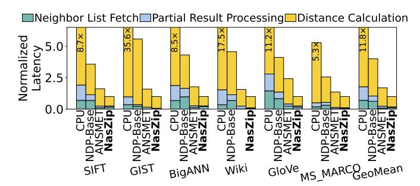
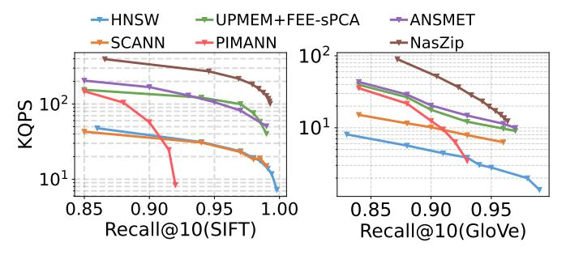

# B. Overall Search Performance

1) Throughput: Fig. 15 reports the speedup of NASZIP with 2 channels (16 sub-channels) over comparable designs at a similar scale, with all results normalized to *CPU-Baseline*.

Fig. 17: Normalized energy efficiency with recall@  $10 \ge 90\%$ .

Fig. 16 compares NASZIP with 6 channels against *GPU-Baseline* and *CPU-HP*. NASZIP is configured in Fig. 16 with 48 sub-channels, providing an aggregated memory bandwidth of 921.6 GB/s (19.2 GB/s per sub-channel). The 48 sub-channels are organized as 6 channels  $\times$  2 DIMMs per channel  $\times$  2 ranks per DIMM  $\times$  2 sub-channels per rank.

As shown in Figs. 15 and 16, NASZIP consistently delivers the best throughput among prior ANNS designs across CPU, GPU, ASIC, UPMEM, FPGA, and NDP platforms. It achieves an 8.4× speedup over the state-of-the-art CPU implementation *SCANN* and nearly 2× over the ASIC design *ANNA*. Compared with the state-of-the-art NDP accelerator *ANSMET*, NASZIP attains up to 1.69× higher performance through its tighter software–hardware co-design, particularly the more aggressive FEE-sPCA optimization. It also outperforms *CPU-HP* and *GPU-Baseline* by 2.7× and 1.4×, respectively, while substantially surpassing the UPMEM-based *PIMANN* despite PIMANN's high raw bandwidth. The largest gain is observed on GIST. This is because, as shown in Fig. 8, most of its early exits occur before dimension 193, pruning nearly 80% of its 960 dimensions, whereas SIFT prunes only about 50%.

2) Energy efficiency: The evaluation is shown in Fig. 17. GPU-Baseline and DF-GAS achieve lower energy efficiency due to the high power consumption of HBM. ANNA exhibits energy efficiency comparable to that of the NDP design ANSMET. By enabling more aggressive early exiting (FEE-sPCA), reducing cross-channel communication (DaM) and caching of frequently accessed neighbor lists (LNC), NASZIP achieves up to 1.5× higher energy efficiency than ANSMET.

Fig. 18: Latency comparison and breakdown (normalized to NASZIP) with recall@10> 90%.

Fig. 19: Comparison of throughput versus recall.

