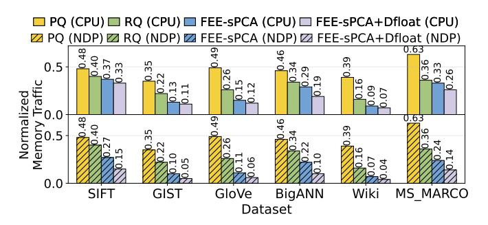
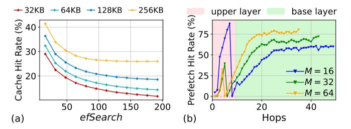
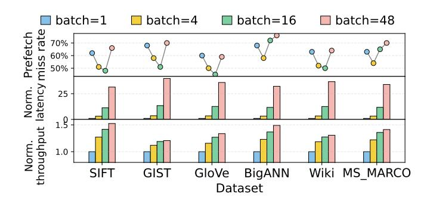

# C. In-depth Analysis

- 1) Latency Breakdown: Fig. 18 breaks down query latency into neighbor-list retrieval, distance computation, and partial-result processing (including CPU-NDP communication in NDPs). FEE-sPCA and Dfloat substantially reduce distance-computation latency, while the local neighbor cache keeps hot indices on NDP, accelerating neighbor-list retrieval and further reducing CPU-NDP communication overhead.
- 2) Throughput versus Recall: Fig. 19 evaluates the effect of varying the search range (efSearch). Increasing efSearch expands the search scope, improving recall but reducing QPS. Overall, NASZIP consistently outperforms baselines.
- 3) Memory Traffic of Database Compression: Fig. 20 compares memory traffic against representative ANNS compression baselines on HNSW at recall@10\ge 90\%. PQ [24] is mainly designed for compression and incurs substantial precision loss. To maintain high recall, PO must use a weaker compression ratio, leading to much higher memory traffic (about 2× that of RabitQ and NASZIP). RabitQ [26] accelerates candidate filtering with compact quantized vector representations, but surviving candidates still require exact full-dimensional distance computation during re-ranking. In contrast, FEE-sPCA reduces memory traffic through featurelevel early exiting, thereby cutting the number of accessed dimensions, while Dfloat further reduces the bit width of each accessed feature. Meanwhile, FEE-sPCA and Dfloat are compatible with the memory access patterns on NDP. As a result, our method achieves lower memory traffic at the same recall level, especially on NDP.
- 4) Cache Size of LNC: Fig. 21a evaluates the impact of LNC-D capacity on cache hit rate. NASZIP adopts a 256KB

Fig. 20: Memory traffic comparison of database compression methods (PQ and RabitQ on HNSW), evaluated with recall@10≥ 90%. Results are normalized to HNSW.

Fig. 21: (a) Hit rate of LNC-D versus search parameters efSearch on SIFT, with varying cache size. (b) Average prefetch hit rate w.r.t. search hops. Evaluated using 1M queries with different graph construction parameters M.

LNC-D, and we vary the enabled capacity to analyze its impact. Overall, larger LNC-D capacity leads to a higher hit rate by retaining more frequently accessed neighbor lists. As efSearch increases, the hit rate decreases because a larger search range visits more diverse candidate nodes and weakens temporal locality. Beyond a certain point (efSearch > 50), most hot neighbor lists are already retained in LNC-D, and the additional cache misses mainly come from a small number of low-reuse tail nodes, causing the hit rate to converge.

- 5) Prefetching performance: Fig. 21b profiles the prefetch hit rate at each hop and its dependence on graph density, controlled by M. The hit rate gradually increases in the upper layers but drops when entering the base layer, because upper-layer neighbor lists differ from base-layer ones and thus invalidate cached entries. As M increases, the hit rate decreases in the upper layers but rises in the base layer: a wider upper-layer search identifies most nearest neighbors earlier, stabilizing the candidate queue and reducing updates in the base layer. Overall, the prefetch hit rate remains above 50%.
- 6) Performance versus Batch Size: Fig. 22 evaluates throughput, latency and relative prefetch miss rate under different batch sizes. As batch size increases, throughput improves due to better sub-channel utilization and higher cache reuse. However, latency also increases, especially when the batch size grows from 16 to 48. This is because prefetching is most effective at batch size 16, whereas at batch size 48, excessive prefetch misses increase cache contention and

Fig. 22: Prefetch miss rate, latency and throughput versus batch sizes, evaluated under recall@ $10 \ge 90\%$ .

Fig. 23: Idle time ratio of the earliest finishing sub-channel.

reduce its benefit. To balance throughput and latency, we use batch size 16 in all other evaluations.

7) Workload Balance Analysis: Fig. 23 reports the average idle time of the least-loaded sub-channel (i.e., the earliest finishing one), normalized to total execution time. The workload imbalance is more severe at small batch sizes, for example, on BigANN, the idle time reaches 39% when the batch size is 1. As the batch size increases, the imbalance decreases, since larger batches average out the variation in the total number of vector dimensions processed by different sub-channels. However, Wiki shows higher imbalance than the other datasets. This is because the other datasets are shuffled to improve distribution uniformity, whereas Wiki is left unshuffled to preserve the spatial and semantic locality of consecutive document chunks for better retrieval quality, consistent with practical RAG deployments [68]. As a result, Wiki accesses are more clustered across sub-channels, leading to higher workload imbalance.

#### D. End-to-end RAG Evaluation

Fig. 24 evaluates the RAG end-to-end using GPT-4o. The corpora are drawn from 2WikiMultihopQA [69], HotpotQA [70], MultiFieldQA-en [71], QASPER [72], and MS\_MARCO [65]. To preserve retrieval quality, we use the text-embedding-ada-002 [73] model from OpenAI, which produces 1536-dimensional embeddings. Fig. 24a shows latency (time-to-first-token, TTFT) versus recall@10, using KNN search as the baseline. NASZIP substantially reduces latency and retains significant speedup even under high-recall requirements. Fig. 24b shows RAG quality under different retrieval accuracy levels (recall@10). Ouality is measured by the LLM score from

Fig. 24: (a) LLM latency (TTFT) vs. retrieval accuracy (Recall@10), normalized to KNN baseline. (b) LLM answer quality (RAGAS score) vs. retrieval accuracy (Recall@10).

Fig. 25: Latency reduction from each NASZIP optimization, compared with ANSMET. From bottom to top, each represents the latency reduction compared to the baseline.

RAGAS [74], reflecting answer correctness and hallucination. When recall@10 exceeds 0.9, response quality degrades only marginally w.r.t. the ideal case of recall@10=1. Overall, NASZIP is robust enough to maintain high RAG quality while significantly reducing latency.

