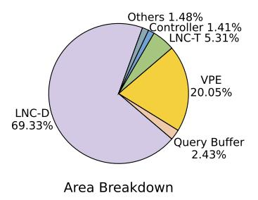

# E. Ablation study

Fig. 25 shows how each technique reduces both distance and non-distance latency. For reference, ANSMET reduces distance calculation latency to 62.27% through bit-level FEE and non-distance latency to 53.42% through mapping and scheduling. NASZIP further reduces distance latency to 51.07% with FEE-sPCA, while Dfloat provides an additional 1.79× speedup. For non-distance overheads, DaM and LNC-T/D reduce latency to 36.54% and 21.08%, respectively, and prefetching (Pre.) further cuts it by about 50%. This highlights the effectiveness of neighbor-list caching and prefetching.

## F. Overhead Analysis

1) PCA Preprocessing: During the offline phase, FEE-sPCA requires database preprocessing, mainly to compute PCA eigenvalues, which introduces additional overhead. Table IV reports the preprocessing time on an A100 GPU. Although the overhead increases with dataset size, it typically remains on the order of seconds to minutes and is small compared with index construction time (e.g., building HNSW on BigANN takes hours). During the online phase, queries must also be PCA-transformed at the embedding stage. As shown in Table IV, this one-shot transformation adds negligible overhead w.r.t. the entire search latency.

TABLE IV: Offline and online overhead of PCA-based preprocessing for database and query.

| Dataset  | Size /     | Offline  | Online       | Online       |
|----------|------------|----------|--------------|--------------|
| Dataset  | Dim.       | time (s) | latency (ms) | overhead (%) |
| SIFT     | 1M / 128   | 6.54     | 0.149        | 3.6          |
| GIST     | 1M / 960   | 53.27    | 0.817        | 0.4          |
| BigANN   | 1B / 128   | 430.66   | 0.135        | 1.7          |
| GloVe    | 1.2M / 100 | 5.23     | 0.127        | 0.1          |
| MS_MARCO | 8M / 384   | 30.91    | 0.519        | 3.8          |
| Wiki     | 1M / 768   | 40.94    | 0.727        | 3.2          |

| Component     | Area( $\mu$ m 2 ) |
|---------------|------------------------------|
| NASZIP Add-on |                              |
| ⊳ LNC-D       | 489.6K                       |
| ▷ LNC-T       | 37.5K                        |
| ▷ VPE         | 144.6K                       |
| ▷ Controller  | 9.9K                         |
|               | 17.1K                        |
| Others        | 10.4K                        |
| Total         | 709.1K                       |
|               |                              |

Fig. 26: Area overhead of added components in NASZIP.

- 2) Area and Energy overhead: The area overhead of the additional NDP components in each sub-channel is shown in Fig. 26. The total area overhead of NASZIP is 0.7091 mm2, which is marginal compared with the 10.22 mm2 area of the standard RCD [75] and DB [76] components. Fig. 27 further breaks down the VPE overhead introduced by FEE-sPCA and Dfloat. The *Query Buffer* and *FEE Module* dominate the area due to query and parameter storage, while the *Multiplier* and *Adder* dominate energy consumption because they remain active for most of the execution.
- 3) Thermal Impact: We further use 3D-ICE [77] to evaluate the thermal impact of our design. At an ambient temperature of 28°C, the combined heat from the added logic and DRAM results in a peak DRAM-cell temperature of 65.47°C. According to JEDEC specifications [78], the default refresh mode provides sufficient data retention for the standard refresh interval ( $t_{\rm REFI}$ ) at temperatures up to 85°C. Therefore, NASZIP does not compromise DRAM reliability, even without active cooling.

