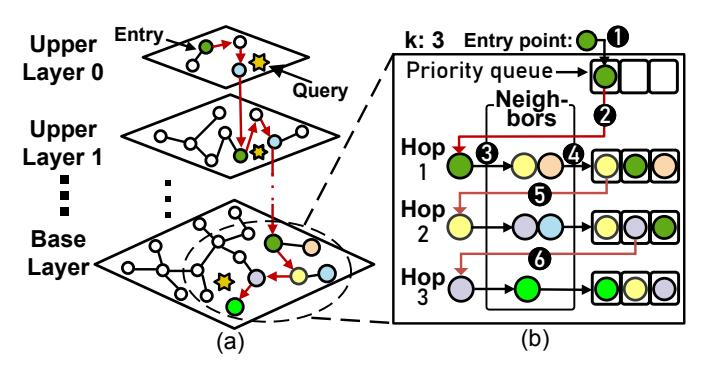
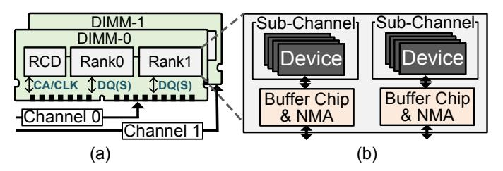
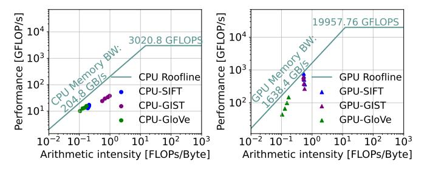

# II. BACKGROUND

## *A. Approximate Nearest Neighbor Search*

*1) Basics:* Nearest neighbor search retrieves vectors {pi} closest to a query q from a vector database (VecDB) P of size n, each with d dimensions:

$$\{\boldsymbol{p}_i\} = \arg\min_{\boldsymbol{p}_i \in \boldsymbol{P}} ||\boldsymbol{p}_i - \boldsymbol{q}||_2, \quad \boldsymbol{P} \in \mathbb{R}^{n \times d}$$
 (1)

where ||·||2 calculates the L 2 norm (or inner product). Retrieving k closest vectors is known as *k-nearest-neighbors* (kNN) search, with O(nd) complexity. To accelerate the searching process, *approximate nearest-neighbor search* (ANNS) is proposed to return approximately closest vectors with sub-linear time complexity as well as minor accuracy loss.

ANNS methods can be categorized as *hashing-based*, *tree-based* [\[7\]](#page-14-2), [\[9\]](#page-14-3), [\[22\]](#page-14-13), *graph-based* [\[12\]](#page-14-14)–[\[14\]](#page-14-15), [\[23\]](#page-14-16) and *quantization-based* [\[24\]](#page-14-17)–[\[26\]](#page-14-18). The graph-based approach is now widely adopted in commercial databases [\[27\]](#page-14-19)–[\[29\]](#page-14-20) and advanced RAG systems [\[30\]](#page-14-21), as it can deliver orders-ofmagnitude speedups over quantization-based and tree-based methods while maintaining high recall [\[31\]](#page-14-22). Despite high throughput, ANNS methods remain difficult to deploy. Under extremely high accuracy requirements [\[32\]](#page-14-23), their advantage

Fig. 1: An example multi-layer graph structure and breadth-first search (BFS) searching process for HNSW.

over kNN can diminish, motivating more robust ANNS designs that sustain throughput without sacrificing accuracy.

- *2) Graph-based ANNS (GANNS):* GANNS represents database vectors as graph nodes, with edges connecting similar nodes to enable efficient traversal toward target vectors in fewer hops. Representative GANNS implementations include hierarchical navigable small worlds (HNSW) [\[14\]](#page-14-15) on CPUs and CAGRA [\[15\]](#page-14-6) on GPUs. HNSW uses a multi-layer graph where the base layer contains all vectors, while upper layers contain fewer nodes and provide longer-range links for coarseto-fine search. In each traversal, the nearest node found at one layer serves as the entry point to the next lower layer. CAGRA uses a single-layer graph for GPU efficiency, but its graph structure can be converted into the multi-layer form of HNSW [\[14\]](#page-14-15), [\[15\]](#page-14-6). *We focus on HNSW in this work for generality.*
- *3) Details of HNSW:* HNSW is illustrated in Fig. [1,](#page-1-0) with its graph structure in (a) and an example search procedure in (b). The algorithm consists of a one-time index construction phase and a repeated search phase. In this work, we focus on the search phase, as it dominates execution time. Details of the hierarchical graph construction can be found in [\[14\]](#page-14-15).

Fig. [1](#page-1-0) shows an example where a candidate priority queue keeps the top-k nearest points found so far (k = 3). HNSW starts from the upper layer 0 and each layer's searching is a breadth-first search (BFS) process. In each iteration, the unvisited closest point is selected from the candidate priority queue as the starting point for the next iteration. The process is exemplified in Fig. [1b](#page-1-0). In 1 , the entry point is added to the priority queue and used as the starting point for the first hop in 2 . Then, we access its neighbor list ( 3 ), calculate their distances to the query, and insert them into the priority queue ( 4 ). Next, in 5 , the closest point (yellow) from the priority queue is selected as the second hop's starting point, and we repeat 3 4 . The blue point is not added because it is not closer than the farthest green one in the queue. In 6 , the unvisited purple point is chosen as the third hop's starting point. HNSW is controlled by two parameters, efSearch and M. efSearch is the size of the candidate queue controlling the search scope during the online search stage. M is the maximum connections per node, controlling the graph density during the offline index construction stage.

TABLE I: Notations used in this work.

| Notion                                             | Description                                                                                        |
|----------------------------------------------------|----------------------------------------------------------------------------------------------------|
| $d_{\text{part}}^k(\boldsymbol{x},\boldsymbol{q})$ | The partial distance of the first $k$ dimensions between                                           |
|                                                    | vector $\boldsymbol{x}$ and query vector $\boldsymbol{q}$ .                                        |
| $d_{\text{est}}^k(\boldsymbol{x},\boldsymbol{q})$  | The estimated distance of all dimensions between vector                                            |
|                                                    | $\bm{x}$ and query vector $\bm{q}$ . Estimation is based on $d_{\mathrm{part}}^k(\bm{x},\bm{q})$ . |
| $d_{\rm all}(\bm{x},\bm{q})$                       | The real distance of all dimensions between vector $\boldsymbol{x}$ and                            |
|                                                    | query vector $q$ .                                                                                 |
| D                                                  | The number of dimensions of vectors in the database.                                               |
| threshold                                          | The distance between the query and the farthest vector in                                          |
|                                                    | the candidate queue.                                                                               |

\*The distance noted here uses L2 norm or inner product distance.

4) Evaluation metric: The accuracy of ANNS is evaluated by the percentage of vectors  $\mathbb{P}'$ , which are correctly identified by ANNS w.r.t. the ground truth (i.e., kNN result  $\mathbb{P}$ ). It is denoted as recall@ $k = |\mathbb{P}' \cap \mathbb{P}|/|\mathbb{P}|$  under a top-k search.

#### B. Feature-Level Early Exiting

Before describing the feature-level early exiting (FEE) [17], [26], [33], we first define the terms in Table I. Given two Ddimensional vectors, the full distance  $(d_{all})$  denotes the exact distance computed over all D dimensions, while the partial distance  $(d_{part}^k)$  denotes the distance computed over only the first k dimensions, where k < D. When k = D, the two are equal; otherwise,  $d_{part}^k < d_{all}$  (L2). As discussed in Section II-A, during each BFS step, a neighbor x is added to the candidate queue only if its full distance to the query,  $d_{\text{all}}(x, q)$ , is smaller than the current farthest distance in the queue, denoted as *threshold*. Otherwise, the computation is **wasted**. FEE reduces this waste by terminating the D-dimensional distance computation early once the partial distance  $d_{\text{part}}^k(\boldsymbol{x}, \boldsymbol{q})$ exceeds threshold after only k dimensions. We further analyze limitations of the existing approaches (Section III-B1) and then present our improved design (Section IV-A).

## C. Near-Data Processing (NDP)

NDP [34] is widely explored to mitigate the "memory wall" by placing dedicated accelerators near memory, improving effective memory bandwidth by up to two orders of magnitude [35]–[37]. Among existing paradigms, the dual in-line memory module (DIMM) based NDP is particularly attractive due to its large memory capacity, scalability, and technical maturity [38]. As shown in Fig. 2a, a DIMM-based NDP system consists of DIMMs containing one register clock driver (RCD), several ranks, and multiple data buffers (DBs). The RCD maintains control/address signal (CA/CLK) integrity, the DBs maintain data signal (DQ/DQS) integrity, and the ranks contain the high-density DRAM chips for data storage.

In this work, we target a DDR5-based DIMM-NDP architecture. As shown in Fig. 2b, each rank contains 8 DRAM devices organized into 2 sub-channels, each with 4 DRAM devices operating synchronously on the same offset. Cross-channel communication is costly [38]–[40] because sub-channels have no direct communication path and must exchange data through the processor. To exploit sub-channel parallelism, a near-memory accelerator (NMA) is placed in each sub-channel. By

Fig. 2: **Example illustration of DIMM-NDP.** (a) Two DIMMs are connected to two channels respectively. Each has one RCD chip, and several ranks. (b) Each rank has two sub-channels. Each sub-channel has four DRAM chips (device). The NMA is placed and packaged together with Buffer Chip of DIMM.

Fig. 3: The roofline model of ANNS implementations on various datasets with CPU (left) and GPU (right). Testing configurations are given in Section VI-A.

making only minor changes to the DB chips and interface, the design preserves host compatibility and reuses the existing processor DDR controller for practical programmability and software integration [40], [41]. In NASZIP, the NMA logic is integrated into the DB chip, similar to [17], without modifying standard DRAM chips.

#### III. MOTIVATION

## A. Memory-Bound Nature of ANNS

Fig. 3 uses the roofline model [42] to analyze ANNS, using different VecDB datasets (SIFT, GIST [43], and GloVe [44]). HNSW on CPU and CAGRA on GPU are both memory-bound, motivating us to leverage high aggregated internal memory bandwidth for higher performance. Recent SRAM-based processing-in/near-memory designs leverage high-speed on-chip SRAM arrays for computation [45]–[47]. However, their limited capacity and high per-bit cost make them unsuitable for storing large-scale vector databases. Therefore, we leverage DIMM-based near-data processing to combine large DRAM capacity with high internal memory bandwidth.

