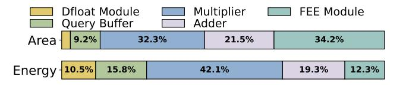

# VII. RELATED WORK

**Software-based ANNS Acceleration.** Early research focused on tree-based (*e.g.*, R-tree [79], KD-tree [80]) and hashbased (*e.g.*, LSH [7], [9]) approaches to optimize ANNS index structure. Subsequently, quantization-based methods (*e.g.*, PQ [24], [25], RabitQ [26]) were proposed to reduce the index size and calculation overhead by pre-computing some values during the index-building stage. In addition, graph-based methods (*e.g.*, NSG [12], HNSW [14]) are widely adopted due to their higher accuracy and speed. Recent works also propose dimension reduction [26], [33] and reordering [81] methods. Meanwhile, works such as SCANN [21], SPFresh [82], and VBASE [83] integrate optimized indexing, quanti-

Fig. 27: Area and energy breakdown of VPE modules.

zation, updating and query-processing techniques to achieve high performance on CPU.

Hardware-based ANNS Acceleration. CAGRA [15] optimizes graph-based ANNS on GPU, achieving up to one million QPS. ANNA [61] and NeuVSA [84] are ASIC designs targeting the quantization-based ANNS (PQ). DF-GAS [49] proposes accelerating graph-based ANNS on FPGA, achieving high throughput by exploring feature-packing memory access patterns and a parallel search scheme. DiskANN [85], SPANN [86], and SPFresh [82] leverage SSD-backed or disk-based indices to support billion-scale vector search with reduced DRAM requirements. Some designs are implemented based on near-SSD computation including VStore [87], ND-Search [18], SmartANNS [50], REIS [88], and ICE [51]. They achieve better results than disk designs, but the SSD speed is still slower than DRAM. Designs based on near/indata processing emerge, as they provide promising bandwidth. Some works like UPVSS [89] and PIMANN [62] implement ANNS acceleration with the help of UPMEM PIM, while DRIM-ANN [90] targets commercial DRAM-PIM. ANSMET [17], CXL-ANNS [19] and DReX [20] further employ near/indata processing and hardware/software co-designs to accelerate ANNS and dense retrieval. ANSMET employs DIMMbased NDP and implements hybrid early exiting. However, its early exiting threshold is not sufficiently strict, which limits its performance. NASZIP further boosts performance by using FEE-sPCA and Dfloat to eliminate more redundant computations, while leveraging the combined hardware optimizations of DaM and LNC.

## VIII. CONCLUSION

Graph-based ANNS is widely adopted in vector databases for its high accuracy and low latency, but its memory-bound nature makes memory bandwidth critical to performance. NASZIP addresses this challenge through an efficient NDP architecture and a software-hardware co-design for ANNS acceleration. Our software innovations include statistics-based early exiting and dynamic floating-point representation. Our hardware innovations include data-aware mapping, caching, and prefetching. Together, they significantly improve the performance over baselines. Consequently, NASZIP outperforms state-of-the-art ANNS designs across diverse architectures.

