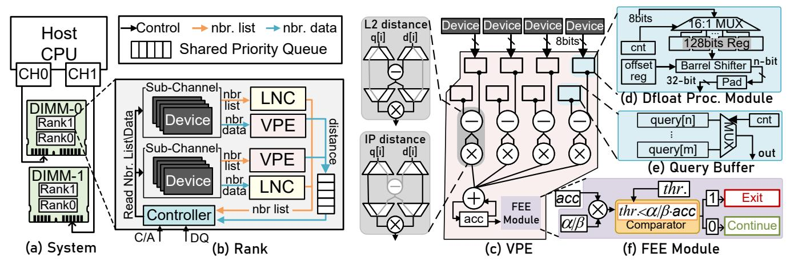

# <span id="page-5-3"></span>Algorithm 1 Search algorithm for Dfloat configuration.

```
1: Input: Target recall@k = R_{\text{target}}; Number of features each
      vector = d; Recall@k with subsets of queries = R'(\cdot),
      1 + n_{\text{exp}} + n_{\text{man}} \in [12, 32]; Number of bits per burst B_{\text{burst}}
 2: Output: Optimized Dfloat configuration \mathbb{C}_{opt}
 1: N_{\text{burst}}^{\text{max}} \leftarrow d/(B_{\text{burst}}/32);
                                                        N_{\text{burst}}^{\text{min}} \leftarrow d/(B_{\text{burst}}/12)
 2: while N_{\text{burst}}^{\min} < N_{\text{burst}}^{\max} do
             N_{\mathrm{burst}} = \lfloor (N_{\mathrm{burst}}^{\mathrm{min}} + N_{\mathrm{burst}}^{\mathrm{max}})/2 \rfloor
 3:

    Number of bursts

              \{\mathbb{C}\} \leftarrow \operatorname{cfg-validate}(N_{\operatorname{burst}})
                                                                                ▶ All valid configs
 4:
             for i = 1 to \#configs(\{\mathbb{C}\}) \& \mathbb{C} \neq \emptyset do
 5:
                    if R(\mathbb{C}_i) \geq R_{\text{target}} \& R(\mathbb{C}_i) > R(\mathbb{C}_{\text{opt}}) then
 6:
                           N_{\text{burst}}^{\text{min}} \leftarrow N_{\text{burst}}; \, \mathbb{C}_{\text{opt}} \leftarrow \mathbb{C}_i;
 7:
 8:
                    end if
             end for
 9:
             if N_{\mathrm{burst}}^{\mathrm{min}} \neq N_{\mathrm{burst}} then
10:
                    N_{\text{burst}}^{\text{max}} \leftarrow N_{\text{burst}}
12:
             end if
13: end while
                                         \triangleright \{n_{\rm exp}, n_{\rm man}\} for each vector segment
14: Return \mathbb{C}_{opt};
```

2) NDP-aware optimization: Based on our preliminary results, simply applying one configuration (i.e., small  $n_{\rm exp}$  and  $n_{\rm man}$ ) for all dimensions leads to a significant recall degradation. It occurs mainly because our sPCA transformation concentrates more important information in lower dimensions, and those dimensions are more sensitive to the low bit-width representation. To achieve better bit-level compression, we propose to conduct a fine-grained search to identify an optimized Dfloat configuration, to maximize ANNS throughput and recall rate. We first divide a vector into  $N_{\rm seg}$  segments along the feature dimension, each with a different bit width. We formulate the optimization objective to minimize the number of DRAM bursts for accessing one vector  $N_{\rm burst}$  while keeping the ANNS recall rate above a preset threshold  $R_{\rm target}$ :

$$\min_{\mathbb{C}_{ont}} N_{burst}; \quad \text{Subject to: } R(\mathbb{C}_{opt}) > R_{target}$$
 (8)

where  $R(\mathbb{C}_{\mathrm{opt}})$  is the recall evaluated when VecDB is processed with an optimized Dfloat configuration  $\mathbb{C}_{\mathrm{opt}} = \{n_{\mathrm{exp},i}, n_{\mathrm{man},i}\}_{i=1}^{N_{\mathrm{seg}}}$ . Taking configuration **Dfloat-1** in Fig. 9 as an example, the vector is divided into three segments via a search algorithm  $(N_{\mathrm{seg}}=3)$ . The chosen Dfloat configuration for the 1st segment is  $1+n_{\mathrm{exp},1}+n_{\mathrm{man},1}=18$ .

Given a specific VecDB, to identify an optimized Dfloat configuration  $\mathbb{C}_{\mathrm{opt}}$ , we combine binary search and brute force enumeration as described in Algorithm 1. The general idea of Algorithm 1 is performing the binary search between maxand min-bound of possible  $N_{\mathrm{burst}} \in [N_{\mathrm{burst}}^{\min}, N_{\mathrm{burst}}^{\max}]$ . For a

<span id="page-6-0"></span>

Fig. 10: **Hardware architecture overview of NASZIP.** The host CPU connects to DIMM-based DRAM modules via memory channels, where each rank embeds near-memory hardware.

specific  $N_{\text{burst}}$ , we conduct an exhaustive search and filter out all possible Dfloat configurations via validation (line-4 in Algorithm 1) following the rules:

- 1) Features of one DRAM burst use identical Dfloat format;
- 2) When the number of features per burst is set, we are prone to increase Dfloat bit width to achieve higher recall;
- 3) The feature bit width  $(1 + n_{exp} + n_{man})$  gradually decreases with the feature index increasing;
- N<sub>burst</sub> must be a multiple of the number of devices per sub-channel, as devices work synchronously.

Note that the DRAM burst size ( $B_{burst}$ ) depends on the DDR generation, e.g., 128 bits for DDR5 and 64 bits for DDR4.

Line 6 of Algorithm 1 evaluates several sampled queries to characterize the database through multiple searches. To ensure broad coverage of HNSW traversal paths and avoid repeatedly probing localized regions, the sampled queries should be diverse. We select them from the full train set of benchmark or sample 1K queries from test set if train set is absent, which is sufficiently representative and covers most index paths. To efficiently explore the Dfloat design space, we use a maskbased emulation method on the host CPU: by applying bit masks to 32-bit floating-point data, we emulate the precision loss of different configurations without repeatedly rebuilding the index. For frequently updated databases, we run the offline process (including both FEE-sPCA and Dfloat) only when updates reach about 30% of the database, at which point the vector index itself typically also requires rebuilding due to structural degradation.

3) Portability: Dfloat improves performance only by increasing the number of features retrieved per memory access, without changing the computation itself or requiring specialized computation units. Before entering the FPU, Dfloat values are zero-padded to match standard arithmetic units (FP32 in NASZIP). Dfloat packing is performed offline during pre-processing. It is independent of any particular floating-point format and can be applied to existing floating-point representations.

4) ECC Compatibility: Server-grade DDR5 DIMMs typically use both on-die ECC and side-band ECC for reliability [57], [58]. In on-die ECC, DRAM chips internally compute the ECC for the written data and store the ECC code. Since NASZIP adds NMA logic in a separate chip without modifying DDR5 dies, on-die ECC remains unaffected. As for side-band ECC, it has additional DRAM chips for ECC bits storage. However, Dfloat is only a software-level data representation, and the physical DRAM chips still follow the standard DDR5 burst format. Thus, conventional memory-controller ECC correction [59] remains compatible with NASZIP.

#### V. HARDWARE ARCHITECTURE

#### A. Architecture Overview

The overall architecture of NASZIP is shown in Fig. 10, consisting of a host CPU and multiple DIMM-based DDR5 DRAM modules connected via memory channels. An example configuration is illustrated in Fig. 10a, where two memory channels are each connected to one DIMM. Each DIMM contains multiple ranks and incorporates customized hardware to accelerate ANNS.

Fig. 10b shows the micro-architecture of a rank, in which DRAM devices are organized into two DDR5 sub-channels. Each sub-channel contains four DRAM devices with 8-bit IO width. NASZIP integrates a vector processing engine (VPE) and a local neighbor cache (LNC) into each sub-channel for efficient near-memory ANNS acceleration. The VPE computes distances for vectors retrieved from the local sub-channel, while the LNC caches frequently accessed neighbor lists to reduce redundant memory accesses. A shared priority queue after the two VPEs merges and sorts their results, so that only top candidates are returned to the host CPU, reducing both data transfer and CPU-side overhead. The controller, shared priority queue, two LNCs, and VPEs are packaged together with the buffer chip. We next describe the VPE design in Section V-B, followed by our data-aware mapping (DaM) and local neighbor cache (LNC) designs in Section V-C and Section V-D, respectively.

<span id="page-7-4"></span>

Fig. 11: An example 128-dimensional vector data mapping within a sub-channel (on SIFT [\[43\]](#page-15-5) dataset).

