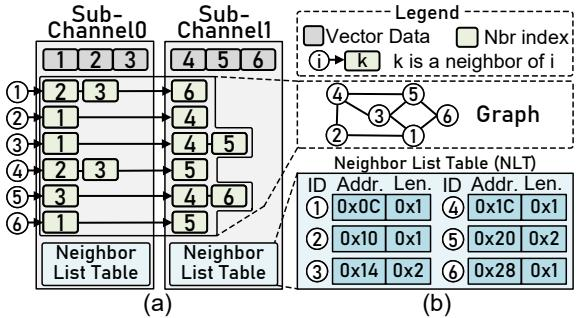
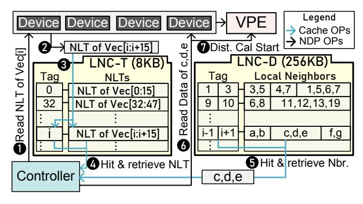
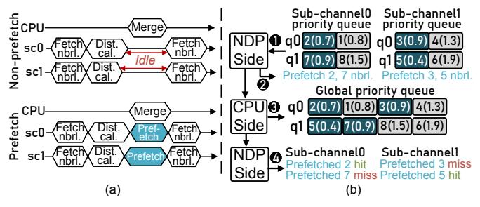
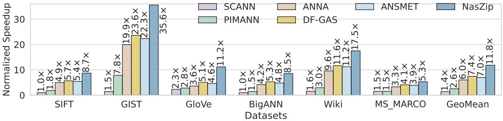

# *B. Vector Process Engine*

Fig. [10c](#page-6-0) shows the microarchitecture of the VPE, which integrates the FEE and Dfloat optimizations described in Section [IV-A](#page-3-1) and Section [IV-B.](#page-5-0) The VPE contains four parallel processing paths, each corresponding to one DRAM device. Each path includes a Dfloat processing module, a query buffer, and a distance calculation module. The outputs of the four paths are then merged by an accumulator, whose result dynamically guides the FEE module to trigger early exit.

The *Dfloat process module*, shown in Fig. [10d](#page-6-0), decodes Dfloat-formatted vector data retrieved from the DRAM device. DRAM data are read in bursts, with each device supplying 128 bits per burst, *i.e*., 8 bits per cycle over 16 cycles. Accordingly, a counter-controlled 16-to-1 multiplexer sequentially loads the 16 bytes of a burst from one DRAM chip into a 128-bit register. Once the register is filled, a barrel shifter extracts each n-bit Dfloat element according to the preset offset register. The extracted value is then zero-padded to 32-bit floating point, completing the decoding process.

The *query buffer*, shown in Fig. [10e](#page-6-0), stores query vector elements preloaded by the CPU before search. During computation, a wrapped-counter-driven multiplexer sequentially outputs one query element per cycle for distance calculation.

The *distance calculation module* (gray-highlighted in Fig. [10c](#page-6-0)) supports both L2 distance and inner-product (IP) computation between the query and vector data. It adopts a shared datapath with a multiplexer to switch between the two modes, following prior designs [\[17\]](#page-14-8), [\[19\]](#page-14-10), [\[60\]](#page-15-19). The partial distances produced by the four parallel modules are then accumulated in the accumulator.

The *FEE module*, shown in Fig. [10f](#page-6-0), determines whether early exit should be triggered. Whenever the accumulator is updated, the module estimates the final distance by scaling the current partial sum with factors αk and βk, following Section [IV-A.](#page-3-1) The estimation is then compared with the threshold, *i.e*., the distance of the current farthest point in the candidate queue. If the estimated distance exceeds the threshold, early exit is triggered and the vector is discarded.

## *C. Mapping of Data and Neighbor List*

*1) Data mapping:* NASZIP maps each vector entirely to a single sub-channel, with its dimensions distributed across the four DRAM devices. Fig. [11](#page-7-4) shows an example for a 128-dimensional vector. With Dfloat encoding, dimensions

Fig. 12: Data-aware neighbor list mapping (DaM). Neighbor lists are partitioned across sub-channels.

1∼42, 43∼74, and 75∼128 are assigned 18, 14, and 16 bits, respectively. Since each device provides 128 bits per burst, these three segments require six, four, and six bursts, respectively. The bursts are interleaved across the four devices, so that in each memory access all devices return one burst in parallel. Access then proceeds sequentially until all dimensions are processed, naturally matching FEE, which evaluates dimensions in increasing order.

*2) Data-aware neighbor list mapping (DaM):* NASZIP stores neighbor lists on NDP to offload neighbor retrieval from the CPU to NDP, as discussed in Section [III-B2.](#page-3-4) To reduce cross-channel communication and enable parallel lookup, NASZIP places each neighbor list in a data-aware manner, colocating it with the corresponding vector in the same subchannel. As a result, each sub-channel can independently retrieve neighbors and compute distances for its local vectors, minimizing cross-channel data movement.

Fig. [12](#page-7-5) shows an example with six nodes, where both vector data and partitioned neighbor lists are distributed across sub-channels. For example, vector 1 has neighbors {2, 3, 6}. Because vectors 2 and 3 are stored in sub-channel 0 while vector 6 is stored in sub-channel 1, the neighbor list of vector 1 is partitioned accordingly across the two sub-channels. When the CPU issues a request to traverse the neighbors of vector 1, sub-channel 0 retrieves its local neighbor list and computes the distances for vectors 2 and 3. In parallel, sub-channel 1 independently handles vector 6, eliminating the need for intersub-channel communication.

However, the length of each partitioned neighbor list differs across nodes, making efficient indexing nontrivial. To address this, we store a neighbor list table (NLT) in each channel memory, as shown in Fig. [12b](#page-7-5). The NLT records the length and memory address of the neighbor list, enabling efficient indexing of variable-length entries. To further accelerate neighborlist lookup, we also employ a local neighbor cache (LNC).

## *D. Local Neighbor Cache*

The key insight is that neighbor-list accesses exhibit strong temporal and spatial locality: similar or repeated queries often revisit the same nodes, causing redundant lookups. To exploit this locality, NASZIP introduces the local neighbor cache for tables (LNC-T) and the local neighbor cache for data (LNC-D). LNC-T stores NLT entries and functions similarly to a

Fig. 13: **Illustration of local neighbor cache** (LNC). LNC-T caches entries of the Neighbor List Table (NLT), while LNC-D caches the actual neighbor list contents.

Fig. 14: (a) **Comparison of flows** with and without prefetch. (b) **Execution flow with prefetch** under batch=2.

translation lookaside buffer (TLB), while LNC-D stores the corresponding neighbor-list contents and functions like a data cache. They together reduce memory accesses and improve search throughput.

Fig. 13 illustrates the structure and operation of the LNC. Its configuration is: LNC-T is an 8KB fully associative cache, while LNC-D is a 256KB 8-way set-associative cache. Both use 64-byte cache lines, matching the burst size of a subchannel. The two caches use different tag formats. Since each NLT entry (Fig. 12b) occupies 4 bytes (3 bytes for the start address and 1 byte for the length), one LNC-T cache line stores 16 entries, so its tag only records the ID of the first entry. By contrast, because neighbor-list sizes vary across sub-channels, the LNC-D tag records both the start and end node IDs of the cached neighbor-list segment.

Fig. 13 also illustrates the LNC workflow. Consider the distance calculation for vector i, where its NLT entry misses in LNC-T but its neighbor list hits in LNC-D. The controller first requests the NLT entry of vector i (1), which is fetched from memory (2) and inserted into LNC-T (3). The controller then reads the cached NLT entry from LNC-T (4) to obtain the address of vector i's neighbor list. Next, the neighbor list is accessed from LNC-D with a cache hit (5). Using the length information (3 in this example), the controller identifies the local neighboring nodes as c, d, and e, and then issues requests to fetch their data and compute distances (6).

TABLE II: Evaluation Platforms and Configurations.

| Host CPU | AMD EPYC 9334, 32-Core, 2.7-3.9 GHz,             |
|----------|--------------------------------------------------|
|          | 64 KB (per core) L1 cache,                       |
|          | 1MB (per core) L2 cache, 128 MB shared L3 cache  |
| NDP      | DDR5-4800, 2 or 6 channels, 2 DIMMs per channel, |
|          | 2 ranks per DIMM, 2 VPEs and LNCs per rank,      |
|          | 256KB LNC-D, 8KB LNC-T, 1.2 GHz                  |

#### E. Neighbor List Prefetching and batch scheduling

Scheduling is performed by synchronizing the hop-by-hop traversal of multiple queries within a batch. Within each hop, vector distances are computed sequentially because our lightweight design provides only a limited number of FPUs, leaving little room for intra-hop scheduling optimization. However, as shown by the baseline schedule in Fig. 14a upper part, we observe idle time between hops while waiting for CPU-side merging. To exploit this gap, NASZIP prefetches neighbor lists for the next BFS hop. An example with two subchannels and a batch of two queries is shown in Fig. 14b. After each search hop (1), the sub-channel priority queue stores the current vector IDs of each query (q0 and q1), ordered by distance. For example, 2(0.7) denotes vector 2 with distance 0.7. Each sub-channel then prefetches the neighbor list (nbrl.) of the current closest vector for each query (2) and stores the fetched data in the LNC. Meanwhile, the queue contents are sent to the host CPU, which merges and sorts them in the global priority queue (3). The CPU then returns the global closest nodes to each sub-channel for the next BFS hop. In the example, the next hop requires the neighbor lists of vectors 2 and 5, so sub-channel 0 and sub-channel 1 successfully reuse the prefetched data, respectively (4). As shown in Fig. 14a, this prefetching scheme fills the idle gap during CPU-side merging compared with the no-prefetch baseline.

When prefetching fails, the overhead remains small because the prefetched content is retained in the LNC (Section V-D), where it can still be effectively reused by future accesses. We further analyze the prefetch hit rate in Section VI-C5, and the impact of batch size on scheduling in Section VI-C6.

#### VI. EVALUATION

#### A. Evaluation Methodology

1) Experimental setup: We develop RTL implementations of added logic in NASZIP. The functionality of modules in NASZIP is verified on FPGA. For accurate area and power evaluation, the RTL design is synthesized using Synopsys Design Compiler with 28nm technology, and place-and-routed using Cadence Innovus. System performance (QPS, latency, recall) is evaluated on UniNDP [39], a cycle-accurate NDP simulator. System configurations are specified in Table II.

#### 2) Competing designs:

- **CPU baselines:** HNSW and *SCANN* [21] on a 32-core CPU (*CPU-baseline*) and a 96-core CPU (*CPU-HP*).
- **Prior accelerator designs:** *ANNA* [61] on ASIC, *DF-GAS* [49] on FPGA, *PIMANN* [62] on UPMEM, and *CAGRA* [15] on NVIDIA A100 GPU.

Fig. 15: **Throughput (QPS) across datasets** with recall@ $10 \ge 90\%$  on various architectures including CPU (SOTA SCANN), ASIC (ANNA), UPMEM (PIMANN), FPGA (DF-GAS), NDP (SOTA ANSMET, NASZIP) normalized to CPU baseline.

TABLE III: Specifications of Benchmark Datasets.

| Dataset       | Distance   | # Dims | # Vectors | # Queries |
|---------------|------------|--------|-----------|-----------|
| SIFT [43]     | $L^2$ norm | 128    | 1M        | 10K       |
| GIST [43]     | $L^2$ norm | 960    | 1M        | 1K        |
| BigANN [63]   | $L^2$ norm | 128    | 1B        | 10K       |
| GloVe [44]    | IP         | 100    | 1.2M      | 1K        |
| Wiki [64]     | $L^2$ norm | 768    | 1M        | 10K       |
| MS_MARCO [65] | $L^2$ norm | 384    | 8M        | 1K        |

Fig. 16: **Normalized throughput** (QPS) of CPU-HP, GPU and NASZIP (6 channels), with recall@1 and recall@ $10 \ge 90\%$ .

- **NDP baselines:** Vanilla HNSW on NDP (*NDP-baseline*) and the SOTA NDP design *ANSMET* [17].
- 3) Datasets: The datasets used in this work are summarized in Table III. SIFT, GIST, BigANN, and GloVe are standard ANNS datasets with high-dimensional vectors. Wiki and MS\_MARCO are retrieval corpora. Wiki contains Wikipedia articles, whose 768-dimensional embeddings are generated by Sentence-BERT [66]. MS\_MARCO consists of real Bing question—answer pairs, whose 384-dimensional embeddings are generated by the widely used BGE model [67]. We build the indices of these datasets and convert the indices into the format required by NASZIP.

