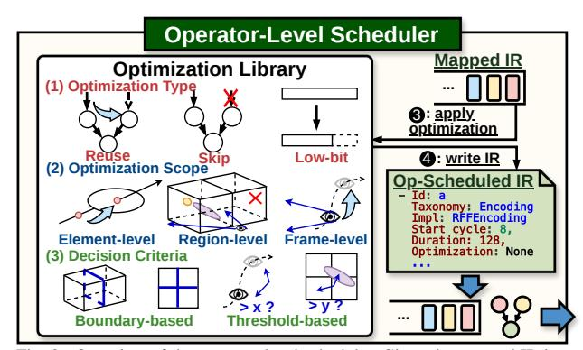
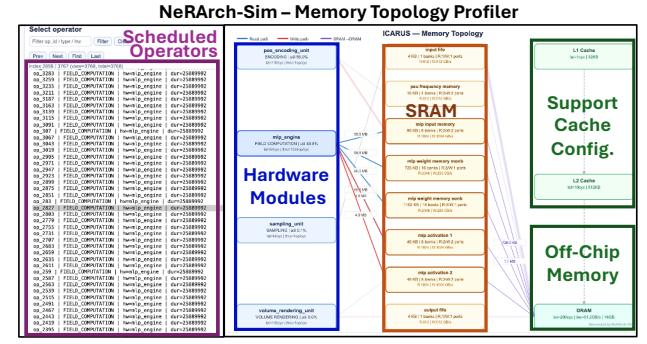
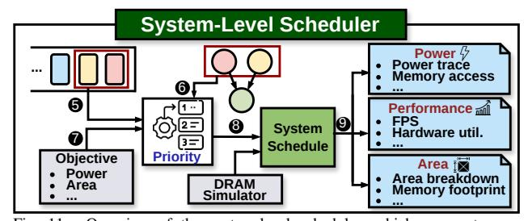
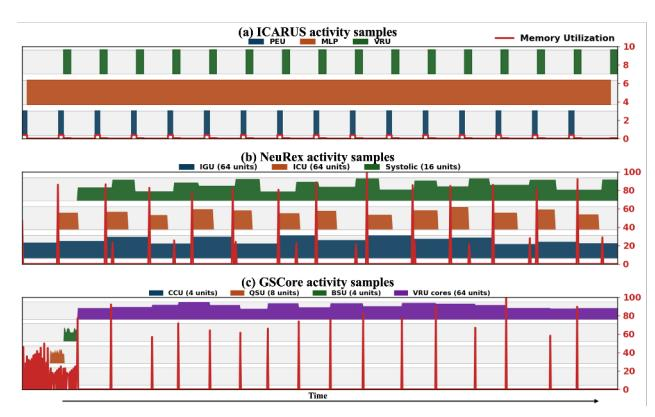
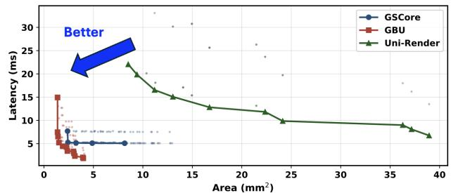
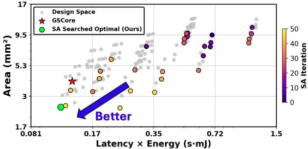
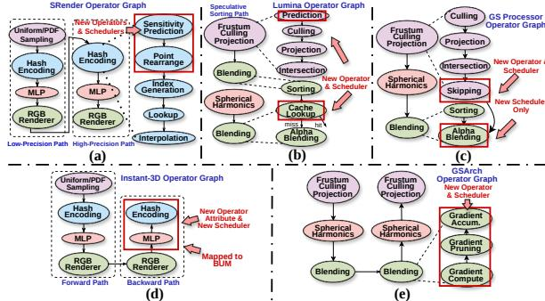
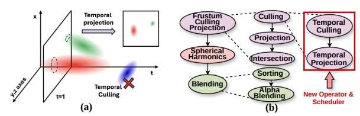

# B. Operator-Level Scheduling: Domain-Specific Optimization Strategies

Following the mapping phase, the operator-level scheduler transforms the mapped IR into execution-ready schedules by applying operator-specific optimizations (**3** in Fig. 9) tailored to neural rendering workloads. This scheduling stage leverages domain-specific knowledge to optimize execution. By categorizing these patterns into a structured framework, the operator-level scheduler can select and combine optimization strategies based on operator characteristics and hardware capabilities.



Fig. 9. Overview of the operator-level scheduler. Given the mapped IR input, the operator-level scheduler first queries the implemented optimization library to obtain operator-specific optimizations and execute the corresponding schedule. It generates the detailed scheduling results for each operator-hardware pair in the mapped IR and writes them to the operator-scheduled IR.

The scheduler produces the **operator-scheduled IR** (**4** in Fig. 9) illustrated in Tab. V-(b), augmenting the mapped representation with precise execution details while maintaining an abstract interface for system-level scheduling.

The key to applying these domain-specific optimizations lies in understanding the common patterns employed across existing accelerators. Through systematic analysis, we identified recurring optimization patterns that can be systematically categorized along three orthogonal dimensions, as summarized in Fig. 9. This three-dimensional framework provides a comprehensive categorization for understanding and applying optimizations in neural rendering accelerators.

**Optimization type** defines the fundamental operation performed by the optimization. **Reuse:** Shares computation results when multiple operations require the same intermediate values, exploiting redundancy in the rendering pipeline. **Skip:** Avoids unnecessary computation and data movement when results are negligible or predictable. **Low bit:** Utilizes low-precision arithmetic [44], [51] for importance computation to reduce memory bandwidth and energy consumption, and to accelerate execution without loss in rendering quality.

Optimization scope determines the granularity at which optimizations are applied. Element-level: targets individual rays, points, or primitives, including Gaussian skipping [9] that bypasses rendering based on contribution scores, per-ray early termination [23], [25] using accumulated opacity, and exponential value reuse [9] that shares computations across multiple Gaussians. Region-level: operates on spatial groups such as tiles, subgrids, or blocks. Restricted hashing [23] processes rays within subgrids, tile-based Gaussian processing [25] groups primitives by screen tiles, and bitmap culling [25] eliminates entire subtiles. Frame-level: spans temporal boundaries between frames. Sparse radiance warping [12] identifies and reuses pixels with similar rays across frames, transforming radiance values to avoid redundant computation.

**Decision criteria** specify the conditions determining when to apply optimizations. **Boundary-based:** Leverages geometric boundaries and spatial partitions to trigger optimizations. Examples include subgrid boundaries [23] and tile boundaries [25] for reuse decisions, and bounding box tests [25] for skip decisions. **Threshold-based:** Evaluates computed metrics against predefined values to activate optimizations. This includes angular proximity thresholds [12] for temporal reuse, sensitivity scores [51] for precision reduction, and alpha/distance thresholds [9] for Gaussian skipping.

This structured optimization framework, applicable across the unified taxonomy, together with NeRArch-Sim's optimization library implementation, enables developers to readily identify applicable techniques for new accelerator designs.

In NeRArch-Sim's implementation, the operator-level scheduler queries the optimization library and maps the selected strategies to per-operator time and memory traffic recorded in the op-scheduled IR. At a high level, we model each operator's time as in Eq. 1

duration
$$(op) = \max\left(\frac{n_{\text{op}}}{\Theta_{\text{hw}}} \cdot s_{\text{comp}}, \frac{v_{\text{off}}}{B_{\text{hw}}} \cdot r_{\text{bytes}}\right),$$
 (1)



Fig. 10. Per-operator memory topology profiler for the ICARUS accelerator. Left panel: interactive operator selector with filtering. Right pane, left to right: hardware modules with utilization and throughput; SRAM instances with capacity, banks, ports, and bandwidth, connected via read/write bindings with data movement volumes on each edge; and the memory hierarchy with per-level latency and bandwidth.

where  $n_{\rm op}$  is the number of elements processed;  $v_{\rm off}$  is communication volume;  $\Theta_{\rm hw}$  is hardware compute throughput; and  $B_{\rm hw}$  is effective memory bandwidth. These parameters are extracted from the mapped IR (Tab. V-(a)). The factors  $s_{\rm comp}, r_{\rm bytes} \in (0,1]$  interface with new dataflow optimizations, capturing compute and memory-traffic reduction from the optimization library. For instance, with tile culling optimization [25] in 3DGS field compute, we derive  $s_{\rm comp}$  from the active Gaussian ratio.

**Memory-aware duration modeling.** The memory term in Eq. 1  $(v_{\rm off}/B_{\rm hw})$  depends on the memory topology. As illustrated in Fig. 10, NeRArch-Sim models a configurable memory hierarchy: hardware modules connect to other modules (direct data passing) or to SRAM instances with configurable capacity, banks, ports, and access latency; SRAM connects to DRAM via Ramulator 2.0 [18]. The updated duration and parameters in Eq. 1 are recorded in the op-scheduled IR and fed into system-level scheduling.

## C. System-Level Scheduling: Global Orchestration Through Op-Scheduled IR

The system-level scheduler combines the local decisions into a globally coordinated execution plan, as shown in Fig. 11. This stage consumes the op-scheduled IR from all hardware modules and resolves cross-module dependencies to maximize



Fig. 11. Overview of the system-level scheduler, which aggregates opscheduled IR results and analyzes operator dependencies to compute priority scores for each ready operation. Based on the scores, it commits operations to the system schedule while respecting resource constraints. The final schedule generates power, performance, and area metrics.

## Algorithm 1 Dependency-Aware Greedy Scheduler (DAGS)

```
Require: Operator Graph G = (V, E), op-scheduled IR S
Ensure: System-level schedule SS
1: procedure DAGS(G, S)
2: SS ← ∅
3: Q ← GETSOURCENODES(G) ▷ all ready ops
4: while Q ̸= ∅ do
5: for all op ∈ Q do
6: d ← COUNTSUCCESSORS(op, G) ▷ number of dependent ops
7: c ← COMPUTECRITICALIMPACT(op, G, S) ▷ resource impact
8: score(op) ← α d + β c
9: end for
10: sel ← arg maxop∈Q score(op)
11: st ← FINDEARLIESTSLOT(sel, S, SS)
12: dur ← S[sel].duration
13: SS[sel] ← (st, dur)
14: UPDATEREADYQUEUE(Q, G, SS)
15: end while
16: return SS
17: end procedure
```

system performance. The op-scheduled IR provides all necessary information for global coordination, allowing the systemlevel scheduler to remain agnostic to operator-specific details while still making informed decisions.

For system-level scheduling, neural rendering workloads exhibit natural parallelism: operators within the same stage (e.g., processing different rays or spatial points) execute independently, creating predictable synchronization points at stage boundaries. Leveraging this, NeRArch-Sim employs a Dependency-Aware Greedy Scheduler (DAGS) that models existing neural rendering accelerators with low error. The DAGS algorithm, shown in Algorithm 1, takes two key inputs: the operator graph G = (V, E) capturing data dependencies and the op-scheduled IR S containing local scheduling decisions, resource allocations, and hardware constraints.

The DAGS algorithm employs two heuristics exploiting neural rendering's computational structure: Successor Count (d): Prioritizes operations at stage boundaries to unlock entire stages of independent operators, maximizing parallelism (❺ in Fig. 11). Critical Resource Impact (c): Accounts for heterogeneous resource demands across rendering stages (e.g., nop, voff in Eq. 1), ensuring efficient utilization during stage transitions (❻ in Fig. 11). The scoring weights (α, β) enable NeRArch-Sim to model existing accelerators and explore alternative scheduling priorities (❼). The FindEarliestSlot function resolves resource contention by respecting resource availability, data dependencies, bandwidth constraints, and SRAM bank/port conflicts to determine conflict-free execution. Once the earliest valid slot is found, DAGS commits the operation to the system schedule with its start time and duration from the op-scheduled IR (❽). The resulting schedule drives NeRArch-Sim's performance modeling, generating power traces, memory patterns, and execution timelines that yield latency, throughput, power, and area metrics (❾).

While NeRArch-Sim's operation order may differ from existing accelerator simulators, DAGS targets modeling fidelity rather than scheduling optimality; the critical path remains unchanged under the same data dependencies and hardware constraints; thus, overall latency and energy stay within our reported error bounds. The effectiveness of DAGS is empirically validated in Sec. V-C with low modeling error, demonstrating that it captures the system-level scheduling complexity of existing neural rendering accelerators. The evaluated accelerators employ diverse dataflow strategies (weight-stationary in ICARUS, pipelined encoding-MLP overlap in NeuRex, tilebased sorting-rasterization overlap in GSCore), all captured through operator graph structure, hardware configuration, and memory bindings without changes to the scheduling algorithm.

DAGS also offers key advantages: (1) Fast compilation – scheduling completes in seconds even for complex workloads, enabling rapid iteration; (2) Interpretable decisions – hardware developers understand scheduling choices, facilitating hardware–software co-design; and (3) Modular integration – while our greedy approach suffices for current accelerators, the scheduler interface enables exploration of sophisticated algorithms for future architectures as needed.

## V. EVALUATION

## *A. Evaluation Settings*

NeRArch-Sim Implementation Details. For the algorithm infrastructure framework illustrated in Fig. 5, we adopt the commonly used NerfStudio [55] in our evaluation. The modular hardware accelerator in NeRArch-Sim is implemented using Catapult HLS [50] with SystemC [1]. The scheduler is implemented in C++. Additionally, we utilize a commercial 28nm HPCP technology node to extract hardware configuration results, and we normalize all baselines to 28nm via DeepScaleTool [48] for fair comparison. SRAM analysis uses the node's SRAM compiler. DRAM timing statistics are obtained using Ramulator [18].

Datasets & Baselines. For datasets, we evaluate small scenes on NeRF-Synthetic [39] (small-scale objects without backgrounds) and large scenes on Unbounded360 [3] (large-scale indoor/outdoor environments with complex backgrounds). To validate NeRArch-Sim's accuracy in modeling existing neural rendering pipelines, we include ICARUS [44], NeuRex [23], CICERO [12], GSCore [25], GBU [65], and Uni-Render [26] as baselines in our evaluation.

## *B. Individual Hardware Modules Validation*

Tab. VI summarizes the modeling results for hardware accelerator modules (introduced in Sec. III-C) across different rendering pipelines, as reported by our modular hardware libraries in NeRArch-Sim and the reference full ASIC design flow, implemented using Fusion Compiler [53] and Prime-Power [52] (marked in gray). Both flows start from the same SystemC source: NeRArch-Sim reports HLS-stage estimates, while the full ASIC flow reports post-layout measurements after synthesis and place-and-route. Specifically, the hardware PPA metrics reported by the modular hardware libraries closely align with those from the full ASIC flow. The modular hardware libraries produce identical latency results across all 17 evaluated modules and yield relative errors of 4.72% to 9.33% in area and power across various neural rendering accelerators. These results demonstrate NeRArch-Sim's capability to deliver both fast (minutes vs. hours) and accurate (≤9.4%

TABLE VI
COMPARING THE MODELING RESULTS FROM OUR NERARCH-SIM AND FULL ASIC DESIGN FLOW (MARKED IN GRAY).

| Module                                                                                              | Latency<br>(cycle)                 | Area $(\mu \text{m}^2)$                                          | Power (μW)                                                     | Avg Err. |
|-----------------------------------------------------------------------------------------------------|------------------------------------|------------------------------------------------------------------|----------------------------------------------------------------|----------|
| ICARUS [44] Pos Encoding Unit MLP Engine Volume Rendering Unit                                      | 130/130<br>64/64<br>192/192        | 6714/5200<br>5.9/6.3×10 <sup>6</sup><br>4755/4960                | 305/330<br>4.0/4.2×10 <sup>5</sup><br>1917/2110                | 9.04%    |
| NeuRex [23]<br>Index Generation Unit<br>Systolic Array (32x32)<br>Interpolation Compute Unit        | 4/4<br>37/37<br>4/4                | 48563/51563<br>5.4/5.4×10 <sup>5</sup><br>17371/15882            | 4836/5000<br>1.1/1.3×10 <sup>5</sup><br>2144/2220              | 9.33%    |
| CICERO [12]<br>Reducer<br>Address Generation<br>NPU (24x24)                                         | 8/8<br>8/8<br>26/26                | 557/628<br>2745/3188<br>3.1/3.1×10 <sup>5</sup>                  | 181/234<br>752/710<br>7.6/7.6×10 <sup>4</sup>                  | 8.28%    |
| GSCore [25] Culling & Conversion Unit Bitonic Sorting Unit Quick Sorting Unit Volume Rendering Unit | 128/128<br>4/4<br>64/64<br>192/192 | 1.7/1.7×10 <sup>5</sup><br>14620/12645<br>358/226<br>21690/23841 | 1.4/1.4×10 <sup>5</sup><br>13700/13652<br>130/128<br>3270/2610 | 5.10%    |
| GBU [65]<br>Row Processing Element<br>Row Generation Engine<br>Decomposition & Binning Engine       | 10/10<br>8/8<br>16/16              | 41253/45345<br>15086/17521<br>1.1/1.1×10 <sup>5</sup>            | 14227/13750<br>4763/5220<br>30090/31157                        | 4.72%    |
| Uni-Render [26]<br>PE Array (16x16)                                                                 | 18/18                              | 13.2/14.2×10 <sup>6</sup>                                        | 5.1/5.4×10 <sup>6</sup>                                        | 6.71%    |

#### TABLE VII

COMPARISON OF MODELING RESULTS FROM OUR NERARCH-SIM AND CORRESPONDING PRIOR ACCELERATORS IN AN END-TO-END PIPELINE EVALUATION ON THE LEGO SCENE FROM THE NERF-SYNTHETIC DATASET [39]. THE RENDERING QUALITY (PSNR) AND FPS RESULTS FOR NEUREX [23] ARE TAKEN FROM [51]. THE RENDERING RESULTS FOR UNI-RENDER [26] ARE EVALUATED ON THE 3DGS PIPELINE.

| Metric                  | ICARUS<br>[44] | NeuRex<br>[23] | CICERO<br>[12] | GSCore<br>[25] | GBU<br>[65] | Uni-Render<br>[26] |
|-------------------------|----------------|----------------|----------------|----------------|-------------|--------------------|
| PSNR                    |                |                |                |                |             |                    |
| Reported                | -              | 27.0           | -              | 34.4           | 33.3        | 33.0               |
| Reproduced              | 29.4           | 29.8           | 23.5           | 34.4           | 33.3        | 33.0               |
| Average Err.            |                |                | 2.6            | %              |             |                    |
| Area (mm <sup>2</sup> ) |                |                |                |                |             |                    |
| Reported                | 7.6            | 21.4           | -              | 3.9            | 1.8         | 14.96              |
| Reproduced              | 6.9            | 20.3           | 0.33           | 3.6            | 1.9         | 15.66              |
| Average Err.            |                |                | 6.5            | %              |             |                    |
| FPS                     |                |                |                |                |             |                    |
| Reported                | 0.02           | 19.7           | -              | 190.0          | 180         | 65                 |
| Reproduced              | 0.02           | 18.6           | 326.4          | 182.2          | 172         | 63                 |
| Average Err.            |                |                | 3.4            | %              |             |                    |

relative error) PPA estimations of single modules, thereby enabling extensible benchmarking and effective DSE.

### C. End-to-end Pipeline Benchmarking

To demonstrate NeRArch-Sim's ability to reproduce existing neural rendering accelerators for fair and extensible benchmarking, we summarize the comparison between the modeling results generated by NeRArch-Sim and the reported results from prior accelerator designs in Tab. VII. Specifically, the area and FPS of the end-to-end pipelines modeled by NeRArch-Sim closely match the reported metrics, with only 6.5% and 3.4% average error in area and FPS, respectively. Since prior works report end-to-end metrics, we validate at the same granularity. These results highlight NeRArch-



Fig. 12. Resource utilization analysis over time for three different pipelines evaluated on the Bicycle scene of the Unbounded360 dataset [3]. PEU: Position Encoding Unit; IGU: Index Generation Unit; ICU: Interpolation Compute Unit; CCU: Culling & Conversion Unit; QSU: Quick Sorting Unit; BSU: Bitonic Sorting Unit; VRU: Volume Rendering Unit.

Sim's potential as a reliable DSE tool for further exploring improvements to existing accelerators under more challenging design constraints, as detailed in Sec. VI.

#### D. End-to-end Resource Utilization Breakdown

NeRArch-Sim provides end-to-end resource-utilization analysis (Fig. 12), enabling developers to identify performance bounds and dominant bottlenecks. In Fig. 12-(a), ICARUS exhibits minimal memory activity due to effective on-chip SRAM caching of the MLP's compact model, while the persistently high MLP utilization indicates that the MLP stage is the dominant bottleneck. Fig. 12-(b) shows that NeuRex is primarily driven by IGU and systolic-array operations, with intermittent memory spikes from occasional data misses, suggesting that improving data locality alongside systolic-array balance would boost throughput. Fig. 12-(c) shows that GSCore performs a brief preprocessing stage before becoming dominated by volume-rendering workloads, indicating that accelerating VRU operations or reducing Gaussian count would yield further speedup.

#### E. Memory Analysis

Using the configurable memory model in Sec. IV-B and visualized in Fig. 10, we analyze the memory behavior of three representative accelerators.

Tab. VIII profiles per SRAM data flow for three accelerators. Both ICARUS and NeuRex perform ray marching at the Field Sampler stage, which streams ray sample coordinates from DRAM through the Input FIFO. For ICARUS, the Input FIFO streams 1.4 GB of sample coordinates per frame; weights (1.9 MB) are loaded once and reused ∼100K times; activations stay on-chip as ping-pong buffers. NeuRex shares the same ray marching stage but its DRAM traffic is dominated by position streaming (469 MB) and hash subtable loading (16 MB) for irregular lookups at fine resolution levels, while on-chip buffers absorb all MLP intermediates. GSCore does not use ray marching; instead it streams Gaussian features from DRAM per tile (79 MB), with sorting and rasterization intermediates fully on-chip.

TABLE VIII
PER SRAM DATA FLOW ANALYSIS ACROSS THREE ACCELERATORS ON THE LEGO SCENE [39].

| SRAM Block       | Size             | SRAM Rd  | SRAM Wr  | DRAM Rd | DRAM Wr |  |  |  |
|------------------|------------------|----------|----------|---------|---------|--|--|--|
| ICARUS [44]      |                  |          |          |         |         |  |  |  |
| Input FIFO       | 4 KB             | 1.4 GB   | 1.4 GB   | 1.4 GB  | _       |  |  |  |
| Frequency Mem.   | 16 KB            | 14.4 GB  | _        | 16 KB   | -       |  |  |  |
| Input Memory     | 96 KB            | 14.4 GB  | 14.4 GB  | _       | _       |  |  |  |
| Weight MONB      | $726\mathrm{KB}$ | 468.8 GB | -        | 726 KB  | _       |  |  |  |
| Weight SONB      | 1.1 MB           | 58.6 GB  | -        | 1.1 MB  | _       |  |  |  |
| Activation 1     | 48 KB            | 234.4 GB | 234.4 GB | _       | _       |  |  |  |
| Activation 2     | 48 KB            | 234.4 GB | 234.4 GB | _       | _       |  |  |  |
| Output FIFO      | 4 KB             | -        | 3.7 MB   | -       | 3.7 MB  |  |  |  |
|                  |                  | NeuRe    | x [23]   |         |         |  |  |  |
| Input FIFO       | 4 KB             | 469 MB   | _        | 469 MB  | _       |  |  |  |
| Position Buffer  | 96 KB            | 469 MB   | 469 MB   | _       | _       |  |  |  |
| Grid Cache       | 64 KB            | 9.8 GB   | _        | 320 KB  | _       |  |  |  |
| Subgrid Buffer   | 128 KB           | 9.8 GB   | _        | 16 MB   | _       |  |  |  |
| Weight Buffer    | 20 KB            | 19.5 GB  | _        | 20 KB   | _       |  |  |  |
| Input Buffer     | 1 MB             | 2.4 GB   | 2.4 GB   | _       | _       |  |  |  |
| Output Buffer    | 1 MB             | 5.1 GB   | 5.1 GB   | _       | _       |  |  |  |
| Output FIFO      | 4 KB             | -        | 3.7 MB   | -       | 3.7 MB  |  |  |  |
|                  |                  | GSCor    | e [25]   |         |         |  |  |  |
| Gaussian In FIFO | 8 KB             | 78.8 MB  | _        | 78.8 MB | _       |  |  |  |
| Tile List Buffer | 32 KB            | 4.1 MB   | 4.1 MB   | _       | _       |  |  |  |
| Sorting Buffer   | 64 KB            | 12.4 MB  | 12.4 MB  | _       | _       |  |  |  |
| GFeat Buffer     | 128 KB           | 6.5 MB   | 9.5 MB   | 9.5 MB  | _       |  |  |  |
| Pixel Out Buffer | 16 KB            | -        | 3.1 MB   | _       | 3.1 MB  |  |  |  |

TABLE IX
PER SRAM BANK CONFLICTS AND STALLS (ROUNDED). STALL
OVERHEAD = STALL CYCLES / TOTAL EXECUTION CYCLES PER FRAME.

| ICARUS [44]     |        |        | NeuRex [23]     |        | GSCore [25] |                 |        |        |
|-----------------|--------|--------|-----------------|--------|-------------|-----------------|--------|--------|
|                 | Confl. | Stalls |                 | Confl. | Stalls      |                 | Confl. | Stalls |
| Freq. Mem.      | 9.1M   | 454K   | Pos. Buf.       | 144K   | 7.2K        | Tile List       | 2.5K   | 127    |
| Input Mem.      | 4.5M   | 227K   | Grid Cache      | 1.5M   | 76.8K       | Sort. Buf.      | 3.8K   | 190    |
| Wt. MONB        | 73.7M  | 3.7M   | Subgrid Buf.    | 7.7M   | 384K        | GFeat Buf.      | 8.8K   | 438    |
| Wt. SONB        | 9.2M   | 461K   | Wt. Buf.        | 12.3M  | 614K        |                 |        |        |
| Act. 1          | 73.7M  | 3.7M   | Input Buf.      | 384K   | 19.2K       |                 |        |        |
| Act. 2          | 73.7M  | 3.7M   | Output Buf.     | 804K   | 40.2K       |                 |        |        |
| Total           | 244M   | 12.2M  | Total           | 22.8M  | 1.1M        | Total           | 15.1K  | 755    |
| Overhead: 0.07% |        |        | Overhead: 2.25% |        |             | Overhead: 0.01% |        |        |

Tab. IX reports per SRAM bank conflicts and stall overhead. NeuRex has the highest relative overhead because its Subgrid Buffer serves irregular, near-random hash lookups at fine resolution levels. ICARUS has more absolute conflicts from activation ping-pong buffers concurrently read/written by adjacent MLP layers, but the overhead is negligible since MLP compute dominates execution. GSCore's sequential tile processing virtually eliminates contention in this case.

### F. Comparison between accelerators

Tab. X compares accelerators across rendering pipelines in area, FPS, and PSNR. The results show that most pipelines except 3DGS fail to achieve 30 FPS as scene complexity

TABLE X

Comparing the modeling results of neural rendering accelerators on the Unbounded360 dataset [3].

| Pipeline           | Area           | Garden             |              | Bicy               | cle          | Stump              |              |
|--------------------|----------------|--------------------|--------------|--------------------|--------------|--------------------|--------------|
|                    | $(mm^2)$       | FPS                | PSNR         | FPS                | PSNR         | FPS                | PSNR         |
| ICARUS             | 5.911          | 7×10 <sup>-4</sup> | 22.2         | $9 \times 10^{-4}$ | 21.2         | 8×10 <sup>-4</sup> | 20.8         |
| NeuRex             | 20.300         | 0.68               | 24.6         | 0.73               | 22.2         | 0.72               | 23.5         |
| CICERO             | 0.330          | 9.57               | 23.5         | 10.92              | 21.8         | 10.64              | 23.3         |
| GSCore             | 3.549          | 81.77              | 27.4         | 61.30              | 25.6         | 74.82              | 26.5         |
| CICERO+<br>GSCore- | 1.320<br>2.953 | 33.49<br>43.2      | 23.5<br>27.4 | 38.22<br>33.1      | 21.8<br>25.6 | 35.11<br>40.5      | 23.3<br>26.5 |



Fig. 13. Comparison of area and latency Pareto fronts for 3DGS accelerators on the Bicycle scene from the Unbounded360 dataset [3].

increases. It also shows that CICERO uses the least resources to achieve relatively high FPS. Using NeRArch-Sim, we scale CICERO (CICERO+ in Tab. X) to compare with 3DGS pipelines and scale down GSCore (GSCore- in Tab. X) to similar FPS. The results show that CICERO+ requires fewer hardware resources than GSCore-.

Fig. 13 further compares 3DGS accelerators—GSCore, GBU, and Uni-Render—in the area-latency space. Each point represents a valid configuration varying core count, on-chip memory, and bandwidth; solid curves highlight the Pareto-efficient operating points. GSCore and GBU lie in the low-area, low-latency region, indicating real-time performance with compact silicon footprints. Uni-Render occupies a higher-area region with higher latency, reflecting overheads from its general, multi-pipeline design.

### G. Simulator Latency Breakdown

Tab. XI presents the end-to-end compilation latency breakdown for a single design point. The total latency comprises two components: (1) **software latency**, which includes instrumentation and operator graph construction (Sec. III-B), and (2) **scheduler latency**, consisting of mapping, operator-level scheduling, and system-level scheduling (Sec. IV). Hardware characteristics are precomputed offline and stored as lookup tables, eliminating the need for users to access design tools.

Tab. XI shows that system-level scheduling time correlates with the operator count, while operator-level scheduling latency is determined by both the operator count and inter-operator scheduling complexity. During hardware-only DSE (e.g., varying buffer sizes, core counts, precision), the operator graph structure remains static (Sec. III-B), so instrumentation is performed once and reused across all design points, reducing the amortized per-design-point latency to only the scheduler components (~1 minute, Tab. XI). For co-design scenarios where the graph structure changes, each variant needs to be instrumented independently (Sec. VII-D).

TABLE XI

MODULAR SCHEDULER LATENCY BREAKDOWN FOR A SINGLE DESIGN
POINT, MEASURED ON THE NERF-SYNTHETIC DATASET [39].

|                              | ICARUS<br>[44] | NeuRex<br>[23] | CICERO<br>[12] | GSCore<br>[25] | <b>GBU</b> [65] | Uni-Render<br>[26] |
|------------------------------|----------------|----------------|----------------|----------------|-----------------|--------------------|
| #Operators ( $\times 10^3$ ) | 60             | 180            | 180            | 10             | 10              | 10                 |
| Total (s)                    | 50.7           | 79.2           | 75.4           | 47.7           | 48.1            | 48.4               |
| Instrumentation              | 31.0           | 45.2           | 43.5           | 23.2           | 22.8            | 22.9               |
| <b>Graph Construction</b>    | 0.5            | 0.8            | 0.7            | 0.4            | 0.4             | 0.4                |
| Mapping                      | 5.3            | 4.6            | 4.4            | 2.1            | 2.0             | 2.0                |
| Op-level Sched.              | 7.1            | 7.5            | 7.5            | 20.7           | 21.7            | 24.1               |
| Sys-level Sched.             | 6.8            | 21.1           | 19.3           | 1.3            | 1.2             | 1.0                |



Fig. 14. DSE on GSCore [25] across various hardware module configurations and buffer sizes using the Unbounded360 dataset [3]. The results demonstrate that, in terms of energy-delay product and area, our NeRArch-Sim-based DSE with simulated annealing identifies a design point superior to GSCore.

#### VI. DESIGN SPACE EXPLORATION WITH NERARCH-SIM

To demonstrate NeRArch-Sim's effectiveness in design space exploration (DSE) for optimizing neural rendering accelerator designs, we present a case study in which NeRArch-Sim guides hardware designers toward achieving specific design objectives (e.g., a lower energy-delay product with similar area). As illustrated in Fig. 14, we apply NeRArch-Sim with Simulated Annealing (SA) [19] to perform DSE on GSCore [25] using the large-scale Unbounded360 dataset [3], which represents a more challenging scenario than the commonly used small-scale scenes with simple objects [39].

In this case study, the DSE objective is to identify a hardware configuration that minimizes both energy-delay product and area. NeRArch-Sim leverages SA to efficiently explore the design space, evaluating only a fraction of possible design points while maintaining high solution quality. Each design point corresponds to a specific configuration of five hardware parameters: (Culling Conversion Units, Quick Sorting Units, Bitonic Sorting Units, Volume Rendering Cores (VRCs), and Buffer sizes). As shown in Fig. 14, NeRArch-Sim with SA successfully locates multiple near-optimal design points that differ from the original GSCore configuration yet achieve lower area and improved energy-delay product. This optimization suggests that reducing over-provisioned resources (VRCs) lowers both area and power. In particular, the optimal design point found uses configuration (16, 8, 4, 32, 4) compared to GSCore's original (4, 8, 4, 64, 8), achieving a 1.3× reduction in energy-delay product and a 1.6× reduction in area.

The SA approach achieves a significant speedup of 2.8× compared to exhaustive search by navigating the design space through probabilistic acceptance of neighboring configurations. These results highlight NeRArch-Sim's ability to efficiently navigate complex design spaces using SA, support system-level performance optimization with reduced overhead, and facilitate the development of accelerators tailored to diverse application scenarios and evolving hardware constraints.

## VII. EXTENDING NERARCH-SIM TO SUPPORT EMERGING ACCELERATORS AND WORKLOADS

We demonstrate NeRArch-Sim's extensibility by incorporating three rendering pipelines, SRender [51] (Sec. VII-A), Lumina (Sec. VII-B), and GS Processor [9] (Sec. VII-C), as well



Fig. 15. (a) Illustration of the operator graph in SRender [51]. Two additional operators and their corresponding dataflow schedulers need to be implemented, while all other operators and schedulers can be directly reused. (b) Illustration of the operator graph in Lumina [10]. Two additional operators (Trajectory Prediction and Cache Lookup) and their corresponding dataflow schedulers need to be implemented to support the concurrent speculative sorting and radiance caching execution paths, while all other operators and schedulers can be directly reused. (c) Illustration of the operator graph in GS Processor [9]. One additional operator and two corresponding dataflow schedulers need to be implemented, while all other operators and schedulers can be directly reused. (d) Illustration of the operator graph in Instant-3D [31]. Backward support requires additional operator attributes, as well as a new dataflow scheduler to support it. (e) Illustration of the operator graph in GSArch [14]. New operators and a new scheduler are required to support backward execution.

as two training pipelines, Instant-3D [31] and GSArch [14] (Sec. VII-D). We also extend NeRArch-Sim to support 4DGS as a new workload (Sec. VII-E). These case studies highlight the effectiveness of NeRArch-Sim's (1) modular abstractions for the software workflow and hardware accelerator, and (2) modular dataflow scheduler, which together enable seamless integration of new accelerators and new workloads with minimal engineering effort, typically under 300 lines of C++ code.

#### A. Case Study I: Extending NeRArch-Sim to Support SRender

As summarized in Tab. XII and guided by the taxonomy defined in Sec. II-C, we integrate SRender [51] into our NeRArch-Sim by identifying the required components across modular hardware, software, and scheduler stacks. For the hardware library, three of the six modules required by SRender [51] are directly reused, while the remainder are added.

For the software workflow and dataflow scheduler, Fig. 15-(a) illustrates the operator graph of SRender [51], which adopts a coarse-to-fine rendering strategy based on ray or point sensitivity, followed by recovery [51]. The highlighted box indicates the additional operators and their corresponding schedulers that need to be implemented. All other components, including the system-level scheduler, remain unchanged. Thanks to NeRArch-Sim's high modularity and extensibility, along with its well-structured skeleton, an expert user can complete this integration within just two to three days. The final modeling results for SRender [51] are shown in Tab. XIII, achieving a relative area error of only 5.3%.

## B. Case Study II: Lumina Extension in NeRArch-Sim

Case Study II integrates Lumina [10], a primitive-based 3DGS accelerator whose sorting-sharing and radiance caching mechanisms introduce cross-frame temporal state, making the

TABLE XII

TAXONOMY-GUIDED REUSE ANALYSIS OF HARDWARE MODULES IN SRENDER [51], LUMINA [10], GS PROCESSOR [9], INSTANT-3D [31], AND GSARCH [14]. MODULES ARE CATEGORIZED BASED ON THE TAXONOMY IN SEC. II-C, WITH REUSE STATUS AND AREA COMPARISON (REPORTED VS. MODELED BY NERARCH-SIM) SUMMARIZED.

| Accelerator  | Taxonomy Hardware Module |                                | Reused | Area (mm <sup>2</sup> ) |       |
|--------------|--------------------------|--------------------------------|--------|-------------------------|-------|
|              | •                        |                                |        | Reported                | Ours  |
|              |                          | Hash Index Generators          | V      | 4.8                     | 4.9   |
| SRender      |                          | Interpolation Units            | V      | 0.9                     | 1.1   |
|              | Encoding                 | Point Rearrangement Units      | ×      | 0.2                     | 0.17  |
|              |                          | Distance Compute Units         | ×      | 0.03                    | 0.03  |
| [31]         |                          | Comparison Units               | X      | 0.01                    | 0.01  |
|              | Field<br>Computation     | Processing Elements            | ~      | 5.51                    | 5.12  |
|              |                          | Neural Rendering Unit (NRU)    | ~      | _                       | 0.010 |
| Lumina       | Blending                 | LuminCache                     | ×      | _                       | 0.112 |
| [10]         |                          | LuminCore                      | ×      | 1.05                    | 1.15  |
|              |                          | Rasterizing Elements           | ~      | -                       | 0.465 |
|              | Blending                 | Interpolating Elements         | ×      | -                       | 0.013 |
| GS Processor |                          | Uni-Interpolating Elements     | ×      | -                       | 0.025 |
| [9]          |                          | Hybrid Array                   | ~      | 0.450                   | 0.503 |
|              | Field<br>Sampler         | Early Skipping Controller      | ×      | 0.028                   | 0.031 |
|              | ъ и                      | Feed-Forward Read Mapper       | ×      | 0.204                   | 0.232 |
| Instant-3D   | Encoding                 | Back-Propagation Update Merger | ×      | 1.428                   | 1.503 |
| [31]         | Field<br>Computation     | MLP Units                      | ~      | 1.496                   | 1.721 |
|              |                          | Sorting Unit                   | ~      | 0.060                   | 0.060 |
|              |                          | Tile Merging Unit              | ×      | 0.090                   | 0.103 |
|              | Blending                 | Feature Computing Unit         | ~      | 0.016                   | 0.021 |
| GSArch       | Dichung                  | Gradient Computing Unit        | ×      | 0.030                   | 0.036 |
| [14]         |                          | Gradient Pruning Unit          | ×      | 0.020                   | 0.022 |
|              |                          | Rearrangement Unit             | ×      | 0.004                   | 0.003 |
|              | Field<br>Sampler         | Culling & Conversion Unit      | •      | 0.100                   | 0.120 |

operator graph inherently stateful. Tab. XII summarizes the required components: the NRU is directly reused, while LuminCache and LuminCore are newly added. Fig. 15-(b) shows Lumina's operator graph, which extends the standard 3DGS pipeline with two concurrent paths for speculative sorting and cached rasterization. Two new operators and their schedulers are added; all others are reused. As shown in Tab. XIII, NeRArch-Sim achieves a relative FPS modeling error of 7.8%.

## C. Case Study III: GS Processor Extension in NeRArch-Sim

Case Study III moves beyond simulation by integrating GS Processor [9], a real 3DGS accelerator, and validating against measured chip results. Following a similar integration process, we first identify the required hardware modules (Tab. XII). For the software workflow and dataflow scheduler, Fig. 15-(c) shows the operator graph of GS Processor, which introduces early-skipping and spatio-temporal fusion strategies in the blending stage. As shown in Tab. XIII, NeRArch-Sim achieves a relative latency modeling error of only 8.0% when compared against the actual fabricated GS Processor chip, validating its flexibility and accuracy across diverse accelerator types.

## D. Case Study IV: Training Extension in NeRArch-Sim

Recent neural rendering accelerators increasingly focus on training acceleration. NeRArch-Sim enables training extension by augmenting existing operators with backward attributes, as illustrated in Fig. 15 (d) and (e). The same operators handle both forward and backward computation through different attribute configurations. The mapping engine directs

TABLE XIII

COMPARISON OF SIMULATION RESULTS FROM OUR NERARCH-SIM WITH THOSE REPORTED BY THE CORRESPONDING ORIGINAL ACCELERATORS ON THE LEGO SCENE IN THE NERF-SYNTHETIC DATASET [39].

| Metric                 | SRender<br>[51] | Lumina<br>[10] | GS Processor<br>[9] | Instant-3D<br>[31] | GSArch<br>[14] |
|------------------------|-----------------|----------------|---------------------|--------------------|----------------|
|                        | FPS             |                |                     | Time (s/scene)     |                |
| Reported               | 55.3            | 218            | 373                 | 1.65               | 180            |
| Reproduced (Ours)      | 52.2            | 201            | 343                 | 1.80               | 191            |
| Relative Error         | 5.6%            | 7.8%           | 8.0%                | 9.1%               | 6.1%           |
| Reported PSNR          | 28.0            | 33.1           | 34.4                | 26.0               | 34.5           |
| Reproduced PSNR (Ours) | 28.3            | 33.9           | 33.9                | 28.3               | 33.9           |
| Relative Error         | 3.5%            | 2.4%           | 1.5%                | 8.8%               | 1.7%           |

backward-attributed operators to dedicated training hardware when available or reconfigured forward units otherwise. The operator-level scheduler models backward-specific optimizations when present, and the system-level scheduler orchestrates the complete forward-backward pipeline to generate final PPA metrics. Case Study IV demonstrates this capability through two accelerators **focusing on training**, with their required hardware modules and reuse analysis summarized in Tab. XII.

Instant-3D [31] accelerates grid-based training through asymmetric color-density decomposition, where hash encoding operators utilize feed-forward read mappers during forward passes and back-propagation update mergers during backward passes to consolidate memory accesses. Since the grid structure remains fixed throughout training, the operator graph is static and requires only a single instrumentation pass. The modeling results are shown in Tab. XIII, achieving a relative latency error of 9.1%.

GSArch [14] accelerates primitive-based training by mapping backward-attributed rasterization operators to dedicated backward processing engines and applying informativeness-based pruning and request rearrangement for efficient gradient accumulation. Primitive-based training produces dynamic operator graphs: as Gaussians are densified or pruned across iterations, the number of primitives changes, altering operator dimensions and dependencies. NeRArch-Sim instruments each graph variant independently when structure changes, while reusing all hardware and scheduling infrastructure. Data-dependent effects within a variant (e.g., gradient pruning) are captured via  $s_{\rm comp}/r_{\rm bytes}$  without re-instrumentation. As shown in Tab. XIII, NeRArch-Sim achieves a relative latency error of 6.1% on GSArch.

#### E. Case Study V: 4DGS Workload Extension in NeRArch-Sim

Case Studies I–IV demonstrate NeRArch-Sim's extensibility along the architecture axis. Case Study V shows extensibility toward new workloads by integrating 4D Gaussian Splatting (4DGS) [7], [37], [60], [63], which extends 3DGS to dynamic scenes. As illustrated in Fig. 16-(a), 4DGS augments each Gaussian with a temporal dimension (x, y, z, t); rendering a target timestamp requires temporal culling and projection from 4D to 3D, after which the pipeline is identical to static 3DGS.

As shown in Fig. 16-(b), 4DGS requires two additional operators in the Field Sampler stage: Temporal Culling, which filters out Gaussians outside the target timestamp, and Temporal Projection, which extracts standard 3D Gaussians



Fig. 16. (a) Illustration of 4DGS [7], [37], [60], [63]: each Gaussian is defined over (x,y,z,t). At a target timestamp t=1, temporal culling filters out Gaussians outside the temporal range (e.g., the blue Gaussian), and temporal projection extracts standard 3D Gaussians from the remaining 4D Gaussians. (b) Operator graph of 4DGS in NeRArch-Sim. Two operators, Temporal Culling and Temporal Projection, are added to the Field Sampler stage; all others are reused from the existing 3DGS pipeline.

TABLE XIV
EVALUATION OF 4DGS WORKLOAD ON GBU [65] USING THE FLAME
STEAK SCENE [32].

| Metric            | FPS  | PSNR  |
|-------------------|------|-------|
| Reported          | 67   | 33.71 |
| Reproduced (Ours) | 63   | 33.8  |
| Relative Error    | 5.9% | 0.3%  |

from the remaining 4D Gaussians. All downstream operators and schedulers remain unchanged. We evaluate 4DGS on GBU [65] using the Flame Steak scene from the real-world dynamic scene dataset [32]. Tab. XIV reports a relative FPS error of 5.9%, demonstrating NeRArch-Sim's extensibility to new workloads with minimal additional modeling effort.

#### VIII. RELATED WORKS

**Prior Simulators.** As summarized in Tab. XV, traditional neural network simulators [41], [46], while equipped with capable dataflow schedulers for DSE, cannot satisfy the high operator heterogeneity required by neural rendering pipelines. This limitation stems from their lack of support for graphics-specific operators, as discussed in Sec. II-A. Adapting these simulators would require replacing both the operator abstractions and scheduling infrastructure to handle the irregular memory access patterns and data-dependent control flow common in neural rendering (e.g., early termination, Gaussian skipping), effectively amounting to a full redesign. On the other hand, existing in-house neural rendering simulators [12], [23], [25], [44] support a broader set of operators compared to general neural network simulators but do not incorporate dataflow schedulers for DSE.

Single Accelerator for Multiple Rendering Pipelines. To accommodate the diverse and evolving nature of neural rendering research, prior works [11], [26] have proposed general-purpose accelerators that support multiple pipelines within a single hardware accelerator. While sharing the same high-level goal, our work takes an orthogonal approach by developing a unified simulator for specialized neural rendering accelerators that target specific application scenarios. Notably, these general-purpose accelerators can also be supported by NeRArch-Sim, following the process in Sec. VII.

**Emerging Neural Rendering Accelerators.** Recent efforts extend neural rendering acceleration to dynamic workloads such as real-time SLAM and incremental training [29], [42], [59], while system techniques like efficiency-aware prun-

#### TABLE XV

COMPARISON OF TRADITIONAL NEURAL NETWORK SIMULATORS,
DEDICATED NEURAL RENDERING SIMULATORS, AND OUR NERARCH-SIM
BASED ON KEY SIMULATOR CHARACTERISTICS.

| Simulator<br>Characteristics | Neural Network<br>Simulators | Dedicated Neural<br>Rendering Simulators | Our<br>NeRArch-Sim |
|------------------------------|------------------------------|------------------------------------------|--------------------|
| Operator<br>Heterogeneity    | Low                          | Medium                                   | High               |
| Dataflow<br>Scheduler        | ~                            | ×                                        | ~                  |

ing and foveated rendering expose new workload heterogeneity [33]. Concurrently, architectures rethink execution paradigms via sparse pixel processing [15] and ray-tracing for Gaussians [24]. These trends diversify the operators, dataflows, and runtime behaviors in neural rendering acceleration, reinforcing the value of NeRArch-Sim's extensible simulation infrastructure for evaluating future designs.

Neural Rendering Benchmarks. Early benchmarks [2], [20], [35], [39] established quality metrics adopted across pipelines, but primitive-based methods require additional metrics including compression ratios, real-time performance, and memory scaling. Recent datasets evaluate these primitive specific aspects: GGSC [62] for 3DGS compression, DL3DV-10K [34] and GauU-Scene [61] for large-scale scene evaluation. Furthermore, hardware benchmarking [47] reveals rasterization bottlenecks and power efficiency challenges in 3DGS. The development of new benchmarks necessitates simulation frameworks with extensible evaluation capabilities, which NeRArch-Sim addresses through its modular architecture.

### IX. CONCLUSION

In this work, we present NeRArch-Sim, the first opensource, modular, and low modeling error simulator specifically designed for neural rendering accelerators, to the best of our knowledge. NeRArch-Sim is built upon modular abstractions of the software workflow, hardware accelerator, and dataflow scheduler. The proposed simulator enables fair and extensible benchmarking across diverse accelerators, supporting efficient DSE to identify architectures that offer improved accuracy-efficiency trade-offs compared to existing solutions.

#### ACKNOWLEDGEMENTS

This article is based upon work supported by the National Science Foundation (NSF) (Award IDs: 2312758, 2434166, 2048183, and 2016727), the Department of Health and Human Services Advanced Research Projects Agency for Health (ARPA-H) under Award Number AY1AX000003 and Agreement Number 140D042490003, and CoCoSys, one of the seven centers in JUMP 2.0, a Semiconductor Research Corporation (SRC) program sponsored by DARPA. The views and conclusions contained herein are those of the authors and should not be interpreted as necessarily representing the official policies or endorsements, either expressed or implied of the Advanced Research Projects Agency Health or the U.S. Government.

## REFERENCES

- [1] Accellera Systems Initiative, "systemc.org," 2024.
- [2] H. Baatz, J. Granskog, M. Papas, F. Rousselle, and J. Novak, "Nerf-tex: ´ Neural reflectance field textures," in *Computer Graphics Forum*, vol. 41, no. 6. Wiley Online Library, 2022, pp. 287–301.
- [3] J. T. Barron, B. Mildenhall, D. Verbin, P. P. Srinivasan, and P. Hedman, "Mip-nerf 360: Unbounded anti-aliased neural radiance fields," in *Proceedings of the IEEE/CVF Conference on Computer Vision and Pattern Recognition*, 2022, pp. 5470–5479.
- [4] ——, "Zip-nerf: Anti-aliased grid-based neural radiance fields," *arXiv preprint arXiv:2304.06706*, 2023.
- [5] J. Cao, V. Goel, C. Wang, A. Kag, J. Hu, S. Korolev, C. Jiang, S. Tulyakov, and J. Ren, "Lightweight predictive 3d gaussian splats," *arXiv preprint arXiv:2406.19434*, 2024.
- [6] Y. Chen, Q. Wu, W. Lin, M. Harandi, and J. Cai, "Hac: Hash-grid assisted context for 3d gaussian splatting compression," in *European Conference on Computer Vision*. Springer, 2024, pp. 422–438.
- [7] Y. Duan, F. Wei, Q. Dai, Y. He, W. Chen, and B. Chen, "4d-rotor gaussian splatting: towards efficient novel view synthesis for dynamic scenes," in *ACM SIGGRAPH 2024 Conference Papers*, 2024, pp. 1–11.
- [8] G. Fang and B. Wang, "Mini-splatting: Representing scenes with a constrained number of gaussians," in *European Conference on Computer Vision*. Springer, 2024, pp. 165–181.
- [9] X. Feng, H. Wang, C. Tang, T. Wu, H. Yang, and Y. Liu, "1.78 mj/frame 373fps 3d gs processor based on shape-aware hybrid architecture using earlier computation skipping and gaussian cache scheduler," in *2025 IEEE International Solid-State Circuits Conference (ISSCC)*, vol. 68. IEEE, 2025, pp. 1–3.
- [10] Y. Feng, W. Lin, Y. Cheng, Z. Liu, J. Leng, M. Guo, C. Chen, S. Sun, and Y. Zhu, "Lumina: Real-time mobile neural rendering by exploiting computational redundancy," *arXiv preprint arXiv:2506.05682*, 2025.
- [11] Y. Feng, W. Lin, Z. Liu, J. Leng, M. Guo, H. Zhao, X. Hou, J. Zhao, and Y. Zhu, "Potamoi: Accelerating neural rendering via a unified streaming architecture," *ACM Transactions on Architecture and Code Optimization*, vol. 21, no. 4, pp. 1–25, 2024.
- [12] Y. Feng, Z. Liu, J. Leng, M. Guo, and Y. Zhu, "Cicero: Addressing algorithmic and architectural bottlenecks in neural rendering by radiance warping and memory optimizations," in *2024 ACM/IEEE 51st Annual International Symposium on Computer Architecture (ISCA)*. IEEE, 2024, pp. 1293–1308.
- [13] D. Han, J. Ryu, S. Kim, S. Kim, and H.-J. Yoo, "2.7 metavrain: A 133mw real-time hyper-realistic 3d-nerf processor with 1d-2d hybridneural engines for metaverse on mobile devices," in *2023 IEEE International Solid- State Circuits Conference (ISSCC)*, 2023, pp. 50–52.
- [14] H. He, G. Li, F. Liu, L. Jiang, X. Liang, and Z. Song, "Gsarch: Breaking memory barriers in 3d gaussian splatting training via architectural support," in *2025 IEEE International Symposium on High Performance Computer Architecture (HPCA)*. IEEE, 2025, pp. 366–379.
- [15] X. Huang, H. Zhu, T. Ma, Y. Xiong, F. Liu, Z. He, Y. Gan, Z. Liu, J. Leng, Y. Feng *et al.*, "Splatonic: Architecture support for 3d gaussian splatting slam via sparse processing," *arXiv preprint arXiv:2511.18755*, 2025.
- [16] Y. Jiang, J. Tu, Y. Liu, X. Gao, X. Long, W. Wang, and Y. Ma, "Gaussianshader: 3d gaussian splatting with shading functions for reflective surfaces," in *Proceedings of the IEEE/CVF Conference on Computer Vision and Pattern Recognition*, 2024, pp. 5322–5332.
- [17] B. Kerbl, G. Kopanas, T. Leimkuhler, and G. Drettakis, "3d gaussian ¨ splatting for real-time radiance field rendering." *ACM Trans. Graph.*, vol. 42, no. 4, pp. 139–1, 2023.
- [18] Y. Kim, W. Yang, and O. Mutlu, "Ramulator: A fast and extensible dram simulator," *IEEE Computer architecture letters*, vol. 15, no. 1, pp. 45–49, 2015.
- [19] S. Kirkpatrick, C. D. Gelatt Jr, and M. P. Vecchi, "Optimization by simulated annealing," *science*, vol. 220, no. 4598, pp. 671–680, 1983.
- [20] A. Knapitsch, J. Park, Q.-Y. Zhou, and V. Koltun, "Tanks and temples: Benchmarking large-scale scene reconstruction," *ACM Transactions on Graphics*, vol. 36, no. 4, 2017.
- [21] S. Laine and T. Karras, "High-performance software rasterization on gpus," in *Proceedings of the ACM SIGGRAPH Symposium on High Performance Graphics*, 2011, pp. 79–88.
- [22] J. C. Lee, D. Rho, X. Sun, J. H. Ko, and E. Park, "Compact 3d gaussian representation for radiance field," *arXiv preprint arXiv:2311.13681*, 2023.

- [23] J. Lee, K. Choi, J. Lee, S. Lee, J. Whangbo, and J. Sim, "Neurex: A case for neural rendering acceleration," in *Proceedings of the 50th Annual International Symposium on Computer Architecture*, 2023.
- [24] J. Lee, S. Jeon, J. Lee, J. Park, and J. Sim, "Grtx: Efficient ray tracing for 3d gaussian-based rendering," *arXiv preprint arXiv:2601.20429*, 2026.
- [25] J. Lee, S. Lee, J. Lee, J. Park, and J. Sim, "Gscore: Efficient radiance field rendering via architectural support for 3d gaussian splatting," in *Proceedings of the 29th ACM International Conference on Architectural Support for Programming Languages and Operating Systems, Volume 3*, 2024, pp. 497–511.
- [26] C. Li, S. Li, L. Jiang, J. Zhang, and Y. C. Lin, "Uni-render: A unified accelerator for real-time rendering across diverse neural renderers," *arXiv preprint arXiv:2503.23644*, 2025.
- [27] C. Li, S. Li, Y. Zhao, W. Zhu, and Y. Lin, "Rt-nerf: Real-time on-device neural radiance fields towards immersive ar/vr rendering," in *Proceedings of the 41st IEEE/ACM International Conference on Computer-Aided Design*, 2022.
- [28] C. Li, B. Wu, P. Vajda, and Y. Lin, "Mixrt: Mixed neural representations for real-time nerf rendering," in *International Conference on 3D Vision (3DV)*, 2024.
- [29] L. Li, J. Qin, J. Peng, Z. Wan, H. Qu, Y. Han, P. Zheng, H. Zhang, Y. Cao, T. Chen *et al.*, "Rtgs: Real-time 3d gaussian splatting slam via multi-level redundancy reduction," in *Proceedings of the 58th IEEE/ACM International Symposium on Microarchitecture*, 2025, pp. 1838–1851.
- [30] R. Li, M. Tancik, and A. Kanazawa, "Nerfacc: A general nerf acceleration toolbox," *arXiv preprint arXiv:2210.04847*, 2022.
- [31] S. Li, C. Li, W. Zhu, B. Yu, Y. Zhao, C. Wan, H. You, H. Shi, and Y. Lin, "Instant-3d: Instant neural radiance field training towards on-device ar/vr 3d reconstruction," in *Proceedings of the 50th Annual International Symposium on Computer Architecture*, 2023.
- [32] T. Li, M. Slavcheva, M. Zollhoefer, S. Green, C. Lassner, C. Kim, T. Schmidt, S. Lovegrove, M. Goesele, R. Newcombe *et al.*, "Neural 3d video synthesis from multi-view video," in *Proceedings of the IEEE/CVF conference on computer vision and pattern recognition*, 2022, pp. 5521– 5531.
- [33] W. Lin, Y. Feng, and Y. Zhu, "Metasapiens: Real-time neural rendering with efficiency-aware pruning and accelerated foveated rendering," in *Proceedings of the 30th ACM International Conference on Architectural Support for Programming Languages and Operating Systems, Volume 1*, 2025, pp. 669–682.
- [34] L. Ling, Y. Sheng, Z. Tu, W. Zhao, C. Xin, K. Wan, L. Yu, Q. Guo, Z. Yu, Y. Lu *et al.*, "Dl3dv-10k: A large-scale scene dataset for deep learning-based 3d vision," in *Proceedings of the IEEE/CVF Conference on Computer Vision and Pattern Recognition*, 2024, pp. 22 160–22 169.
- [35] L. Liu, J. Gu, K. Zaw Lin, T.-S. Chua, and C. Theobalt, "Neural sparse voxel fields," *Advances in Neural Information Processing Systems*, vol. 33, pp. 15 651–15 663, 2020.
- [36] Y. Liu, K. Zhu, G. Wu, Y. Ren, B. Liu, Y. Liu, and J. Shan, "Mvdeepsdf: Implicit modeling with multi-sweep point clouds for 3d vehicle reconstruction in autonomous driving," in *Proceedings of the IEEE/CVF International Conference on Computer Vision*, 2023, pp. 8306–8316.
- [37] J. Luiten, G. Kopanas, B. Leibe, and D. Ramanan, "Dynamic 3d gaussians: Tracking by persistent dynamic view synthesis," in *2024 International Conference on 3D Vision (3DV)*. IEEE, 2024, pp. 800– 809.
- [38] N. Max, "Optical models for direct volume rendering," *IEEE Transactions on visualization and computer graphics*, vol. 1, no. 2, pp. 99–108, 2002.
- [39] B. Mildenhall, P. P. Srinivasan, M. Tancik, J. T. Barron, R. Ramamoorthi, and R. Ng, "Nerf: Representing scenes as neural radiance fields for view synthesis," in *European Conference on Computer Vision*, 2020.
- [40] T. Muller, A. Evans, C. Schied, and A. Keller, "Instant neural graphics ¨ primitives with a multiresolution hash encoding," *ACM Trans. Graph.*, vol. 41, no. 4, pp. 102:1–102:15, Jul. 2022.
- [41] A. Parashar, P. Raina, Y. S. Shao, Y.-H. Chen, V. A. Ying, A. Mukkara, R. Venkatesan, B. Khailany, S. W. Keckler, and J. Emer, "Timeloop: A systematic approach to dnn accelerator evaluation," in *2019 IEEE international symposium on performance analysis of systems and software (ISPASS)*. IEEE, 2019, pp. 304–315.
- [42] M. Pei, G. Li, J. Si, Z. Zhu, Z. Mo, P. Wang, Z. Song, X. Liang, and J. Cheng, "Gcc: A 3dgs inference architecture with gaussian-wise and cross-stage conditional processing," in *Proceedings of the 58th*

- *IEEE/ACM International Symposium on Microarchitecture*, 2025, pp. 1824–1837.
- [43] J. Philip, M. Gharbi, T. Zhou, A. A. Efros, and G. Drettakis, "Multiview relighting using a geometry-aware network." *ACM Trans. Graph.*, vol. 38, no. 4, pp. 78–1, 2019.
- [44] C. Rao, H. Yu, H. Wan, J. Zhou, Y. Zheng, M. Wu, Y. Ma, A. Chen, B. Yuan, P. Zhou *et al.*, "Icarus: A specialized architecture for neural radiance fields rendering," *ACM Transactions on Graphics (TOG)*, vol. 41, no. 6, pp. 1–14, 2022.
- [45] C. Reiser, R. Szeliski, D. Verbin, P. Srinivasan, B. Mildenhall, A. Geiger, J. Barron, and P. Hedman, "Merf: Memory-efficient radiance fields for real-time view synthesis in unbounded scenes," *ACM Transactions on Graphics (TOG)*, vol. 42, no. 4, pp. 1–12, 2023.
- [46] A. Samajdar, Y. Zhu, P. N. Whatmough, M. Mattina, and T. Krishna, "Scale-sim: Systolic cnn accelerator," *CoRR*, 2018.
- [47] S. Samudrala, S. Kondguli, and P. Gratz, " Benchmarking 3D Gaussian Splatting Rendering ," in *2025 IEEE International Symposium on Performance Analysis of Systems and Software (ISPASS)*. Los Alamitos, CA, USA: IEEE Computer Society, May 2025, pp. 227– 238. [Online]. Available: https://doi.ieeecomputersociety.org/10.1109/ ISPASS64960.2025.00029
- [48] S. Sarangi and B. Baas, "DeepScaleTool: A tool for the accurate estimation of technology scaling in the deep-submicron era," in *2021 IEEE International Symposium on Circuits and Systems (ISCAS)*. IEEE, 2021, pp. 1–5.
- [49] P. Shirley, M. Ashikhmin, and S. Marschner, *Fundamentals of computer graphics*. AK Peters/CRC Press, 2009.
- [50] Siemens, "Catapult High-Level Synthesis and Verification," 2024.
- [51] Z. Song, H. He, F. Liu, Y. Hao, X. Song, L. Jiang, and X. Liang, "Srender: Boosting neural radiance field efficiency via sensitivity-aware dynamic precision rendering," in *2024 57th IEEE/ACM International Symposium on Microarchitecture (MICRO)*. IEEE, 2024, pp. 525–537.
- [52] Synopsys, "PrimePower," 2022.
- [53] Synopsys, Inc., "Fusion Compiler: Achieve Your Simply Better PPA," 2024, https://www.synopsys.com/implementation-and-signoff/physicalimplementation/fusion-compiler.html.
- [54] T. Takikawa, O. Perel, C. F. Tsang, C. Loop, J. Litalien, J. Tremblay, S. Fidler, and M. Shugrina, "Kaolin wisp: A pytorch library and engine for neural fields research," 2022.
- [55] M. Tancik, E. Weber, E. Ng, R. Li, B. Yi, J. Kerr, T. Wang, A. Kristoffersen, J. Austin, K. Salahi, A. Ahuja, D. McAllister, and A. Kanazawa, "Nerfstudio: A modular framework for neural radiance field development," in *ACM SIGGRAPH 2023 Conference Proceedings*, ser. SIGGRAPH '23, 2023.
- [56] A. Tewari, J. Thies, B. Mildenhall, P. P. Srinivasan, E. Tretschk, Y. Wang, C. Lassner, V. Sitzmann, R. Martin-Brualla, S. Lombardi, T. Simon, C. Theobalt, M. Nießner, J. T. Barron, G. Wetzstein, M. Zollhofer, and ¨ V. Golyanik, "Advances in neural rendering," in *Computer Graphics Forum*, vol. 41, no. 2. Wiley Online Library, 2022, pp. 703–735.
- [57] D. Verbin, P. Hedman, B. Mildenhall, T. Zickler, J. T. Barron, and P. P. Srinivasan, "Ref-nerf: Structured view-dependent appearance for neural radiance fields," in *2022 IEEE/CVF Conference on Computer Vision and Pattern Recognition (CVPR)*. IEEE, 2022, pp. 5481–5490.
- [58] D. Verbin, P. P. Srinivasan, P. Hedman, B. Mildenhall, B. Attal, R. Szeliski, and J. T. Barron, "Nerf-casting: Improved view-dependent appearance with consistent reflections," in *SIGGRAPH Asia 2024 Conference Papers*, 2024, pp. 1–10.
- [59] H. Wang, Z. Zhu, T. Zhao, Y. Xiang, Z. Wang, J. Yu, H. Yang, Y. Xie, and Y. Wang, "React3d: Real-time edge accelerator for incremental training in 3d gaussian splatting based slam systems," in *Proceedings of the 58th IEEE/ACM International Symposium on Microarchitecture*, 2025, pp. 1852–1866.
- [60] G. Wu, T. Yi, J. Fang, L. Xie, X. Zhang, W. Wei, W. Liu, Q. Tian, and X. Wang, "4d gaussian splatting for real-time dynamic scene rendering," in *Proceedings of the IEEE/CVF Conference on Computer Vision and Pattern Recognition*, 2024, pp. 20 310–20 320.
- [61] B. Xiong, Z. Li, and Z. Li, "Gauu-scene: A scene reconstruction benchmark on large scale 3d reconstruction dataset using gaussian splatting," *arXiv preprint arXiv:2401.14032*, 2024.
- [62] Q. Yang, K. Yang, Y. Xing, Y. Xu, and Z. Li, "A benchmark for gaussian splatting compression and quality assessment study," in *Proceedings of the 6th ACM International Conference on Multimedia in Asia*, 2024, pp. 1–8.

- [63] Z. Yang, H. Yang, Z. Pan, and L. Zhang, "Real-time photorealistic dynamic scene representation and rendering with 4d gaussian splatting," *arXiv preprint arXiv:2310.10642*, 2023.
- [64] C. Ye, Y. Nie, J. Chang, Y. Chen, Y. Zhi, and X. Han, "Gaustudio: A modular framework for 3d gaussian splatting and beyond," *arXiv preprint arXiv:2403.19632*, 2024.
- [65] Z. Ye, Y. Fu, J. Zhang, L. Li, Y. Zhang, S. Li, C. Wan, C. Wan, C. Li, S. Prathipati *et al.*, "Gaussian blending unit: An edge gpu plug-in for real-time gaussian-based rendering in ar/vr," in *2025 IEEE International Symposium on High Performance Computer Architecture (HPCA)*. IEEE, 2025, pp. 353–365.
- [66] H. Yu, J. Julin, Z. A. Milacski, K. Niinuma, and L. A. Jeni, "Cogs: ´ Controllable gaussian splatting," in *Proceedings of the IEEE/CVF Conference on Computer Vision and Pattern Recognition*, 2024, pp. 21 624– 21 633.
- [67] W. Zielonka, T. Bolkart, and J. Thies, "Instant volumetric head avatars," in *Proceedings of the IEEE/CVF Conference on Computer Vision and Pattern Recognition*, 2023, pp. 4574–4584.