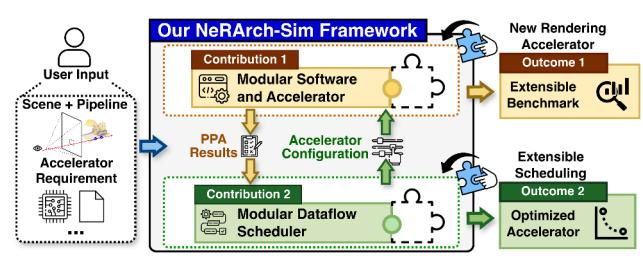
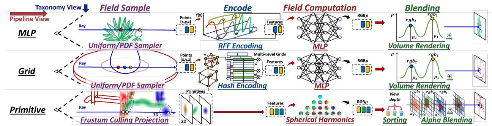
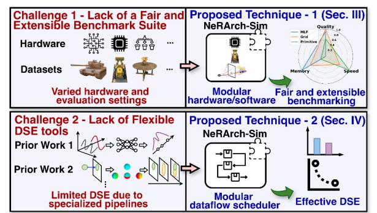
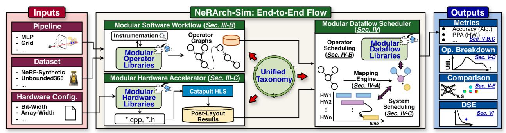
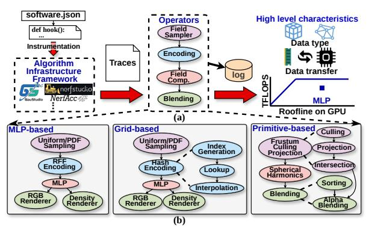
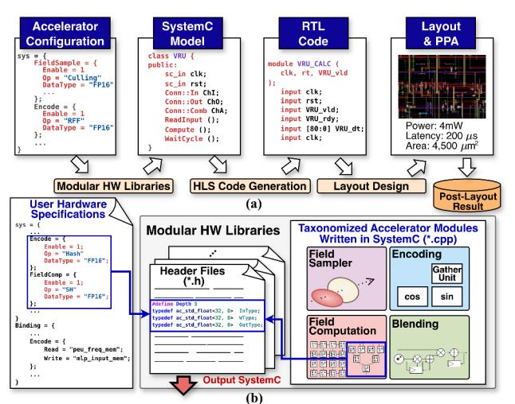
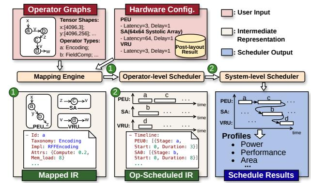
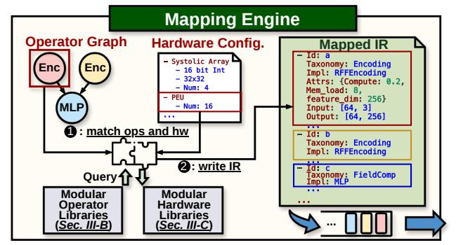

# NeRArch-Sim: A Unified Simulator for Benchmarking and DSE of Neural Rendering Accelerators

Cheng-Jhih Shih Chaojian Li Chihao Yu<sup>†</sup> Hsuan-Chen Fang Sixu Li Wei-Po Hsin<sup>†</sup> Lexington Whalen Hyewon Suh Greg Eisenhauer Ling Liu Yingyan (Celine) Lin *Georgia Institute of Technology*, Atlanta, USA {cshih63, cli851, hfang87, sli941, lwhalen7, hsuh45, celine.lin}@gatech.edu {eisen, ling.liu}@cc.gatech.edu <sup>†</sup>eiclab.gatech@gmail.com

Abstract—Recent breakthroughs in neural rendering promise numerous real-time 3D intelligence applications, e.g., AR/VR, robotics, and digital twins. To satisfy real-time requirements, various neural rendering accelerators have been developed, with each employing a different rendering algorithm pipeline and designed for a specific hardware target. Such one-off specialization, representing only a single design point, creates two gaps: (i) fair, extensible cross-accelerator benchmarking, and (ii) design-space exploration (DSE) that retargets designs across pipelines or hardware budgets. We present NeRArch-Sim, an open-source simulator purpose-built for neural rendering accelerators with module-accurate models and validated end-to-end schedules (error ≤9.4%). NeRArch-Sim follows two principles: (1) modular abstractions for software workflows and hardware, enabling extensible benchmarking across diverse algorithmic pipelines and accelerator designs; and (2) a dataflow-aware two-level scheduler for rapid, effective DSE. Across eleven accelerators and two datasets, NeRArch-Sim reproduces prior designs with minimal changes (modeling error ≤9.4%) and guides new accelerators that achieve up to  $1.3\times$  efficiency gains. To our knowledge, NeRArch-Sim is the first open-source simulator that models a wide range of neural rendering accelerators, providing timely infrastructure for this emerging domain. The simulator is publicly available at https://github.com/GATECH-EIC/NeRArch-Sim.

### I. INTRODUCTION

Recent advances in neural rendering [56] have enabled immersive 3D intelligence applications, e.g., virtual telepresence, avatar generation, and embodied AI agents [36], [43], [67]. These applications demand both photorealistic quality and real-time performance, driving the development of specialized neural rendering accelerators [9], [12], [13], [23], [25], [27], [44], [51]. Each accelerator employs distinct scene representations, memory hierarchies, and ray sampling strategies to balance rendering quality and computational efficiency. However, such one-off specialization limits each accelerator to a single design point, creating two key challenges: (1) the lack of fair, extensible benchmarking across diverse accelerators, hindering systematic comparison and understanding of their relative merits; and (2) the absence of flexible design-space exploration (DSE) tools capable of adapting existing designs to new algorithmic pipelines or hardware constraints.

These challenges are further exacerbated by the absence of unified simulators tailored to neural rendering pipelines.



Fig. 1. NeRArch-Sim integrates (1) modular abstractions for software work-flows and hardware accelerators, enabling extensible and fair benchmarking across diverse neural rendering designs; and (2) a modular dataflow scheduler for rapid, scalable design-space exploration (DSE), greatly simplifying the evaluation, reproduction, and optimization of neural rendering accelerators.

Existing simulators for neural network accelerators [41], [46] fail to support graphics-specific operations essential to neural rendering, e.g., ray marching [38], spatial sampling [49], and hybrid neural-graphics operators [40], [45]. Hence, researchers face substantial barriers in studying emerging pipelines, incorporating hardware-aware optimizations, and evaluating tradeoffs across pipelines and accelerator architectures.

To address these limitations, we present *NeRArch-Sim*, the first unified, open-source simulator purpose-built for neural rendering accelerators. NeRArch-Sim adopts two core principles: (1) modular abstractions of software workflows and hardware accelerators for extensible, fair benchmarking; and (2) a modular dataflow scheduler enabling rapid, scalable, and effective DSE. Leveraging a unified taxonomy of rendering pipeline components and accelerator building blocks, NeRArch-Sim streamlines both the reproduction of existing accelerators and the systematic exploration of new design variants. It can also serve as an educational toolkit, performance profiler, and design automation backend within a

TABLE I

COMPARISON OF EXISTING 3D RENDERING ACCELERATOR SIMULATORS AND NERARCH-SIM IN TERMS OF SIMULATION ACCURACY, SPEED, EXTENSIBILITY, AND HARDWARE PROTOTYPING IMPLEMENTABILITY.

| A    | Approach                      | Accuracy                   | Speed           | Extensibility   | Implementability                       |
|------|-------------------------------|----------------------------|-----------------|-----------------|----------------------------------------|
| RTI  | lytical Model<br>L Simulation | <b>X</b> Low <b>✓</b> High | ✓ High<br>✓ Low | ✓ High<br>✗ Low | <ul><li>✗ Low</li><li>✔ High</li></ul> |
| NeRA | rch-Sim (Ours)                | ✓ High                     | ✓ High          | High            | ✓ High                                 |



Fig. 2. Overview of different neural rendering pipelines from the perspectives of per-pipeline and the unified taxonomy.

cohesive open-source framework. Fig. 1 provides an overview of NeRArch-Sim, and Tab. I summarizes its advantages over prior simulation approaches. Our main contributions are:

- We present NeRArch-Sim, the first open-source simulator purpose-built for neural rendering accelerators, offering a unified infrastructure for systematic benchmarking and effective design-space exploration (DSE).
- NeRArch-Sim employs modular abstractions of software workflows and hardware accelerators, enabling extensible and fair benchmarking across diverse neural rendering pipelines and architectures.
- A modular dataflow scheduler enables efficient, scalable DSE across varied rendering pipelines and accelerator configurations.
- Experiments on eleven accelerators and two datasets demonstrate NeRArch-Sim's fidelity and flexibility, reproducing prior accelerators with minimal modification (modeling error ≤9.4%) and guiding new designs that achieve up to 1.3× higher efficiency.

## II. BACKGROUND & MOTIVATION

## *A. Algorithm Trend: Diverse and Evolving Pipelines*

As discussed in Sec. I, neural rendering has become a cornerstone of photorealistic 3D intelligence applications. Depending on requirements, e.g., memory footprint, speed, or quality, different algorithm pipelines offer distinct trade-offs. As summarized in Tab. II and illustrated in Fig. 2, representative pipelines include Multi-Layer Perceptron (MLP) based [3], [39], [57], grid-based [4], [40], [45], [58], and primitive-based [8], [16], [17], [22] approaches.

MLP-based methods [39] sample 3D points along camera rays, encode them via Random Fourier Features (RFF) [39], and query an MLP to predict scene properties (e.g., density and color). Final outputs are produced through volume

TABLE II SUMMARY OF KEY CHARACTERISTICS OF VARYING NEURAL RENDERING PIPELINES AND THEIR RECENT REPRESENTATIVE ALGORITHMS.

| Pipeline  | Representative Algorithms | Key Characteristic     |
|-----------|---------------------------|------------------------|
| MLP       | [39], [3], [57]           | Low Memory Footprint   |
| Grid      | [40], [4], [58]           | High Rendering Quality |
| Primitive | [8], [22], [16]           | Fast Rendering Speed   |

rendering [38]. These methods typically offer lower memory footprints than other pipelines [3], [4], [8].

Grid-based pipelines use discretized spatial structures, e.g., hash grids [40] or voxel grids [45], to store precomputed scene features. They retain similar sampling and volume rendering steps as MLP-based methods but deliver higher rendering quality on challenging datasets [57], [58].

Primitive-based approaches employ explicit geometric primitives, e.g., triangles [13] or 3D Gaussians (3DGS) [17]. Unlike ray-marching pipelines, they follow a rasterization paradigm, projecting 3D primitives onto 2D pixels and aggregating color and density. Leveraging optimized GPU rasterizers [21], these methods achieve high rendering speed. Although lacking explicit neural networks, they can be viewed as zero-layer networks with parameters learned via gradient descent, and are typically categorized as neural rendering [56].

Hybrid neural rendering [5], [6], [28], [66] is an emerging trend combining multiple pipelines to balance speed, memory, and quality. For example, [6] integrates grid- and 3DGS-based pipelines, achieving high frame rates and compact memory usage. Hence, supporting diverse and evolving pipelines—especially hybrids—has become essential.

## *B. Accelerator Design Challenge: One-Off Specialization*

As shown in Tab. II, each neural rendering pipeline offers unique advantages tailored to different applications. To accelerate rendering and support immersive 3D intelligence, various neural rendering accelerators have been developed [9], [12], [13], [23], [25], [27], [44], [51], summarized in Tab. III. Each

TABLE III

REPRESENTATIVE ACCELERATORS ACROSS DIFFERENT PIPELINES SUMMARIZED BY HARDWARE SPECIFICATIONS. FOR DESIGNS WITH MULTIPLE VARIANTS, THE SERVER-LEVEL VERSIONS (NEUREX-SERVER [23], SRENDER-SERVER [51], AND CICERO-16 [12]) ARE REPORTED FOR FAIR COMPARISON. DASHES (–) INDICATE METRICS NOT REPORTED IN THE ORIGINAL WORK.

| Pipeline  | Accelerators     | FPS   | Freq.<br>(MHz) | Area<br>(mm2<br>) | Tech.<br>(nm) | Power<br>(mW) |
|-----------|------------------|-------|----------------|-------------------|---------------|---------------|
| MLP       | ICARUS [44]      | 0.017 | 400            | 16.5              | 40            | 282.8         |
|           | MetaVRain [13]   | 110   | 250            | 20.25             | 28            | 899           |
| Grid      | NeuRex [23]      | 19.72 | 1,000          | 21.37             | 28            | 6,100         |
|           | CICERO [12]      | -     | -              | -                 | 16            | -             |
|           | SRender [51]     | 56.2  | 500            | 20.87             | 28            | -             |
| Primitive | GSCore [25]      | 190   | 1,000          | 3.95              | 28            | 870           |
|           | GS Processor [9] | 373   | 700            | 2.43              | 28            | 664           |



Fig. 3. Overview of key challenges in neural rendering acceleration and our proposed NeRArch-Sim solutions.

is optimized for a specific algorithmic pipeline, but such oneoff specialization introduces key challenges (see Fig. 3).

Challenge 1 — Lack of a Fair and Extensible Benchmark Suite. Existing accelerators vary widely in hardware configurations and evaluation settings (Tab. III), hindering systematic comparison and insight into their relative strengths and weaknesses. They are often evaluated on different datasets and resolutions, further complicating fair comparison. A unified framework is needed to enable fair, extensible benchmarking across diverse algorithmic and architectural designs while lowering the barrier for non-expert users.

Challenge 2 — Lack of Flexible DSE Tools. Neural rendering involves large design spaces across hardware and mapping parameters—such as inter-stage buffer sizing, number of functional units per stage, and operator mapping—that impact utilization, bandwidth, and energy. While the accelerators in Tab. III achieve strong performance on specific pipelines, their DSE methodologies are too specialized and cover design objectives tied to their specific scenarios, and are often proprietary, limiting their adaptability to new pipelines or hardware constraints and reducing long-term reusability.

Both challenges stem from the absence of a unified simulator capable of accurately and efficiently evaluating neural rendering accelerators. Existing simulators for general neural network accelerators [41], [46] lack key graphics operations [39], [49] essential to these pipelines, and their operator and dataflow scheduling are tailored for regular tensor workloads. Addressing these benchmarking and DSE challenges requires a unified simulator specifically designed for the unique characteristics of neural rendering workloads.

## *C. Opportunity: Unified Taxonomy Enables Modular Design*

Building a unified simulator for diverse neural rendering pipelines requires supporting not only the accelerators summarized in Tab. III but also future designs for emerging pipelines. Naively implementing each accelerator individually is unsustainable given the rapid evolution of rendering algorithms and hardware. A key opportunity lies in adopting a unified taxonomy that systematically decomposes neural rendering pipelines into modular components, enabling corresponding hardware accelerators to be modularized as well. This modularity allows reusing common modules across accelerators and integrating new ones by modifying only relevant components, without altering the overall simulator.

As summarized in Fig. 2, the taxonomy divides neural rendering pipelines into four key stages:

- Field Sampler samples objects (e.g., 3D points) within the scene along camera-emitted rays to define 3D regions of interest. MLP- and grid-based pipelines commonly use uniform or PDF-based sampling [39], while primitivebased pipelines apply frustum culling [17], [21] to discard primitives outside the target 2D region.
- Encoding converts each sampled object's position into feature vectors for downstream processing. RFF [39] and hash encoding [40] are widely used in MLP- and grid-based pipelines to enhance spatial discrimination. Primitive-based pipelines like 3DGS bypass this stage since primitives inherently store scene properties.
- Field Computation computes scene properties (e.g., color/density) of sampled objects based on encoded features, typically using MLPs or Spherical Harmonics [49].
- Blending aggregates scene properties to produce final pixel colors. MLP- and grid-based pipelines employ volume rendering [38], while primitive-based approaches commonly use sorting followed by alpha blending [17].

These four stages form a unidirectional pipeline, producing directed acyclic operator graphs (DAGs). Similar taxonomies adopted in neural rendering frameworks [54], [55] provide a unified view across pipelines and ensure compatibility with existing algorithmic infrastructures. This taxonomy thus enables a unified simulator supporting (1) extensible benchmarking via modular abstractions of software workflows (Sec. III-B) and hardware accelerators (Sec. III-C), and (2) effective DSE through a modular dataflow scheduler (Sec. IV).

## III. THE PROPOSED NERARCH-SIM SIMULATOR

## *A. Overview*

Leveraging the modular design opportunities enabled by the unified taxonomy described in Sec. II-C, we develop *NeRArch-Sim*, a unified simulator for modeling a variety of neural rendering accelerators. As illustrated in Fig. 4, NeRArch-Sim consists of three key components: (1) Modular Software Workflow: This workflow instruments existing software frameworks [17], [55], [64] to profile and generate runtime traces, extracting workload characteristics from user-defined rendering pipelines and datasets. (2) Modular Hardware Accelerator: The hardware component provides an open-source SystemC [1]-based codebase for modeling hardware modules defined by our taxonomy. It supports precise module-level modeling and reports power, performance, and area (PPA) metrics. Additionally, the design supports high-level synthesis (HLS), enabling deployability on real hardware platforms such as FPGAs and ASICs. This modular abstraction of both software and hardware forms the foundation for fair and extensible benchmarking. (3) Modular Dataflow Scheduler: The integrated scheduler bridges software-generated operator graphs with the underlying hardware, ensuring standardized



Fig. 4. Overview of the proposed NeRArch-Sim simulator, which comprises three main components: the **modular software workflow**, **modular hardware accelerator**, and **modular dataflow scheduler**. These components process user-specified algorithms and hardware configurations, producing both algorithmic and hardware metrics and enabling effective DSE that results in accelerator designs with better accuracy–efficiency trade-offs than existing solutions.

module mapping based on the taxonomy. It also performs optimal hardware resource allocation, enabling rapid evaluation of PPA metrics and facilitating effective DSE.

### B. Modular Software Workflow: Operator Graph Generation

With the overall goal of generating an operator graph for subsequent workload analysis, the modular software workflow leverages taxonomized modules to collect runtime traces of function calls. NeRArch-Sim instruments workloads using lightweight runtime hooks that intercept function calls without modifying the original algorithms. As shown in Fig. 5, the hooks capture function identifiers (specified in software.json), call counts, tensor shapes, and tensor values while preserving caller-callee relationships. These traced logs are processed to construct an operator graph that captures function dependencies, input/output data sizes, and call frequencies. Additionally, the modular software workflow enables profiling operator characteristics on GPUs (e.g., roofline analysis) as a developer reference. The instrumented operator graph captures complete computational information from the rendering pipeline. Since all operators are invoked through the taxonomized interfaces, the runtime hooks capture every operator call and its data dependencies by construction. The modular software workflow further ensures no operator calls or algorithmic dependencies are missed by re-executing the



Fig. 5. Overview of NeRArch-Sim's modular software workflow. (a) Runtime instrumentation of widely used algorithm infrastructure frameworks to collect execution traces and extract operator graphs. Operator characteristics on GPU (e.g., roofline analysis) can additionally be profiled as a developer reference. (b) Examples of neural rendering operator graphs extracted by NeRArch-Sim for three different pipelines [17], [39], [40].

extracted graph and comparing its rendered output against the original pipeline to verify no quality degradation.

At the core of this workflow is the **Modular Operator Libraries**, which encapsulate computation primitives defined by the taxonomy in Sec. II-C. These libraries expose unified and extensible interfaces for constructing rendering pipelines. Each stage follows a taxonomized interface with common attributes while allowing pipeline-specific extensions through detailed parameters. This interface enables the operator library to adapt to algorithm-hardware co-designed variants.

```
def neurex_pipeline(dim):
    g = OperatorGraph()
    s = UniformSampler(dim, graph=g)
    e = HashEncoding(dim, num_levels=16, graph=g)
    m = MLP(dim, in_dim=e.out_dim, num_layers=4,
```

The code block above showcases construction of the NeuRex [23] pipeline using this programming interface. Common attributes are denoted in blue, and extensions in brown. Minor co-design parameters (e.g., precision) are handled through additional attributes (e.g., bit\_width in MLP), while more significant algorithmic changes require new operators like HashEncoding, which implements the Encoding interface with its own parameters and is recognized by the scheduler in a later stage. Notably, updating these operator attribute parameters does not require re-instrumentation, as the operator graph structure remains unchanged, enabling rapid evaluation of algorithmic variants. In this way, our modular interface allows diverse and evolving rendering algorithms to be continuously supported in NeRArch-Sim.

It is worth noting that, thanks to the similarity between the taxonomy adopted by NeRArch-Sim and those used in existing algorithm frameworks [30], [55], [64], NeRArch-Sim can be seamlessly integrated into their workflows. This compatibility bridges software and hardware implementations and facilitates co-design of neural rendering accelerators.

## C. Modular Hardware Accelerator: Implementation and Deployment

To ensure compatibility with the modular software workflow described in Sec. III-B, the modular hardware accelerator in



Fig. 6. Overview of NeRArch-Sim's modular hardware accelerator. (a) The hardware characterization flow: user-defined accelerator configurations are transformed into SystemC models, synthesized into RTL via HLS, and processed through layout design to produce post-layout PPA results. (b) The modular hardware libraries contain taxonomized SystemC modules organized by the unified taxonomy, with configurable header files that allow users to customize data types, precision, and memory bindings for each module.

TABLE IV
MODULAR HARDWARE LIBRARY COMPONENTS AND SUPPORTED
CONFIGURABLE ARCHITECTURAL PARAMETERS

|                               | (a) Modular hardware library components                                                                                                                                                                                                                                                                                 |
|-------------------------------|-------------------------------------------------------------------------------------------------------------------------------------------------------------------------------------------------------------------------------------------------------------------------------------------------------------------------|
| Category                      | Modules                                                                                                                                                                                                                                                                                                                 |
| Sampling (3)<br>Encoding (10) | Culling conversion unit [25], Skipping controller [9], Sampling unit Position encoding unit [44], Address generator [23], Tree reducer, Index generation unit, Index computation unit, Distance computation unit [51], Comparison unit, Sensitivity prediction engine, Feed forward mapper [31], Backward update merger |
| Field Comp. (5)               | MLP engines (4 variants: SSA [44], MONB, SONB, Systolic array [23]), Adder tree [31]                                                                                                                                                                                                                                    |
| Blending (8)                  | Volume rendering units (3 variants [9], [14], [25]), Bitonic sort unit, Quick sort unit, Processing element arrays [9] (3 variants)                                                                                                                                                                                     |
| (b) S                         | Supported Configurable Architectural Parameters                                                                                                                                                                                                                                                                         |
| Parameter Type                | Examples                                                                                                                                                                                                                                                                                                                |
| Synthesis Directives          | Pipelining (initiation interval), loop unrolling, array partitioning (inherently supported by HLS)                                                                                                                                                                                                                      |
| Precision                     | Arbitrary integer, floating-point, and fixed-point precision                                                                                                                                                                                                                                                            |
| Implementation                | CORDIC, piecewise linear for exponential arithmetic                                                                                                                                                                                                                                                                     |
| Module Sizing                 | Systolic array dimensions, number of PEs, buffer depths                                                                                                                                                                                                                                                                 |
| Parallelism Factor            | Number of modules integrated                                                                                                                                                                                                                                                                                            |
| i arancusiii Factor           | Number of modules integrated                                                                                                                                                                                                                                                                                            |

Channel depths, stream widths, handshaking protocols

our NeRArch-Sim framework is built using High-Level Synthesis (HLS) based on the same unified taxonomy introduced in Sec. II-C. The implementation begins by processing hardware configuration files to generate a SystemC HLS model for individual hardware modules. From this model, the simulator supports two levels of hardware characterization, as illustrated in Fig. 6-(a): (1) HLS synthesis for rapid PPA estimation, and (2) full ASIC post-layout flow for precise PPA analysis and real hardware deployment, capturing physical implementation effects including interconnect and routing overhead. Fig. 6-(b) shows modular hardware libraries, where taxonomized SystemC modules are paired with configurable headers specifying data types, precision, and memory bindings.

The modular design of the hardware accelerator is supported by the **Modular Hardware Libraries** containing 20+ reusable modules organized by the unified taxonomy. Table IV-(a) details the library components across all four categories, while Table IV-(b) presents the hierarchical architectural parameters exposed by each module, spanning from low-level synthesis directives to high-level interface specifications.

This structure allows developers to easily tailor hardware functionality to specific design requirements and plug in custom modules with minimal overhead. By reusing shared modules across different accelerator designs, NeRArch-Sim reduces implementation effort. Developers can quickly integrate new variants of accelerator modules into the framework with minimal modifications, as demonstrated in Sec. VII.

In addition to compute modules, each hardware configuration specifies the memory subsystem: named SRAM blocks with configurable capacity, bank count, port count, and access latency; explicit operator-to-SRAM bindings; and a DRAM backend modeled via Ramulator [18] for DRAM timing. These specifications feed the memory-aware duration modeling described in Sec. IV-B.

### D. Modular Dataflow Scheduler: PPA Optimization

To bridge the modular software workflows and hardware accelerators, NeRArch-Sim adopts a dataflow scheduler leveraging the unified taxonomy for systematic hardware—software mapping and scheduling. The scheduler enables rapid PPA-oriented design space exploration, completing end-to-end scheduling within seconds on workstation-class CPUs. Sec. IV details the scheduling algorithms and optimization strategies.

## IV. MODULAR SCHEDULING IMPLEMENTATION AND DESIGN SPACE EXPLORATION

In this section, we dive into the detailed implementation of the modular dataflow scheduler, as illustrated in Fig. 7. The scheduling challenge in neural rendering is complex due to the *heterogeneous nature of operators* (ranging from matrix multiplications to hash table lookups) and *the diverse hardware modules* available (from systolic arrays to custom hash units). To address this complexity, NeRArch-Sim's scheduler adopts



Fig. 7. Illustration of NeRArch-Sim's scheduling process. A domain-specific IR aligned with the unified taxonomy in Sec. II-C is used across the scheduling stages: the mapping engine converts the operator graph into a mapped IR with operator-hardware bindings; the operator-level scheduler schedules tasks per hardware module; and the system-level scheduler finalizes the execution plan and produces end-to-end PPA metrics.

#### TABLE V

(A) THE MAPPED IR, PRODUCED BY THE MAPPING ENGINE, SERVES AS THE INTERFACE TO OPERATOR-LEVEL SCHEDULING. (B) THE OPERATOR-SCHEDULED IR EXTENDS THE MAPPED IR WITH EXECUTION DETAILS WHILE MAINTAINING OPERATOR-TYPE INDEPENDENCE FOR SYSTEM-LEVEL SCHEDULING. FOR BREVITY, ONLY DETAILS FOR KEY FIELDS ARE SHOWN.

| (a)                        | MAPPED IR STRUCTURE                                 |
|----------------------------|-----------------------------------------------------|
| Field                      | Description                                         |
| Operator Information       |                                                     |
| op_id                      | Unique operator identifier                          |
| op_type                    | Operator type from taxonomy (e.g., HASH_ENCODE)     |
| input_tensors              | Input tensor shapes and data types                  |
| output_tensors             | Output tensor shapes and data types                 |
| Taxonomy-Specific Attribut |                                                     |
| attributes/                | Dictionary containing taxonomy-specific parameters: |
| Encoding                   | {encoding_type, hash_table_size,                    |
|                            | feature_dim}                                        |
| Field Comp.                | {network_depth, hidden_dim,                         |
|                            | activation}                                         |
| Sampling                   | {num_samples, sampling_strategy}                    |
| Blending                   | {blend_mode, accumulation_type}                     |
| Hardware Binding Informa   | tion                                                |
| Resource Requirements      |                                                     |
| Optimization Techniques    |                                                     |
|                            | FOR-SCHEDULED IR STRUCTURE                          |
| Field                      | Description                                         |
| Inherited from Mapped IR   |                                                     |
| [mapped_ir]                | All fields from mapped IR preserved                 |
| Execution Schedule         |                                                     |
| start_cycle                | Scheduled start cycle relative to hardware unit     |
| duration                   | Execution duration in cycles                        |
| Resource Allocation        |                                                     |
| Data Movement Schedule     |                                                     |
| Optimization Metadata      |                                                     |

a systematic and hierarchical approach that decomposes the scheduling problem into three manageable stages: **mapping** (operator-to-hardware assignment), **operator-level scheduling** (local optimization within each hardware module), and **system-level** scheduling (global orchestration across modules), with each stage building upon the results of the previous one.

## A. Mapping Engine: Operator-Hardware Binding and IR Generation

Our taxonomy reveals the inherent structure in neural rendering: each operator class aligns with specific hardware architectures. This alignment reflects structural correspondence. A mapping is valid only when an operator's I/O specifications and computational semantics match the hardware's



Fig. 8. Illustration of the mapping engine in modular scheduling. Given operator graphs and hardware configurations as inputs, the mapping engine matches operators to hardware using a unified taxonomy. During this process, it may query the modular operator and hardware libraries for necessary information. Finally, it outputs the matched results into a mapped IR for the operator-level scheduler to process.

supported operations; otherwise, NeRArch-Sim reports a mismatch. When multiple valid mappings exist, the engine selects the most efficient option based on expected performance.

The mapping engine leverages these relationships to automate implicit design knowledge, enabling rapid prototyping and systematic exploration. Given an operator graph and hardware configuration, the engine (1) in Fig. 8) matches operators to hardware modules using the unified taxonomy, querying the modular operator and hardware libraries as needed. When several hardware units can execute an operator, it chooses the highest-throughput option; when multiple instances exist, it balances bindings to avoid bottlenecks. As the bridge between modular software workflows and hardware implementation, the mapping process draws from both domains: the modular operator libraries (Sec. III-B) provide computational patterns, data-access behavior, and taxonomy attributes, while the modular hardware libraries (Sec. III-C) specify compatible hardware units and capabilities.

This automated process produces the **mapped IR** (② in Fig. 8), which synthesizes the extracted information into a unified representation. Tab. V-(a) details the five sections of this IR: (1) *Operator Information* captures operator types and tensor specifications; (2) *Taxonomy-Specific Attributes* provides flexible parameters for each operator class; (3) *Hardware Binding Information* specifies the assigned hardware unit for each operator; (4) *Resource Requirements* quantifies computational and memory demands; and (5) *Optimization Techniques* describes the optimizations applied in later stages.

