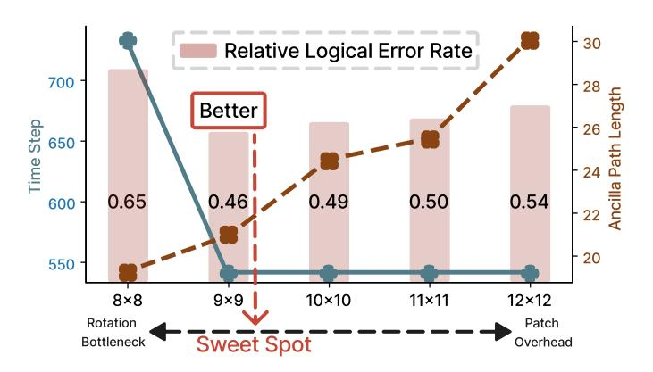
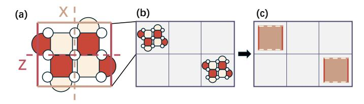
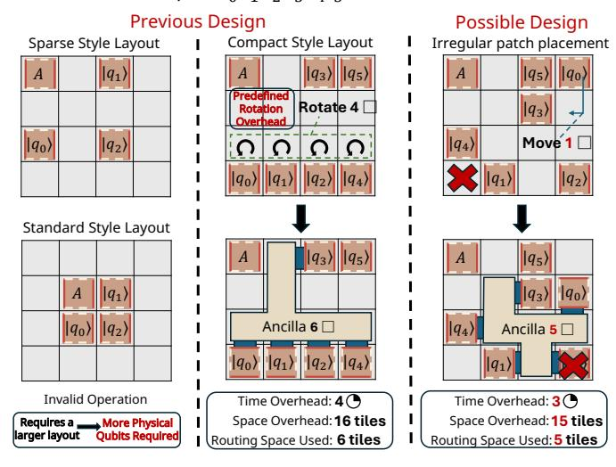
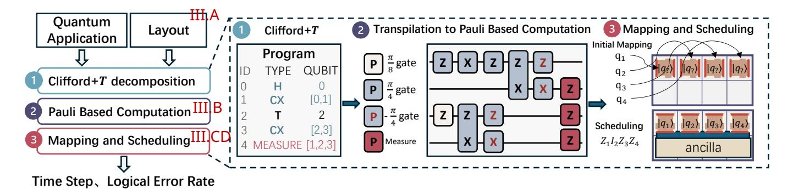
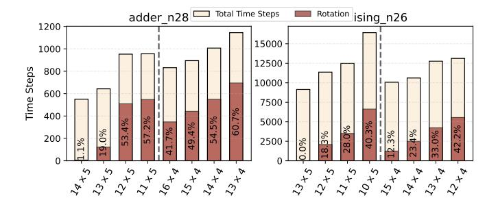
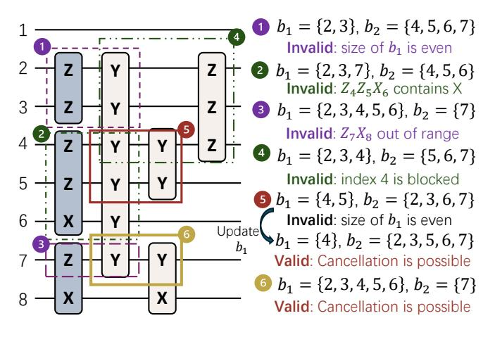

# 2 nd Xian Wu<sup>∗</sup>

*The Hong Kong University of Science and Technology (Guangzhou)* Guangzhou, China

#### 3 rd Jiahan Chen

*The Hong Kong University of Science and Technology (Guangzhou)* Guangzhou, China

#### 4 th Keming He

*The Hong Kong University of Science and Technology (Guangzhou)* Guangzhou, China

#### 5 th Junjie Wu

*College of Computer Science and Technology National University of Defense Technology* Changsha, China

6 th Xin Wang† *The Hong Kong University of Science and Technology (Guangzhou)* Guangzhou, China felixxinwang@hkust-gz.edu.cn

7 th Lingling Lao†

*College of Computer Science and Technology National University of Defense Technology* Changsha, China laolinglingrolls@gmail.com

*Abstract*—Toward the large-scale, practical realization of quantum computing, quantum error correction is essential. Among various quantum error-correcting codes, the surface code stands out as a leading candidate, and lattice surgery based on surface codes has emerged as a promising technique for faulttolerant quantum computation (FTQC). However, implementing quantum algorithms using lattice surgery introduces both resource and time overhead. Existing approaches typically focus on large layout designs, with compiler passes aimed primarily at optimizing time overhead. This often overlooks the trade-off between rotation bottlenecks and movement distance, which leads to inefficient resource utilization and prevents further reduction of the quantum computation failure rate.

To address these challenges, we introduce O3LS, a framework for optimizing lattice surgery through automatic layout search and loose scheduling. O3LS achieves an optimal balance by automatically generating squeezed data layouts to reduce space requirements and employing loose scheduling algorithms combined with circuit synthesis techniques to reduce time overhead, thereby effectively minimizing overall logical error rates. Numerical results indicate that O3LS can reduce space overhead by 28.0% over standard layouts and 46.7% over sparse layouts without increasing the number of time steps, leading to suppression of logical error rates by up to 16% relative to larger data layout designs. O3LS can also achieve time overhead reductions of 36.07% and 24.76% in compact and standard data layout designs, respectively. It suppresses logical error rates by up to an order

This work has been partially supported by the National Key R&D Program of China (Grant No. 2024YFB4504001), the National Natural Science Foundation of China (Grant Nos. 12447107, 62302395, and 62421002), the Fundamental and Interdisciplinary Disciplines Breakthrough Plan of the Ministry of Education of China (Grant No. JYB2025XDXM202), the Aid Program for Science and Technology Innovative Research Teams in Higher Educational Institutions of Hunan Province, and the Guangdong Provincial Quantum Science Strategic Initiative (Grant Nos. GDZX2403008 and GDZX2503001). of magnitude compared to prior compilers that focus primarily on maximizing parallelism.

*Index Terms*—fault-tolerant quantum computation, surface code, lattice surgery, quantum compiler design

## I. INTRODUCTION

Quantum computers are expected to offer practical advantages over classical computers in solving certain classes of problems [22], [44]. While noisy intermediate-scale quantum (NISQ) devices [40] have enabled significant theoretical and experimental progress [3], [10], [15], [36], their performance remains limited by noise, hindering practical quantum advantage. This necessitates the use of quantum error correction (QEC) [6], [17], [19], [43], [55], which is critical for enabling fault-tolerant quantum computing (FTQC).

A series of experimental demonstrations have validated the feasibility of QEC [9], [16], [29], [37], [50], [58]. Among the various QEC codes, the surface code has emerged as a leading candidate for realizing FTQC, owing to its relatively high error threshold, compatibility with nearest-neighbor qubit connectivity and various schemes for universal quantum computation. Notably, recent implementations on Google's Willow processor have demonstrated exponential noise suppression using the surface code [1], [2], representing a significant milestone toward practical FTQC.

A prominent technique for achieving universal quantum computation on 2D nearest-neighbor devices is lattice surgery, which implements logical multi-qubit gates by merging and splitting planar code patches [26], [34]. This approach enables the execution of logical operations within a 2D nearestneighbor layout and introduces additional compilation chal-

<sup>∗</sup>Co-first authors

<sup>†</sup>Co-corresponding authors



Fig. 1. O3LS can achieve comparable time overheads by automatically designing squeezed data layouts, even compared to larger layouts (e.g. 10×10 and 12 × 12). Moreover, squeezed layouts can reduce ancilla patch distances, thereby leading to a lower logical error rate (sweet spot).

lenges, particularly in ancilla routing and the design of data layouts, with the ultimate goal of minimizing the logical error rate (LER).

Existing compilers [25], [47], [49] for lattice surgery compilation primarily focus on large or sparse data layouts to maximize parallelism. This strategy aims to reduce the total number of time steps required for executing quantum circuits, thereby minimizing LER. However, it overlooks a critical factor: larger data layouts often result in increased movement distances, which in turn elevate the likelihood of idle memory errors and ultimately degrade LER [28]. In contrast, compact data layouts can reduce the physical qubit footprint and limit movement overhead. Nevertheless, if the layout architecture becomes too compact, it may significantly increase time costs due to reduced parallelism. This reveals a fundamental trade-off between the number of time steps and the movement distance as illustrated in Fig. 1, which must be carefully balanced to optimize overall LER.

Motivated by these insights, our work leverages data layout design (sweet spot in Fig. 1) to reduce overall space overhead, while incorporating an optimized scheduling strategy to minimize time costs. Together, these approaches aim to achieve a more balanced and efficient reduction in the overall LER. In summary, our key contributions are:

- We develop a lattice surgery compiler O3LS that integrates an automatic data layout design algorithm, an optimized synthesis algorithm, and a loose scheduling strategy to minimize both the space and time overhead.
- We propose an automatic logical qubit data layout design strategy aimed for squeezing data layouts, enabling more efficient use of limited qubit resources to support larger quantum applications.
- We design an optimized synthesis algorithm that improves Pauli operator cancellation, thereby reducing the time overhead of lattice surgery in more compact data layout designs and making it well-suited for integration with the data layout design algorithm.
- We also present a loose scheduling mechanism that dy-

namically reassigns patch functionalities. This approach reduces redundant patch movements and eliminates unnecessary operations.

The evaluation results demonstrate that O3LS simultaneously achieves time step reductions of 36.07% and 24.76%, and space overhead reductions of 28.0% and 46.7% on average, compared to previous compilers executed on fixed layouts. These improvements contribute to an effective suppression of overall logical error rates.

## II. BACKGROUND AND MOTIVATION

## *A. Quantum Computing and Quantum Error Correction*

Introduction to Quantum Computation. In quantum computing, the basic unit of quantum information is qubit, which has two basis states, typically denoted as |0⟩ and |1⟩. A qubit can exist in a superposition expressed as |ψ⟩ = α |0⟩ + β |1⟩, where α, β ∈ C and |α| <sup>2</sup> + |β| <sup>2</sup> = 1. Quantum gates serve as fundamental operations for manipulating qubit states.

Quantum Error Correction. Quantum computers are vulnerable to noise that disturbs quantum states. Quantum error correction codes (QECCs) address this by encoding a logical qubit into multiple physical qubits. Among these, the surface code [17] is particularly notable for its topological structure and compatibility with universal quantum operations. In Fig. 2(a), we show an example of our FTQC scheme using a surface code tile. Each tile has four boundaries, which are either of X or Z type, indicated by white and red lines. The logical Z operator is defined as the tensor product of physical Z operators along a string of data qubits, as illustrated by the red dashed lines. The logical X operator is defined similarly using physical X operators.

Common Gates and Their Decomposition. The universal gate set Clifford+T is well-suited for surface codes. It consists of the Hadamard gate H, the phase gate S, the T gate requiring the consumption of magic state |0⟩ + e iπ/4 |1⟩, and the controlled-NOT gate (CNOT). However, implementing T gates requires the consumption of magic states, which must be generated through magic state distillation protocols [7], [8], [27], [35] to enable universal quantum computation.

## *B. Lattice Surgery in Surface Code*

Abstraction of surface code to patches. Each patch corresponds to a distance-d surface code, which encodes a logical qubit using d <sup>2</sup> physical data qubits, as illustrated in Fig.2(b) for the case of d = 3. These surface codes are then abstracted as patches placed on tiles, as shown in Fig.2(c). In this abstraction, dashed boundaries represent Z operators, while solid boundaries represent X operators. These operators can be represented as edges on the patch and, for convenience, will be referred to as X- and Z-edges. The key performance metric is the implementation of quantum algorithms using the minimum number of tiles and time steps—collectively referred to as the space-time volume. Here, the unit of time corresponds to round of code cycles, which we denote using symbol .



Fig. 2. (a) Example of the distance-3 surface code. (b) Logical qubits are encoded by portions of a device's physical lattice into patches. (c) Abstraction of logical qubits into patches, where the white dashed line represents the X operator and the red line represents the Z operator.


Fig. 3. Patch operations and their related time costs.

**Patch Operations.** (a) Initialization. A single-qubit patch can be initialized in the states  $|+\rangle$  or  $|0\rangle$  (Fig. 3a), and twoqubit patches can be initialized in  $|+\rangle \otimes |+\rangle$  or  $|0\rangle \otimes |0\rangle$ , all with zero cost (0<sup>®</sup>). (b) Patch Deformation. A patch can be expanded to cover additional tiles (1<sup>(1)</sup>) or shrunk to occupy fewer tiles (0\mathbb{O}). By combining expansion and shrinkage, a patch can be moved to an adjacent tile (Fig. 3b). (c) Patch Rotation. A patch can be rotated by combining corner movements and patch translation operations (Fig. 3c). (d) Measurement. The product of Pauli operators can be measured when the relevant edges are adjacent to the ancilla path or routing space. This operation incurs a cost of 1<sup>®</sup> (Fig. 3d). Multi-patch  $\pi/4$  and  $\pi/8$  measurements can be performed by initializing an ancilla patch A, following the protocol proposed in [34]. A summary of these rules is provided in Fig. 3. For detailed implementation of protocols, we refer to [34].

Representative Data Layouts. (a) Compact layouts [34] place qubit patches sequentially within a limited number of rows (e.g., 4 rows and columns in Fig. 4). As more qubits are needed for later applications, additional columns are added to extend the layout, placing new patches (e.g.,  $q_4$ ,  $q_5$ ) adjacent to existing ones. (b) Sparse layouts [25] place both the X-and Z-edges of each data patch adjacent to the routing space, ensuring direct accessibility for logical operations. Each data patch is separated by at least one empty tile from its neighbors. As illustrated in Fig. 4, this results in a sparse layout on a  $4\times4$  board. (c) Standard layouts [25] are similar to sparse layouts, but use a different placement, as shown in Fig. 4.

## C. Pipeline of Executing Logical Circuits

We introduce the top-down compilation flow following the practices outlined in [5], [25]. The pipeline is shown in Fig. 5.

**Step (1): Clifford+**T **Decomposition.** The program begins with a quantum algorithm written in a high level-language. Since such algorithms are not expressed in the Clifford+T gate set required for fault-tolerant execution, gate synthesis becomes necessary. This is typically done using the Solovay-Kitaev algorithm [14] or more advanced techniques [42].

Step ②: Transpilation to Pauli-Based Computation. The decomposed Clifford+T circuits are subsequently transpiled into Pauli product rotations. The Pauli product rotations are defined as  $P_{\theta} = \exp(-iP\theta)$ , where P is a multi-qubit Pauli operator. It is equivalent that  $S = Z_{\pi/4}$  and  $T = Z_{\pi/8}$  and the standard decompositions are given as:  $H = Z_{\pi/4}X_{\pi/4}Z_{\pi/4}$  and  $CNOT = (Z \otimes X)_{\pi/4}(I \otimes X)_{-\pi/4}(Z \otimes I)_{-\pi/4}$ . There are several rules for simplifying circuits based on the commutation relations of Pauli operators. If P and P' commute i.e. PP' - P'P = 0, then  $P_{\pi/4}$  can be moved past  $P'_{\theta}$ . If P and P' anti-commute i.e. PP' + P'P = 0,  $P'_{\theta}$  turns into  $(iPP')_{\theta}$  when passing  $P_{\pi/4}$ . Clifford gates can be commuted through the circuit and absorbed into final measurements, as they map Pauli operators to Pauli operators.

Step ③: Surface Code Level Mapping and Scheduling. After transpilation of Pauli product rotations, one need to perform these instructions by mapping and scheduling following the rules required by lattice surgery. The instructions are initially mapped by assigning logical qubits to different patches of data layout, with the goal of maximizing opportunities for simultaneous multi-patch measurements while minimizing time costs. These instructions are executed sequentially according to the rules outlined in Fig. 3.

## D. Motivation

Observation 1 - Existing methods rely on fixed data layout. In most cases, the layout is predefined or designed for executing logical operations. However, these layouts may overlook the scheduling potential based on the specific shapes of patches and often require increasing the overall size to support larger quantum applications. For example, in Fig. 4, consider performing a multi-patch measurement of  $Z_0Z_1Z_2Z_3Z_4$  using the compact-style layout, where 'A' denotes the ancilla patch reserved for potential operations. This operation requires 4 time steps due to patch rotation overhead and utilizes 6 ancilla patches to perform the measurements. In addition, the sparse-style layout is invalid in this case because it places an insufficient number of data qubit patches on the board, limiting the available logical resources for computation.

In contrast, irregular data patch placement can potentially improve execution time and reduce space overhead, as indicated by the red cross. Additionally, since the data qubit patches are placed closer together, fewer ancilla patches are needed for routing. For example, Fig. 4 (right) requires only 5 ancilla routing patches. These potential benefits motivate the development of an automated search framework for designing layouts that are difficult to optimize manually.

## Example: $Z_0Z_1Z_2Z_3Z_4I_5$ measurement



Fig. 4. Example of layout design and loose scheduling (instruction rules based on Fig. 3). Prior sparse or standard style layouts (left) often suffer from inefficient resource usage, while compact style layout (middle) can incur additional scheduling overhead. In this context, irregular designs (right) can achieve higher patch utilization and fewer time steps.

Observation 2 - Current compiler passes' scheduling are static. The term 'static' refers to the current compiler passes that uniformly apply fixed scheduling strategies, regardless of circuit context or layout constraints. For example, in the compact layout, patches are typically rotated to align X and Z operators for multi-patch measurements. However, this approach overlooks cases where such in-place rotations are unnecessary. A concrete example is shown in Fig. 4 (right), where only  $q_0$  is moved downward and the patch is rotated to expose a different edge to the routing space. This avoids the overhead of a full patch rotation and thereby reducing the required time steps. We refer to this more flexible strategy as 'loose' scheduling, as it adapts the placement and orientation of logical qubit patches based on the circuit requirements.

Observation 3 - Potential for Pauli operator cancellation. In a more compact data layout where X and Z operators may not be accessible simultaneously, decomposition of the Y operator becomes necessary. An odd number of Y gates can be decomposed into a single rotation, while an even number must be decomposed into two. The latter enables multiple decomposition schemes, which can be exploited for potential gate cancellation. We present an example in Fig. 6 that illustrates the synthesis of Y operators using X or Z operators. In Fig. 6(a), the previous compiler pass [32], [52] decomposes the rotations  $(Y^{\otimes N})_{\pi/8}$  as  $[Z_{\pi/4}\otimes (Z^{\otimes N-1})_{\pi/4}](X^{\otimes N})_{-\pi/8}[Z_{-\pi/4}\otimes (Z^{\otimes N-1})_{-\pi/4}]$ for even N, a method that overlooks potential cancellations among Pauli operators. In contrast, Fig. 6(b) shows a case where such cancellations can occur and be utilized in the synthesis process. We instead decomposing  $(Y^{\otimes N})_{\pi/8}$  $[(Z^{\otimes n})_{\pi/4} \otimes (Z^{\otimes N-n})_{\pi/4}](X^{\otimes N})_{-\pi/8}[(Z^{\otimes n})_{-\pi/4} \otimes$  $(Z^{\otimes N-n})_{-\pi/4}$ ] where n is odd then N-n is odd. This enables operator elimination and offers potential to reduce time costs.

Observation 4 - Rotations are the primary bottleneck in space-constrained layouts. In space-constrained or irregular data layouts, such as the one shown in Fig. 4, the primary factor limiting execution speed is the need to expose the Zoperator to the routing space from the X operator, which requires a rotation operation that takes 3 time steps. This issue is especially evident in irregular layouts, where patches differ in their access to X and Z operators. Some patches expose only a single X or Z operator to the routing space, while others expose both. If a qubit that frequently switches between X and Z operators is mapped to a patch that supports only one of them, the resulting overhead can be significant. This overhead is quantified in Fig. 7, we observe that as the total number of tiles decreases, rotations could become the dominant bottleneck, accounting for more than 50% of the overall time steps. In contrast, using an optimized layout size with moderate tile count, the rotation overhead can be reduced. This motivates us to design improved data layouts that balance tile count and rotation overhead.

## III. THE O3LS COMPILER

## A. O3LS Module 1: Layout Design

We first propose an algorithm for the automated design of logical qubit data layouts, enabling the search for more squeezed configurations. The core design principle is to preserve the connectivity between the routing space and all data patches, while also maximizing the number of X and Z edges that each data patch exposes to the routing space. This is because the connectivity is intentionally designed to ensure that all data patches are measurable, thereby preventing the failure of logical operations. Moreover, the primary source of time overhead arises from patch rotations. If the layout allows for a greater variety of edge types, this overhead can be reduced, potentially improving overall execution efficiency.

**Layout Design Scoring Function.** Based on these intuitions, we first design a scoring function S to evaluate the goodness for a given board B. The detailed formulation of the scoring function S is as follows:

$$S(B) = C(B) \times (N_x(B) + N_z(B) - \alpha_e N_e(B)). \tag{1}$$

We use C(B) to indicate whether a routing path exists in the given board or designed layout B that connects to at least one edge of specified data patches. We further require that both the x- and z-edges of the ancilla patch be connected to the routing space, as completing Pauli product rotations necessitates performing Y measurements on the newly initialized ancilla patch [34]. The value of C(B) is 1 if such a routing path exists, and 0 otherwise. We use  $N_x(B)$  to denote the number of qubits on board B that are connected to the x-edge by a routing path. Similarly,  $N_z(B)$  represents the number of qubits connected to the z-edge. Additionally, we introduce  $N_e(B)$  as a penalty term, defined as the number of edges in B that connect data patches to the routing space, and is penalized by the density factor  $\alpha_e$ . This term primarily guides the layout design by encouraging the subsequent design process to favor either more compact or sparser layouts.



Fig. 5. Pipeline of executing logical circuits. In this work, we introduce an algorithm to optimize layout design, equipped with advanced synthesis techniques for Pauli-based computation, as well as mapping and scheduling strategies to improve both time steps and logical error rate.


Fig. 6. Operator cancellation opportunities in the process of Pauli-Y decomposition. (a) shows the decomposition method used in prior compiler passes [32], [52], which overlooks the cancellation opportunities shown in (b).

Fig. 8. Layout design process. Darker pink color indicate higher scores. At each step, the highest-scoring position is selected as the new qubit patch.



Fig. 7. Quantification of rotation bottleneck (data-layout sizes in x-axis).

**Design Process.** Based on the scoring function, we propose an iterative layout design method. The board is initialized with an ancilla patch A placed at the corner. Then, at each step, we attempt to add a data patch to the current board B, generating a list of candidate boards  $\{B_1^{(1)}, B_2^{(1)}, \cdots\}$ . Among these candidates, the board with highest-scoring  $B_i^{(1)}$  is selected as the updated layout. This process is repeated iteratively until all data patches have been successfully placed. Fig. 8 shows this procedure, where positions indicating the routing path are

marked in gray. At each iteration, the location with the highest score is selected for placing the next data patch.

Additionally, after each new qubit patch is placed, we perform a post-processing step to further enhance the overall layout performance. Specifically, this step involves evaluating the potential for relocating existing qubit patches through a one-step move within the current board configuration. If a modified board B' resulting from such a relocation yields a higher score according to the scoring function, then B' is adopted as the updated layout. An example of this process is shown in Step 5 of Fig. 8. After placing  $q_4$ , relocating  $q_5$  increases the number of distinct edges exhibited by  $q_5$  while preserving routing connectivity. This one-step adjustment serves as an effective means of improving the layout's overall performance.

**Complexity Analysis.** Overall, the computational complexity is  $\mathcal{O}(n|B|)$ , where n denotes the number of qubits and |B| represents the size of board.

## B. O3LS Module 2: Y-Synthesis Algorithm

We then introduce O3LS module 2 to address observation 3: Y-operator decomposition is necessary, and previous compilers

## Algorithm 1 Y-synthesis Algorithm

```
Input: Pauli operator sequence S = \{P_1, P_2, \dots, P_l\}
Output: Synthesized Pauli operator sequence S'
 1: Initialize S' = \{\}
 2: for P_i \in S do
 3:
        Get the Y indices of P_i as Y_indices<sub>i</sub>
        if size(Y_indices_i) == 0 then
 4:
           S'.append(P_i)
 5:
           Continue
 6:
        else if size(Y_indices_i) is odd then
 7:
           Set b_1 = Y_{indices_i} and b_2 = \emptyset
 8:
 9:
           Find the bipartition b_1, b_2 of the set Y_indices<sub>i</sub>.
10:
11:
        Build left Z-rotation operator L_i^{(1)}, L_i^{(2)} and right Z-
12.
        rotation operator R_i^{(1)}, R_i^{(2)} according to b_1, b_2
        Decompose P_i to get Y-free operator P_i' S'.append(L_i^{(1)}, L_i^{(2)}, P_i', R_i^{(1)}, R_i^{(2)})
13:
14:
16: Do Pauli operator synthesis on S'
17: return S'
```

have missed opportunities for Pauli operator cancellation in squeezed data layouts. The key motivation stems from the fact that measuring a Pauli-Y operator requires simultaneous access to both X and Z operators. However, in many layouts with limited data patches, such simultaneous measurements are not feasible, including these generated from O3LS Module 1. This limitation necessitates decomposing Pauli Y operators into equivalent combinations of Pauli X and Z operators.

Y-Synthesis Algorithm. The Y-synthesis algorithm is structured as a two-step process. (1) Y-decompose. The process referred to as Y-decomposition (e.g. step 3-13 in Algorithm 1) involves transforming Pauli-Y operators into combinations of Pauli-X and Pauli-Z operators, since direct Y-basis measurements are not always supported by the available patch configurations on the surface code lattice. As illustrated in Fig. 9, there may exist multiple valid decomposition schemes for the same operator. Therefore, the Y-decomposition process must select the decomposition that is most suitable for Pauli operator synthesis, particularly in terms of enabling Pauli operator cancellation. 2 Pauli Operator Synthesis. Pauli operator synthesis (e.g. step 16 in Algorithm 1) is the process of taking a sequence of Pauli operators and merging adjacent ones that share the same Pauli basis to enable cancellation and reduce circuit overhead.

The Y-Synthesis pseudocode is given in Algorithm 1, whose Step 10 is pivotal. Due to the inherent properties of Pauli operators, if an operator contains an even number of Y components, these Y components must be divided into two non-overlapping groups, each containing an odd number of Y components. Subsequently, left Z-rotation and right Z-rotation operators are constructed based on these groups.

During this process, Y-synthesis algorithm evaluates whether any operator derived from a group can be absorbed



Fig. 9. An example of Y-synthesis rule.

by other operators. Specifically, for each group, we check if at least one operator within that group can be absorbed by another operator. If such an operator exists, the group is designated as a candidate. Among these candidate groups, we then select the one with the highest number of absorbed operators. Fig. 9 is an example of the algorithm, which illustrates the relevant constraints. Since the input Pauli operator sequence is a topologically sorted list, for a specific Pauli operator  $P_i$ , its predecessor operators must have already completed the Y-decompose process. Therefore, it is sufficient to ascertain whether the group can be absorbed by its predecessor operators. Additionally, for the successor operators, it is necessary to verify whether there exists a potential Y-decomposition opportunity that could enable the group to be absorbed.

O3LS-IR. To support efficient Y-synthesis in O3LS, we introduce O3LS-IR, an intermediate representation that captures dependencies among Pauli operations to determine execution order and enable parallelism. Pauli operators are represented as nodes in a Pauli Directed Acyclic Graph (PDAG), recorded in our quantum IR, which includes:

- Rotation angle: This specifies the rotation angle associated with the Pauli operator. The rotation angle can also indicate whether the node represents a measurement.
- 2) Pauli words: These represent the Pauli operators.
- 3) *Predecessor nodes:* These are nodes that precede the current node in the DAG.
- 4) *Successor nodes:* These are nodes that follow the current node in the DAG.

The rules for constructing the PDAG are as follows: Each Pauli operator is represented as a node in the PDAG. A directed edge  $(P_i, P_j)$  exists between two nodes  $P_i$  and  $P_j$  if and only if: (1). There is at least one qubit q on which both  $P_i$  and  $P_j$  are not the identity operator I. (2). No other Pauli operator  $P_k$  between  $P_i$  and  $P_j$  acts non-trivially on qubit q. A node with in-degree 0 corresponds to an executable Pauli operator. Once executed, the node is removed, and the process repeats until all nodes are processed, ensuring correct dependency resolution.

**Complexity analysis.** During Y-synthesis, each operator examines at most n predecessor and n successor nodes, resulting in a per-operator computational complexity  $\mathcal{O}(n)$ . Considering that the Y-decomposition involves at most l Pauli operators, the overall complexity of Algorithm 1 is  $\mathcal{O}(nl)$ .

## C. O3LS Module 3: Loose Scheduling

As highlighted in Observation 2 and illustrated in Fig. 4, most existing approaches rely on pre-defined scheduling patterns or assume that logical patches are sufficiently large to avoid additional patch rotations during multi-patch measurements. This leaves room for further optimization in scheduling. To address this, the O3LS module implements a loose scheduling strategy, where loose refers to the flexibility of the scheduling process. This approach allows for dynamic repositioning and adjustment of patches to better accommodate measurement requirements, ultimately aiming to reduce the total number of time steps. The pseudocode for the loose scheduling algorithm is provided in Algorithm 2.

