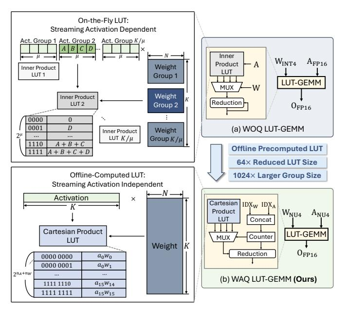
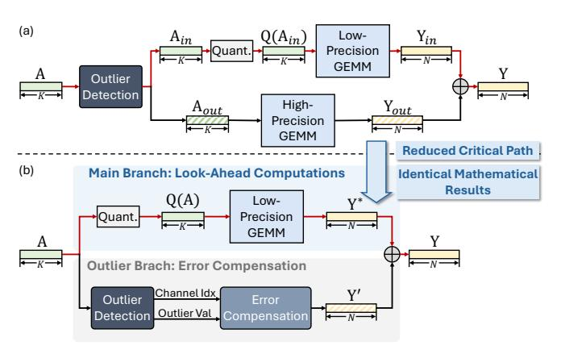

# *A. LLM Quantization*

LLMs typically utilize FP16 format for weights and activations during inference [1], [10]. Quantization, which reduces the numerical precision of weights and activations, has emerged as a promising technique to optimize LLM inference efficiency [11], [16], [19], [21], [29]. WOQ methods effectively reduce model memory footprint by quantizing the weights [11], [29], but fail to leverage emerging efficient lowprecision compute units (e.g., GPUs' INT4 Tensor Cores [41]) since the activations remain in FP16 format. In contrast, WAQ methods quantize both weights and activations, enabling lowprecision computation for faster inference [3], [33]. Therefore, recent studies have increasingly focused on developing WAQ methods to further enhance LLM inference efficiency [3], [28], [33], [50], [62].

Conventional WAQ methods quantize both weights and activations into integer representations, which face significant accuracy degradation in low-precision quantization configurations [3], [33], [57], [62]. Compared to integer quantization, which maps floating-point numbers to equally spaced integer levels, non-uniform quantization employs unequally spaced centroids that better align with the actual distributions of weights and activations, thereby reducing quantization noise [2], [34], [54], [60]. To achieve higher accuracy, recent studies have leveraged non-uniform quantization methods to achieve low-precision LLMs [21], [31], [42].

Non-uniform quantization includes low-precision floatingpoint formats (e.g., MXFP4 [54], NVFP4 [2]) and learnedcodebook methods [34], [60]. The learned-codebook methods, which optimize centroids via training, generally achieve higher accuracy [19], [21]. These methods represent data as integer index matrices that reference a floating-point codebook. For example, K-Means quantization [34] can be written as:

$$\tilde{x}_i = C_{idx_i}, \qquad idx_i = \arg\min_k \|x_i - C_k\|^2, \tag{1}$$

where xi is the original data point, x˜i is its quantized value, Ck is the centroid of the k th cluster, and idxi is the integer index corresponding to x˜i that selects the nearest centroid. To represent a matrix of size M × N with n-bit K-Means quantization, an n-bit integer index matrix idx of size M ×N and an FP centroid codebook C of size 2 n are required.

Although learned-codebook schemes reduce quantization error, they incur substantial runtime cost at inference because current accelerators do not natively support such nonuniform data representations [8], [40]. Performing GEMMs with index-coded data therefore requires per-element codebook lookups and dequantization into FP16 values, followed by FP16 GEMMs, which adds significant overhead [19], [21]. Therefore, unleashing the performance benefits of learnedcodebook quantization motivates the design of hardware that directly supports their non-uniform data representations.

#### *B. LUT-Based GEMM Schemes*

LUT-based computation has been demonstrated to be an effective approach for performing efficient GEMMs without

Fig. 2. (a) Existing WOQ LUT-GEMM scheme. A, B, C, and D denote different streaming activation values. (b) Our proposed WAQ LUT-GEMM scheme.  $a_i$  and  $w_i$  denote the activation and weight centroids, respectively.

TABLE I COMPARISON OF LUT-BASED GEMM SCHEMES.

|                        | WOQ LUT-GEMM                      | Ours                  |
|------------------------|-----------------------------------|-----------------------|
| Wgt. Precision $(n_W)$ | NU4                               | NU4                   |
| Act. Precision $(n_A)$ | FP16                              | NU4                   |
| Offline-Computed LUT?  | ×                                 | ✓                     |
| Group Size             | $\mu$                             | K                     |
| LUT Size               | $2^{\mu} \cdot \frac{K}{\mu}$     | $2^{n_A+n_W}$         |
| #FLOPs for Reduction   | $\frac{K}{\mu} \cdot n_W \cdot N$ | $2^{n_A+n_W} \cdot N$ |

dequantization cost [37], [42], [43]. Generally, LUT-based GEMM methods take two inputs: which kind of multiplication result is stored in the LUT, and how the LUT is indexed. As shown in Fig. 2(a) and Table I, existing LUT-GEMM methods for WOQ execution [37], [42], [43] store the groupwise inner product results between weights and activations in the LUT and use the weights as the MUX select signals. However, they remain compute-inefficient due to the following limitations: (1) The LUT depends on the streaming activations and therefore must be generated on-the-fly; (2) Let K denote the reduction length of the inner product, a LUT with the size of  $2^K$  is required to store all possible inner product results between weights and FP16 activations, which is impractical for large reduction lengths (e.g., K = 4096 in LLaMA-7B [52]). To limit the LUT size, existing LUT-based methods partition the weights and activations into small groups of size  $\mu$  and perform multiple partial inner products. (3) Partialsum reductions are required across multiple groups, incurring additional FLOPs and latency. Existing WOO LUT-GEMM methods adopt bit-serial weight processing to further reduce the LUT size, with each cycle only processing one bit of the weights [37], [42], [43].

To balance between the LUT size and computational parallelism, weights and activations are grouped into groups of size  $\mu=4$  [37], [42]. Among the existing WOQ LUT-GEMM methods, FIGLUT [42] and LUT Tensor Core [37] manage to reduce the LUT size by half by using the most-significant-bit (MSB) of the weight index as the enable signal of the negation logic. However, the LUT sizes of these methods are still large, and the computational parallelism remains limited.

While WOQ LUT-GEMM methods can be adapted to avoid dequantizing weights and activations in NU-WAQ GEMMs, we observe three opportunities specific to NU-WAQ that further improve the compute efficiency: (1) In NU-WAQ, activation centroids are trained offline, so the set of possible activation values at runtime is known in advance, allowing the LUT to be precomputed and stored on-chip prior to inference. (2) With both weights and activations quantized, the number of distinct Cartesian Product results is limited; storing the Cartesian Product of weight and activation centroids in the LUT instead of the inner product results substantially reduces LUT sizes. (3) A Cartesian Product LUT is independent of the reduction length, allowing computation at a larger granularity and significantly eliminating the number of FLOPs during reductions.

Leveraging the aforementioned opportunities, we propose a novel LUT-based GEMM scheme for NU-WAQ, as illustrated in Fig. 2(b). The inputs of our design are weights and activations that are non-uniformly quantized using learned codebooks. The LUT stores the Cartesian Product of weight and activation centroids, which can be precomputed and loaded on-chip before inference. At runtime, weight and activation indices are concatenated. The occurrence counts of the unique concatenated indices are calculated and used to perform reductions as weighted sums of the corresponding LUT entries. These unique concatenated indices act as MUX select signals to fetch the corresponding Cartesian Product values from the LUT.

The configuration comparison between existing WOQ LUT-GEMM methods and our proposed WAQ LUT-GEMM method is summarized in Table I.  $n_W$  and  $n_A$  denote the bitwidths of weights and activations, respectively. Consider an M-K-N GEMM example between weights and activations where M=1 and N=K=4096, which is a common case in the LLaMA-7B model [52]. For the configuration of  $n_W=n_A=4$ , our proposed WAQ LUT-GEMM method achieves a  $64\times$  reduction in LUT size, a  $1024\times$  increase in group size, and a  $16\times$  reduction in floating-point operations (FLOPs) for reductions over existing WOQ LUT-GEMM methods [37], [42], [43].

#### C. Handling Activation Outliers in WAQ

In LLMs, activation outliers exhibit both higher quantity and magnitude compared to weight outliers, which expands the quantization range and reduces the effective bit resolution available for the majority of values (inliers) [33]. To mitigate activation outlier-induced quantization errors, prior works have

Fig. 3. Comparison between online and offline derived upper activation outlier thresholds. The online dataset is WikiText-2 [36] (W2), and the offline dataset is (a) C4 [9] and (b) PTB [35]. The activations used to compute the thresholds and centroids are the input of the  $1^{st}$   $q\_proj$  layer in the LLaMA-3-8B model [15]. 128 activation tokens are applied to compute the thresholds, each with the dimension of  $1 \times 4096$ . The thresholds are normalized to [0, 1].

Fig. 4. Comparison of (a) conventional dynamic outlier detection and (b) the proposed look-ahead scheme.

proposed to isolate outliers and preserve them in higher-precision representations (e.g., INT8 or FP16) during computation [19], [62]. Existing works basically identify outliers with two approaches: (1) dynamically identify top-k outliers during inference [19]; and (2) leveraging an offline calibration dataset to identify certain activation channels that contain a large volume of outliers as outlier channels. During online inference, the channel indices are used to indicate which activation values are outliers [32], [62]. It has been evaluated that dynamic outlier detection generally yields higher accuracy than static outlier channel identification [19]. To explain this, we define the value of the top-k largest activation as the upper outlier threshold.

Fig. 3 demonstrates substantial discrepancies in upper outlier thresholds between offline and online datasets. The online calibration uses WikiText-2 [36], while online inference uses C4 [9] and PTB [35] in Fig. 3(a) and (b), respectively. The root mean square error (RMSE) between online and offline thresholds is 0.32 and 0.38 in Fig. 3(a) and (b), respectively, indicating low similarity.

Therefore, to preserve model accuracy, it is crucial to dynamically identify outliers during inference.

Fig. 4(a) illustrates the conventional workflow of dynamic outlier detection during inference [19]. Generally, the entire activation vector is scanned to identify outliers, separating the

Fig. 5. Comparison between online and offline derived 4-bit quantization centroids for activations. The configurations of activations are the same as those in Fig. 3. The centroids are normalized to [0, 1].

activations into two groups: inliers  $(A_{in})$ , which are quantized into low-precision formats; and outliers  $(A_{out})$ , which are retained in higher-precision formats. The activation inliers and outliers undergo low-precision GEMMs and high-precision GEMMs with the weights, respectively, and their results  $Y_{in}$  and  $Y_{out}$  are combined to produce the final output. While the GEMMs associated with inliers and outliers can be executed in parallel on separate compute units, the outlier detection process stays on the *critical path* (indicated with red arrows), incurring significant latency overhead.

To address this issue, we propose a look-ahead computation scheme, as illustrated in Fig. 4(b). To avoid introducing additional runtime overhead for handling outliers, we propose two concurrent compute branches: the *main branch* performs *look-ahead* WAQ-LUT GEMMs with the entire activation quantized, ignoring the quantization errors from outliers; meanwhile, the *outlier branch* calculates the quantization errors from outliers and performs *error compensation*. The final GEMM result is obtained by summing the outputs of look-ahead GEMMs  $(Y^*)$  and error compensation (Y'), which leads to identical mathematical results as conventional dynamic outlier detection, but without incurring additional latency.

#### D. Our Approach

We aim to achieve efficient LLM inference with high model performance by leveraging NU-WAQ. Driven by the aforementioned observations and analysis, in this paper, we propose OASIS, an algorithm-architecture co-design framework. Specifically, § III details the computation optimizations of OASIS, which focus on the following two aspects: (1) to enable efficient GEMMs between the inliers of non-uniformly quantized weights and activations, we propose a WAQ LUT-GEMM scheme without requiring dequantization; and (2) we introduce an outlier-aware GEMM computation scheme that concurrently performs computations on both activation inliers and outliers. We also present the architecture design of the OASIS accelerator in § IV, which efficiently implements the proposed computation schemes.

