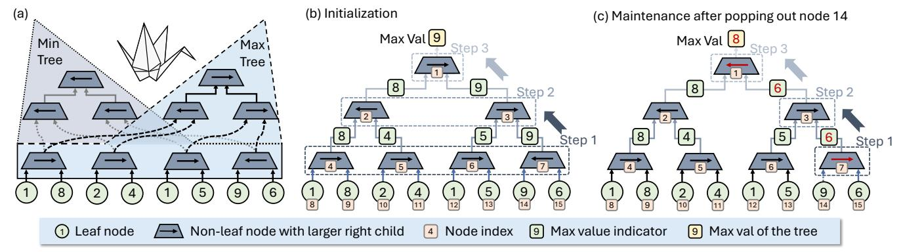

# *B. Index Counter*

In OASIS, we design an Index Counter to compute the index distribution of the concatenated indices with high parallelism, which is illustrated in Fig. 9(a). The concatenated indices are decoded into one-hot vectors in parallel, and the bit counters calculate the row-wise sums of the one-hot vectors to obtain the count for a certain concatenated index. For example, the first concatenated index '01' is decoded into the one-hot vector [0, 0, 1, 0] as shown in the first column of the decoded one-hot matrix in Fig. 9(a). In the first row of the decoded one-hot matrix, there is one '1', indicating that the concatenated index '11' appears once in the concatenated indices. The row-wise sums of the second, third, and fourth rows correspond to the counts of concatenated indices '10', '01', and '00', respectively. To satisfy timing and area constraints, the Index Counter employs a 16-input design, with each PE Line incorporating 32 Index Counters to perform the index distribution calculations in parallel.

TABLE II OASIS ACCELERATOR CONFIGURATIONS (28NM, 500MHZ).

| Module            |                               | Specification                               | Area (mm2 )             | Power (W)                  |
|-------------------|-------------------------------|---------------------------------------------|----------------------------|----------------------------|
| PE Line           |                               | 16 PE Lines per chip                        | 9.08                       | 7.54                       |
|                   | Concat Unit Wgt Idx Buffer | 4096 Concat Units per line 2 KB per line | 8.68 × 10−2 6.75 × 10−2 | 8.36 × 10−2 1.69 × 10−2 |
| PE Line           | Index Counter                 | 32 16-in Index Counters per line            | 2.71 × 10−1                | 6.14 × 10−2                |
|                   | Dequant Unit                  | 1 Dequant Unit per line                     | 2.83 × 10−3                | 6.11 × 10−3                |
|                   | MAC Tree                      | 1 32-in FP16 MAC Tree per line              | 1.17 × 10−1                | 2.54 × 10−1                |
|                   | MAC                           | 8 FP16 MAC Units per line                   | 4.89 × 10−2                |                            |
|                   | Output Buffer                 | 64 KB per chip                              | 2.17                       | 2.68 × 10−1                |
| Act. Idx Buffer   |                               | 16 KB per chip                              | 5.40 × 10−1                | 6.71 × 10−2                |
| LUT               |                               | 2 KB per chip                               | 6.75 × 10−2                | 8.38 × 10−3                |
| Cluster. Unit     |                               | 4 Clustering Units per chip                 | 1.31 × 10−3                | 2.90 × 10−4                |
| Orizuru           |                               | 273 16-in Orizuru Units per chip            | 7.39 × 10−1                | 2.73 × 10−1                |
| Error Calc. Unit  |                               | 1 Error Calculation Unit per chip           | 4.12 × 10−3                | 6.40 × 10−3                |
| Func. Unit        |                               | 1 Functional Unit per chip                  | 8.89 × 10−1                | 5.63 × 10−1                |
| Memory Controller |                               | 1 Memory Controller per chip                | 1.47                       | 9.28 × 10−1                |
| Total             |                               | —                                           | 15.31                      | 9.66                       |

## *C. Clustering Unit*

To perform efficient non-uniform quantization for the activations, we design a Clustering Unit as illustrated in Fig. 9(b), which maps each activation to its nearest centroid based on the pre-defined codebook. The clustering unit first computes the boundary values between each pair of adjacent centroids: bi = (ci + ci+1)/2, where ci and ci+1 are two adjacent centroids. For any input value which is within [bi−1, bi), it is assigned to the i-th cluster with centroid ci . Then, for each input activation x, the clustering unit compares it with the boundary values to determine the cluster index it belongs to. To accelerate the clustering process, we implement the comparison logic using a binary search tree structure. In the example of Fig. 9(b), there are 4 centroids, and each input activation x undergoes log2(4) = 2 hierarchical comparisons to determine its cluster index.

### *D. Orizuru: Dynamic Outlier Detection Engine*

As mentioned in § III-C, OASIS minimizes runtime by performing outlier detection on a dedicated outlier branch that runs in parallel with the main branch. To avoid making the outlier branch the performance bottleneck of the entire GEMM operation, we design *Orizuru* 1 , an efficient outlier detection engine that identifies the outliers from each activation token with minimal latency and energy consumption.

We propose to detect the top k largest and smallest values within each activation token x = [xi ] ∈ R N , which are excluded from the quantization process. To minimize the number of comparisons required for outlier detection, we adopt a treebased architecture which maximizes the reuse of comparison results. As shown in Fig. 10(a), *Orizuru* is composed of two complete binary trees with shared leaf nodes. These two binary trees, named the max tree, P, and the min tree, Q, are used

1The shape of the two-fold binary trees with shared leaves resembles an *Orizuru* (a paper crane).

Fig. 10. Orizuru architecture. (a) The overall architecture of Orizuru: two-fold binary trees with shared leaf nodes and comparison results at the last layer of the non-leaf nodes. (b) Initialization of the max tree. (c) Maintenance of the max tree after popping out node 14.

to pop the k largest and smallest elements of a given vector  $\mathbf{x}$ , respectively. The tree structure offers high data reuse for input data, reducing memory access overhead. Without loss of generality, we take the max tree as an illustration of how we initialize, pop out, and maintain the tree; then we showcase how we reuse the information from the max tree to the min tree towards the Orizuru architecture.

Complete binary tree architecture For simplicity, in the example of Fig. 10, we consider an 8-input Orizuru for N=8. Specifically for the max tree,  $\mathcal{P}$ , as shown in Fig. 10(b), we build a complete binary tree with L levels, where  $L=\log_2(N)$ . Each node on the tree is a 2-to-1 multiplexer (MUX) controlled by the value in a bit buffer, denoted as  $p_{l,i} \in [0,1]$ , where  $l=1,2,\ldots,L$  is the level index and  $i=1,2,\ldots,2^{l-1}$  is the node index of this level. For the N/2 leaf nodes on the L-th level, the node  $p_{L,i}$  is directly connected to the FP16 values of  $x_{2i-1}$  and  $x_{2i}$ ; the non-leaf node  $p_{l,i}$  is connected to its left/right children  $p_{l+1,2i-1}$  and  $p_{l+1,2i}$ , and its MUX outputs

$$MUX(p_{l,i}) = \begin{cases} MUX(p_{l+1,2i-1}) \text{ or } x_{2i-1}, & p_{l,i} = 0\\ MUX(p_{l+1,2i}) \text{ or } x_{2i}, & p_{l,i} = 1. \end{cases}$$
 (2)

In the max tree,  $\mathcal{P}$ , the bit buffer points to the larger child node or activation value, which represents the largest element in the sub-tree rooted at the current node. Consequently, the output of the root node,  $\operatorname{MUX}(1,1)$ , corresponds to the largest value in the entire activation vector,  $\operatorname{max}(\mathbf{x})$ . To track the availability of activation elements, we introduce a mask vector  $\mathbf{m}^{(p)} = [m_i^{(p)}] \in [0,1]^N$  for the max tree  $\mathcal{P}$ , where  $m_i^{(p)} = 1$  indicates that the activation element  $x_i$  is available, and  $m_i^{(p)} = 0$  indicates it has already been popped out. Similarly, another independent mask vector  $\mathbf{m}^{(q)} = [m_i^{(q)}] \in [0,1]^N$  is defined for the min tree  $\mathcal{Q}$ .

Initializing the binary tree To initialize the max and min trees for a new activation vector  $\mathbf{x}$ , we update all the bit buffers tree, which is shown in Fig. 10(b) for the max tree. This process is performed in a bottom-up manner across the L levels of the tree. Initially, at the  $\log_2(N)$ -th level, the registers of the non-leaf nodes (e.g., nodes 4, 5, 6, and 7) are updated by comparing their left and right child nodes at the leaf level, which hold the input values. This step involves N/2 comparisons. After completing these comparisons, the

registers are updated to indicate whether the left or right child contains the larger value. Next, this comparison process is repeated recursively for each level, moving upwards until the root node's register is updated. Finally, the MUX at the root node selects the maximum value from the N elements. Overall, the tree initialization requires N-1 FP16 comparisons.

Popping out and maintaining the tree Once the initialization is complete, the maximum value can be popped out immediately. The index of this maximum value is determined by traversing the tree from the root node to the corresponding leaf node, following the binary digits stored in the registers. For example, to locate the index of the maximum element "9" (at node 14) in Fig. 10(b), we start at the root node, which contains "1", directing us to its right child, node 3. Node 3 also contains "1", further directing us to its right child, node 7. This process continues for  $\log_2(N)$  steps until we reach the maximum element "9" at node 14. The binary digits from the accessed registers are concatenated to form "110". Since leaf nodes are indexed from N to 2N-1, a "1" is prefixed to the concatenated value, resulting in "1110"—the binary representation of the index "14" for the maximum value "9". Note that this process does not involve any comparisons and can be completed in one clock cycle.

To identify the second largest value, the popped maximum value must first be effectively "removed" from the tree, which is the tree maintenance process. This is achieved by updating the registers of the non-leaf nodes while maintaining the tree structure. As shown in Fig. 10(c), the updated information is highlighted with red Max val indicators and arrows. Specifically, the popped maximum value is treated as negative infinity during the update for the register value of its parent node, while the original value remains unchanged in the FP16 buffer of the corresponding leaf node. Consequently, the arrow in the parent node flips to point to the neighbor node of the popped value.

The registers of the ancestors of the popped element are updated in a bottom-up manner. This maintenance process resembles the initialization but involves only a single comparison per level. Each maintenance step requires  $\log_2(N)$  sequential comparisons. To retrieve the top-k maximum values, this popping and maintenance process is repeated k times.

Note that after repeating the maintenance process multiple times, there may be cases where both leaf nodes under a certain non-leaf node are popped out. For instance, after retrieving the top-3 largest values, both child nodes of node 7 may be popped out. In this case, the MUX of node 7 outputs negative infinity for the register update on its parent node (node 3) in the subsequent cycle. Obviously, as long as the tree is not entirely emptied, i.e., fewer than N elements have been popped out, this negative infinity cannot propagate all the way to the root node.

Combining two trees into *Orizuru* A key advantage of *Orizuru*'s two-fold binary tree architecture is its ability to reuse the max tree's results to reduce the number of comparisons needed for the min tree. Given the limited number of comparators, the runtime bottleneck in *Orizuru* occurs during the initial tree setup, which requires N/2 comparisons. However, the comparison results from this step can be directly reused to initialize the min tree. Specifically, the registers at the log2 (N)-th level of the min tree can adopt the reversed comparison results from the max tree. This allows the min tree's initialization to skip the log2 (N)-th level and begin directly at the (log2 N − 1)-th level, reducing the total comparisons for its initialization by 50%.

In summary, *Orizuru* picks the k maximums and k minimums from an N-input activation vector x at the cost of 1.5N + 2k ·log2 (N) comparisons. This is significantly smaller than the 6N comparisons required by the top-k engine in [55]. Dealing with ties Since the outlier detection is performed on the FP16 activations, which have limited precision, multiple activation values within each token can be identical, leading to ties when determining the k-th largest or smallest values. On average, such ties occur in approximately 2% of activation tokens across all evaluated layers and models. To address this issue, we always output exactly k outliers for each of the max and min trees to maintain a consistent number of outliers for error compensation. This is achieved by the following tie-breaking strategy: in cases where there are ties in the comparison results, we deterministically select the left child node as the larger value in the max tree and as the smaller

#### V. EVALUATION

