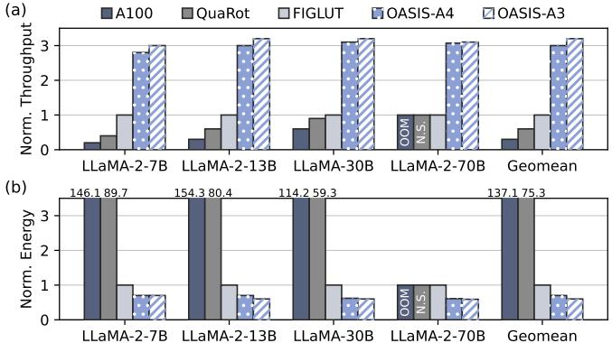

# C. Hardware Performance Analysis

For hardware performance, we evaluate OASIS (an NU-WAQ design) against FP16, INT-WAQ, and WOQ LUT accelerators. FP16 inference is run on the A100 GPU. For the INT-WAQ baseline, we deploy QuaRot's W4A4 GEMM kernel on the A100, since Atom's kernel is only available for LLaMA-2-7B among the models we test (as reported in QServe [30]). For the WOQ LUT comparison, we use FIGLUT, the SOTA ASIC LUT design evaluated at W4A16 precision.

Fig. 11 shows the normalized throughput and energy consumption of OASIS and baseline accelerators in single-batch decoding, with results normalized to FIGLUT. N.S. indicates

Fig. 11. Normalized throughput and energy consumption of OASIS and baseline accelerators in single-batch decoding.

that the accelerator does not support the corresponding model, while OOM indicates that the accelerator runs out of memory for the specified model. For throughput, on average, OASIS-A4 achieves  $5.41\times$ ,  $3.12\times$ ,  $3.00\times$  speedup and OASIS-A3 achieves  $5.67 \times$ ,  $3.27 \times$ ,  $3.15 \times$  speedup over A100, QuaRot, and FIGLUT, respectively. For energy efficiency, on average, OASIS-A4 achieves  $198.1\times$ ,  $108.8\times$ ,  $1.44\times$ , and OASIS-A3 achieves  $206.53 \times$ ,  $113.56 \times$ ,  $1.51 \times$  energy efficiency improvement over A100, QuaRot, and FIGLUT, respectively. The performance of GPU-based accelerators (A100 and QuaRot) is limited by low batch sizes during single-batch decoding, while FIGLUT's performance is constrained by limited parallelism due to small group sizes. In contrast, OASIS leverages an efficient WAQ LUT-GEMM design to substantially enhance computational parallelism, yielding superior throughput and energy efficiency.

