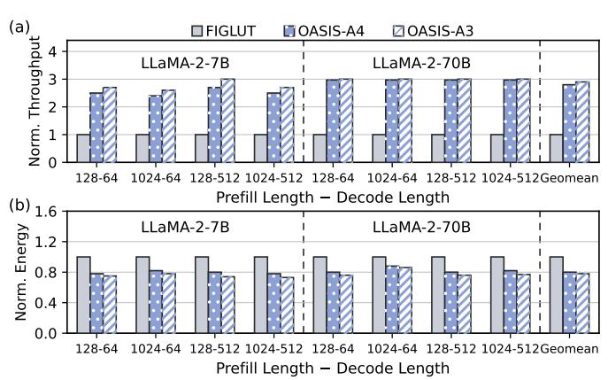
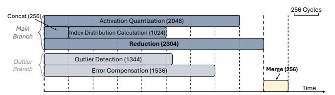
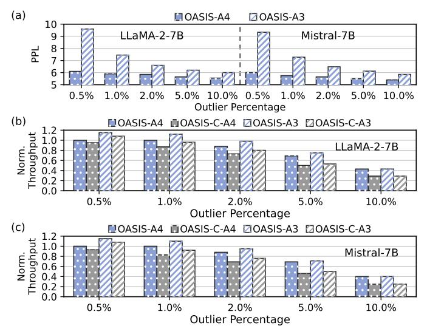
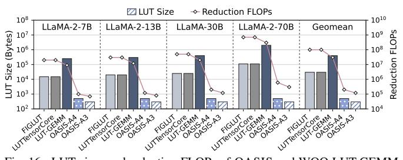
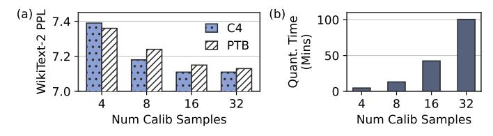
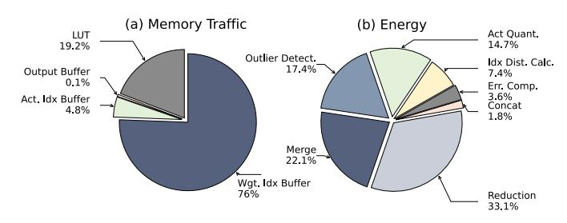

# D. Ablation Studies

1) Batched-Decoding: OASIS is an ASIC accelerator tar-

TABLE IV ZERO-SHOT ACCURACY RESULTS WITH 2048 SEQUENCE LENGTH.

| Model      | Precision | M. d. l           | Zero-Shot Accuracy ↑ |       |       |       |           |            |       |  |
|------------|-----------|-------------------|----------------------|-------|-------|-------|-----------|------------|-------|--|
|            |           | Method            | PIQA                 | ARC-E | ARC-C | BoolQ | HellaSwag | WinoGrande | Avg.  |  |
|            | FP16      | _                 | 78.67                | 74.58 | 46.16 | 78.59 | 75.95     | 68.98      | 70.49 |  |
|            | W4A4      | QuaRot            | 76.39                | 69.61 | 40.61 | 72.48 | 71.63     | 63.06      | 65.63 |  |
|            |           | Atom † | 75.14                | 52.99 | 38.40 | 74.59 | 69.37     | 62.75      | 62.21 |  |
|            | WAA       | OASIS-S           | 77.31                | 71.46 | 42.92 | 76.06 | 72.57     | 64.80      | 67.52 |  |
| LLaMA-2-7B |           | OASIS             | 77.97                | 73.06 | 43.60 | 76.83 | 74.32     | 65.51      | 68.55 |  |
|            |           | QuaRot            | 53.16                | 27.99 | 25.26 | 41.10 | 28.75     | 49.49      | 37.63 |  |
|            | W4A3      | Atom † | 71.01                | 48.63 | 33.49 | 58.73 | 62.54     | 59.50      | 55.65 |  |
|            | WAAS      | OASIS-S           | 75.14                | 63.93 | 37.37 | 63.89 | 67.58     | 63.93      | 61.97 |  |
|            |           | OASIS             | 75.84                | 65.99 | 39.59 | 65.47 | 68.28     | 64.17      | 63.22 |  |
|            | FP16      | _                 | 80.63                | 77.62 | 57.71 | 81.28 | 79.61     | 73.70      | 75.09 |  |
|            | W4A4      | QuaRot            | 68.28                | 60.48 | 37.46 | 66.57 | 61.73     | 63.06      | 59.60 |  |
|            |           | Atom † | 69.45                | 63.26 | 40.12 | 67.67 | 69.75     | 61.13      | 61.90 |  |
|            |           | OASIS-S           | 77.62                | 73.95 | 50.34 | 78.67 | 75.88     | 70.56      | 71.17 |  |
| LLaMA-3-8B |           | OASIS             | 78.67                | 74.03 | 51.37 | 80.02 | 77.00     | 71.27      | 72.06 |  |
|            | W4A3      | QuaRot            | 49.84                | 26.18 | 25.60 | 43.82 | 26.09     | 50.20      | 36.95 |  |
|            |           | Atom † | 72.86                | 51.06 | 40.52 | 61.19 | 67.78     | 60.87      | 59.05 |  |
|            |           | OASIS-S           | 75.82                | 70.22 | 41.99 | 74.01 | 71.98     | 65.03      | 66.51 |  |
|            |           | OASIS             | 77.09                | 71.89 | 45.65 | 75.64 | 73.80     | 66.22      | 68.38 |  |
|            | FP16      | _                 | 82.54                | 79.42 | 54.18 | 77.39 | 81.18     | 75.22      | 74.99 |  |
|            | W4A4      | QuaRot            | 80.19                | 70.97 | 41.06 | 73.00 | 72.88     | 72.34      | 68.41 |  |
|            |           | Atom † | 80.71                | 68.63 | 52.39 | 74.55 | 77.52     | 72.03      | 70.97 |  |
|            |           | OASIS-S           | 81.77                | 77.26 | 51.81 | 74.20 | 78.99     | 72.97      | 72.83 |  |
| Mistral    |           | OASIS             | 82.10                | 77.82 | 53.24 | 75.77 | 80.15     | 73.40      | 73.80 |  |
|            | W4A3      | QuaRot            | 53.16                | 27.99 | 25.26 | 41.10 | 25.68     | 48.78      | 36.99 |  |
|            |           | Atom † | 73.69                | 54.06 | 37.98 | 68.07 | 73.24     | 63.73      | 61.80 |  |
|            |           | OASIS-S           | 77.35                | 74.01 | 43.68 | 70.85 | 76.02     | 66.93      | 68.14 |  |
|            |           | OASIS             | 79.87                | 76.30 | 49.32 | 73.03 | 78.58     | 70.56      | 71.28 |  |

† Atom applies group quantization to weights and activations, with the group size of 128.

Fig. 12. Normalized throughput and energy consumption of OASIS and baseline accelerators during low-batch decoding.

geting edge LLM inference, where low-batch decoding is the predominant use case. In Fig. 12, we compare the normalized throughput and energy consumption of OASIS-A4/A3 over the baseline accelerators during low-batch decoding with batch sizes of 1, 2, and 4. The evaluation is conducted with the LLaMA-2-7B/13B models. OASIS-A4/A3 achieve average speedups of  $3.41\times$  and  $3.73\times$  over baseline accelerators,

and average energy efficiency improvements of 26.43× and 28.20×, respectively. As the batch size increases, all accelerators exhibit higher throughput and lower energy consumption, primarily due to increased arithmetic intensity from weight reuse. GPU-based approaches show steady throughput gains as batch size increases, which is because of higher Tensor Core utilization on GPUs [39]. Nonetheless, OASIS still surpasses the baseline accelerators in both throughput and energy efficiency, especially with the smaller model of LLaMA-2-7B, which is more relevant for edge deployment.

2) Prefill vs Decode: We evaluate the performance of OASIS and FIGLUT under different prefill and decode length pairs using the LLaMA-2-7B/70B models, which is shown in Fig. 13. On average, OASIS-A4/A3 achieves 2.80× and 2.93× speedup over FIGLUT across different prefill/decode length pairs. Notably, OASIS's throughput and energy efficiency improvement over FIGLUT is more pronounced on the LLaMA-2-70B model than on the LLaMA-2-7B model, which is because larger models have a higher number of input channels, allowing OASIS to better leverage its compute efficiency advantage.

3) Cycle Latencies for each Step in the Computation Pipeline: Fig. 14 shows the pipeline execution schedule of performing a 1-4096-4096 GEMM with OASIS at W4A4 preci-

Fig. 13. Normalized throughput and energy consumption of OASIS and baseline accelerators for various prefill/decode length pairs.

Fig. 14. Computation pipeline of performing an 1-4096-4096 GEMM with 1% outliers on OASIS at W4A4 precision. The numbers in parentheses indicate the number of cycles required for each step. The steps that bottleneck each pipeline stage are bolded.

sion with 1% outliers. The cycle latencies of each step are also shown in the figure with the numbers in parentheses. Based on the hardware configurations in Table II, in the 1% outlier case, the two branches exhibit comparable latencies, with the outlier branch completing approximately 33% faster. Consequently, the outlier branch finishes first and outputs results to the Output Buffer, which are subsequently merged with the main branch results upon completion. Conversely, in outlier-heavy scenarios, the main branch may finish first, with its results held in the Output Buffer awaiting the outlier branch completion.

4) Outlier Sensitivity: Fig. 15(a) presents the WikiText-2 PPL of LLaMA-2-7B and Mistral-7B on OASIS for outlier percentages ranging from 0.5% to 10%. For both models, increasing the outlier percentage generally improves PPL. To further examine the impact of increasing the outlier percentage on throughput, Fig. 15(b) and (c) show the throughput of LLaMA-2-7B and Mistral-7B normalized to that of OASIS-A4, respectively. We make two observations: (i) increasing the outlier percentage from 0.5% to 1% results in negligible throughput degradation for both models, as the end-to-end latency is dominated by the main branch; (ii) further increasing the outlier percentage from 1% to 10% leads to a significant increase in the execution time of the outlier branch, which becomes the new bottleneck of the end-to-end latency. This is because, as discussed in § IV-A, the hardware configurations in Table II are chosen such that the execution times of the main and outlier branches are comparable at 1% outlier percentage. Therefore, when the outlier percentage remains at or below 1%, the outlier branch does not constitute a bottleneck; however, once it exceeds this threshold, the computational

Fig. 15. (a) PPL, (b) LLaMA-2-7B's normalized throughput, and (c) Mistral-7B's normalized throughput of OASIS across different outlier percentages.

Fig. 16. LUT sizes and reduction FLOPs of OASIS and WOQ LUT-GEMM designs for the GEMM of the  $q\_proj$  layer.

overhead of the outlier branch grows rapidly and dominates the overall latency.

To demonstrate the effectiveness of the look-ahead design, we quantify the latency of dynamic outlier detection by comparing OASIS's throughput to the conventional dynamic detection design (Fig. 4(a), denoted as OASIS-C), where outlier detection is placed on the GEMM critical path. On LLaMA-2-7B, when keeping 1% of outliers, OASIS-A4 and OASIS-A3 achieve 16% and 18% higher throughput than OASIS-C-A4 and OASIS-C-A3, respectively, demonstrating the importance of the look-ahead design in hiding the latency of dynamic outlier detection and achieving high throughput.

5) Comparisons with LUT-Based GEMM Designs: In Fig. 16, we compare the LUT sizes and FLOPs during reduction of OASIS with WOQ LUT-GEMM designs, including FIGLUT [42], LUT Tensor Core [37], and LUT-GEMM [43]. The evaluation is conducted on the  $q\_proj$  layer's GEMM operation in different LLaMA models with W4A16 precision for WOQ LUT-GEMM designs. On average, OASIS-A4 reduces LUT sizes by  $62.1\times$ , and  $994.2\times$  compared to FIGLUT/LUT Tensor Core, and LUT-GEMM, respectively. OASIS-A4 also decreases FLOPs during reduction by  $497.1\times$ , and  $248.6\times$  compared to FIGLUT/LUT Tensor Core, and LUT-GEMM, respectively. The three LUT baseline methods all employ Inner Product LUTs with small group sizes to limit LUT size.

Fig. 17. Effects across calibration datasets and numbers of calibration samples on (a) PPL and (b) quantization time of OASIS-A4 on LLaMA-3-8B.

Fig. 18. Breakdown of (a) memory traffic and (b) energy consumption of OASIS-A4 for a 1-4096-4096 GEMM with 1% outliers.

This results in high FLOPs during reduction and consequently limits compute efficiency. Among these, LUT-GEMM trades off LUT size for lower FLOPs during reduction by utilizing a larger group size. As the model size increases from 7B to 70B, the number of input channels also increases from 4096 to 26728, leading to a significant rise in LUT sizes for all WOQ LUT-GEMM designs. In contrast, OASIS adopts Cartesian Product LUTs, which enable constant LUT sizes regardless of the number of input channels. As the model size increases, the increase of FLOPs in OASIS during reduction is also marginal compared to WOQ LUT-GEMM designs.

6) Robustness of Offline-Learned Activation Centroids: Fig. 17 investigates how calibration dataset selection and sample quantity affect the PPL and quantization time of OASIS-A4 on LLaMA-3-8B. As shown in Fig. 17(a), PPL remains consistent across different calibration datasets (C4 and PTB), with minimal variation. For instance, at 16 samples, PPL is 7.11 (C4) versus 7.15 (PTB). Generally, using C4 as the calibration dataset yielding slightly better PPL than PTB, which is because C4 is a larger and more comprehensive dataset than PTB, providing better coverage of the data distribution for centroid learning. Increasing calibration samples from 4 to 32 improves PPL  $(7.39 \rightarrow 7.11 \text{ for C4})$ , but convergence occurs around 16 samples, beyond which quantization time grows substantially (42.47  $\rightarrow$  100.52 minutes) without significant PPL gains. Consequently, we employ 16 C4 samples for activation centroid learning in OASIS to achieve an optimal balance between accuracy and efficiency.

7) Memory access / energy breakdown: In Fig. 18, we present the breakdown of on-chip memory traffic and energy consumption for a 1-4096-4096 GEMM with 1% outliers with OASIS-A4. Memory traffic is measured as the total number of bytes transferred, including both reads and writes. The Weight Index Buffer dominates memory traffic at 76.0%, while LUT reads and writes contribute 19.2%, demonstrating that LUT access does not induce significant memory overhead. Energy

consumption is primarily attributed to reduction (33.1%) and merging results from the main and outlier branches (22.1%).

## VI. RELATED WORKS

#### A. LLM WAQ Methods

In WAQ settings, both weights and activations are quantized to low precision, which can significantly reduce memory usage and computational costs during LLM inference [3], [14], [33], [62]. For example, SmoothQuant [58] applies scaling on both weights and activations to migrate the quantization difficulties of activations to weights, which are easier to quantize due to their smaller magnitude and quantity of outliers. QuaRot [3] applies Hadamard rotation matrices on both weights and activations to spread the quantization noise across all dimensions. Atom [62] applies fine-grained quantization granularity to limit the impact of quantization noise caused by outliers within smaller groups, and preserve some outliers with higher precision. However, they still lead to noticeable PPL degradation compared to FP16 models in low-precision configurations, and induce additional runtime overhead during GEMM operations. In contrast, OASIS does not incorporate outlier suppression operations, and handle the outliers without additional runtime overhead.

#### B. Reduction Tree-Based Architectures

Reduction trees perform O(N) operations with O(logN) latency by exploiting parallelism across tree levels. They are widely used for summation, e.g., in MAERI [23] and Flexagon [38], and can also support outlier selection via tournament trees [49], which identify maxima or minima through hierarchical pairwise comparisons. Inspired by tournament trees, we develop *Orizuru*, an outlier detection engine tailored for efficiently identifying both maximum and minimum activation outliers during LLM inference. *Orizuru* features shared leaf nodes between the maximum and minimum trees, which allows for efficient comparison of both maximum and minimum values with reduced hardware costs.

#### VII. CONCLUSION

OASIS introduces an approach to executing NU-WAQ inference by eliminating dequantization and maximizing compute efficiency. By leveraging offline-computed Cartesian-product LUTs, OASIS significantly reduces LUT sizes and enables large-granularity GEMMs that exploit massive parallelism. Its outlier-aware quantization and lightweight *Orizuru* top-k engine further preserve accuracy and efficiency without adding runtime latency and with only marginal energy overhead. Together, these innovations bridge the algorithm-hardware gap for NU-WAQ, maintaining accuracy with substantial throughput and energy efficiency gains.

#### ACKNOWLEDGEMENT

This work was partially supported by NSF under Grant Nos. 2332744, 2112562, and 2148253, and by AFOSR under Grant No. FA9550-24-1-0322. The authors would like to thank Duke CEI Lab for their support. We also acknowledge helpful discussions with Yiran Chen, Zhixu Du and Changchun Zhou.

#### REFERENCES

- [1] J. Achiam, S. Adler, S. Agarwal, L. Ahmad, I. Akkaya, F. L. Aleman, D. Almeida, J. Altenschmidt, S. Altman, S. Anadkat *et al.*, "Gpt-4 technical report," *arXiv preprint arXiv:2303.08774*, 2023.
- [2] E. Alvarez, O. Almog, E. Chung, S. Layton, D. Stosic, R. Krashinsky, and K. Aubrey, "Introducing nvfp4 for efficient and accurate low-precision inference," https://developer.nvidia.com/blog/introducingnvfp4-for-efficient-and-accurate-low-precision-inference/, Jun 2025.
- [3] S. Ashkboos, A. Mohtashami, M. L. Croci, B. Li, P. Cameron, M. Jaggi, D. Alistarh, T. Hoefler, and J. Hensman, "Quarot: Outlier-free 4-bit inference in rotated llms," *arXiv preprint arXiv:2404.00456*, 2024.
- [4] Y. Bisk, R. Zellers, J. Gao, Y. Choi *et al.*, "Piqa: Reasoning about physical commonsense in natural language," in *Proceedings of the AAAI conference on artificial intelligence*, vol. 34, no. 05, 2020, pp. 7432– 7439.
- [5] T. Brown, B. Mann, N. Ryder, M. Subbiah, J. D. Kaplan, P. Dhariwal, A. Neelakantan, P. Shyam, G. Sastry, A. Askell *et al.*, "Language models are few-shot learners," *Advances in neural information processing systems*, vol. 33, pp. 1877–1901, 2020.
- [6] C. Clark, K. Lee, M.-W. Chang, T. Kwiatkowski, M. Collins, and K. Toutanova, "Boolq: Exploring the surprising difficulty of natural yes/no questions," in *Proceedings of the 2019 conference of the north American chapter of the association for computational linguistics: Human language technologies, volume 1 (long and short papers)*, 2019, pp. 2924–2936.
- [7] P. Clark, I. Cowhey, O. Etzioni, T. Khot, A. Sabharwal, C. Schoenick, and O. Tafjord, "Think you have solved question answering? try arc, the ai2 reasoning challenge," *arXiv preprint arXiv:1803.05457*, 2018.
- [8] N. Corporation, "Nvidia rtx blackwell gpu architecture: Built for neural rendering," NVIDIA Corporation, Tech. Rep. V1.1, 2025, white paper. [Online]. Available: https://images.nvidia.com/aem-dam/ Solutions/geforce/blackwell/nvidia-rtx-blackwell-gpu-architecture.pdf
- [9] J. Dodge, M. Sap, A. Marasovic, W. Agnew, G. Ilharco, D. Groeneveld, ´ M. Mitchell, and M. Gardner, "Documenting large webtext corpora: A case study on the colossal clean crawled corpus," *arXiv preprint arXiv:2104.08758*, 2021.
- [10] A. Dubey, A. Jauhri, A. Pandey, A. Kadian, A. Al-Dahle, A. Letman, A. Mathur, A. Schelten, A. Yang, A. Fan *et al.*, "The llama 3 herd of models," *arXiv preprint arXiv:2407.21783*, 2024.
- [11] E. Frantar, S. Ashkboos, T. Hoefler, and D. Alistarh, "Gptq: Accurate post-training quantization for generative pre-trained transformers," *arXiv preprint arXiv:2210.17323*, 2022.
- [12] Y. Fu, Y. Zhang, Z. Yu, S. Li, Z. Ye, C. Li, C. Wan, and Y. C. Lin, "Gpt4aigchip: Towards next-generation ai accelerator design automation via large language models," in *2023 IEEE/ACM International Conference on Computer Aided Design (ICCAD)*. IEEE, 2023, pp. 1–9.
- [13] L. Gao, J. Tow, B. Abbasi, S. Biderman, S. Black, A. DiPofi, C. Foster, L. Golding, J. Hsu, A. Le Noac'h, H. Li, K. McDonell, N. Muennighoff, C. Ociepa, J. Phang, L. Reynolds, H. Schoelkopf, A. Skowron, L. Sutawika, E. Tang, A. Thite, B. Wang, K. Wang, and A. Zou, "The language model evaluation harness," 07 2024. [Online]. Available: https://zenodo.org/records/12608602
- [14] Z. Gao, S. K. Vadlamani, K. Sulimany, D. Englund, and T. Chen, "Disaggregated machine learning via in-physics computing at radio frequency," *Science Advances*, vol. 12, no. 2, p. eadz0817, 2026.
- [15] A. Grattafiori, A. Dubey, A. Jauhri, A. Pandey, A. Kadian, A. Al-Dahle, A. Letman, A. Mathur, A. Schelten, A. Vaughan *et al.*, "The llama 3 herd of models," *arXiv preprint arXiv:2407.21783*, 2024.
- [16] C. Guo, F. Cheng, Z. Du, J. Kiessling, J. Ku, S. Li, Z. Li, M. Ma, T. Molom-Ochir, B. Morris *et al.*, "A survey: Collaborative hardware and software design in the era of large language models," *IEEE Circuits and Systems Magazine*, vol. 25, no. 1, pp. 35–57, 2025.
- [17] D. Guo, D. Yang, H. Zhang, J. Song, R. Zhang, R. Xu, Q. Zhu, S. Ma, P. Wang, X. Bi *et al.*, "Deepseek-r1: Incentivizing reasoning capability in llms via reinforcement learning," *arXiv preprint arXiv:2501.12948*, 2025.
- [18] Z. He, H. Wu, X. Zhang, X. Yao, S. Zheng, H. Zheng, and B. Yu, "Chateda: A large language model powered autonomous agent for eda," in *2023 ACM/IEEE 5th Workshop on Machine Learning for CAD (MLCAD)*. IEEE, 2023, pp. 1–6.
- [19] C. Hooper, S. Kim, H. Mohammadzadeh, M. W. Mahoney, Y. S. Shao, K. Keutzer, and A. Gholami, "Kvquant: Towards 10 million

- context length llm inference with kv cache quantization," *arXiv preprint arXiv:2401.18079*, 2024.
- [20] A. Q. Jiang, A. Sablayrolles, A. Mensch, C. Bamford, D. S. Chaplot, D. d. l. Casas, F. Bressand, G. Lengyel, G. Lample, L. Saulnier *et al.*, "Mistral 7b," *arXiv preprint arXiv:2310.06825*, 2023.
- [21] S. Kim, C. Hooper, A. Gholami, Z. Dong, X. Li, S. Shen, M. W. Mahoney, and K. Keutzer, "Squeezellm: Dense-and-sparse quantization," *arXiv preprint arXiv:2306.07629*, 2023.
- [22] T. Kumar, Z. Ankner, B. F. Spector, B. Bordelon, N. Muennighoff, M. Paul, C. Pehlevan, C. Re, and A. Raghunathan, "Scaling laws for ´ precision," *arXiv preprint arXiv:2411.04330*, 2024.
- [23] H. Kwon, A. Samajdar, and T. Krishna, "Maeri: Enabling flexible dataflow mapping over dnn accelerators via reconfigurable interconnects," *ACM Sigplan Notices*, vol. 53, no. 2, pp. 461–475, 2018.
- [24] W. Kwon, Z. Li, S. Zhuang, Y. Sheng, L. Zheng, C. H. Yu, J. Gonzalez, H. Zhang, and I. Stoica, "Efficient memory management for large language model serving with pagedattention," in *Proceedings of the 29th Symposium on Operating Systems Principles*, 2023, pp. 611–626.
- [25] J. Li, J. Xu, S. Li, S. Huang, J. Liu, Y. Lian, and G. Dai, "Fast and efficient 2-bit llm inference on gpu: 2/4/16-bit in a weight matrix with asynchronous dequantization," *arXiv preprint arXiv:2311.16442*, 2023.
- [26] S. Li, Z. Yang, D. Reddy, A. Srivastava, and B. Jacob, "Dramsim3: A cycle-accurate, thermal-capable dram simulator," *IEEE Computer Architecture Letters*, vol. 19, no. 2, pp. 106–109, 2020.
- [27] S. Li, K. Chen, J. H. Ahn, J. B. Brockman, and N. P. Jouppi, "Cactip: Architecture-level modeling for sram-based structures with advanced leakage reduction techniques," in *2011 IEEE/ACM International Conference on Computer-Aided Design (ICCAD)*. IEEE, 2011, pp. 694–701.
- [28] H. Lin, H. Xu, Y. Wu, J. Cui, Y. Zhang, L. Mou, L. Song, Z. Sun, and Y. Wei, "Duquant: Distributing outliers via dual transformation makes stronger quantized llms," *Advances in Neural Information Processing Systems*, vol. 37, pp. 87 766–87 800, 2025.
- [29] J. Lin, J. Tang, H. Tang, S. Yang, W.-M. Chen, W.-C. Wang, G. Xiao, X. Dang, C. Gan, and S. Han, "Awq: Activation-aware weight quantization for on-device llm compression and acceleration," *Proceedings of Machine Learning and Systems*, vol. 6, pp. 87–100, 2024.
- [30] Y. Lin, H. Tang, S. Yang, Z. Zhang, G. Xiao, C. Gan, and S. Han, "Qserve: W4a8kv4 quantization and system co-design for efficient llm serving," *arXiv preprint arXiv:2405.04532*, 2024.
- [31] S.-y. Liu, Z. Liu, X. Huang, P. Dong, and K.-T. Cheng, "Llm-fp4: 4-bit floating-point quantized transformers," *arXiv preprint arXiv:2310.16836*, 2023.
- [32] W. Liu, H. Meng, Y. Luo, P. Zhang, and X. Ma, "Micromix: Efficient mixed-precision quantization with microscaling formats for large language models," *arXiv preprint arXiv:2508.02343*, 2025.
- [33] Z. Liu, C. Zhao, I. Fedorov, B. Soran, D. Choudhary, R. Krishnamoorthi, V. Chandra, Y. Tian, and T. Blankevoort, "Spinquant–llm quantization with learned rotations," *arXiv preprint arXiv:2405.16406*, 2024.
- [34] J. MacQueen, "Some methods for classification and analysis of multivariate observations," in *Proceedings of 5-th Berkeley Symposium on Mathematical Statistics and Probability/University of California Press*, 1967.
- [35] M. Marcus, G. Kim, M. A. Marcinkiewicz, R. MacIntyre, A. Bies, M. Ferguson, K. Katz, and B. Schasberger, "The penn treebank: Annotating predicate argument structure," in *Human Language Technology: Proceedings of a Workshop held at Plainsboro, New Jersey, March 8-11, 1994*, 1994.
- [36] S. Merity, C. Xiong, J. Bradbury, and R. Socher, "Pointer sentinel mixture models," *arXiv preprint arXiv:1609.07843*, 2016.
- [37] Z. Mo, L. Wang, J. Wei, Z. Zeng, S. Cao, L. Ma, N. Jing, T. Cao, J. Xue, F. Yang *et al.*, "Lut tensor core: A software-hardware co-design for lut-based low-bit llm inference," in *Proceedings of the 52nd Annual International Symposium on Computer Architecture*, 2025, pp. 514–528.
- [38] F. Munoz-Mart ˜ ´ınez, R. Garg, M. Pellauer, J. L. Abellan, M. E. Aca- ´ cio, and T. Krishna, "Flexagon: A multi-dataflow sparse-sparse matrix multiplication accelerator for efficient dnn processing," in *Proceedings of the 28th ACM International Conference on Architectural Support for Programming Languages and Operating Systems, Volume 3*, 2023, pp. 252–265.
- [39] NVIDIA, "Tensor core performance: The ultimate guide," NVIDIA, Tech. Rep., 2019.
- [40] ——, "Nvidia a100 tensor core gpu architecture," NVIDIA, Tech. Rep., 2020.

- [41] NVIDIA Corporation, "Nvidia turing gpu architecture whitepaper," NVIDIA Corporation, Tech. Rep. 87 pages, 2018. [Online]. Available: https://images.nvidia.com/aem-dam/en-zz/Solutions/designvisualization/technologies/turing-architecture/NVIDIA-Turing-Architecture-Whitepaper.pdf
- [42] G. Park, H. Kwon, J. Kim, J. Bae, B. Park, D. Lee, and Y. Lee, "Figlut: An energy-efficient accelerator design for fp-int gemm using look-up tables," in *2025 IEEE International Symposium on High Performance Computer Architecture (HPCA)*. IEEE, 2025, pp. 1098–1111.
- [43] G. Park, B. Park, M. Kim, S. Lee, J. Kim, B. Kwon, S. J. Kwon, B. Kim, Y. Lee, and D. Lee, "Lut-gemm: Quantized matrix multiplication based on luts for efficient inference in large-scale generative language models," *arXiv preprint arXiv:2206.09557*, 2022.
- [44] A. Paszke, S. Gross, F. Massa, A. Lerer, J. Bradbury, G. Chanan, T. Killeen, Z. Lin, N. Gimelshein, L. Antiga *et al.*, "Pytorch: An imperative style, high-performance deep learning library," *Advances in neural information processing systems*, vol. 32, 2019.
- [45] J. Pennington and P. Worah, "The spectrum of the fisher information matrix of a single-hidden-layer neural network," *Advances in neural information processing systems*, vol. 31, 2018.
- [46] B. Roziere, J. Gehring, F. Gloeckle, S. Sootla, I. Gat, X. E. Tan, Y. Adi, J. Liu, R. Sauvestre, T. Remez *et al.*, "Code llama: Open foundation models for code," *arXiv preprint arXiv:2308.12950*, 2023.
- [47] K. Sakaguchi, R. L. Bras, C. Bhagavatula, and Y. Choi, "Winogrande: An adversarial winograd schema challenge at scale," *Communications of the ACM*, vol. 64, no. 9, pp. 99–106, 2021.
- [48] H. Sharma, J. Park, D. Mahajan, E. Amaro, J. K. Kim, C. Shao, A. Mishra, and H. Esmaeilzadeh, "From high-level deep neural models to fpgas," in *2016 49th Annual IEEE/ACM International Symposium on Microarchitecture (MICRO)*. IEEE, 2016, pp. 1–12.
- [49] A. A. Stepanov and A. Kershenbaum, "Using tournament trees to sort," Center for Advanced Technology in Telecommunications, Polytechnic University of New York, Tech. Rep. 86-13, 1986.
- [50] Y. Sun, R. Liu, H. Bai, H. Bao, K. Zhao, Y. Li, J. Hu, X. Yu, L. Hou, C. Yuan *et al.*, "Flatquant: Flatness matters for llm quantization," *arXiv preprint arXiv:2410.09426*, 2024.
- [51] T. Tao, J. Li, B. Tan, H. Wang, W. Marshall, B. M. Kanakiya, J. Hestness, N. Vassilieva, Z. Shen, E. P. Xing *et al.*, "Crystal: Illuminating llm abilities on language and code," *arXiv preprint arXiv:2411.04156*, 2024.
- [52] H. Touvron, T. Lavril, G. Izacard, X. Martinet, M.-A. Lachaux, T. Lacroix, B. Roziere, N. Goyal, E. Hambro, F. Azhar ` *et al.*, "Llama: Open and efficient foundation language models," *arXiv preprint arXiv:2302.13971*, 2023.
- [53] H. Touvron, L. Martin, K. Stone, P. Albert, A. Almahairi, Y. Babaei, N. Bashlykov, S. Batra, P. Bhargava, S. Bhosale *et al.*, "Llama 2: Open foundation and fine-tuned chat models," *arXiv preprint arXiv:2307.09288*, 2023.
- [54] A. Tseng, T. Yu, and Y. Park, "Training llms with mxfp4," *arXiv preprint arXiv:2502.20586*, 2025.
- [55] H. Wang, Z. Zhang, and S. Han, "Spatten: Efficient sparse attention architecture with cascade token and head pruning," in *2021 IEEE International Symposium on High-Performance Computer Architecture (HPCA)*. IEEE, 2021, pp. 97–110.
- [56] T. Wolf, L. Debut, V. Sanh, J. Chaumond, C. Delangue, A. Moi, P. Cistac, T. Rault, R. Louf, M. Funtowicz *et al.*, "Transformers: Stateof-the-art natural language processing," in *Proceedings of the 2020 conference on empirical methods in natural language processing: system demonstrations*, 2020, pp. 38–45.
- [57] X. Wu, E. Hanson, N. Wang, Q. Zheng, X. Yang, H. Yang, S. Li, F. Cheng, P. P. Pande, J. R. Doppa, K. Chakrabarty, and H. Li, "Blockwise mixed-precision quantization: Enabling high efficiency for practical reram-based dnn accelerators," *IEEE Transactions on Computer-Aided Design of Integrated Circuits and Systems*, vol. 43, no. 12, pp. 4558– 4571, 2024.
- [58] G. Xiao, J. Lin, M. Seznec, H. Wu, J. Demouth, and S. Han, "Smoothquant: Accurate and efficient post-training quantization for large language models," in *International Conference on Machine Learning*. PMLR, 2023, pp. 38 087–38 099.
- [59] R. Zellers, A. Holtzman, Y. Bisk, A. Farhadi, and Y. Choi, "Hellaswag: Can a machine really finish your sentence?" *arXiv preprint arXiv:1905.07830*, 2019.
- [60] D. Zhang, J. Yang, D. Ye, and G. Hua, "Lq-nets: Learned quantization for highly accurate and compact deep neural networks," in *Proceedings*

- *of the European conference on computer vision (ECCV)*, 2018, pp. 365– 382.
- [61] S. Zhang, S. Roller, N. Goyal, M. Artetxe, M. Chen, S. Chen, C. Dewan, M. Diab, X. Li, X. V. Lin *et al.*, "Opt: Open pre-trained transformer language models," *arXiv preprint arXiv:2205.01068*, 2022.
- [62] Y. Zhao, C.-Y. Lin, K. Zhu, Z. Ye, L. Chen, S. Zheng, L. Ceze, A. Krishnamurthy, T. Chen, and B. Kasikci, "Atom: Low-bit quantization for efficient and accurate llm serving," *Proceedings of Machine Learning and Systems*, vol. 6, pp. 196–209, 2024.