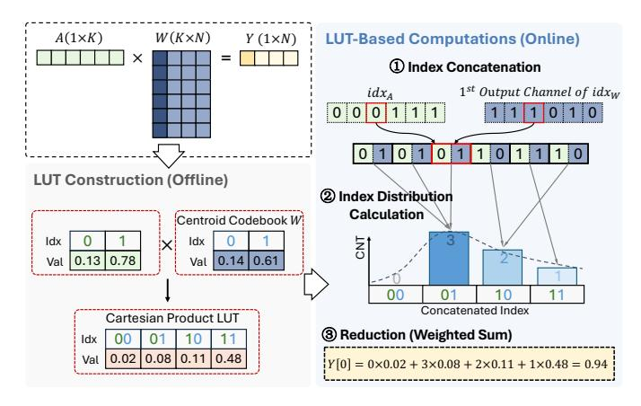

# III. COMPUTATION OPTIMIZATIONS

In this section, we present the computation optimizations to enable efficient LLM inference with NU-WAQ. Specifically, § III-A describes the quantization method used in OASIS,

Fig. 6. WAQ LUT-based GEMM computation scheme.

§ III-B presents the WAQ LUT-based GEMM scheme for efficient GEMMs with non-uniformly quantized weights and activations, and § III-C introduces the look-ahead computation and error compensation designs to handle activation outliers.

#### A. Quantizing Weights and Activations

To maintain model performance in low-precision configurations, OASIS adopts the learned-codebook quantization method of K-Means [34] for weight and activation quantization. Specifically, we employ output-channel-wise quantization for weights and token-wise quantization for activations. For weights, the entire weight matrix shares the same quantization centroids, while each output channel has its own scaling factor. For activations, each token has its own set of quantization centroids and scaling factors. We quantize the pretrained LLM weights to obtain the weight centroids, while the activation centroids are learned through an offline calibration dataset. As shown in Fig. 5, the offline and online activation centroids exhibit high consistency across different dataset configurations. The RMSE values between the offline and online centroids are both only 0.01 in Fig. 5(a) and (b). This indicates the feasibility of using offline-learned activation centroids for online activation quantization to avoid the overhead of activation centroid learning during inference. To further mitigate model performance degradation caused by activation quantization, we dynamically identify the top-0.5% largest and the bottom-0.5% smallest of the activations as outliers and preserve them in FP16 format.

#### B. WAQ LUT-Based GEMM

Leveraging the WAQ-specific opportunities discussed in Section II-B, we propose a WAQ LUT-based GEMM scheme to efficiently execute GEMMs between non-uniformly quantized weights and activations. Fig. 6 shows an example of computing the GEMM output with the activation and the first output channel of weights using the proposed WAQ LUT-based GEMM scheme. In this M-K-N GEMM example, M=1, K=6, N=4, and  $n_W=n_A=1$ .

In learned-codebook WAQ methods, both the quantization centroids of weights and activations are determined offline. In

Fig. 7. Look-ahead computations and error compensation.

other words, unique weight and activation values are predefined before inference. Therefore, we construct the Cartesian Product LUT offline, which stores all possible multiplication results between the weight and activation centroids. During online inference, we concatenate the indices of the activations and weights, which is shown in step (1). Then, in step (2), we calculate the distribution of these concatenated indices. Finally, in step (3), we perform the reduction of the multiplication results along the input channel dimension (K). Specifically, we replace the K FP16 additions in the conventional GEMM with a weighted sum of the multiplication results stored in the Cartesian Product LUT. The counts of each unique concatenated index serve as weights of the weighted sum. The number of FP16 additions is reduced from K to  $2^{n_W+n_A}$ , which is significantly smaller in low-precision quantization scenarios.

Consider the common case of W4A4 GEMMs, where  $n_W = n_A = 4$ . The Cartesian product LUT stores  $2^{n_W + n_A}$  multiplication results—only 256 entries. This LUT size is  $64 \times$  smaller than the inner-product LUT used in existing WOQ LUT-GEMM methods for a  $4096 \times 4096$  weight layer. Therefore, unlike WOQ LUT-GEMM methods that require small group sizes to control LUT size, our design can support arbitrary reduction lengths without increasing LUT size, enabling higher parallelism. In our WAQ LUT-GEMM scheme, the reduction length is equal to the input channel number of the weights K. The high computational parallelism of our design yields a  $16 \times$  reduction in FLOPs compared to existing WOQ LUT-GEMM methods. These advantages become more pronounced for larger LLMs as per-layer input channel numbers increase [10], which is evaluated in §V-D.

