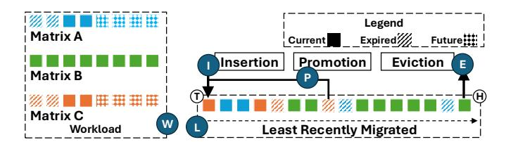
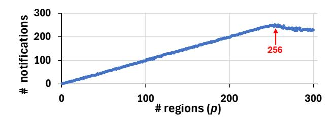
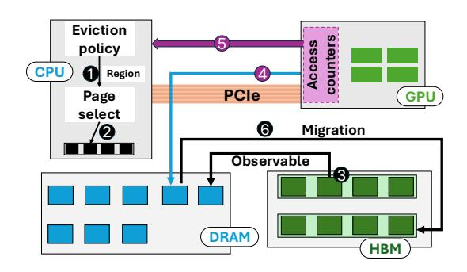
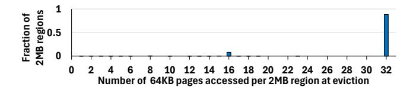

# II. BACKGROUND ON UVM

NVIDIA introduced Unified Virtual Memory (UVM) to simplify GPU programming and enable oversubscription of GPU memory [\[23\]](#page-15-1). GPUs have limited on-board memory (High-Bandwidth Memory, or *HBM*) [\[26\]](#page-15-10) typically in tens of GBs with a couple of hundreds of GBs only in the topend server GPUs. Compare this with CPU memories (*DRAM*) that routinely scale up to TBs. Traditionally, the programmer allocates memory buffers on the HBM, copies data from DRAM to HBM over the PCIe interconnect, requests the GPU to perform computation, and then copies the output

Fig. 1: Page fault based migration, eviction and access counter based migration in UVM

back to the DRAM. UVM simplifies GPU programming by freeing the programmer from manual memory copying. The UVM driver, running on the CPU, transparently performs page migrations between the DRAM and HBM, like demand paging in CPUs. Importantly, UVM enables HBM oversubscription. Oversubscription allows GPU programs to work with datasets larger than the HBM capacity.

There are two key parts to UVM: ① deciding what pages to migrate onto the HBM, and ② what to evict from HBM under memory pressure. The former encompasses page migration and prefetching strategies, and has been studied well [2], [3], [9], [18], [22], [31]. The latter is in the purview of the eviction policy, and little attention has been paid to this aspect. We now describe the workings of UVM in detail, focusing on page migration, page eviction, and prefetching strategies.

#### A. Page Migration in UVM

UVM employs a page fault mechanism to migrate 64KB pages between the DRAM and HBM (Figure 1a). When the GPU accesses a page that is not resident on the HBM, it raises a page fault ①. The faulting address is placed in a buffer shared between the GPU and the CPU ②. The UVM driver reads this page fault information from the shared buffer and services the corresponding page faults ③. It locates the faulting page on the CPU DRAM, unmaps the page from the CPU's page tables ④, migrates the page to the faulting GPU's HBM ⑤ over PCIe, establishes the appropriate page table mappings on the GPU's page tables ⑥, and finally instructs the GPU to replay the faulting instructions ⑦.

Servicing a single page fault takes between 10 and 50 microseconds [65]. Since page faults lie on the critical execution path of the GPU, page migration through page faults is costly. It has been well recognized that enhancing page migration is important for improving UVM performance [4], [5], [11]. Thus, prior works have proposed improving UVM page migration with page fault handling optimizations [31], prefetching [22], [46], and access counter-based page migration [19], [45].

#### B. Access Counter Based Page Migration (ACBM)

The latency of page fault servicing and page migrations in UVM lies on the critical path of execution. Further, the page fault based mechanism cannot differentiate between heavily accessed and lightly accessed pages, leading to blind page

migrations on the first touch. To improve page migration, NVIDIA introduced optional Access Counter Based Migration (*ACBM*) with the Volta generation of GPUs [42], [45].

Figure 1b shows the working of ACBM. With ACBM enabled, regions evicted from the HBM to the DRAM ① are mapped onto the GPU's page tables ②, and are accessed by the GPU over PCIe. Access counters monitor accesses over PCIe ③ and raise notifications ④ when a region accumulates a *threshold* (parameterized) number of accesses. Upon a notification, the driver triggers the migration of the region from DRAM to HBM (⑤). The tracking granularity and threshold are configured at driver load time, with threshold from 1 to 65535 and granularity from 64KB, 2MB, 16M, or 1GB.

ACBM provides two benefits. ① Only heavily accessed regions are migrated to the HBM to enjoy high bandwidth, minimizing needless migrations and preventing thrashing. ② DRAM-resident pages remain accessible to the GPU (mapped onto GPU page tables), unlike in page fault-based migration where the faulting instruction stalls until the fault is serviced.

We emphasize that access counters *track accesses from GPU to DRAM* over the PCIe, and *not* the accesses to HBM-resident pages. We believe this is the result of fundamental hardware limitations – tracking and updating access counters for HBM accesses at TB/s bandwidth is challenging and possibly unrealistic. In comparison, PCIe bandwidth is only a few tens of GB/s and thus easy to track. Note that ACBM is disabled by default in the UVM driver (Section III-D).

#### C. Prefetching in UVM

The UVM driver performs prefetching within 2MB boundaries (intra-2MB) from DRAM to HBM using a Tree-Based Prefetching (TBP) strategy to reduce critical path page migration latency [18], [46]. TBP uses complete binary trees, each representing a 2MB memory region, to track HBM residency within the region. The leaves of this tree represent 64KB regions, the root represents the 2MB region, and the internal nodes represent power-of-two sized regions between them. Each node tracks the fraction of HBM-resident memory under the sub-tree of the node. On a page fault, if a node's GPU-resident memory exceeds a threshold (default 51%), all pages in its sub-tree are prefetched. The threshold determines the aggressiveness of prefetching. A lower threshold leads

to sub-tree migrations with fewer faults, and hence is more aggressive. Similarly, a higher threshold is less aggressive.

However, note that TBP is not adaptive. It uses a fixed threshold and does not consider the utility of prefetched pages to adapt its aggressiveness. Thus, it may prefetch pages unnecessarily, wasting PCIe bandwidth, or miss opportunities to prefetch pages early.

## *D. Eviction in UVM*

While page migration and prefetching have received considerable attention, eviction is, unfortunately, an overlooked yet important aspect of UVM. To make room for pages demanded by the GPU, the UVM driver may evict HBM resident pages to the DRAM. Figure [1c](#page-2-2) shows the page eviction mechanism. The UVM driver, running on the CPU, chooses the eviction victim 1 . The chosen victim is unmapped from the GPU's page tables 2 , migrated to the DRAM 3 , and mapped onto the CPU's page tables 4 . The choice of eviction victim is important, as poor eviction decisions can lead to frequent page faults, ultimately degrading performance.

The UVM driver uses a Least Recently Migrated (*LRM*) policy (Figure [2\)](#page-3-0) for choosing 2MB regions to evict from the HBM. The driver maintains a list L of HBM-resident 2MB memory regions. When a 2MB region that is not resident on the HBM is faulted upon, the UVM driver inserts the region to the tail T of the list ( I ). Eventually, the region moves towards the head H of the list, as newer regions are added to the tail. When another 64KB page within the 2MB region is faulted upon, the 2MB region is promoted to the tail of the list ( P ). Under memory pressure, the 2MB region at the head H of the list (i.e., the least recently migrated) is chosen for eviction and removed from the list ( E ).

Limitations: The UVM driver makes eviction decisions without any information about the GPU's accesses to the HBM. Unlike CPUs, NVIDIA GPUs do *not* provide access bits [\[43\]](#page-15-12), [\[44\]](#page-15-4) or low-overhead monitoring tools (e.g., AMD's IBS [\[1\]](#page-14-9)) to track memory accesses to the HBM. Thus, the UVM driver chooses eviction victims solely based on the page fault stream, limiting its ability to make good decisions (Section [III-A\)](#page-3-1).

## III. CURRENT SHORTCOMINGS AND KEY INSIGHTS

In this section, we discuss the limitations of existing eviction, prefetching, and access counter-based migration policies, and present four observations that motivate our approach to improving GPU memory oversubscription.

## *A. Limitations of UVM's LRM Eviction Policy*

UVM's Least Recently Migrated (LRM) eviction policy often makes poor eviction decisions. The LRM policy can evict HBM-resident regions that are actively being accessed, even when there are other regions that are inactive. This is because the UVM driver, running on the CPU, has *no* knowledge of GPU accesses to HBM, i.e., the driver has no *observability* into the accesses to HBM.

We demonstrate this limitation using a simple matrix multiplication application shown in Figure [2.](#page-3-0) This application ( W

Fig. 2: Working of the UVM's default LRM policy

in the figure) operates on three matrices, A, B, and C. The shaded squares in the figure represent the state of 2MB regions within these matrices: fully shaded regions (Current) are being accessed currently; hatched regions (Expired) have been accessed earlier and *not* accessed again; and tiled regions (Future) will be accessed in the future. Matrices A and C are accessed in parts, with different portions accessed during different stages of execution. Matrix B is accessed in its entirety across the entire execution. Consequently, the pages of B should never be evicted from the HBM. Unfortunately, the driver has no way of knowing if a region is being accessed *after* it has been migrated to the HBM. As a result, the regions of B move towards the head of the list L and get evicted early under memory pressure (Section [II-D\)](#page-3-2). It must subsequently be migrated back upon access, incurring significant overheads.

If the driver could peek into GPU accesses to HBM, it could make better-informed eviction decisions. It could transform the default LRM eviction policy to approximate the Least Recently Used (LRU) policy. In the above example, the driver could move memory regions of the matrix B to the tail of the list to avoid evicting them. As we will show later, using the LRU policy instead of LRM reduces evictions in matrix multiplication by as much as 71%. Unfortunately, it is not possible today due to the lack of observability.

## *B. Single Policy Does Not Fit All*

Unsurprisingly, different applications, with distinct access patterns, prefer different eviction policies. For example, in applications with a cyclic access pattern with very large reuse distances between consecutive accesses to the same memory region, evicting the least-recently used regions effectively leads to no reuse of the migrated pages. Such applications, instead, benefit from evicting recently used regions. Similarly, some applications exhibit access patterns that favor evicting the least *frequently* used (LFU) regions. In our evaluation with fourteen diverse applications, five prefer LRU, six prefer LFU, and three prefer a policy tailored for cyclic patterns. We describe the policies in detail in Section [VI-A](#page-7-1) and evaluate them in Section [VII-A.](#page-9-0) Ultimately, no single policy suits every application. Choosing the right policy is important to minimize evictions and subsequent migrations.

Thankfully, UVM policies are implemented in the software (driver), enabling customization of eviction policies without hardware modification. However, policies are deeply embedded in the UVM driver, making it impractical to easily explore diverse policy choices. Changing policies would require modifying, recompiling, and reloading the driver. Bugs in the policy or in implementation could crash the system and expose it to security vulnerabilities. In Section [IV-C,](#page-5-1) we discuss how we separate policy from mechanism to overcome these limitations.

### *C. Lack of Feedback Constrains Prefetching*

Prefetching can improve performance by reducing page migrations on the critical path of access. However, useless prefetches can cause destructive interference on the PCIe and further limit the effective capacity of the HBM. As with eviction, the driver is responsible for prefetching into HBM. However, it *lacks* knowledge of whether a prefetched region is actually accessed in the HBM.

In the absence of *feedback* on prefetch's usefulness, the driver acts blindly and often conservatively. The UVM driver employs a Tree-Based Prefetcher (TBP) that desists from migrating entire 2MB regions. Instead, it waits for a stream of faults to 64KB constituent pages to gain confidence before migrating the residual pages within a region (Section [II-C\)](#page-2-3). While justified for applications with low spatial locality to avoid useless prefetches, TBP leaves significant performance on the table for those with high spatial locality – typical for many GPU applications. It would have been beneficial to prefetch the *entire* 2MB region upfront, wherever an application ultimately accesses all or most of the constituent 64KB pages. However, feedback on past prefetches is essential to prefetch aggressively without risking many useless ones.

To quantify the opportunity cost of TBP's conservative strategy, we measure the number of HBM-resident 64KB pages in every 2MB region (i.e., *occupancy*) at the time of the region's eviction. A high occupancy indicates that most pages were accessed and consequently, migrated onto the HBM. We find that, on average, a 2MB region is over 90% occupied at eviction. This implies a significant opportunity to aggressively prefetch entire 2MB regions upfront.

Further, the UVM driver only prefetches *within* a 2MB region but never across regions. Many applications could benefit from prefetching beyond a single 2MB region. For instance, in the example described in Section [III-A,](#page-3-1) matrices A and C are accessed in parts, but in a predictable and linear fashion. Such access patterns are amenable to prefetch policies that transcend 2MB boundaries. However, blindly prefetching across 2MB regions can significantly hurt performance (Section [VI-D\)](#page-9-1). Feedback on the usefulness of past prefetches is crucial for dynamically tuning prefetch aggressiveness.

#### *D. Limited Usefulness of Access Counters for Migration*

Finally, we find that ACBM, while good in theory, does not work as well in practice. It is constrained by 1 the limited number of hardware counters and 2 the difficulty of selecting appropriate configuration parameters (granularity, threshold).

We found that there are only a limited number (256) of hardware access counters for tracking GPU accesses to DRAM-resident pages. We reverse-engineer the number of counters using a microbenchmark. It allocates p × 2MB on the DRAM and pins it to avoid migration, maps the allocated memory to the GPU page table, and accesses each 2MB region

Fig. 3: Microbenchmark: Limited number of access counters

*x* times from the GPU. Correspondingly, we set the threshold for the access counters to *x*. We expect one notification per region (p) as long as 'p' is equal to or less than the number of hardware counters. Figure [3](#page-4-1) reports the number of notifications (y-axis) with varying p (number of regions). We observe that the number of notifications increases linearly with p *until 256*. It saturates thereafter, confirming the presence of 256 hardware counters. We observe the same on a range of NVIDIA GPUs.

Tracking accesses to TBs of DRAM (millions of pages) with *only* 256 access counters is *futile*. It is also unrealistic to ever have millions of access counters on a GPU.

Furthermore, access counters have a large configuration space. There are four possible tracking granularities and 65535 possible thresholds, yielding ∼ 250,000 possible combinations (Section [II\)](#page-1-0). The *right* configuration varies across applications. Lower thresholds may cause excessive migrations and thrashing, while higher thresholds risk delayed migration. For instance, cuBLAS's matrix multiplication works best with low thresholds (e.g., 1), while rank computation prefers higher thresholds. Similarly, the tracking granularity trades off tracking precision for coverage. Thus, ACBM needs extensive perapplication tuning to be useful in practice.

In short, access counters have limited usefulness in performing their primary function – i.e., identifying and migrating hot pages. We observed that ACBM can be detrimental to performance (Section [VII-B\)](#page-10-0). Consequently, ACBM is disabled by default in the UVM driver. It instead relies on traditional page-fault-based migration (Section [II\)](#page-1-0).

#### Summary of Key Insights

1 Lack of observability into GPUs' accesses to HBM hinders UVM's ability to make informed eviction choices. 2 Absence of feedback on the utility of prefetching limits the aggressiveness of prefetching policies. 3 A flexible framework is needed to customize UVM policies for diverse application needs. 4 Fundamental limitations prevent access counters from aiding page migration.

#### IV. OBSERVUVM: A FRAMEWORK FOR INFORMED UVM

We design a framework, named ObservUVM, to overcome key limitations of existing eviction and prefetching mechanisms. It has three key objectives:

- 1) Provide observability of accesses to HBM-resident memory *without* needing hardware modifications.
- 2) Enable feedback on the utility of prefetching into HBM.

Fig. 4: Mechanism to enable observability

3) Ease customization of UVM's eviction and prefetching policies by separating them from mechanisms in driver.

Here, we detail the framework's design principles. Section [V](#page-6-0) details the implementation of ObservUVM, while Section [VI](#page-7-2) demonstrates how the framework can be used to enable different eviction and prefetching policies in userspace.

#### *A. Sampled Observability for Eviction Policies*

ObservUVM enables eviction policies to *observe* (sampled) accesses to a chosen set of key HBM-resident memory regions (e.g., up to 100 2MB regions). It *emulates the functionality of 'access bits'* for chosen regions without requiring new hardware by re-purposing existing access counters. Figure [4](#page-5-2) shows ObservUVM's philosophy behind making a region observable. An eviction policy chooses an HBM-resident region (here, 2MB) to be made *observable* 1 . ObservUVM chooses a constituent *page* (here, 64KB) *within* the observable region as a sample 2 . It migrates the sampled page to DRAM and pins it 3 . Upon a GPU access (over PCIe) to the sampled page on the DRAM 4 , the hardware generates an access counter notification to ObservUVM's driver 5 . The driver informs the policy about the access to the sampled page. The sampled page is then migrated back to the HBM as it has finished serving its purpose of monitoring access to its encompassing region 6 . The region ceases to be observable.

Re-purposing access counters for observability sidesteps its key limitations (Section [III-D\)](#page-4-0). The traditional use case of page migration necessitates tracking possibly terabytes of DRAM. In contrast, ObservUVM only monitors (observes) sampled pages from the chosen HBM-resident regions that are key to a policy's decision-making. An eviction policy needs only to observe regions at immediate risk of eviction (key regions). We empirically find that observing up to 100 regions is sufficient, well within the tracking capabilities of current GPUs. Another limitation of access counters is finding the *right* threshold to differentiate hot pages from cold ones. Since ObservUVM uses access counters to emulate access bits, the threshold must naturally be *one*.

The effectiveness of sampling for observability relies on spatial locality in an application. If the GPU accesses an observed region but *not* its sampled page, ObservUVM will fail to report accesses to the region. Fortunately, GPU programs naturally exhibit significant spatial locality [\[36\]](#page-15-7).

Fig. 5: Locality in 2MB regions upon eviction

We empirically find that monitoring a single page (64KB) within a memory region (2MB) is sufficient for making informed eviction decisions. A 2MB region consists of thirtytwo 64KB pages. If most of the constituent pages of a region are accessed before the region is evicted from HBM, sampling *any one* of the pages provides accurate observability for the region. Figure [5](#page-5-3) empirically measures this across all applications. The x-axis shows the number of constituent pages within a region that are accessed before the region's eviction. The height (y-axis) of a bar at a point 'p' on the xaxis captures the fraction of 2MB regions (y-axis) whose 'p' constituent pages are accessed. From the figure, we notice that all constituent pages of more than 90% of regions are accessed before eviction. This affirms that sampling a single page within a region provides sufficient observability. Section [VII-C](#page-11-0) shows the sensitivity to sampling a different number of pages from a region. Further, we extend ObservUVM to dynamically adjust the number of pages it samples per region based on the spatial locality of applications (Section [V-D\)](#page-7-0).

Note that accessing sampled pages over the PCIe increases access latency. However, upon access, the sampled page is migrated back to the HBM to enjoy high-bandwidth access, limiting the number of PCIe accesses.

### *B. Feedback for Prefetching Policies*

Observability is also useful for providing feedback on the usefulness of past prefetches. For example, a TBP prefetching policy can make (a subset of) regions under active prefetching observable. It can then sample a prefetched page within a region and pin it on the DRAM to monitor accesses to it using counters. Upon receiving an access counter notification for a prefetched page, the driver notifies the policy of the useful prefetch (positive feedback). If a region is evicted without its sampled page witnessing access, it provides negative feedback to the policy. A prefetching policy can utilize the feedback to increase the aggressiveness of prefetching or throttle it.

#### *C. Separation of Policy from Mechanism*

Today, the eviction and prefetching policies are baked into the driver. It impedes safe and rapid exploration of policies. In contrast, ObservUVM enables policies to be implemented in userspace. It extends the UVM driver to relay events (e.g., page faults and evictions) to userspace (Section [V-A\)](#page-6-1). It provides observability and enforces the policy decisions. Meanwhile, the userspace (Section [V-C\)](#page-6-2) is responsible for making policy decisions, e.g., selecting an eviction candidate, based on information relayed by the modified driver.

Fig. 6: Components of ObservUVM and their interactions

#### V. IMPLEMENTING OBSERVUVM FRAMEWORK

We implement ObservUVM by extending NVIDIA's open-source UVM driver v525 [47], creating an extensible userspace engine, and a communication layer between the driver and userspace. The userspace engine is written in C++11 while the communication layer uses eBPF [15] via libbpf [38].

Overview: Figure 6 depicts the three major components of ObservUVM. The modified UVM driver D provides observability, relays events (e.g., page faults) to the userspace, and enforces policy decisions (Section V-A). The userspace engine U consumes the events from the modified driver, exports an interface for custom policies to make decisions, and relays policy decisions to the driver (Section V-C). The userspace also chooses pages for observability and feedback. Finally, the communication layer C (Section V-B) enables fast communication between the modified driver and the userspace.

#### A. Modifications to the UVM Driver

We extend the UVM driver to perform three key functions, in addition to its existing responsibilities: ① enable observability, ② relay important events to user space, and ③ enforce decisions from userspace.

**Enabling observability:** The extended driver receives the address of a 64KB page from the 2MB region selected for observability by the userspace via the communication layer (Figure 6). It migrates the selected (sampled) page from the HBM onto the DRAM and maps the page onto the GPU's page tables. Such pages can now be accessed over PCIe and raise access counter notifications.

**Relaying events to userspace:** We extend the driver to relay important events **①**2 to the userspace. We added tracepoints **①**2 [12] to the driver on *page fault, access counternotification, prefetch,* and *eviction* events. These tracepoints are used by the communication layer (Section V-B) to relay events to the userspace.

Receiving and enforcing userspace decisions: The modified driver receives decisions (e.g., eviction victims) from the userspace through the communication layer **T3** (detailed in Section V-B) and enforces these decisions.

**TABLE I:** Comm. layer interface/Userspace callbacks

|            | Interface/callback        | Arguments       |
|------------|---------------------------|-----------------|
| Upstream   | onPageFault               | Address         |
|            | onAccessCounter           | Address         |
|            | onEviction                | Address         |
|            | onPrefetch                | Address, Bitmap |
| Downstream | setEvictionRegion         | Address         |
|            | setPrefetchThreshold      | Integer         |
|            | setPrefetchRegion         | Address         |
|            | setObservabilityCandidate | Address         |
|            | setFeedbackCandidate      | Address         |

Upon memory pressure, the driver needs to evict a 2MB region ①3. The modified driver retrieves the eviction victim, as chosen by the userspace and conveyed over the communication layer. It evicts the region from the HBM to DRAM.

The driver can receive requests **T3** from the userspace to change the prefetching strategy too. ObservUVM controls the prefetching aggressiveness by changing the prefetch threshold (Section VI-C). A lower threshold value implies aggressive prefetching, and vice versa. The driver also receives addresses of regions to prefetch from the userspace (Section VI-D).

#### B. Communication Layer

The communication layer relays messages between the modified driver and the userspace engine. It provides two sets of interfaces: *upstream* interfaces that the driver uses to relay events to userspace, and *downstream* interfaces for messages from userspace to the driver. These interfaces are listed in Table I and are self-explanatory.

We implement the communication layer using Linux's eBPF framework [15]. eBPF allows running custom programs safely in the kernel context at specified points (e.g., tracepoints [12]). It also provides shared data structures, e.g., maps, for easy communication between userspace and eBPF programs in the kernel [16]. Finally, the *kfunc* feature allows eBPF programs to manipulate kernel/driver variables [14].

### C. Userspace Engine

The userspace engine (U) in Figure 6) is responsible for polling events upstreamed by the driver, passing them to the appropriate policies, maintaining metadata, and communicating policy decisions to the driver.

The heart of the engine is an event loop (UI), that retrieves and processes events from the driver. Based on the specific event, the engine invokes appropriate callbacks of registered eviction (U2) and/or prefetching (U3) policies. Corresponding to every API exposed by the driver in Table I, the engine provides a callback for policies to implement. Each user-implemented policy, written in C++, must register its implementation for the callbacks exposed by the engine. For example, upon a page fault event upstreamed by the driver, the engine invokes onPageFault callbacks of the registered eviction and prefetching policies.

The engine also maintains policy-agnostic metadata, such as currently GPU-resident regions ①5, and currently observed regions ①4. The policies can query the engine for this

metadata if needed for their decision-making. Finally, policy implementations (Section [VI\)](#page-7-2) invoke downstream callbacks to relay their decisions to the driver. The engine forwards them to the driver using APIs exposed by the driver.

The enhanced driver, the communication layer, and the userspace engine complete the ObservUVM framework. In Section [VI,](#page-7-2) we demonstrate how ObservUVM can be used to create a diverse set of eviction and prefetching policies.

## *D. Adapting Number of Pages to Sample*

By default, ObservUVM randomly samples *one* 64KB page (parameterized) within a HBM-resident 2MB region to provide (sampled) observability for the region. While our analysis in [Section IV-A](#page-5-0) and the sensitivity studies [\(Section VII-C\)](#page-11-0) show that one sampled page per region is sufficient to make informed eviction and prefetching decisions, ObservUVM can dynamically increase (decrease) the number of sampled pages per region to adapt to different degrees of spatial locality.

We observe that if an *actively accessed* region gets evicted from the HBM despite sampling a 64KB page, then the region will quickly experience a page fault. ObservUVM's driver monitors 2MB regions (default, 100) that were recently evicted from the HBM. A page fault on these monitored regions indicates a likely failure of sampling to ascertain the usefulness of the region.

ObservUVM periodically calculates the fraction of recently evicted regions that are accessed again. If this fraction crosses a threshold (default, 0.5), ObservUVM doubles the number of sampled pages per region to improve observability *resolution*. Similarly, if a large fraction (here, 0.8) of the recently evicted region were not accessed quickly again, ObservUVM halves the number of sampled pages within a region. Thus, ObservUVM adapts the number of samples per region based on the application characteristics.

