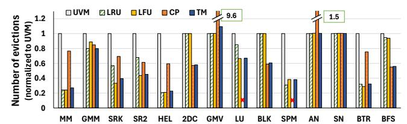
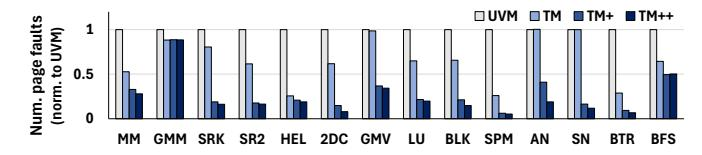
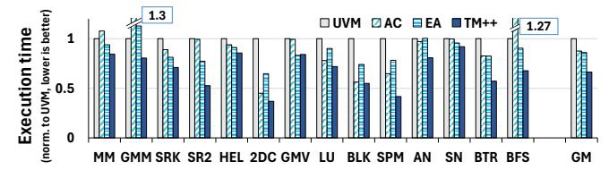

# VI. EXPLORING POLICIES WITH OBSERVUVM

<span id="page-7-2"></span>We create several policies using the ObservUVM framework to demonstrate its versatility and usefulness. We create three different eviction policies leveraging the newfound observability. We then create a meta-policy (Tournament) to dynamically choose between the eviction policies. Finally, we design two feedback-driven prefetching policies.

#### <span id="page-7-1"></span>*A. Eviction Policies Enabled by Observability*

We implement three eviction policies that leverage observability. These policies are built on a common principle: *utilize observability to identify memory regions that are at immediate risk of eviction from HBM (key regions) but are actively accessed by the GPU*. We now detail these policies.

Least Recently Used (LRU): Our (approximate) LRU policy (Figure [7a\)](#page-8-0) avoids evicting recently *accessed* HBM-resident regions. It maintains a list of HBM-resident 2MB regions. The head H of the list represents the least recently accessed region, and the tail T represents the most recently accessed. When a DRAM-resident 64KB page is faulted upon and migrated to the HBM, the encompassing 2MB region is added

```
1 void onPageFault(u64 addr):
2 lru_list.move_to_tail(addr);
4 void onAccessCounter(u64 addr):
5 lru_list.move_to_tail(addr);
6
7 void onEviction(u64 addr):
8 lru_list.remove(addr);
9
10 u64 setEvictionCandidate():
11 return lru_list.head;
13 u64 setObservabilityCandidate():
14 node = lru_list.head;
15 while (node.isObservable()):
16 node = node->next;
17 return node;
```

Listing 1: Implementation of LRU policy using ObservUVM

to the tail of the list (Insertion). Upon further page faults, 2MB regions are moved to the tail (Promotion).

The LRU policy picks a small number (e.g., 100) of *key* 2MB regions near the head of the LRU list (at risk of eviction) to be made observable ( ). Regions that receive access counter notifications AC are deemed actively accessed by the GPU and thus, moved (Promotion) to the tail. This avoids evicting actively accessed regions. The 2MB region at the top of the list is evicted due to memory pressure (Eviction).

Listing [1](#page-7-3) shows simplified pseudo-code for the LRU policy, implementing ObservUVM's callbacks (Table [I\)](#page-6-5). The list lru\_list tracks HBM-resident 2MB regions. On a page fault (lines 1,2) or an access counter notification (lines 4,5), the region is moved to the tail of the list (lines 2,5). On eviction, the region is removed from the list (lines 7,8). At every page fault/access counter event, the user-space engine calls setEvictionRegion and setObservabilityCandidate to obtain the policy's choice of regions for eviction and observability. LRU chooses the region at the head of the list (lines 10,11) for eviction. It chooses the *unobserved* region closest to the head of the list (lines 13-17) for observability after querying the metadata.

Least Frequently Used (LFU): We create an (approximate) LFU policy that avoids evicting *frequently accessed* 2MB regions from the HBM. When the constituent pages of the regions are in the DRAM, any access to them triggers a page fault. The driver uses the fault stream to track the frequency of accesses to a region. However, once the region migrates to HBM, the policy leverages observability to estimate the relative access frequency of HBM-resident region as the driver is otherwise blind to GPU accesses to HBM.

Figure [7b](#page-8-1) pictorially depicts the working of an example LFU policy using ObservUVM framework. It maintains a histogram of 2MB regions binned by their (estimated) access frequencies. Regions within a bin are maintained in a list, with the most recently accessed region at the tail T . On the first fault to a constituent page in a 2MB region, the region is added to the tail of the lowest frequency bin (Insertion). On further

<span id="page-8-0"></span>

<span id="page-8-1"></span>Fig. 7: Different eviction policies implemented over ObservUVM

page faults (PF), the frequency of the region is incremented by moving the region to the next bin (Promotion).

The LFU policy makes HBM-resident regions in the lowest frequency bin, i.e., those at risk of immediate eviction, observable (Q), for monitoring accesses to them. Upon an access counter notification, the frequency of the encompassing regions is incremented and (possibly) moved to the next bin. When moving a region across bins, it is added to the tail of the destination bin to avoid victimizing the recently accessed region. The LFU policy evicts the region at the head of the lowest-frequency bin  $(\widehat{\mathbf{H}})$ .

**Cyclic Protection(CP)**: LRU and LFU policies are not suitable for applications with *cyclic* access patterns, which repeatedly cycle through a large number of regions (large reuse distance) that do **not** fit on the HBM (e.g., BlackScholes) [50]. Evicting more recently migrated regions (MRU) is better. [24].

We design an example Cyclic Protection policy (**CP**) (Figure 7c) tailored for such use cases using observability. It maintains a list of 2MB regions resident in HBM. The list is divided into two parts: a protected area (hatched shading) towards the head **H**, and an unprotected area at the tail **T**. The regions in the protected area are *not* evicted; the policy tries to retain them on the HBM across cycles. Regions are evicted from the tail of the unprotected area **S**. Upon a page fault (**PF**), the region is migrated to HBM and added to the tail of the list, i.e., to the unprotected region (Insertion).

We notice that just-migrated 2MB regions do not immediately lose their usefulness but witness accesses over a short period. However, the length of this period is applicationdependent. Thus, the practical challenge here is to find the 'right' split between the protected and unprotected areas. The split, however, is application-dependent. The unprotected area must be large enough that a region is not evicted before its usefulness expires. However, a larger unprotected area reduces the protected area, increasing subsequent page faults and migration. We leverage observability to determine the appropriate split at runtime. CP chooses the regions near the head of the unprotected area (S) to be made observable (Q). If such regions are accessed, then the unprotected area is too small. The policy increases it accordingly. If observable pages are evicted before being accessed, the policy decreases its size, giving more space to the protected region.

#### B. Runtime Policy Selection with Tournament

Since one policy does not fit all, we further design the Tournament *meta-policy* (henceforth, Tournament) to choose

#### <span id="page-8-4"></span><span id="page-8-3"></span><span id="page-8-2"></span>**Algorithm 1** Tournament: Selecting the eviction policy

```
1: N := \{ \text{set of all policies} \}
2: A := \{ \text{set of active policies} \}, initially A := N
3: CauseMap{Region, Policy}
4: BlmPts[N] = 0
5: while PageFault||EvictionRequest do
      if EvictionRequest then
6:
        evPolicy = choosePolicyRR(A)
7:
8:
        evRegion = evPolicy()
        CauseMap[evRegion] = evPolicy
9:
10:
      if PageFault(Region) then
        blamePolicy := CauseMap[Region]
11:
12:
        BlmPts[blamePolicy] + +
        if \Sigma BlmPts > T then
13:
           W = (1/(|A|) * 1.2)
14:
           for x \in A do
15:
             if BlmPts[x]/\Sigma BlmPts > W then
16:
               Retire x; A = A \setminus x
17:
```

the appropriate eviction policy for a given application at runtime (Figure 7d). Tournament runs different eviction policies concurrently, monitors their effectiveness, and *retires* poorly performing policies.

Algorithm 1 depicts simplified code for the Tournament policy. It starts by running all constituent policies (N) simultaneously (lines 1, 2). It selects the eviction region from one of the active policies (A) using a round-robin fashion (lines 7, 8). Tournament notes the policy associated with each eviction, termed the cause of the eviction, and stores the association in the CauseMap dictionary (line 9).

Some of the evicted regions get accessed again later, causing page faults (line 10). Tournament places the blame for the bad eviction decision on the policy that caused the eviction and accumulates blame for each policy in the BlmPts array (lines 11, 12). When the total number of blames assigned crosses a threshold (T), Tournament *retires* policies that accumulate blames faster than its contemporaries. In our implementation, we retire policies with more than 20% (parameterized) higher blame than the average (lines 14-17). In summary, Tournament selects the appropriate eviction policy for each application based on its performance.

## <span id="page-9-3"></span>Algorithm 2 FDP: choosing the appropriate threshold

```
1: P refetchT hreshold := 51
2: CountAC, CountEV, CountSum := 0
3: while F eedback do
4: if F eedback == AC then
5: CountAC + +
6: else
7: CountEV + +
8: CountSum + +
9: if CountSum > T then
10: if CountAC/CountSum > 0.8 then
11: P refetchT hreshold = 1
12: else
13: P refetchT hreshold = 51
```

#### <span id="page-9-2"></span>*C. Feedback Driven Prefetching Policy*

Next, we design Feedback-Driven Prefetching (FDP), which controls the aggressiveness of prefetching within 2 MB memory regions based on feedback garnered through ObservUVM. Under Tree-Based Prefetching (TBP) (Section [II-C\)](#page-2-3), a page fault triggers the prefetch of all pages in the subtree rooted at any ancestor node, if the fraction of HBM resident memory at the node is above the 51% threshold. We propose a simple *Aggressive Prefetching* (AP) strategy to complement TBP in applications with high spatial locality. Under AP, an entire 2MB region is migrated upon the first page fault to one of its constituent pages. We achieve this by setting a low prefetch threshold. AP reduces page migrations in highspatial-locality applications, thereby improving performance. However, in low-locality applications, aggressive prefetching can cause unnecessary migrations and hurt performance.

The FDP policy (Algorithm [2\)](#page-9-3) dynamically chooses between TBP and AP. It sets TBP (i.e., threshold 51%) as the default prefetching policy (line 1). FDP samples a few *prefetched* regions and makes them observable to garner feedback. FDP counts the number of access counter notifications and evictions for these sampled regions (lines 4-8). If more than 80% of the observed regions are accessed, it switches to AP by setting the threshold to 1 (lines 9-13). Otherwise, it continues with TBP's conservative policy (line 13). Thus, the feedback is used to enable aggressive prefetching only when beneficial.

#### <span id="page-9-1"></span>*D. Region-Grain Prefetching Policy*

We leverage feedback to design a Region-Grain Prefetching policy that implements a next-*region* (here, 2MB) prefetcher, similar to next-line cache prefetchers [\[57\]](#page-16-1). Here, feedback helps to ensure prefetch timeliness, which is as important as accuracy [\[8\]](#page-14-14), especially when prefetching aggressively.

RGP identifies *streaming* access patterns across contiguously allocated memory regions (e.g., cudaMallocManaged()). Specifically, it tracks the stream of page fault addresses within each allocated virtual address region. If it finds faulting addresses within an allocated virtual address region that are to neighboring pages, it classifies the allocated region as witnessing a streaming access pattern. For such regions,

<span id="page-9-4"></span>

Fig. 8: Region-Grain Prefetching

TABLE II: Workloads

<span id="page-9-5"></span>

| Abbr. | Description                                | Size(GB) |
|-------|--------------------------------------------|----------|
| MM    | Tiled matrix multiplication [50]           | 10.1     |
| GMM   | Matrix multiplication (CUBLAS) [49]        | 12.0     |
| SRK   | Symmetric rank-k operation (CUBLAS) [49]   | 9.6      |
| SR2   | Symmetric rank-2k operation (CUBLAS) [49]  | 8.3      |
| HEL   | Hellinger algorithm [27]                   | 7.9      |
| 2DC   | 2DC convolution [58]                       | 18.0     |
| GMV   | Matrix vector product (CUBLAS) [49]        | 23.6     |
| LU    | Lower-upper decomposition (CUSOLVER) [49]  | 12.0     |
| BLK   | Black Scholes iterative algorithm [49]     | 10.0     |
| SPM   | Sparse matrix-matrix mult. (CUSPARSE) [49] | 8.0      |
| AN    | Alexnet batched inference [30]             | 10.3     |
| SN    | Squeezenet batched inference [30]          | 19.8     |
| BTR   | B+ tree query [7]                          | 5.0      |
| BFS   | Breadth-first search [10]                  | 2.1      |

RGP aggressively prefetches entire 2MB blocks of the virtual address space, rather than 64KB pages onto the HBM.

RGP then leverages feedback to appropriately time prefetches. Figure [8](#page-9-4) depicts RGP's philosophy. Green boxes show already prefetched regions. The orange ones show prefetch candidates. RGP makes a randomly sampled 64KB page in each prefetched region *observable*, referred to as the *trigger* T . When a trigger page is accessed, RGP prefetches P the next *yet-to-be-prefetched* region onto HBM C . This way, 2MB regions are migrated before demand accesses, but not too early to evict other useful regions. It reduces migration in the critical path to improve performance.

#### VII. EVALUATION

We evaluate ObservUVM with various policies on a system with an NVIDIA 3090 GPU (24 GB GDDR), connected to AMD Ryzen 7950X CPU over PCIe 4.0 interconnect. We evaluate fourteen applications with diverse access patterns and memory footprints. Table [II](#page-9-5) describes the applications and their memory footprints. We subject each application to varying levels of GPU memory oversubscription. An oversubscription of *x*% implies that the application's memory footprint is *x*% larger than the available HBM capacity. To emulate different oversubscription levels, we reserve a portion of the HBM using cudaMalloc API [\[48\]](#page-15-17) rendering it *unavailable* to applications. Varying the size of this reserved memory capacity helps create different degrees of oversubscription for an application.

#### <span id="page-9-0"></span>*A. Performance of Tournament and Prefetching*

We evaluate the performance of eviction and prefetching policies built on ObservUVM. Figure [9](#page-10-1) shows the execution time (lower is better) on the y-axis, for different applications under 1 default UVM (UVM), 2 Tournament *without* FDP or RGP (TM), 3 Tournament *with* FDP (TM+), and 4 Tournament with FDP and RGP (TM++), all under 50%

<span id="page-10-1"></span>

Fig. 9: Execution time with TM, TM+, and TM++

<span id="page-10-2"></span>

Fig. 10: Execution time with different eviction policies

memory oversubscription. We exclude time to allocate, and initialize memory. The execution time is normalized to UVM.

TM++ improves performance over UVM by 34%, and up to 64% (SPM). Tournament picks the appropriate eviction policy for each application, improving execution time by an average of 20% over UVM. FDP speeds up further by 9%, and RGP by another 5%, by enabling aggressive prefetching where beneficial. We now analyze the sources of improvement.

Eviction policies: First, we analyze Tournament's constituent eviction policies. Figure [10](#page-10-2) compares the execution times (yaxis) of Tournament's constituent policies, with prefetching *disabled* (referred to as LRU, LFU, and CP) and Tournament (TM). As expected, no single policy performs best for all applications; five prefer LRU, three prefer CP, and the remaining six prefer LFU. Applications LU and SPM do not finish within a reasonable amount of time under CP. The graph shows the Tournament performs close to the best-performing policy for each application by choosing the 'right' policy. It adds ∼ 2% overhead in its effort to choose the policy but this overhead is easily amortized thanks to better eviction decisions.

Figure [11](#page-10-3) shows the normalized number of evictions (lower is better) along the y-axis with different policies. The applications MM, GMM, and HEL preferred the LRU policy, reducing evictions by 62% and improving execution time by about 14% on average (up to 20%). These applications have data structures that are accessed throughout the entire execution, as well as those that are accessed in parts. LRU ensures that pages of the former are not evicted, reducing evictions and page faults. AN and SN choose the LRU policy, but do not show performance improvements, as LRU has similar behavior to UVM's default LRM policy in these cases. Applications 2DC and BLK have cyclic access patterns and thus benefit from the CP policy, improving the number of evictions by 46% and execution time by around 34%. Applications such as SRK, SR2, GMV, LU, and SPM incline towards the LFU policy, with an average of 16% (up to 58%) performance improvement and 46% reduction in evictions. The LFU policy

<span id="page-10-3"></span>

Fig. 11: Number of evictions with different policies

ensures that regions with higher reuse are not easily evicted. BTR and BFS are *irregular* applications – they make datadependent memory accesses. Consequently, the addresses of memory accesses are unpredictable, i.e., irregular. However, these applications also end up accessing most of the 64KB pages within a 2MB region. Thus, ObservUVM is effective in providing observability through sampling. BTR (B+ tree) prefers the LFU policy which prioritizes keeping frequently used regions on the GPU, which are more likely to be reaccessed. BFS, which has sparse accesses across all regions, prefers the CP policy.

Figure [12](#page-11-1) shows the normalized number of page faults (yaxis) with UVM, TM, TM+, and TM++. On average, TM reduces the number of faults by 40% thanks to better-informed eviction choices that avoids repeated faults to same pages.

Prefetching: TM+ uses FDP to improve performance over TM by choosing the appropriate threshold for prefetching within 2MB regions. All applications except GMM opt for AP (threshold 1), due to high spatial locality. TM+ reduces GPU page faults by 36% on average (and up to 84%) and improves execution time by 8% on average (up to 15%) over TM without FDP. GMM, with poor spatial locality, chooses TBP, and has a similar number of page faults with TM and TM+. SN and AN are ML inference applications. Prefetching of memory regions containing weights to the GPU HBM reduces page faults in their critical path of execution. Overall, TM+ reduces page faults over UVM by around 78% on average. TM++ (TM with FDP and RGP) further improves performance by an additional 6%, thanks to a 9% reduction in page faults over TM+. By prefetching entire 2MB regions before witnessing any page fault, RGP further improves performance.

Overheads of ObservUVM: ObservUVM introduces two types of overheads. 1 Overheads of migrating sampled pages between DRAM and HBM for observability and upon receiving access counter notifications. 2 Overheads due to communication between the driver and the userspace, and due to the driver's enforcement of policy decisions. We quantified these overheads at around 2.4% and 1.8%, on average, respectively. The reported numbers already include these overheads. Importantly, the benefit from better-informed eviction and prefetching decisions outweigh ObservUVM's overheads.

## <span id="page-10-0"></span>*B. Comparison with Alternatives*

Figure [13](#page-11-2) compares the execution time (y-axis) of TM++ versus access counter-based migration (ACBM), i.e., the traditional use case of access counters, in its default configuration, and with a prior work, EarlyAdaptor [\[22\]](#page-15-3).

<span id="page-11-1"></span>

Fig. 12: Number of page faults with TM, TM+, and TM++

<span id="page-11-2"></span>

Fig. 13: Comparison of TM++ with UVM, ACBM, and EA

Comparison with access counter-based page migration (ACBM): TM++ significantly outperforms ACBM, across the board, thanks to its superior eviction and prefetching decisions. The limited number of access counters hinders ACBM's effectiveness. For some applications (MM, GMM), ACBM performs worse than even page fault-based UVM (default). Overall, TM++ shows around 20% improvement over ACBM.

Comparison with EarlyAdaptor (EA): EarlyAdaptor is a runtime approach that chooses the appropriate prefetching threshold using page faults as signals [\[22\]](#page-15-3). Note that it does *not* focus on eviction policies, unlike ObservUVM. We empirically find that EA is generally effective at selecting the appropriate prefetching threshold, except for GMM. With GMM, EA's heuristics prefetch more aggressively than necessary, resulting in performance degradation. Nevertheless, TM++ outperforms EA by nearly 20%, on average (and up to 36%). Further, our technique does not degrade any application and provides a platform to create custom eviction and prefetching policies.

