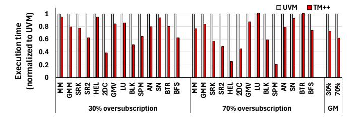
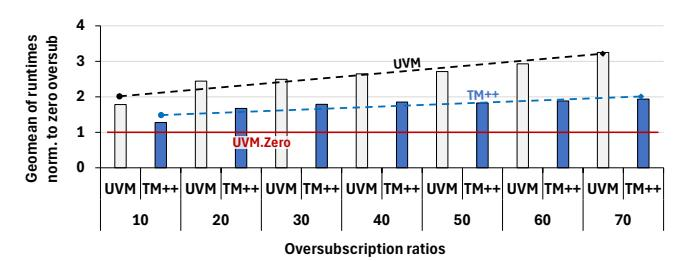
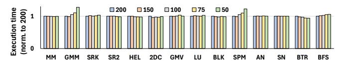

# <span id="page-11-0"></span>*C. Sensitivity Studies*

Sensitivity to oversubscription level: Figure [14](#page-11-3) shows the execution time (y-axis) of UVM and TM++, with two sections along the x-axis for 30% and 70% oversubscription, respectively. We observe significant improvements in execution time with TM++, with an average of 26% and 38% improvements for 30% and 70% oversubscription, respectively. Typically, the improvements of TM++ over UVM increase with increasing oversubscription. In some cases (e.g., GMV, LU), a change in oversubscription level results in a sharp change in memory pressure and access patterns. There, the improvements of TM++ are relatively muted with 70% oversubscription.

Furthermore, Figure [15](#page-11-4) shows the trends in the normalized runtime under TM++ and UVM with increasing memory oversubscription levels. Each bar shows the geometric mean of normalized runtimes of all applications, normalized to UVM with *no* oversubscription, with increasing memory oversubscription from 10 percent to 70 percent (lower is better). The blue bar represents TM++ and the gray bar represents the execution time of UVM. TM++ outperforms UVM by a wide margin under all levels of oversubscription. The improvements increase with increasing oversubscription, as demonstrated by the widening gap between the black and blue trend lines. The

<span id="page-11-3"></span>

Fig. 14: ObservUVM with selected oversubscription levels

<span id="page-11-4"></span>

Fig. 15: ObservUVM with different oversubscription levels

y-axis value of 1 (red trend line, UVM.Zero) shows UVM's performance with *no* (zero) oversubscription, capturing headroom for further improvement.

Sensitivity to the number of samples: Figure [16](#page-12-0) shows the performance of LRU eviction policy with decreasing number of *observable* 2MB regions (along x-axis). Decreasing the number of observable 2MB regions has little effect on most applications, as we only need to track a few critical regions. However, GMM and SPM suffer significantly. In these applications, with fewer access counters, observable regions get evicted before they get a chance to be accessed.

Increasing the number of 64KB samples per 2MB region also has little impact on most applications. Figure [17](#page-12-1) shows the execution time with 75 observable 2MB regions, tracking 1, 2, or 3 64KB pages per 2MB region. As expected, applications show high locality as discussed in [III-A,](#page-3-1) and do not see benefits from sampling more pages per region.

## VIII. DISCUSSION

#### *A. Extendability to Multi-GPU Systems*

ObservUVM is a first step towards enabling observabilitydriven eviction and prefetching policies under memory oversubscription. While its current focus is on single-GPU systems, the core challenge of the UVM driver being blind to the GPU's accesses to the HBM remains for multi-GPU systems. Further, ObservUVM's core idea of re-purposing access counters for observability is also applicable in multi-GPU systems.

Extending ObservUVM to multi-GPU systems brings new challenges, though. The access counters track peer-to-peer accesses in addition to PCIe accesses to DRAM. ObservUVM must differentiate between accesses over PCIe to DRAM and to peer GPUs' HBM. Newer generation GPUs allow monitoring specific parts of the virtual address space, making the necessary enhancements achievable.

<span id="page-12-0"></span>

Fig. 16: Sensitivity to number of observable regions

<span id="page-12-1"></span>

Fig. 17: Sensitivity to number of samples per region

## *B. Applicability to CPU-GPU Systems*

Even in tightly integrated CPU-GPU systems with highspeed cache-coherent interconnects, such as the GH200 [\[55\]](#page-16-3), the UVM driver running on the CPU manages the GPUattached HBM. The CPU and GPU have different types of physical memory attached – slower LPDDR on the CPU and fast HBM on the GPU. While the fast, cache-coherent interconnect reduces overheads, the difference in bandwidth between the CPU DRAM and GPU HBM is still high. Managing the HBM capacity well is essential to maximize utilization and eviction policy still remains an important aspect of UVM. Thus, the core idea of observability remains relevant in such systems. To the best of our knowledge, access counters in GH200 GPUs function similarly, tracking accesses to pages resident in the DRAM. Thus, it is possible for ObservUVM to enable observability as it does on the evaluated system.

### *C. ObservUVM with Different Page Sizes*

ObservUVM builds upon UVM for seamlessly speeding up UVM applications today while avoiding bespoke hardware modifications. Consequently, ObservUVM relies on the region and page sizes (2MB and 64KB respectively) that UVM exposes. That said, the idea of sampled observability by repurposing the access counter is *not* tied to any region or page sizes. Being a software-only technique, ObservUVM can easily adopt other page or region sizes exposed by UVM.

#### IX. RELATED WORK

A large body of works have studied the overheads of migration in UVM and tried to mitigate them. Gayathri et al. [\[20\]](#page-14-3), Chien et al. [\[11\]](#page-14-2), and Tyler and Ge [\[4\]](#page-14-0), [\[5\]](#page-14-1), analyzed the costs and benefits of demand paging and prefetching in UVM. Agarwal et al. [\[3\]](#page-14-6), [\[2\]](#page-14-5) used profiling for page placement in UVM. Mosaic [\[6\]](#page-14-17) used many page sizes to improve memory transfer overheads. Li et al. [\[37\]](#page-15-18) and SUV [\[52\]](#page-15-19) leverage high-level access information from static analysis for memory management. Kim et al. [\[32\]](#page-15-20) optimized page fault batch size and enabled eager eviction to reduce UVM overheads. Helm [\[28\]](#page-15-21) introduces novel locality metrics to guide data placement under UVM. Ariadne [\[56\]](#page-16-4) utilize dynamic pagesharing information to perform data placement under UVM. SwapAdvisor [\[25\]](#page-15-22), Capuchin [\[51\]](#page-15-23), Sentinel [\[54\]](#page-15-24) and DeepUM [\[29\]](#page-15-25), optimize DNN training under UVM with profiling. G10 [\[64\]](#page-16-5) performed automatic tensor migration between HBM, DRAM, and disk. DynaMap [\[9\]](#page-14-7) migrated hot pages in graph workloads using instrumentation. Go et al. [\[22\]](#page-15-3) improved prefetching with page fault history. None of these techniques enable observability into GPU's accesses to improve eviction or prefetching policies on UVM.

A recent work, Forest [\[39\]](#page-15-26), proposed new hardware for observing accesses to HBM to improve UVM policies. Unlike ObservUVM, Forest requires significant new hardware and source code analysis – both of which impede practical adoption. Moreover, Forest was evaluated on small memory footprints (average 60MB), likely masking the need to track a significantly larger number of regions. Importantly, Forest does not enable the flexibility of customizing eviction policies, whereas ObservUVM allows users to build custom eviction and prefetching policies in the userspace.

Many works have proposed hardware modifications to improve UVM. ETC [\[36\]](#page-15-7) improved UVM with pre-eviction, throttling, and compression. HPE [\[63\]](#page-16-6) and CHPE [\[62\]](#page-16-7) propose hardware counters to help with prefetching and page eviction. Zheng et al. [\[65\]](#page-16-0) describe hardware and software techniques to improve UVM's performance. Ganguly et al. [\[19\]](#page-14-8) proposed improved access counters for better page migration. Ganguly et al. [\[17\]](#page-14-18) [\[18\]](#page-14-4) improved migration/prefetching with new hardware. GRIT [\[60\]](#page-16-8) IDYLL [\[34\]](#page-15-27), and Trans-FW [\[35\]](#page-15-28) propose hardware techniques to improve multi-GPU UVM. Unlike these, ObservUVM requires no hardware changes. While UVM has been studied extensively in the past, ObservUVM opens new possibilities with observability and flexibility for custom eviction and prefetching policies on real systems.

Access bits have existed on CPUs since 1960s [\[21\]](#page-15-29). Several works propose policies to exploit them better [\[13\]](#page-14-19), [\[40\]](#page-15-30), [\[41\]](#page-15-31), [\[61\]](#page-16-9). Memtis [\[33\]](#page-15-32), TMTS [\[13\]](#page-14-19), and HeMem [\[53\]](#page-15-33) used hardware sampling (e.g., AMD IBS [\[1\]](#page-14-9)) for tiered memory management while Memstrata [\[66\]](#page-16-10) and M5 [\[59\]](#page-16-11) exploit CXL's access tracking features. These works exploit purpose-built tracking hardware, a luxury unavailable to ObservUVM.

## X. CONCLUSION

ObservUVM empowers UVM with observability into the GPU's accesses to the HBM without hardware modifications, thereby enabling better-informed eviction and prefetching policies. Its clean separation of policy and mechanism simplifies the development of custom policies and enables rapid exploration of *what-if* scenarios. We demonstrate policies that improve performance of UVM-based applications by 34%. We believe that ObservUVM has the potential to accelerate future research on UVM policies.

## XI. ACKNOWLEDGMENT

We thank anonymous reviewers for the constructive feedback. Pratheek was partially supported by the Intel India Ph.D. Fellowship. This work is partially supported by generous research grants from AMD, Microsoft, and Google.

#### APPENDIX

#### *A. Abstract*

This artifact contains the source code for ObservUVM framework, various eviction/prefetching policies, and the workloads used to evaluate them.

ObservUVM is a framework for creating eviction/prefetching policies for UVM that utilizes the power of sampled observability by repurposing existing access counters. It consists of a modified UVM driver and a userspace component. The userspace component exposes APIs to implement different eviction/prefetching policies. We have implemented Least Recently Used, Least Frequently Used, and Cyclic Protection eviction policies, the Tournament meta policy, an intra-2MB prefetching policy called Feedback Driven Prefetching, and an aggressive Region Grain Prefetching policy. We evaluate these policies over a wide range of workloads, under various memory oversubscription levels.

The artifact includes the source code for the userspace component, the modified UVM driver and the aforementioned eviction and prefetching policies. We have pre-compiled binaries for different workload configurations for ease of running. The default scripts use these binaries. We also include the source code to generate the binaries.

We maintain the most updated code and additional scripts at [https://github.com/csl-iisc/ObservUVM.](https://github.com/csl-iisc/ObservUVM) Please use GitHub to discuss or raise any issues.

#### *B. Artifact Check-list (meta-information)*

- Algorithm: Eviction policies (page replacement policies)
- Program: UVM driver, GPU workloads
- Run-time environment: Linux 6.2, libbpf
- Hardware: NVIDIA 3090, AMD Ryzen 9 7950X
- Metrics: Execution time, GPU page faults, evictions
- Experiments: Comparison of different eviction/prefetching policies
- How much disk space required (approximately)?: 20 GB
- How much time is needed to prepare workflow (approximately)?: 2 hours
- How much time is needed to complete experiments (approximately)?: 24 hours
- Publicly available?: Yes.
- Workflow automation framework used?: No
- Archived (provide DOI)?: https://doi.org/10.5281/zenodo.19428841

#### *C. Description*

*1) How to access:* Please download the artifact from the Zenodo link here [https://zenodo.org/records/19428841.](https://zenodo.org/records/19428841) Please extract the file aeisca26.tar.gz to an appropriate location.

- <sup>1</sup> tar xvf aeisca26.tar.gz
- *2) Hardware dependencies:*
- NVIDIA 3090 GPU (24GB)
- AMD Ryzen 9 7950X
- 64GB DRAM recommended (32 GB minimum)

- *3) Software dependencies:*
- Linux 6.2
- libbpf
- make
- gcc
- clang
- *4) Data sets:* All required data sets are included.
- *5) Models:* None.

## *D. Installation*

[Optional] Install the CUDA 11.8 from NVIDIA's download page or from your distribution's repository.

#### *E. Experiment Workflow*

*1) Prerequisites:* Root access is necessary to run the userspace, primarily for running eBPF programs. The scripts assume the user can run sudo. Set up password-less sudo for ease of running experiments. For e.g., if your username is username, then run the following.

```
1 sudo visudo -f /etc/sudoers.d/username
2 username ALL=(ALL) NOPASSWD: ALL
```

*2) Compile the drivers:* Compile the baseline driver and ObservUVM driver with the following commands. It should generate several kernel objects, including nvidia.ko, base-driver.ko, super-driver.ko. We will compile the drivers only once, but use these drivers in the next steps.

```
1 cd driver;
2 bash compile_drivers.sh
3 cd ..
```

Modify the following files driver\_change\_base.sh, driver\_change\_ac.sh, driver\_change\_ea.sh, driver\_change\_super.sh, to point the DPATH variable to the driver folder using your editor. Assuming the artifact is extracted at isca26ae in your home folder, then the DPATH will be as follows:

```
1 DPATH=/home/username/isca26ae/driver
```

*3) Compile the userspace:* Next, compile the userspace component using the following commands.

```
1 cd userspace;
2 bash compile_userspace.sh
3 bash gen_configs.sh
4 cd ..
```

*4) Setup workloads:* Generate the input for bfs.

```
1 cd workloads/bfs
2 cd inputGen
3 make
4 bash gen_dataset.sh
5 cp graph16M.txt ..
6 cp graph16M.txt ../..
```

*5) Run workload under key configurations:* Run the following script to run all the workloads under configurations necessary for reproducing the key figures (9, 10, 11, 12, and 13).

```
1 bash run_key.sh
```

*6) Generating figures:* Run the script for the appropriate figure. These scripts will generate .csv files that may be used to generate the final plots.

```
1 bash fig9.sh
2 bash fig10.sh
3 bash fig11.sh
4 bash fig12.sh
5 bash fig13.sh
```

Copy the output .csv to the provided Excel file (Graphs.xlsx) to the appropriate sheet (Figure number) which is pre-populated with the formulas to generate the graphs.

## *F. Evaluation and Expected Results*

The key figures in the paper are as follows:

Figure [9](#page-10-1) compares the performance of baseline UVM with ObservUVM with various policies. It shows the execution time (lower is better) normalized against baseline UVM.

Figure [10](#page-10-2) compares different eviction policies (with prefetching disabled). It shows different policies being preferred by different workloads, and that the Tournament meta policy performs as well as the best performing alternative among the different policies.

Figure [11](#page-10-3) shows the number of evictions corresponding to different policies (without prefetching).

Figure [12](#page-11-1) shows the number of page faults corresponding to different prefetching policies.

Figure [13](#page-11-2) compares ObservUVM with alternatives.

#### *G. More Results*

Figure 14 can be reproduced easily by running

```
1 bash fig14.sh
```

Other graphs can be reproduced by suitably modifying the configuration flags.

#### *H. Experiment Customization*

To create new eviction (or prefetching) policies, please add a new directory and create appropriate .cpp and .h files. Eviction policies inherit from the EvictionPolicy base class, and must implement all the key functionality (i.e., all the virtual functions in the base class). Intra-2MB prefetching policies inherit from the ShallowPrefetch base class and inter-2MB prefetching policies from DeepPrefetch.

## REFERENCES

- <span id="page-14-9"></span>[1] Advanced Micro Devices, Inc., *BIOS and Kernel Developer's Guide (BKDG) for AMD Family 15h Models 00h–0Fh Processors*, 2022, revision 3.14. [Online]. Available: [https://www.amd.com/content/dam/](https://www.amd.com/content/dam/amd/en/documents/developer/uprof-v4.0-gaGA-user-guide.pdf) [amd/en/documents/developer/uprof-v4.0-gaGA-user-guide.pdf](https://www.amd.com/content/dam/amd/en/documents/developer/uprof-v4.0-gaGA-user-guide.pdf)
- <span id="page-14-5"></span>[2] N. Agarwal, D. Nellans, M. O'Connor, S. W. Keckler, and T. F. Wenisch, "Unlocking bandwidth for gpus in cc-numa systems," in *2015 IEEE 21st International Symposium on High Performance Computer Architecture (HPCA)*, 2015, pp. 354–365.
- <span id="page-14-6"></span>[3] N. Agarwal, D. Nellans, M. Stephenson, M. O'Connor, and S. W. Keckler, "Page placement strategies for gpus within heterogeneous memory systems," in *Proceedings of the Twentieth International Conference on Architectural Support for Programming Languages and Operating Systems*, ser. ASPLOS '15. New York, NY, USA: Association for Computing Machinery, 2015, p. 607–618. [Online]. Available:<https://doi.org/10.1145/2694344.2694381>

- <span id="page-14-0"></span>[4] T. Allen and R. Ge, "Demystifying gpu uvm cost with deep runtime and workload analysis," in *2021 IEEE International Parallel and Distributed Processing Symposium (IPDPS)*, 2021, pp. 141–150.
- <span id="page-14-1"></span>[5] T. Allen and R. Ge, "In-depth analyses of unified virtual memory system for gpu accelerated computing," in *Proceedings of the International Conference for High Performance Computing, Networking, Storage and Analysis*, ser. SC '21. New York, NY, USA: Association for Computing Machinery, 2021. [Online]. Available: <https://doi.org/10.1145/3458817.3480855>
- <span id="page-14-17"></span>[6] R. Ausavarungnirun, J. Landgraf, V. Miller, S. Ghose, J. Gandhi, C. J. Rossbach, and O. Mutlu, "Mosaic: A gpu memory manager with application-transparent support for multiple page sizes," in *Proceedings of the 50th Annual IEEE/ACM International Symposium on Microarchitecture*, ser. MICRO-50 '17. New York, NY, USA: Association for Computing Machinery, 2017, p. 136–150. [Online]. Available:<https://doi.org/10.1145/3123939.3123975>
- <span id="page-14-15"></span>[7] M. A. Awad, S. Ashkiani, R. Johnson, M. Farach-Colton, and J. D. Owens, "Engineering a high-performance gpu b-tree," in *Proceedings of the 24th Symposium on Principles and Practice of Parallel Programming*, ser. PPoPP '19. New York, NY, USA: Association for Computing Machinery, 2019, p. 145–157. [Online]. Available: <https://doi.org/10.1145/3293883.3295706>
- <span id="page-14-14"></span>[8] G. Ayers, H. Litz, C. Kozyrakis, and P. Ranganathan, "Classifying memory access patterns for prefetching," in *Proceedings of the Twenty-Fifth International Conference on Architectural Support for Programming Languages and Operating Systems*, ser. ASPLOS '20. New York, NY, USA: Association for Computing Machinery, 2020, p. 513–526. [Online]. Available:<https://doi.org/10.1145/3373376.3378498>
- <span id="page-14-7"></span>[9] C.-H. Chang, A. Kumar, and A. Sivasubramaniam, "To move or not to move? page migration for irregular applications in over-subscribed gpu memory systems with dynamap," in *Proceedings of the 14th ACM International Conference on Systems and Storage*, ser. SYSTOR '21. New York, NY, USA: Association for Computing Machinery, 2021. [Online]. Available:<https://doi.org/10.1145/3456727.3463766>
- <span id="page-14-16"></span>[10] S. Che, M. Boyer, J. Meng, D. Tarjan, J. W. Sheaffer, S.-H. Lee, and K. Skadron, "Rodinia: A benchmark suite for heterogeneous computing," in *2009 IEEE International Symposium on Workload Characterization (IISWC)*, 2009, pp. 44–54.
- <span id="page-14-2"></span>[11] S. Chien, I. Peng, and S. Markidis, "Performance evaluation of advanced features in cuda unified memory," in *2019 IEEE/ACM Workshop on Memory Centric High Performance Computing (MCHPC)*, 2019, pp. 50–57.
- <span id="page-14-11"></span>[12] L. community, "Using linux kernel tracepoints," 2024. [Online]. Available:<https://docs.kernel.org/trace/tracepoints.html>
- <span id="page-14-19"></span>[13] P. Duraisamy, W. Xu, S. Hare, R. Rajwar, D. Culler, Z. Xu, J. Fan, C. Kennelly, B. McCloskey, D. Mijailovic, B. Morris, C. Mukherjee, J. Ren, G. Thelen, P. Turner, C. Villavieja, P. Ranganathan, and A. Vahdat, "Towards an adaptable systems architecture for memory tiering at warehouse-scale," in *Proceedings of the 28th ACM International Conference on Architectural Support for Programming Languages and Operating Systems, Volume 3*, ser. ASPLOS 2023. New York, NY, USA: Association for Computing Machinery, 2023, p. 727–741. [Online]. Available:<https://doi.org/10.1145/3582016.3582031>
- <span id="page-14-13"></span>[14] eBPF community, "Bpf kernel functions (kfuncs)," 2024. [Online]. Available:<https://docs.kernel.org/bpf/kfuncs.html>
- <span id="page-14-10"></span>[15] eBPF community, "ebpf," 2024. [Online]. Available: [https://docs.kernel.](https://docs.kernel.org/bpf/index.html) [org/bpf/index.html](https://docs.kernel.org/bpf/index.html)
- <span id="page-14-12"></span>[16] eBPF community, "ebpf maps," 2024. [Online]. Available: [https:](https://docs.kernel.org/bpf/maps.html) [//docs.kernel.org/bpf/maps.html](https://docs.kernel.org/bpf/maps.html)
- <span id="page-14-18"></span>[17] D. Ganguly, R. Melhem, and J. Yang, "An adaptive framework for oversubscription management in cpu-gpu unified memory," in *2021 Design, Automation and Test in Europe Conference and Exhibition (DATE)*, 2021, pp. 1212–1217.
- <span id="page-14-4"></span>[18] D. Ganguly, Z. Zhang, J. Yang, and R. Melhem, "Interplay between hardware prefetcher and page eviction policy in cpu-gpu unified virtual memory," in *2019 ACM/IEEE 46th Annual International Symposium on Computer Architecture (ISCA)*, 2019, pp. 224–235.
- <span id="page-14-8"></span>[19] D. Ganguly, Z. Zhang, J. Yang, and R. Melhem, "Adaptive page migration for irregular data-intensive applications under gpu memory oversubscription," in *2020 IEEE International Parallel and Distributed Processing Symposium (IPDPS)*, 2020, pp. 451–461.
- <span id="page-14-3"></span>[20] R. Gayatri, K. Gott, and J. Deslippe, "Comparing managed memory and ats with and without prefetching on nvidia volta gpus," in *2019*

- *IEEE/ACM Performance Modeling, Benchmarking and Simulation of High Performance Computer Systems (PMBS)*, 2019, pp. 41–46.
- <span id="page-15-29"></span>[21] C. T. Gibson, "Time-sharing in the ibm system/360: model 67," in *Proceedings of the April 26-28, 1966, Spring Joint Computer Conference*, ser. AFIPS '66 (Spring). New York, NY, USA: Association for Computing Machinery, 1966, p. 61–78. [Online]. Available:<https://doi.org/10.1145/1464182.1464190>
- <span id="page-15-3"></span>[22] S. Go, H. Lee, J. Kim, J. Lee, M. K. Yoon, and W. W. Ro, "Earlyadaptor: An adaptive framework for proactive uvm memory management," in *2023 IEEE International Symposium on Performance Analysis of Systems and Software (ISPASS)*, 2023, pp. 248–258.
- <span id="page-15-1"></span>[23] M. Harris, "Unified memory for cuda beginners," [https://developer.](https://developer.nvidia.com/blog/unified-memory-cuda-beginners/) [nvidia.com/blog/unified-memory-cuda-beginners/,](https://developer.nvidia.com/blog/unified-memory-cuda-beginners/) 2017.
- <span id="page-15-9"></span>[24] J. L. Hennessy and D. A. Patterson, *Computer Architecture: A Quantitative Approach*, 6th ed. Morgan Kaufmann, 2017.
- <span id="page-15-22"></span>[25] C.-C. Huang, G. Jin, and J. Li, "Swapadvisor: Pushing deep learning beyond the gpu memory limit via smart swapping," in *Proceedings of the Twenty-Fifth International Conference on Architectural Support for Programming Languages and Operating Systems*, ser. ASPLOS '20. New York, NY, USA: Association for Computing Machinery, 2020, p. 1341–1355. [Online]. Available: <https://doi.org/10.1145/3373376.3378530>
- <span id="page-15-10"></span>[26] JEDEC, "High bandwidth memory (hbm) dram," 2021. [Online]. Available:<https://www.jedec.org/standards-documents/docs/jesd235a>
- <span id="page-15-15"></span>[27] Z. Jin and J. S. Vetter, "A benchmark suite for improving performance portability of the sycl programming model," in *2023 IEEE International Symposium on Performance Analysis of Systems and Software (ISPASS)*, 2023, pp. 325–327.
- <span id="page-15-21"></span>[28] N. Jones, T. Allen, and R. Ge, "Helm: Characterizing unified memory accesses to improve gpu performance under memory oversubscription," in *Proceedings of the International Conference for High Performance Computing, Networking, Storage and Analysis*, ser. SC '25. New York, NY, USA: Association for Computing Machinery, 2025, p. 490–504. [Online]. Available:<https://doi.org/10.1145/3712285.3759812>
- <span id="page-15-25"></span>[29] J. Jung, J. Kim, and J. Lee, "Deepum: Tensor migration and prefetching in unified memory," in *Proceedings of the 28th ACM International Conference on Architectural Support for Programming Languages and Operating Systems, Volume 2*, ser. ASPLOS 2023. New York, NY, USA: Association for Computing Machinery, 2023, p. 207–221. [Online]. Available:<https://doi.org/10.1145/3575693.3575736>
- <span id="page-15-16"></span>[30] A. Karki, C. P. Keshava, S. M. Shivakumar, J. Skow, G. M. Hegde, and H. Jeon, "Detailed characterization of deep neural networks on gpus and fpgas," in *Proceedings of the 12th Workshop on General Purpose Processing Using GPUs*, ser. GPGPU '19. New York, NY, USA: Association for Computing Machinery, 2019, p. 12–21. [Online]. Available:<https://doi.org/10.1145/3300053.3319418>
- <span id="page-15-2"></span>[31] H. Kim, J. Sim, P. Gera, R. Hadidi, and H. Kim, *Batch-Aware Unified Memory Management in GPUs for Irregular Workloads*. New York, NY, USA: Association for Computing Machinery, 2020, p. 1357–1370. [Online]. Available:<https://doi.org/10.1145/3373376.3378529>
- <span id="page-15-20"></span>[32] H. Kim, J. Sim, P. Gera, R. Hadidi, and H. Kim, "Batch-aware unified memory management in gpus for irregular workloads," in *Proceedings of the Twenty-Fifth International Conference on Architectural Support for Programming Languages and Operating Systems*, ser. ASPLOS '20. New York, NY, USA: Association for Computing Machinery, 2020, p. 1357–1370. [Online]. Available: <https://doi.org/10.1145/3373376.3378529>
- <span id="page-15-32"></span>[33] T. Lee, S. K. Monga, C. Min, and Y. I. Eom, "Memtis: Efficient memory tiering with dynamic page classification and page size determination," in *Proceedings of the 29th Symposium on Operating Systems Principles*, ser. SOSP '23. New York, NY, USA: Association for Computing Machinery, 2023, p. 17–34. [Online]. Available: <https://doi.org/10.1145/3600006.3613167>
- <span id="page-15-27"></span>[34] B. Li, Y. Guo, Y. Wang, A. Jaleel, J. Yang, and X. Tang, "Idyll: Enhancing page translation in multi-gpus via light weight pte invalidations," in *Proceedings of the 56th Annual IEEE/ACM International Symposium on Microarchitecture*, ser. MICRO '23. New York, NY, USA: Association for Computing Machinery, 2023, p. 1163–1177. [Online]. Available: [https://doi.org/10.1145/3613424.](https://doi.org/10.1145/3613424.3614269) [3614269](https://doi.org/10.1145/3613424.3614269)
- <span id="page-15-28"></span>[35] B. Li, J. Yin, A. Holey, Y. Zhang, J. Yang, and X. Tang, "Trans-fw: Short circuiting page table walk in multi-gpu systems via remote forwarding," in *2023 IEEE International Symposium on High-Performance Computer Architecture (HPCA)*, 2023, pp. 456–470.

- <span id="page-15-7"></span>[36] C. Li, R. Ausavarungnirun, C. J. Rossbach, Y. Zhang, O. Mutlu, Y. Guo, and J. Yang, "A framework for memory oversubscription management in graphics processing units," in *Proceedings of the Twenty-Fourth International Conference on Architectural Support for Programming Languages and Operating Systems*, ser. ASPLOS '19. New York, NY, USA: Association for Computing Machinery, 2019, p. 49–63. [Online]. Available:<https://doi.org/10.1145/3297858.3304044>
- <span id="page-15-18"></span>[37] L. Li and B. Chapman, "Compiler assisted hybrid implicit and explicit gpu memory management under unified address space," in *Proceedings of the International Conference for High Performance Computing, Networking, Storage and Analysis*, ser. SC '19. New York, NY, USA: Association for Computing Machinery, 2019. [Online]. Available: <https://doi.org/10.1145/3295500.3356141>
- <span id="page-15-13"></span>[38] libbpf community, "libbpf," 2024. [Online]. Available: [https://docs.](https://docs.kernel.org/bpf/libbpf/libbpf_overview.html) [kernel.org/bpf/libbpf/libbpf](https://docs.kernel.org/bpf/libbpf/libbpf_overview.html) overview.html
- <span id="page-15-26"></span>[39] M. Lin, Y. Feng, G. Cox, and H. Jeon, "Forest: Access-aware gpu uvm management," in *Proceedings of the 52nd Annual International Symposium on Computer Architecture*, ser. ISCA '25. New York, NY, USA: Association for Computing Machinery, 2025, p. 137–152. [Online]. Available:<https://doi.org/10.1145/3695053.3731047>
- <span id="page-15-30"></span>[40] A. Maruf, A. Ghosh, J. Bhimani, D. Campello, A. Rudoff, and R. Rangaswami, "Multi-clock: Dynamic tiering for hybrid memory systems," in *2022 IEEE International Symposium on High-Performance Computer Architecture (HPCA)*, 2022, pp. 925–937.
- <span id="page-15-31"></span>[41] H. A. Maruf, H. Wang, A. Dhanotia, J. Weiner, N. Agarwal, P. Bhattacharya, C. Petersen, M. Chowdhury, S. Kanaujia, and P. Chauhan, "Tpp: Transparent page placement for cxl-enabled tieredmemory," in *Proceedings of the 28th ACM International Conference on Architectural Support for Programming Languages and Operating Systems, Volume 3*, ser. ASPLOS 2023. New York, NY, USA: Association for Computing Machinery, 2023, p. 742–755. [Online]. Available:<https://doi.org/10.1145/3582016.3582063>
- <span id="page-15-0"></span>[42] NVIDIA, "Nvidia tesla v100 gpu architecture," [https://images.nvidia.](https://images.nvidia.com/content/volta-architecture/pdf/volta-architecture-whitepaper.pdf) [com/content/volta-architecture/pdf/volta-architecture-whitepaper.pdf,](https://images.nvidia.com/content/volta-architecture/pdf/volta-architecture-whitepaper.pdf) 2018.
- <span id="page-15-12"></span>[43] Nvidia, "Nvidia pascal mmu," 2019, [https://nvidia.github.io/](https://nvidia.github.io/open-gpu-doc/pascal/gp100-mmu-format.pdf) [open-gpu-doc/pascal/gp100-mmu-format.pdf.](https://nvidia.github.io/open-gpu-doc/pascal/gp100-mmu-format.pdf)
- <span id="page-15-4"></span>[44] NVIDIA, "open-gpu-kernel-modules," [https://github.com/NVIDIA/](https://github.com/NVIDIA/open-gpu-kernel-modules/tree/main) [open-gpu-kernel-modules/tree/main,](https://github.com/NVIDIA/open-gpu-kernel-modules/tree/main) 2023.
- <span id="page-15-5"></span>[45] NVIDIA, "open-gpu-kernel-modules," [https://github.com/NVIDIA/](https://github.com/NVIDIA/open-gpu-kernel-modules/blob/main/kernel-open/nvidia-uvm/uvm_gpu_access_counters.c) [open-gpu-kernel-modules/blob/main/kernel-open/nvidia-uvm/uvm](https://github.com/NVIDIA/open-gpu-kernel-modules/blob/main/kernel-open/nvidia-uvm/uvm_gpu_access_counters.c) gpu access [counters.c,](https://github.com/NVIDIA/open-gpu-kernel-modules/blob/main/kernel-open/nvidia-uvm/uvm_gpu_access_counters.c) 2023.
- <span id="page-15-11"></span>[46] NVIDIA, "open-gpu-kernel-modules," [https://github.com/NVIDIA/](https://github.com/NVIDIA/open-gpu-kernel-modules/blob/main/kernel-open/nvidia-uvm/uvm_perf_prefetch.c) [open-gpu-kernel-modules/blob/main/kernel-open/nvidia-uvm/uvm](https://github.com/NVIDIA/open-gpu-kernel-modules/blob/main/kernel-open/nvidia-uvm/uvm_perf_prefetch.c) perf [prefetch.c,](https://github.com/NVIDIA/open-gpu-kernel-modules/blob/main/kernel-open/nvidia-uvm/uvm_perf_prefetch.c) 2023.
- <span id="page-15-6"></span>[47] NVIDIA, "open-gpu-kernel-modules, v525," [https://github.com/](https://github.com/NVIDIA/open-gpu-kernel-modules/tree/525) [NVIDIA/open-gpu-kernel-modules/tree/525,](https://github.com/NVIDIA/open-gpu-kernel-modules/tree/525) 2023.
- <span id="page-15-17"></span>[48] NVIDIA, "Cuda toolkit documentation," 2025. [Online]. Available: [https://docs.nvidia.com/cuda/cuda-runtime-api/group](https://docs.nvidia.com/cuda/cuda-runtime-api/group__CUDART__MEMORY.html) CUDART [MEMORY.html](https://docs.nvidia.com/cuda/cuda-runtime-api/group__CUDART__MEMORY.html)
- <span id="page-15-8"></span>[49] NVIDIA, "Nvidia cuda library samples," 2025. [Online]. Available: <https://github.com/NVIDIA/CUDALibrarySamples>
- <span id="page-15-14"></span>[50] NVIDIA, "Nvidia cuda library samples," 2025. [Online]. Available: <https://github.com/NVIDIA/cuda-samples>
- <span id="page-15-23"></span>[51] X. Peng, X. Shi, H. Dai, H. Jin, W. Ma, Q. Xiong, F. Yang, and X. Qian, "Capuchin: Tensor-based gpu memory management for deep learning," in *Proceedings of the Twenty-Fifth International Conference on Architectural Support for Programming Languages and Operating Systems*, ser. ASPLOS '20. New York, NY, USA: Association for Computing Machinery, 2020, p. 891–905. [Online]. Available: <https://doi.org/10.1145/3373376.3378505>
- <span id="page-15-19"></span>[52] B. Pratheek, G. Cox, J. Vesely, and A. Basu, "Suv: Static analysis guided unified virtual memory," in *2024 57th IEEE/ACM International Symposium on Microarchitecture (MICRO)*, 2024, pp. 293–308.
- <span id="page-15-33"></span>[53] A. Raybuck, T. Stamler, W. Zhang, M. Erez, and S. Peter, "Hemem: Scalable tiered memory management for big data applications and real nvm," in *Proceedings of the ACM SIGOPS 28th Symposium on Operating Systems Principles*, ser. SOSP '21. New York, NY, USA: Association for Computing Machinery, 2021, p. 392–407. [Online]. Available:<https://doi.org/10.1145/3477132.3483550>
- <span id="page-15-24"></span>[54] J. Ren, J. Luo, K. Wu, M. Zhang, H. Jeon, and D. Li, "Sentinel: Efficient tensor migration and allocation on heterogeneous memory systems for deep learning," in *2021 IEEE International Symposium on High-Performance Computer Architecture (HPCA)*, 2021, pp. 598–611.

- <span id="page-16-3"></span>[55] G. Schieffer, J. Wahlgren, J. Ren, J. Faj, and I. Peng, "Harnessing integrated cpu-gpu system memory for hpc: a first look into grace hopper," in *Proceedings of the 53rd International Conference on Parallel Processing*, ser. ICPP '24. New York, NY, USA: Association for Computing Machinery, 2024, p. 199–209. [Online]. Available: <https://doi.org/10.1145/3673038.3673110>
- <span id="page-16-4"></span>[56] H. Shin, S. Bang, H. Park, and D. Kim, "Ariadne: Adaptive uvm management for efficient gpu memory oversubscription," in *2026 IEEE International Symposium on High Performance Computer Architecture (HPCA)*, 2026, pp. 1–15.
- <span id="page-16-1"></span>[57] A. Smith, "Sequential program prefetching in memory hierarchies," *Computer*, vol. 11, no. 12, pp. 7–21, 1978.
- <span id="page-16-2"></span>[58] O. STARLAB, "Uvm benchmark," 2025. [Online]. Available: [https:](https://github.com/OSU-STARLAB/UVM_benchmark) [//github.com/OSU-STARLAB/UVM](https://github.com/OSU-STARLAB/UVM_benchmark) benchmark
- <span id="page-16-11"></span>[59] Y. Sun, J. Kim, Z. Yu, J. Zhang, S. Chai, M. J. Kim, H. Nam, J. Park, E. Na, Y. Yuan, R. Wang, J. H. Ahn, T. Xu, and N. S. Kim, "M5: Mastering page migration and memory management for cxl-based tiered memory systems," in *Proceedings of the 30th ACM International Conference on Architectural Support for Programming Languages and Operating Systems, Volume 2*, ser. ASPLOS '25. New York, NY, USA: Association for Computing Machinery, 2025, p. 604–621. [Online]. Available:<https://doi.org/10.1145/3676641.3711999>
- <span id="page-16-8"></span>[60] Y. Wang, B. Li, A. Jaleel, J. Yang, and X. Tang, "Grit: Enhancing multi-gpu performance with fine-grained dynamic page placement," in *2024 IEEE International Symposium on High-Performance Computer Architecture (HPCA)*, 2024, pp. 1080–1094.
- <span id="page-16-9"></span>[61] Z. Yan, D. Lustig, D. Nellans, and A. Bhattacharjee, "Nimble page management for tiered memory systems," in *Proceedings of the Twenty-Fourth International Conference on Architectural Support for Programming Languages and Operating Systems*, ser. ASPLOS '19. New York, NY, USA: Association for Computing Machinery, 2019, p. 331–345. [Online]. Available:<https://doi.org/10.1145/3297858.3304024>

- <span id="page-16-7"></span>[62] Q. Yu, B. Childers, L. Huang, C. Qian, H. Guo, and Z. Wang, "Coordinated page prefetch and eviction for memory oversubscription management in gpus," in *2020 IEEE International Parallel and Distributed Processing Symposium (IPDPS)*, 2020, pp. 472–482.
- <span id="page-16-6"></span>[63] Q. Yu, B. Childers, L. Huang, C. Qian, and Z. Wang, "Hierarchical page eviction policy for unified memory in gpus," in *2019 IEEE International Symposium on Performance Analysis of Systems and Software (ISPASS)*, 2019, pp. 149–150.
- <span id="page-16-5"></span>[64] H. Zhang, Y. Zhou, Y. Xue, Y. Liu, and J. Huang, "G10: Enabling an efficient unified gpu memory and storage architecture with smart tensor migrations," in *Proceedings of the 56th Annual IEEE/ACM International Symposium on Microarchitecture*, ser. MICRO '23. New York, NY, USA: Association for Computing Machinery, 2023, p. 395–410. [Online]. Available:<https://doi.org/10.1145/3613424.3614309>
- <span id="page-16-0"></span>[65] T. Zheng, D. Nellans, A. Zulfiqar, M. Stephenson, and S. W. Keckler, "Towards high performance paged memory for gpus," in *2016 IEEE International Symposium on High Performance Computer Architecture (HPCA)*, 2016, pp. 345–357.
- <span id="page-16-10"></span>[66] Y. Zhong, D. S. Berger, C. Waldspurger, R. Wee, I. Agarwal, R. Agarwal, F. Hady, K. Kumar, M. D. Hill, M. Chowdhury, and A. Cidon, "Managing memory tiers with cxl in virtualized environments," in *Proceedings of the 18th USENIX Conference on Operating Systems Design and Implementation*, ser. OSDI'24. USA: USENIX Association, 2024.