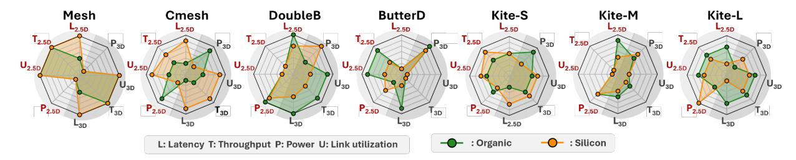
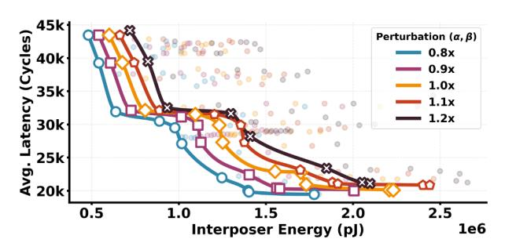
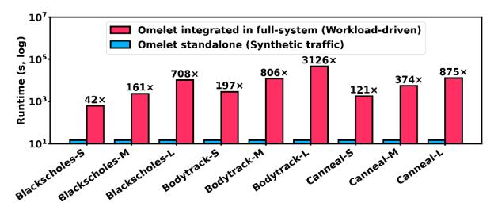

# ▶ Bonding Technology Impact.

Fig. 11 illustrates how bonding technology reshapes latency–load behavior. As bonding pitch decreases, we increase off-chip bandwidth through wider interposer-facing links and router datapath depths. However, this scaling also enlarges the width disparity between on-chip NoC ports and interposer-based NoI links.

In a 2.5D system, all cross-chiplet traffic traverses a chiplet–interposer boundary through a PHY-facing adapter layer. When the NoI link is significantly wider than the NoC injection width, packets must be aggregated and packetized before transmission and de-aggregated upon reception. This boundary conversion introduces additional pipeline and buffering overhead. Under low offered load, queueing is negligible and these fixed adaptation costs dominate, leading higher-density bonding to exhibit higher zero-load latency despite greater physical bandwidth.

As load increases, traffic accumulates at boundary routers. Although wider NoI links raise peak escape bandwidth, they do not proportionally increase NoC injection bandwidth or internal distribution capacity. Cross-chiplet flows therefore concentrate at boundary interfaces, generating localized queue buildup. The additional physical bandwidth becomes effective only once traffic levels are sufficient to utilize the wider links. In deep saturation, latency is governed by how quickly congested boundary links can serve queued packets. Higher bandwidth bonding technologies increase this service rate, allowing queues to drain more efficiently and slightly moderating latency growth relative to lower-bandwidth bonding options.

Fig. 12: Die stacking impact on average packet latency and saturation point with µbumps on organic and silicon interposer.

Overall, higher-density bonding increases service capacity but does not guarantee lower latency across all load regimes. When boundary routers are lightly loaded, fixed pipeline and adaptation overhead dominate. When the network is saturated, performance is dictated by the service rate of congested boundary ports. This behavior underscores the need for architecture–packaging co-design to translate physical bandwidth scaling into sustained system-level benefit.

Takeaway 4: Higher-density bonding increases service capacity but does not guarantee lower latency across all traffic regimes due to boundary adaptation overhead.

## *D. 3D Stacking Impacts*

Fig. 12 highlights a system-level bottleneck that can dominate latency in stacked systems. Although 3D stacking provides short, high-bandwidth vertical links within a stack, many practical communication paths still traverse the shared interposer, particularly for tier-to-tier traffic that must cross stacks or access interposer-attached resources (e.g., HBM or centralized I/O controllers). Because these flows are multiplexed onto a limited set of interposer routing channels, interposer links and routers become the throughput-limiting resource. As injection rate increases, this shared-substrate contention drives earlier saturation and higher average latency, even when vertical links are individually fast. Rather than implying stacking is detrimental, the figure exposes where provisioning and routing must be optimized (e.g., interposer bandwidth, path diversity, and traffic placement) to realize 3D stacking's potential under realistic cross-stack traffic.

Takeaway 5: 3D stacking improves direct vertical communication, but system-level latency can be ultimately limited by shared interposer contention under cross-stack traffic.

## VII. DESIGN SPACE EXPLORATION

Using Omelet, we evaluate seven candidate topologies under two integration schemes: 2.5D interposer (grey sectors, subscript "2.5D") and 3D stacking (dark sectors, subscript "3D"). Fig. 13 summarizes four metrics for each configuration: average packet latency (L), peak throughput (T), total power (P), and worst-case link utilization (U). Each radial axis represents a relative, unitless ranking derived from the underlying

Fig. 13: Topology comparison across integration schemes (2.5D/3D) and interposer materials.

numerical results (larger values indicate lower latency/power and higher throughput/utilization). For each metric, an axis level is assigned to only one topology, representing its rank relative to the other evaluated topologies. This visualization highlights that topology performance depends on the integration technology, motivating technology-aware topology selection.

- ▶ Silicon-optimized designs. Silicon interposers provide high wiring density and support fine-pitch links, which improves path diversity and helps distribute traffic under high load. Their drawback is higher interposer-link delay, so performance still depends on keeping communication relatively local. This trend is reflected in Fig. 13: Mesh achieves strong latency and throughput because it can exploit silicon's dense connectivity through many short horizontal paths, while the cost appears in higher power and utilization from activating more links.
- ▶ Organic-optimized designs. Organic interposers offer lower interposer-link delay, which helps baseline latency, but their lower wiring density limits how many parallel links can be provisioned. As a result, the main challenge is not individual link delay but congestion on a smaller communication fabric. Fig. 13 reflects this shift: topologies that rely on broad, uniformly dense connectivity lose part of their advantage, while designs with more selective long-range connectivity, such as DoubleButterfly and the Kite family, become more favorable because they reduce how often packets must traverse many small intermediate links and instead move traffic through a smaller number of hops of direct higher-reach connections.
- ▶ Design insights. The preferred topology changes with both packaging style and interposer material because the communication bottlenecks are different. In 2.5D, all chipletto-chiplet traffic traverses the lateral interposer network, so topology quality is strongly shaped by the interposer's link density and delay.

In 3D, vertical links offload part of inter-chiplet traffic from the lateral interposer network, changing where congestion forms and which connectivity patterns are most effective. As a result, topology optimality is packaging-dependent: a design favored in one technology may no longer remain optimal under a different integration scheme, so DSE must jointly evaluate topology, network, and integration.

## VIII. TOOL FIDELITY VALIDATION

Full end-to-end silicon validation of 2.5D/3D hierarchical systems requires proprietary floorplans, PHY implementations, and packaging parameters that are not publicly accessible.

Fig. 14: RC scaling validation for organic RDL interposers.

Given Omelet's positioning as an early-stage design space exploration tool, we validate fidelity from two complementary perspectives.

First, we establish packaging-level physical grounding by cross-validating our interconnect modeling against published packaging measurements. Second, we perform sensitivity analysis. Early-stage DSE requires architectural decisions under inevitable modeling uncertainty; therefore, robust conclusions should remain stable under reasonable parameter perturbations. Sensitivity analysis evaluates how architectural outcomes (e.g., topology rankings or optimal design points) vary under controlled modeling perturbations.

▶ Packaging-Level Physical Grounding. Omelet uses a technology library built from component-level EM extraction and SPICE-based modeling. This library provides the interchiplet latency, bandwidth, and EPB values used by the simulator. The resulting latency and EPB values are validated against published packaging studies. Extracted resistance, capacitance, and delay scaling behaviors are compared with reported data for silicon and organic interposers. Across technologies, modeled electrical characteristics align with prior reports, with deviations typically within single-digit percentages for latency.

For organic RDL interposers, we reproduce the RC scaling reported by TSMC [51] by configuring identical line/space parameters and material stack assumptions (1 µm Cu thickness, 6 µm polyimide dielectric), as shown in Fig. 14. The resulting RC trends show an average difference of 3.5% across line lengths, with a maximum deviation of 5.7% at 7 mm for 2 µm L/S routing, confirming consistent scaling behavior [18]. Two additional representative silicon interconnect fabric cases from Jangam et al. [18] demonstrate similarly close agreement. For a 100 µm link with 2 µm pitch, we obtain 54.36 ps latency (-2.49%) and 0.287 pJ/bit (-4.33%); for a 500 µm link with 10 µm pitch, we obtain 60.07 ps latency (2.16%) and 0.35 pJ/bit (11.75%).

▶ Architectural Robustness (Sensitivity Analysis).

Fig. 15: Topology ranking robustness under parameter perturbation.

Fig. 16: Latency breakdown under parameter perturbation.

- 1) Rank Robustness: We evaluate four topologies under ±20% latency perturbations across four injection rates. As shown in Fig. 15, the relative ordering remains stable under our 50 ps baseline. However, the same perturbation has larger absolute impact at smaller baselines: at 10 ps, ±20% shifts link delay by only 2 ps but can still push topologies past saturation and alter rankings. Rank stability therefore depends on the absolute latency baseline, reinforcing the need for technology-aware modeling rather than treating it as a free parameter.
- 2) Latency Bottleneck Analysis: In Fig. 16, we analyze latency breakdowns for DoubleButterfly topology. Despite varying the perturbation factor (α) from 0.7× to 1.3×, the dominance of off-chip latency, switch arbitration, and congestion hotspots remains consistent.
- 3) DSE Pareto Stability: We perturb both latency (α) and energy-per-bit (β) from 0.8× to 1.2× to evaluate DSE robustness. As shown in Fig. 17, Pareto frontiers exhibit close to a uniform translation without altering the fundamental knee of the curve or the selection of optimal design points.

#### IX. INTEGRATION OF REAL WORKLOAD AND COMPUTE

Beyond synthetic traffic, Omelet can be driven by real workloads to validate selected design points under realistic

Fig. 17: DSE robustness under parameter perturbation across 394 design points.

Fig. 18: Runtime comparison between Omelet with synthetic traffic and full-system execution with PARSEC benchmarks.

memory and coherence patterns. We integrate Omelet with gem5 Full-System (FS) simulation: the system boots with KVM CPUs and switches to Timing CPUs for detailed execution, and applications are launched through a boot script that runs the selected program and input set, generating coherence and memory traffic through the gem5 memory hierarchy that is injected into the Omelet network. As a case study, we run three PARSEC applications (Blackscholes, Bodytrack, and Canneal) [5] with three input sizes (small, medium, large). Other workloads can be executed in the same manner by modifying the boot script to launch different binaries or input sets, and compute-node parameters (CPU, GPU) are defined in the FS run script and remain independent of Omelet. Fig. 18 compares runtime between standalone Omelet and gem5 FS execution. While FS mode captures workload-driven traffic, it introduces substantial runtime overhead (42× to 3126×). Therefore, synthetic traffic injection is used for early-stage design space exploration, while FS execution is reserved for validating selected design points.

## X. CONCLUSION

As monolithic SoC scaling reaches its limits, chipletbased 2.5D and 3D systems are emerging as promising paths forward, but their performance is tightly coupled to packaging technologies that existing simulators abstract away. We introduced Omelet, a unified NoC–NoI–NoL simulation framework that pairs cycle-level hierarchical communication modeling with link parameters derived from electromagnetic extraction and SPICE-based circuit evaluation. Across seven topologies and multiple packaging configurations, Omelet reveals behaviors that simplified models systematically miss: technology-agnostic and isolated-layer simulation can substantially mispredict latency, optimal topology rankings shift with packaging choice, and per-link efficiency does not reflect network-level energy under traffic. Omelet further enables iterative design-space exploration across interconnect architecture, chiplet placement, and packaging technology, providing a co-design environment for emerging chiplet-based systems.

## ACKNOWLEDGMENT

This work was supported in part by the Qualcomm Innovation Fellowship and NSF under Grant Number 2317251. We thank Ting Zheng and Shane Oh for their advice on EM models.

## REFERENCES

- [1] "FreePDK45 | NC State EDA." [Online]. Available: https://eda.ncsu.edu/freepdk/freepdk45/
- [2] N. Agarwal, T. Krishna, L.-S. Peh, and N. K. Jha, "Garnet: A detailed on-chip network model inside a full-system simulator," in 2009 IEEE international symposium on performance analysis of systems and software. IEEE, 2009, pp. 33–42.
- [3] S. Bharadwaj, J. Yin, B. Beckmann, and T. Krishna, "Kite: A family of heterogeneous interposer topologies enabled via accurate interconnect modeling," in 2020 57th ACM/IEEE Design Automation Conference (DAC). IEEE, 2020, pp. 1–6.
- [4] R. Bhargava and K. Troester, "Amd next-generation "zen 4" core and 4th gen amd epyc server cpus," IEEE Micro, vol. 44, no. 3, pp. 8–17, 2024.
- [5] C. Bienia, S. Kumar, J. P. Singh, and K. Li, "The parsec benchmark suite: Characterization and architectural implications," in Proceedings of the 17th international conference on Parallel architectures and compilation techniques, 2008, pp. 72–81.
- [6] J. Cai, Z. Wu, S. Peng, Y. Wei, Z. Tan, G. Shi, M. Gao, and K. Ma, "Gemini: Mapping and architecture co-exploration for large-scale dnn chiplet accelerators," in 2024 IEEE International Symposium on High-Performance Computer Architecture (HPCA), 2024, pp. 156–171.
- [7] S. Du, L. Zheng, A. M. Parvathy, F. Xie, T. Wei, A. Raghunathan, and H. Li, "3d-cimlet: A chiplet co-design framework for heterogeneous in-memory acceleration of edge llm inference and continual learning," in 2025 62nd ACM/IEEE Design Automation Conference (DAC). IEEE, 2025, pp. 1–7.
- [8] Y. Feng, Y. Wei, D. Xiang, and K. Ma, "Evaluating chiplet-based {Large-Scale} interconnection networks via {Cycle-Accurate}{Packet-Parallel} simulation," in 2024 USENIX Annual Technical Conference (USENIX ATC 24). USENIX, 2024, pp. 731–747.
- [9] W. Gomes, A. Koker, P. Stover, D. Ingerly, S. Siers, S. Venkataraman, C. Pelto, T. Shah, A. Rao, F. O'Mahony, E. Karl, L. Cheney, I. Rajwani, H. Jain, R. Cortez, A. Chandrasekhar, B. Kanthi, and R. Koduri, "Ponte vecchio: A multi-tile 3d stacked processor for exascale computing," in 2022 IEEE International Solid-State Circuits Conference (ISSCC), vol. 65, 2022, pp. 42–44.
- [10] W. Gomes, S. Morgan, B. Phelps, T. Wilson, and E. Hallnor, "Meteor lake and arrow lake intel next-gen 3d client architecture platform with foveros," in 2022 IEEE Hot Chips 34 Symposium (HCS), 2022, pp. 1–40.
- [11] L. Gwennap, "Fd-soi offers alternative to finfet," Posted at https://www. globalfoundries. com/sites/default/files/fd-soi-offers-alternative-tofinfet. pdf, 2016.
- [12] S. Hou, W. C. Chen, C. Hu, C. Chiu, K. Ting, T. Lin, W. Wei, W. Chiou, V. J. Lin, V. C. Chang et al., "Wafer-level integration of an advanced logic-memory system through the second-generation cowos technology," IEEE Transactions on Electron Devices, vol. 64, no. 10, pp. 4071–4077, 2017.
- [13] P. Iff, B. Bruggmann, M. Besta, L. Benini, and T. Hoefler, "Rapidchiplet: A toolchain for rapid design space exploration of chiplet architectures," arXiv preprint arXiv:2311.06081, 2023.
- [14] ——, "Placeit: Placement-based inter-chiplet interconnect topologies," 2025, arXiv preprint. [Online]. Available: https://arxiv.org/abs/2502.01449
- [15] Intel, "Foveros Direct 3D Technology Brief," https://www.intel.com/ content/dam/www/central-libraries/us/en/documents/2025-11/foverosdirect-3d-tech-brief.pdf, 2025, accessed: 2026-03-06.
- [16] C.-H. Jan, M. Agostinelli, M. Buehler, Z.-P. Chen, S.-J. Choi, G. Curello, H. Deshpande, S. Gannavaram, W. Hafez, U. Jalan et al., "A 32nm soc platform technology with 2 nd generation high-k/metal gate transistors optimized for ultra low power, high performance, and high density product applications," in 2009 IEEE International Electron Devices Meeting (IEDM). IEEE, 2009, pp. 1–4.
- [17] C.-H. Jan, U. Bhattacharya, R. Brain, S.-J. Choi, G. Curello, G. Gupta, W. Hafez, M. Jang, M. Kang, K. Komeyli et al., "A 22nm soc platform technology featuring 3-d tri-gate and high-k/metal gate, optimized for ultra low power, high performance and high density soc applications," in 2012 International Electron Devices Meeting. IEEE, 2012, pp. 3–1.
- [18] S. Jangam, S. Pal, A. Bajwa, S. Pamarti, P. Gupta, and S. S. Iyer, "Latency, Bandwidth and Power Benefits of the SuperCHIPS Integration Scheme," in 2017 IEEE 67th Electronic Components and Technology Conference (ECTC), May 2017, pp. 86–94, iSSN: 2377-5726. [Online]. Available: https://ieeexplore.ieee.org/document/7999676/

- [19] N. E. Jerger, A. Kannan, Z. Li, and G. H. Loh, "Noc architectures for silicon interposer systems: Why pay for more wires when you can get them (from your interposer) for free?" in 2014 47th Annual IEEE/ACM International Symposium on Microarchitecture. IEEE, 2014, pp. 458–470.
- [20] A. Kannan, N. E. Jerger, and G. H. Loh, "Enabling interposer-based disintegration of multi-core processors," in Proceedings of the 48th international symposium on Microarchitecture, 2015, pp. 546–558.
- [21] J. Kim, G. Murali, H. Park, E. Qin, H. Kwon, V. Chaitanya, K. Chekuri, N. Dasari, A. Singh, M. Lee et al., "Architecture, chip, and package co-design flow for 2.5 d ic design enabling heterogeneous ip reuse," in Proceedings of the 56th Annual Design Automation Conference 2019, 2019, pp. 1–6.
- [22] P. R. Kinget, "Scaling analog circuits into deep nanoscale cmos: Obstacles and ways to overcome them," in 2015 IEEE Custom Integrated Circuits Conference (CICC). IEEE, 2015, pp. 1–8.
- [23] C.-T. Ko and K.-N. Chen, "Wafer-level bonding/stacking technology for 3d integration," Microelectronics reliability, vol. 50, no. 4, pp. 481–488, 2010.
- [24] G. Krishnan, S. K. Mandal, M. Pannala, C. Chakrabarti, J.-S. Seo, U. Y. Ogras, and Y. Cao, "Siam: Chiplet-based scalable in-memory acceleration with mesh for deep neural networks," ACM Transactions on Embedded Computing Systems (TECS), vol. 20, no. 5s, pp. 1–24, 2021.
- [25] J. H. Lau, "Recent Advances and Trends in Advanced Packaging," IEEE Transactions on Components, Packaging and Manufacturing Technology, vol. 12, no. 2, pp. 228–252, Feb. 2022, conference Name: IEEE Transactions on Components, Packaging and Manufacturing Technology. [Online]. Available: https://ieeexplore.ieee.org/document/9684894/?arnumber=9684894
- [26] ——, "State of the art of cu–cu hybrid bonding," IEEE Transactions on Components, Packaging and Manufacturing Technology, vol. 14, no. 3, pp. 376–396, 2024.
- [27] S. Li, M.-S. Lin, W.-C. Chen, and C.-C. Tsai, "High-bandwidth chiplet interconnects for advanced packaging technologies in ai/ml applications: Challenges and solutions," IEEE Open Journal of the Solid-State Circuits Society, vol. 4, pp. 351–364, 2024.
- [28] T. Li, J. Hou, J. Yan, R. Liu, H. Yang, and Z. Sun, "Chiplet heterogeneous integration technology—status and challenges," Electronics, vol. 9, no. 4, p. 670, 2020.
- [29] F. Liu, P. Nimbalkar, N. Aslani-Amoli, M. Kathaperumal, R. Tummala, and M. Swaminathan, "A critical review of lithography methodologies and impacts of topography on 2.5-d/3-d interposers," IEEE Transactions on Components, Packaging and Manufacturing Technology, vol. 13, no. 3, pp. 291–299, 2023.
- [30] J. Lowe-Power, A. M. Ahmad, A. Akram, M. Alian, R. Amslinger, M. Andreozzi, A. Armejach, N. Asmussen, B. Beckmann, S. Bharadwaj et al., "The gem5 simulator: Version 20.0+," arXiv preprint arXiv:2007.03152, 2020.
- [31] R. Mahajan, R. Sankman, N. Patel, D.-W. Kim, K. Aygun, Z. Qian, Y. Mekonnen, I. Salama, S. Sharan, D. Iyengar, and D. Mallik, "Embedded multi-die interconnect bridge (emib) – a high density, high bandwidth packaging interconnect," in 2016 IEEE 66th Electronic Components and Technology Conference (ECTC), 2016, pp. 557–565.
- [32] C. S. Mandalapu, C. Buch, P. Shah, R. Topacio, P. Cheng, L. Wang, R. Swaminathan, A. Smith, J. Wuu, K. Mysore, and A. Alam, "3.5D Advanced Packaging Enabling Heterogenous Integration of HPC and AI Accelerators," in 2024 IEEE 74th Electronic Components and Technology Conference (ECTC), May 2024, pp. 798–802, iSSN: 2377-5726. [Online]. Available: https://ieeexplore.ieee.org/document/10564877/?arnumber=10564877
- [33] M. Min and S. Kadivar, "Accelerating innovations in the new era of hpc, 5g and networking with advanced 3d packaging technologies," in 2020 International Wafer Level Packaging Conference (IWLPC). IEEE, 2020, pp. 1–6.
- [34] S. Naffziger, N. Beck, T. Burd, K. Lepak, G. H. Loh, M. Subramony, and S. White, "Pioneering Chiplet Technology and Design for the AMD EPYC™ and Ryzen™ Processor Families : Industrial Product," in 2021 ACM/IEEE 48th Annual International Symposium on Computer Architecture (ISCA), Jun. 2021, pp. 57–70, iSSN: 2575-713X. [Online]. Available: https://ieeexplore.ieee.org/document/9499852/?arnumber=9499852
- [35] N. Nassif, A. O. Munch, C. L. Molnar, G. Pasdast, S. V. Lyer, Z. Yang, O. Mendoza, M. Huddart, S. Venkataraman, S. Kandula, R. Marom, A. M. Kern, B. Bowhill, D. R. Mulvihill, S. Nimmagadda, V. Kalidindi,

- J. Krause, M. M. Haq, R. Sharma, and K. Duda, "Sapphire rapids: The next-generation intel xeon scalable processor," in 2022 IEEE International Solid-State Circuits Conference (ISSCC), vol. 65, 2022, pp. 44–46.
- [36] M. Orenes-Vera, E. Tureci, M. Martonosi, and D. Wentzlaff, "Muchisim: A simulation framework for design exploration of multi-chip manycore systems," in 2024 IEEE International Symposium on Performance Analysis of Systems and Software (ISPASS). IEEE, 2024, pp. 48–60.
- [37] H. Park, J. Kim, V. C. K. Chekuri, M. A. Dolatsara, M. Nabeel, A. Bojesomo, S. Patnaik, O. Sinanoglu, M. Swaminathan, S. Mukhopadhyay, J. Knechtel, and S. K. Lim, "Design Flow for Active Interposer-Based 2.5-D ICs and Study of RISC-V Architecture With Secure NoC," IEEE Transactions on Components, Packaging and Manufacturing Technology, vol. 10, no. 12, pp. 2047–2060, Dec. 2020, conference Name: IEEE Transactions on Components, Packaging and Manufacturing Technology. [Online]. Available: https://ieeexplore.ieee.org/document/9235512
- [38] J. M. Rabaey, A. Chandrakasan, and B. Nikolic, Digital integrated circuits. Prentice hall Englewood Cliffs, 2002, vol. 2.
- [39] R. Radojcic, More-than-Moore 2.5D and 3D SiP Integration. Cham: Springer International Publishing, 2017. [Online]. Available: http://link.springer.com/10.1007/978-3-319-52548-8
- [40] Reuters, "Nvidia CEO Says Its Advanced Packaging Technology Needs Are Changing," https://www.reuters.com/technology/nvidia-ceo-saysits-advanced-packaging-technology-needs-are-changing-2025-01-16/, 2025, accessed: 2026-03-06.
- [41] K. Sahoo, V. Harish, H. Ren, and S. S. Iyer, "A review of die-to-die, die-to-substrate and die-to-wafer heterogeneous integration," IEEE Electron Devices Reviews, vol. 2, pp. 6–31, 2025.
- [42] A. Smith, G. H. Loh, S. Naffziger, J. Wuu, N. Kalyanasundharam, E. Chapman, R. Swaminathan, T. Huang, W. Jung, A. Kaganov et al., "Interconnect design for heterogeneous integration of chiplets in the amd instinct mi300x accelerator," IEEE Micro, vol. 45, no. 1, pp. 57–66, 2024.
- [43] A. Smith, G. H. Loh, M. J. Schulte, M. Ignatowski, S. Naffziger, M. Mantor, M. F. N. Kalyanasundharam, V. Alla, N. Malaya, J. L. Greathouse, E. Chapman, and R. Swaminathan, "Realizing the amd exascale heterogeneous processor vision : Industry product," in 2024 ACM/IEEE 51st Annual International Symposium on Computer Architecture (ISCA), 2024, pp. 876–889.
- [44] C.-F. Tseng, C.-S. Liu, C.-H. Wu, and D. Yu, "Info (wafer level integrated fan-out) technology," in 2016 IEEE 66th Electronic Components and Technology Conference (ECTC). IEEE, 2016, pp. 1–6.
- [45] TSMC, "CoWoS®: Chip-on-Wafer-on-Substrate," https://3dfabric.tsmc. com/english/dedicatedFoundry/technology/cowos.htm, 2024, accessed: 2026-03-06.
- [46] A. Usman, E. Shah, N. B. Satishprasad, J. Chen, S. A. Bohlemann, S. H. Shami, A. A. Eftekhar, and A. Adibi, "Interposer Technologies for High-Performance Applications," IEEE Transactions on Components, Packaging and Manufacturing Technology, vol. 7, no. 6, pp. 819–828, Jun. 2017. [Online]. Available: https://ieeexplore.ieee.org/abstract/document/7883901
- [47] P. Vanna-Iampikul, S. Woo, S. Erdogan, L. Zhu, M. Kathaperumal, R. Agarwal, R. Gupta, K. Rinebold, M. Swaminathan, and S. K. Lim, "Glass interposer integration of logic and memory chiplets: Ppa and power/signal integrity benefits," IEEE Transactions on Computer-Aided Design of Integrated Circuits and Systems, 2024.
- [48] P. Vanna-Iampikul, L. Zhu, S. Erdogan, M. Kathaperumal, R. Agarwal, R. Gupta, K. Rinebold, and S. K. Lim, "Glass Interposer Integration of Logic and Memory Chiplets: PPA and Power/Signal Integrity Benefits," in 2023 60th ACM/IEEE Design Automation Conference (DAC), Jul. 2023, pp. 1–6. [Online]. Available: https://ieeexplore.ieee.org/document/10247949/?arnumber=10247949
- [49] Z. Wang, P. S. Nalla, J. Sun, A. A. Goksoy, S. K. Mandal, J.-s. Seo, V. A. Chhabria, J. Zhang, C. Chakrabarti, U. Y. Ogras et al., "Hisim: Analytical performance modeling and design space exploration of 2.5 d/3d integration for ai computing," IEEE Transactions on Computer-Aided Design of Integrated Circuits and Systems, 2025.
- [50] J. Wuu, R. Agarwal, M. Ciraula, C. Dietz, B. Johnson, D. Johnson, R. Schreiber, R. Swaminathan, W. Walker, and S. Naffziger, "3d v-cache: the implementation of a hybrid-bonded 64mb stacked cache for a 7nm x86-64 cpu," in 2022 IEEE International Solid-State Circuits Conference (ISSCC), vol. 65. IEEE, 2022, pp. 428–429.

- [51] K. Yan, Y.-H. Hu, C.-H. Lee, H.-Y. Chen, M.-S. Liu, E. Chen, M. Yew, C. Hsu, S.-P. Jeng, and J. He, "Fine pitch high density cowos-r package with 1.4/1.4 um rdl lines and 3um via cd," in 2025 IEEE 75th Electronic Components and Technology Conference (ECTC). IEEE, 2025, pp. 246–250.
- [52] J. Yin, Z. Lin, O. Kayiran, M. Poremba, M. S. B. Altaf, N. E. Jerger, and G. H. Loh, "Modular routing design for chiplet-based systems," in 2018 ACM/IEEE 45th Annual International Symposium on Computer Architecture (ISCA). IEEE, 2018, pp. 726–738.
- [53] D. C. H. Yu, C.-T. Wang, and H. Hsia, "Foundry Perspectives on 2.5D/3D Integration and Roadmap," in 2021 IEEE International Electron Devices Meeting (IEDM), Dec. 2021, pp. 3.7.1–3.7.4, iSSN: 2156-017X. [Online]. Available: https://ieeexplore.ieee.org/document/9720568/?arnumber=9720568
- [54] Y. Zhang, X. Zhang, and M. S. Bakir, "Benchmarking Digital Die-to-Die Channels in 2.5-D and 3-D Heterogeneous Integration Platforms," IEEE Transactions on Electron Devices, vol. 65, no. 12, pp. 5460–5467, Dec. 2018, conference Name: IEEE Transactions on Electron Devices. [Online]. Available: https://ieeexplore.ieee.org/document/8525345
- [55] T. Zheng and M. S. Bakir, "Benchmarking Frequency-Dependent Parasitics of Fine-Pitch Off-Chip I/Os for 2.5D and 3D Heterogeneous Integration," IEEE Transactions on Components, Packaging and Manufacturing Technology, vol. 12, no. 12, pp. 2002–2012, Dec. 2022, conference Name: IEEE Transactions on Components, Packaging and Manufacturing Technology.