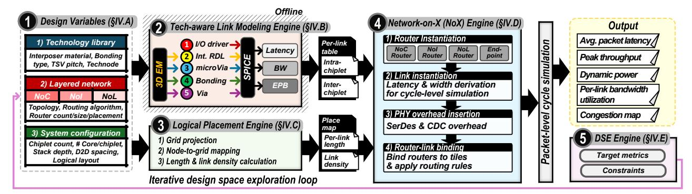
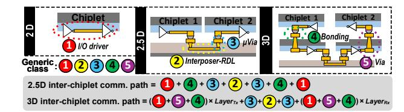
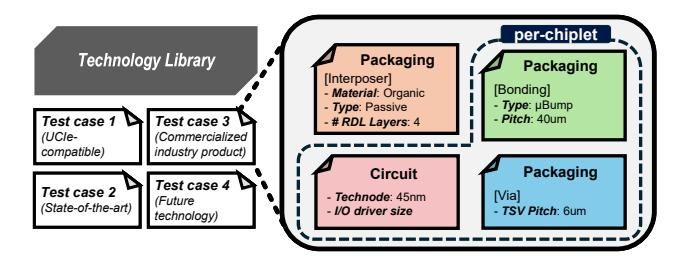
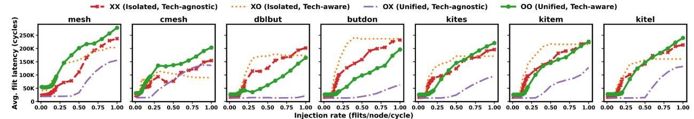
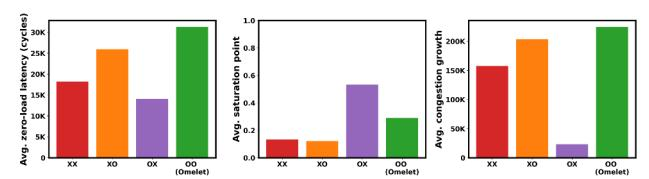

# ▶ Bridging System-Level and Physical Link Modeling

Packaging-level tools such as electromagnetic (EM) solvers provide high-fidelity modeling of interconnect structures, capturing parasitics and signal integrity, but require full 3D geometry and incur hours to days per configuration. In contrast, system-level simulators enable architectural exploration but lack physically grounded link models. This disconnect necessitates a unified framework that captures hierarchical communication across NoC, NoI, and NoL domains while incorporating technology-dependent link characteristics derived from physical interconnect structures, enabling scalable exploration of architectural and integration choices without resorting to full physical simulation. Such integration allows designers to evaluate how packaging technologies and chiplet organization jointly shape system-level performance and bottlenecks.

- ▶ Our Contribution To address these limitations, Omelet introduces the following advances aligned with L1–L3:
- C1) Unified Hierarchical Network Modeling. Omelet models NoC, NoI, and NoL communication within a single cycle-level framework that captures cross-layer interactions and boundary effects in heterogeneous interconnect hierarchies.
- C2) Physically-Derived Technology Input. Users specify the target integration technology, and Omelet retrieves corresponding link parameters from a pre-characterized technology table derived from electromagnetic extraction and circuit-level

evaluation. This ensures that latency, bandwidth, and energy reflect realistic packaging constraints without manual tuning.

- C3) Component-Based Die-to-Die Link Modeling. Omelet models die-to-die communication as a sequence of physical components, including I/O driver, interposer RDLs, bonding technologies, and TSVs, rather than a single abstract link. This enables accurate representation of heterogeneous link behavior beyond simple distance-based scaling.
- C4) Cross-Stack System Analysis. By combining technology-aware link modeling with a unified interconnect hierarchy, Omelet enables analysis of congestion, latency, and bottleneck formation arising from interactions across communication domains, supporting architecture–packaging co-design.

#### II. BACKGROUND AND RELATED WORK

#### *A. Background*

- ▶ Off-Chip Interconnect Modeling. In monolithic SoCs, interconnect delay and energy are tightly coupled to a complex RTL-to-GDSII place-and-route (PnR) [21]. In contrast, offchip interconnects in 2.5D/3D systems are governed primarily by packaging technology. Chiplet locations, bump maps, and RDL stack parameters are fixed early, producing simple and repeatable routing patterns. This allows off-chip link latency and energy to be estimated from packaging parameters. However, because interposer wires can span millimeter-scale distances, exhibiting strong frequency- and return path-dependent behavior, accurate characterization requires full-wave 3D electromagnetic analysis. The key challenge in off-chip interconnect modeling is therefore to develop a compact link abstraction replicating full EM analysis that can be integrated into architectural simulators for large-scale design exploration.
- ▶ Chiplet-to-chiplet Conversion Overhead. On-chip and off-chip interconnects differ fundamentally in how they transmit data and realize bandwidth and latency. On-chip communication exploits short reach, dense metal stacks, and tightly synchronized clocking to construct wide datapaths, enabling low-latency and highly deterministic transfer. Offchip interconnects, in contrast, traverse package-level routing with longer reach and constraints due to wiring density and bump pitch. Although off-chip links can achieve high aggregate bandwidth through high-speed signaling or parallel aggregation of lanes, such bandwidth conversion from on-chip to off-chip is architecturally expensive and depends on explicit PHY and interface protocols. Consequently, off-chip latency is dominated not only by physical propagation but also by boundary overheads arising from clock-domain crossing, data reformatting, and protocol translation. These conversions introduce nontrivial latency and throughput penalties, reducing the effective benefits of chiplet-to-chiplet communication.

## *B. Related Work*

Fig. 2 illustrates common modeling shortcuts in prior chiplet frameworks: (a) letting the user specify raw latency/bandwidth numbers and assigning a single analytical formula or constant

| on_chip_latency = 1 (a) off_chip_latency = 2 * length | Comm. latency = NoC latency + NoI latency                                                           | (b) |
|-------------------------------------------------------|-----------------------------------------------------------------------------------------------------|-----|
| on_chip_bandwidth = 1 off_chip_bandwidth = 2          | <pre>hop_latency("noc", 2mm) = 1 hop_latency("noi", 0.5 mm) = 1 hop_latency("noi", 15 mm) = 1</pre> | (c) |

Fig. 2: Oversimplified chiplet-interconnect assumptions used in prior simulators.

for all off-chip latency and bandwidth, (b) computing end-toend delay as a post hoc sum of separately modeled NoC, NoI, and NoL latencies, and (c) using distance-agnostic or coarse hop costs (e.g., a 0.5 mm and 15 mm interposer hop both costing one cycle). Table I summarizes how recent chiplet and interconnect simulators map onto our limitations L1–L3.

- ▶ Analytical 2.5D/3D Frameworks. Several frameworks target fast exploration of 2.5D/3D chiplet designs using analytical rather than unified cycle-level simulation. RapidChiplet [13], 3D-CIMlet [7], Gemini [6], and HISIM [49] estimate interchiplet latency and throughput from closed-form models, trading accuracy for speed. HISIM captures TSV and wire RC but omits the driver and bonding technology, so the modeled link is incomplete and end-to-end behavior is invariant to bonding choice. All four tools treat on-chip and off-chip networks as separate domains and combine their delays post hoc (L1), rely on hand-tuned constants or parameters assembled from inconsistent sources (L2), and abstract dieto-die as a single link rather than a chain of components (L3).
- ▶ Cycle-Level Network Interconnect Simulators. Other frameworks focus on cycle-level, network-based communication modeling. Kite [3] extends Garnet [2] with on-interposer routers; CNSim [8] provides packet-parallel modeling for large multi-chip systems, and simulates interchiplet communication as direct PHY-bridged extensions of the NoC rather than a separately-routed NoI. SIAM [24] runs cycle-level NoC and network on package (NoP) simulations individually but composes them by summing latencies. These tools are limited to 2.5D NoC-NoI or direct off-chip links and do not extend to vertical NoL communication (L1), rely on hand-tuned constants or parameters drawn from disparate sources that mix incompatible physical assumptions (L2), and despite targeting 2.5D systems, model off-chip links as uniform abstractions without packaging-aware decomposition into driver, wire, via, and bonding (L3).

## III. OMELET OVERVIEW

This section provides an overview of Omelet's key components, and the detailed implementations will be introduced in the next section. As illustrated in Fig. 3, Omelet operates in a 5-stage end-to-end flow that tightly integrates configuration, modeling, simulation, and exploration.

➊ Input Configurations (§IV-A). The flow begins with structured input configurations describing the system organization, communication hierarchy, and integration technology. Rather than requiring users to manually provide latency, bandwidth, or energy values, Omelet maps these inputs to precharacterized technology entries to obtain the corresponding link parameters.

Fig. 3: End-to-end flow of Omelet.

- **2** Technology-Aware Link Modeling (§IV-B, §IV-A1). Omelet integrates a packaging-aware link modeling engine built on pre-extracted electrical parameters from detailed physical modeling. We first obtain RC parasitics for RDL/interposer traces, vias, and bonding tiers using HFSS-based 3D electromagnetic simulation. These parasitics are then incorporated into SPICE circuit models to evaluate link latency, bandwidth, and energy-per-bit. The resulting characterization is organized into a technology lookup table that is accessed during architectural simulation, enabling technology-aware interconnect behavior.
- **❸** Logical Placement (§IV-C). The Placement Engine maps chiplets and interposers onto a logical grid. Omelet supports both user-defined and automated placement. The resulting placement map encodes spatial relationships such as interchiplet distances and overlap regions, which are directly used in calculating achievable bandwidth.
- **4** Hierarchical Network Construction and Cycle-level Simulation (§IV-D). Using the modeled links and spatial placement, the Network-on-X (NoX) Engine constructs the hierarchical interconnect across the NoC, NoI, and NoL layers. It instantiates routers for each network tier, connects them to system nodes (e.g., cores, caches) through network interfaces, and establishes directional router-to-router links according to the selected topology and placement. When communication crosses hierarchy boundaries, the engine inserts adapters to handle differences in link characteristics. The resulting router-level network is simulated at cycle level to capture routing, buffering, and contention across the heterogeneous hierarchy.
- **6** Design Space Exploration (§IV-E). Omelet supports iterative design space exploration (DSE) and co-optimization across interconnect architecture, chiplet placement, and packaging technology, based on targeting metrics or constraints users set.

#### IV. OMELET IMPLEMENTATION

#### A. Input Design Variables

Omelet exposes three categories of input variables for chiplet system exploration: (1) technology library parameters describing integration technologies, (2) network configuration specifying the communication hierarchy, and (3) system configuration defining chiplet organization. These inputs

Fig. 4: Generic components in possible communication paths.

determine link properties, network connectivity, and spatial placement in the modeled multi-chiplet system.

- 1) Technology Library: The technology library defines technology-dependent parameters that determine the physical characteristics and performance of chiplet interconnect links. At a high level, the library specifies two integration link categories that serve as guardrails for constructing physically realizable signal paths: lateral interposer-based links and vertical stacked links. Rather than treating a chiplet-to-chiplet connection as an abstract channel defined only by latency, bandwidth, or energy, Omelet constructs each link as a sequence of compatible physical components forming a complete electrical path from transmitter to receiver. A link becomes fully defined only after a compatible set of components is assembled into a continuous signal path. The following paragraphs describe the component building blocks used to construct these links.
- ▶ Component-Based Link Construction Modern packaging platforms support diverse integration styles, including 2.5D interposers, 3D stacking, and hybrid 3.5D systems that combine both. Despite this diversity, surveys of commercial and academic designs [25], [32], [34], [37], [39], [48], [53] show that chiplet links are consistently composed of a small set of physical elements such as drivers, redistribution layers, vertical transitions such as  $\mu$ vias or TSVs, and a bonding technology. An end-to-end electrical path between transmitter and receiver can therefore be represented as an ordered combination of these elements, as illustrated in Fig. 4.

Motivated by this structural commonality, Omelet represents off-chip links as ordered chains of these components rather than as a single "advanced package link" abstraction. The user selects a set of components, which are chained as SPICE elements and simulated offline to derive link parameters, with compatibility constraints enforced between

TABLE II: Technology Library of Omelet

| Scope        | Parameters        | Omelet Ingredients                                                           |  |  |
|--------------|-------------------|------------------------------------------------------------------------------|--|--|
| Architecture | Structure         | chiplet count, stacking depth, #cores/chiplet, D2D distance, keepout zone |  |  |
|              |                   | Network Config. topology, routing algorithm, router size & placement         |  |  |
|              | Interconnect Path | 2.5D (interposer, silicon bridge), 3D (F2F/F2B)                              |  |  |
|              | Layout            | logical chiplet placement, chiplet size                                      |  |  |
| Packaging    | Bonding Tiers     | solder balls, µbump, Cu-Cu TCB, hybrid bonding                               |  |  |
|              | Interposer Core   | silicon, organic                                                             |  |  |
|              | RDL Materials     | Cu/oxide, Cu/polyimide                                                       |  |  |
|              | Vias              | TSV, µvia                                                                    |  |  |
|              | Wiring            | GSG Lines                                                                    |  |  |
|              | Line Length       | 0.1 - 5 mm                                                                   |  |  |

adjacent components to ensure physically valid structures. This formulation also improves extensibility: new packaging technologies can be incorporated by adding component options.

▶ Interconnect Technology Scope Table II summarizes the packaging and interconnect options currently supported by the technology library as selectable components. These options span a range of vertical and lateral integration technologies, including high-density silicon interposers and mature organic interposers [46], as well as bonding approaches ranging from conventional solder-based techniques to advanced hybrid bonding. This range enables exploration of I/O pitch scaling from approximately 1 µm to 50 µm [55]. For each supported configuration, the library specifies key technology parameters such as bump pitch, wire pitch, the number of RDL layers, bonding-tier infill materials, and TSV geometry (including pitch and aspect ratio).

The technology library captures packaging parameter ranges representative of recent commercial systems and academic studies. For 2.5D integration, Omelet supports RDL dimensions from 0.8 µm line/space used in TSMC CoWoS-S (5th Gen, 2021) to 2.0 µm line/space used in CoWoS-L/R deployed in accelerator platforms such as the NVIDIA Blackwell B200 (2024–2025) [40], [45]. The framework also supports forward-looking scaling to 0.5 µm and 1.4 µm RDL dimensions explored in recent packaging studies [27], [51]. For bonding technologies, the library spans solder balls and µbumps (> 30 µm pitch) used in early chiplet integrations to micron-scale hybrid bonding demonstrated in recent work [41] [26]. Intermediate regimes are supported, including < 10 µm Cu–Cu hybrid bonding reported for Intel Foveros Direct 3D (2021), used in Panther Lake CPUs (2025) [15]. These parameter ranges allow Omelet to represent both current production technologies and emerging integration trends.

▶ I/O driver and electrostatic discharge (ESD) support. Omelet integrates circuit-level models for chiplet I/O drivers and receivers, as well as ESD circuit terminations, which are known to have non-negligible impact on link latency [47]. While the technology library includes driver resistance and capacitance for each process node, the current study focuses on the 45 nm node available through FreePDK45TM due to community familiarity [1]. The impact of technology node is especially critical in high-density 2.5D/3D systems,

Fig. 5: Configuration interface and shipped test cases.

where transistor characteristics significantly influence signal propagation speed [16], [17].

- ▶ Configuration and test cases. Packaging inputs can be specified with a dual interface to support both architecturedriven studies and packaging-oriented exploration.
- Architecture studies: the predefined technology options or packaged presets, illustrated in Fig. 5, provide representative parameter combinations that reflect integration styles. These presets allow architectural exploration without requiring detailed packaging expertise while maintaining consistency with realistic technology configurations.
- Packaging studies: users may directly provide numerical parameters to evaluate emerging technologies, enabling forward-looking design exploration. Omelet enforces guardrail constraints to ensure physically valid configurations by checking technology compatibility (e.g., preventing hybrid bonding with organic interposers).

#### *B. Technology-Aware Link Modeling Engine*

- *1) Packaging-Aware Modeling:* To enable accurate interconnect latency and power modeling, this study with Omelet incorporates a component-level RC parasitic extraction framework based on full-wave 3D electromagnetic simulation using Ansys HFSS. Each interconnect element (e.g., RDL, vias, bonding tiers) is modeled as a parameterized 3D structure3 , and RC values are extracted over the typical digital operating range of 0.1–7 GHz. The extraction is repeated across different pitches while preserving realistic aspect ratios and design rules [55]. Because EM simulation is computationally expensive, this characterization is performed offline. The resulting parasitics are compiled into a technology table indexed by interconnect type, material, pitch, and frequency, which Omelet retrieves to generate SPICE-based link files.
- *2) Technology-aware RC latency model:* We adopt an Elmore delay model for interconnect latency estimation. All physical elements (detailed in §IV-A1) are looked up in the technology table and cascaded in a SPICE simulator to establish the full link. Length–dependent entries (e.g., interposer wires) scale with the geometric distance and are treated as distributed elements, while lumped elements (bonds, µvias) contribute fixed values.

The link is driven by a super-buffer operating at VDD = 1 V constructed from electrical fan-out of a minimum inverter

3All bonding tiers and vias have a single signal and two adjacent grounds. All wiring layers have a single signal wire, two in-plane ground wires, and ground planes above and below the wires.

Fig. 6: Examples of die-to-die in 2.5D and 3D chiplet systems.

with NMOS width, PMOS width, and NMOS/PMOS channel lengths of 50 nm, 97 nm, and 50 nm, respectively. The number of fan-out stages and the sizing for each stage are determined by obtaining the minimum equal rise and fall delays (< 1 ps difference) [38]. Link latency is determined based on averaging the rise and fall delays once VDD /2 is achieved. The maximum bandwidth of the link is assumed to be BWlink = 6·τ , where τ is the link latency [54]. Lastly, energy-per-bit (EPB) values for each link are obtained by integrating the current-voltage product over one clock cycle. The resulting latency, bandwidth, and EPB values are stored back into the technology library and used across experiments. The models are validated against prior work [18], [54]; detailed validation is presented in Section VIII.

▶ Integration of Emerging Packaging Technologies. New packaging technologies are incorporated in Omelet by adding an entry to the per-link parameter table and referencing it in the configuration file, which defines link parameters such as latency, bandwidth, and energy per bit applied at link instantiation. Fig. 6 illustrates examples covered this way: a passive 2.5D interposer can be extended into a silicon-bridge variant by inserting a µvia surrounded by organic material into the 2.5D chain to emulate traversal through the organic RDL down to the embedded bridge, and 3D vertical paths are composed by chaining bonding components in either F2F or F2B orientation, which differ in whether the TSV traverses the die before or after the bonding interface.

#### *C. Logical Placement Engine*

Since link latency and bandwidth depend on the physical proximity of chiplets and routers, placement must be networkand technology-aware rather than treated as a secondary consideration, as shown in previous work [14]. In Omelet, designers can import custom layouts by specifying logical coordinates for each chiplet. If no placement is provided, Omelet automatically generates one: it parses the NoC/NoI/NoL graph, ranks nodes (chiplet, memory, router) by communication intensity (if available), and applies a force-directed placement algorithm that places nodes with higher communication traffic closer together while enforcing minimum spacing constraints.

▶ Step 1: Grid Projection and Feasibility Check. Omelet first assigns each node to the nearest point on a logical grid that encodes adjacency and prevents overlap, even across heterogeneous die sizes. This logical grid is then scaled using a technology-dependent minimum chiplet spacing parameter to compute physical distances between components. Omelet checks for feasibility under key physical constraints, such as TSV density per mm2 and the maximum span permitted by interposer technologies (e.g., silicon or organic). An error is reported if an unusable configuration is specified (e.g., attempting to span 20 mm using a silicon interposer). Once feasible placement is confirmed, the engine emits a place map that includes both logical and physical coordinates and per-link distances, ready for downstream DSE.

▶ Step 2: Enforcing Beach-Front and Vertical Overlap Constraints. Real chiplet systems often have dies of different sizes, e.g., a large CPU flanked by smaller HBM stacks. This creates imbalanced perimeters ("beach-fronts") and limits how many links can physically fit between dies. Omelet calculates the shared beach-front for each die pair and caps the number of links accordingly. Similarly, in vertical stacking, only the overlapping area allows TSV or hybrid bond formation. These lateral and vertical constraints are passed to the link modeler, which adjusts bandwidth and router size to respect wiring limits.

### *D. Network-on-X (NoX) Engine and Cycle-level Simulation*

Omelet unifies intra-chiplet NoC, interposer-level NoI, and vertical inter-layer connections NoL into a single abstraction called *Network-on-X* (*NoX*). Traffic patterns and physical constraints vary dramatically across a package—lowest-tier chiplets rely on long, high-RC interposer wires, while stacked tiers benefit from short, low-latency vertical vias. To evaluate these heterogeneous networks, the NoX engine transforms physical link data and placement coordinates into a unified, flit-level network graph ready for cycle-level simulation. This transformation occurs through five automated stages:

- 1) System and Node Instantiation. The simulator first instantiates the architectural components participating in communication, e.g., computing nodes, memory components (e.g., cache controllers, memory controllers), and indirect routers. These components are connected to network routers through external links from the network, forming the logical endpoints of the communication fabric. The number, placement, and the role of routers are determined by the user's network configuration of each hierarchy (e.g., NoC, NoI, NoL).
- 2) Placement-Aware Link Construction. Once the nodes and routers are instantiated, Omelet utilizes the userdefined 3D placement map to establish the network topology. By analyzing the grid coordinates (lateral x,y positions and vertical tier index z) of every router pair, the engine determines the physical nature of the required connections. If two connected routers reside on the same tier, the engine assigns a 2.5D lateral link. If they span different tiers, a 3D vertical link is assigned. Omelet computes the physical distance between routers based on chiplet placement and assigns each router-to-router connection a technology label (e.g., on-die wire, interposer RDL, or vertical TSV). This information determines the physical medium used to implement the link and enables the simulator to retrieve the corresponding latency, bandwidth, and energy parameters from the technology library.

- 3) Technology-informed Parameter Conversion. After the physical realization of each connection is determined, Omelet queries the technology library to obtain the corresponding electrical characteristics. These technology entries provide continuous physical quantities such as latency, bandwidth, and energy per bit. Because Omelet operates as a flit-level cycle-level simulator, these physical quantities (e.g., bandwidth (Gb/s), delay (ps), and energy (pJ/bit)) must be translated into architecture-level parameters usable by the simulator. Each link is modeled using three derived quantities: (i) latency in clock cycles ( $t_{cyc}$ ), (ii) link width in flits per cycle (W), and (iii) energy-per-bit  $(E_{bit})$ . The number of physical lanes  $\lambda$  is computed by dividing the available bonding perimeter by the bump or TSV pitch. The data rate per lane  $R_{lane}(\ell)$  is obtained from the pre-characterized technology library indexed by interconnect length  $\ell$ , which accounts for degradation due to RC delay. Given a fixed flit size  $F_{\rm bits} = 128$  bits (16 bytes) and operating clock frequency  $f_{\rm clk}$ , the effective link width in flits per cycle is  $W = \left\lfloor \frac{\lambda \cdot R_{\rm lane}(\ell)}{f_{\rm clk} \cdot F_{\rm bits}} \right\rfloor$ .
- Overhead Insertion. 4) Automated Adapter and Heterogeneous interconnects inherently create bandwidth and frequency mismatches across the network. To ensure cycle-accurate modeling, the NoX engine analyzes the input and output nodes of every router. Whenever a mismatch is detected between distinct technology domains (e.g., moving from a parallel, slow 2.5D interposer to a dense, fast 3D TSV), the engine automatically inserts structural overheads. This includes queuing adapters for PHY transitions, data aggregation/serialization delays (SerDes), and Clock-Domain Crossing (CDC) penalties. The SerDes delay is modeled proportionally to the data rate ratio between the input and output links, while CDC delay is fixed at 1 cycle assumption, following prior work [3]. These penalties are incorporated directly into the effective latency of the link during simulation.
- Synthesis. In the final step before simulation execution, the NoX engine finalizes the microarchitectural details of the network graph. Routers are dimensioned based on the bandwidth of their connected heterogeneous links. Because 2.5D and 3D links exhibit drastically different delay-bandwidth products, buffer depths are automatically sized to prevent starvation on high-latency interposer links while avoiding over-provisioning on short vertical links. Finally, the engine propagates routing constraints, including topology-specific turn restrictions, limitations on vertical transitions between tiers, and rules governing communication between NoC, NoI, and NoL layers.

Routers are dimensioned based on the lowest available bandwidth among their connected links to minimize the SerDes overhead. They are then placed and bound to adjacent tiles, and routing constraints (e.g., turn prohibitions in hierarchical meshes) are propagated. Since each link carries a technology-aware tuple  $\langle W, t_{\rm cyc}, E_{\rm bit} \rangle$ ,

- congestion and timing analysis naturally reflect the heterogeneity of physical interconnects.
- ▶ Cycle-level Simulation. With the NoX graph fully constructed and annotated with converted tuple  $\langle W, t_{\rm cyc}, E_{\rm bit} \rangle$ , Omelet executes the network using a flit-level cycle-level simulation model. Packets traverse routers and links cycle by cycle, undergoing routing, arbitration, buffering, serialization, and link traversal delays determined by the previously derived parameters. This unified execution model enables Omelet to capture heterogeneous interconnect behavior across NoC, NoI, and NoL layers, enabling realistic modeling of congestion and cross-layer backpressure.

#### E. Design-Space Exploration (DSE) Engine

Omelet's DSE Engine turns the simulator into a fully automated exploration tool. Given a user-defined search space, e.g., topologies, router designs, chiplet placements, and packaging options, it runs the full simulation flow (Fig. 3) for each configuration and collects performance results.

- 1) Search space definition: A design point is formulated as the tuple  $\langle G_{\rm net}, P_{\rm place}, T_{\rm tech} \rangle$  where  $G_{\rm net}$  encodes the NoC/NoI/NoL topologies and router parameters,  $P_{\rm place}$  defines chiplet coordinates and tier assignments, and  $T_{\rm tech}$  selects interposer material, bonding, TSV pitch, etc. Users supply discrete sets or ranges, and the engine forms the Cartesian product.
- 2) Evaluation loop: Each design point runs four steps: (1) generates technology-aware links (§IV-B); (2) synthesizes the NoX network (§IV-D); (3) performs a flit-level cycle simulation; and (4) produces metrics including average flit latency, peak throughput, per-link EPB and traffic-activated energy, per-link utilization, and crossing overhead.
- 3) Bottleneck attribution: The simulator attaches metadata describing the physical and architectural properties of each link and router. When latency increases, this metadata allows the tool to identify the specific cause with latency breakdown.
- 4) Search strategies: The default mode is an exhaustive sweep for spaces up to  $10^3$  points. Larger spaces use simulated-annealing guided by a weighted objective.
- 5) Outputs: The DSE engine outputs a Pareto-optimal set of architectural designs, each annotated with performance metrics and linked to the corresponding placement and network configuration files. The framework currently evaluates performance and energy and can be extended to additional metrics or tools (e.g., cost or thermal) through external models using the system configuration and simulation outputs.

#### V. EXPERIMENT SETUP AND BASELINE

▶ Simulation Infrastructure. The framework is designed to be portable across cycle-level network simulators; in this work we integrate Omelet with gem5 [30]'s Garnet NoC simulator [2], extending its cycle-level simulation to support heterogeneous, hierarchical, and packaging-aware interconnects for 2.5D/3D systems. To enable rapid design-space exploration, we employ synthetic traffic injection where each chiplet is modeled as a traffic endpoint that generates and receives packets through the network. Evaluations

TABLE III: Baseline System Configuration

|            | Parameter         | Value                                                                           |  |  |
|------------|-------------------|---------------------------------------------------------------------------------|--|--|
| System     | Chiplet Count     | 1, 4, 8, 12                                                                     |  |  |
|            | Cores / Chiplet   | 16 (4×4 grid)                                                                   |  |  |
|            | Stacking Depth    | 1 (2.5D), 2, 3                                                                  |  |  |
| Network    | Traffic pattern   | Uni. random, shuffle, transpose, tornado, neighbor                              |  |  |
|            | Router pipeline   | 4                                                                               |  |  |
|            | Virtual channels  | 4                                                                               |  |  |
|            | SerDes latency    | Ratio of the bandwidth difference                                               |  |  |
| NoC        | Topology          | 2D Mesh                                                                         |  |  |
|            | Link Latency      | 1 cycle (normalized)                                                            |  |  |
|            | Link Width        | 16 Bytes                                                                        |  |  |
|            | NoC Unit Latency  | 10 ps/mm, 50 ps/mm, 100 ps/mm                                                   |  |  |
| NoI/NoL    | Topologies        | Mesh, Cmesh, DblBut, ButDon, Kite-S/M/L                                         |  |  |
|            | Link Width        | Tech-aware                                                                      |  |  |
| Technology | Interposer Choice | Silicon (0.5 µm L/S), Organic (2 µm L/S)                                        |  |  |
|            | Bonding (pitch)   | Solder Ball (30 µm), µbumps (10 µm), Cu-Cu TCB (5 µm), Hybrid Bond (1 µm)    |  |  |
|            | Vias              | TSV (pitch same as bond, AR = 15), µVia (pitch same as bond, diam = pitch/2) |  |  |
|            |                   | Dielectric (thickness) Oxide (1 µm), Polyimide (6 µm)                           |  |  |
|            | Wire lengths      | 0.5 - 5 mm (topology dependent)                                                 |  |  |
|            | Clock Frequency   | 3 GHz                                                                           |  |  |

are performed using 5 different synthetic traffic patterns, including uniform random, transpose, shuffle, neighbor, and tornado across seven different topologies: mesh, concentrated mesh (cmesh), double butterfly (dblbut), butterdonut (butdon), and 3 variants of Kite (small, medium, and large).

Our baseline system configuration consists of 4 chiplets, each containing 16 cores arranged in a 2×2 chiplet grid as assumed in previous chiplet papers [4], [9], [10], [35], [42], [43], [3], [19], [20], [52]. Omelet is designed to reflect the diversity of modern chiplet-based products; this baseline references representative industry systems including Intel Sapphire Rapids (4 chiplets) [35], AMD Instinct MI250X (2 GPU dies) [43], and AMD MI300/EPYC-class systems [4], [42] with 8–12 chiplets. Our evaluation studies 4, 8, and 12-chiplet configurations using representative packaging technologies consistent with these systems. All chiplets are placed on an interposer and interconnected using a NoI topology. NoI routers act as indirect routers, serving only to forward data and having no direct connection to injection or ejection nodes. Routers within each chiplet's NoC are direct routers, connected to cores and serving as both traffic sources and destinations. Router placement and routing follow the same approach as in the references.

To ensure a packaging-feasible evaluation across all seven topologies, we adapt the physical link-length assumptions used in prior work. The original Kite paper [3] assumes a 2.2 mm router-to-router separation for the mesh baseline. Adopting the same 2.2 mm pitch for our broader set of topologies, especially those with diagonal or long-reach connectivity, would require inter-chiplet links as long as 9.8 mm. This is an atypical length for our baseline system configuration, and would require dynamic adjustments to wire L/S to maintain reasonable signal integrity. Therefore, to maintain both architectural comparability and packaging realism, we reduce the mesh router-to-router pitch to 1 mm, which lies well within typical 2.5D design envelopes. All other topologies are then geometrically scaled based on this 1 mm baseline.

For our 3D-stacking evaluations, we simulate two configurations: a 2-tier system in which four additional chiplets are stacked above the base layer (8 chiplets total), and a 3-tier system with another four chiplets added on top (12 chiplets total). Each tier preserves the same 2×2 physical layout. Vertical communication is handled by network-onlayer (NoL) links, whose router sizes and link parameters (e.g., bandwidth, latency, serialization overheads) are fully configurable. All simulations assume full chiplet activity.

Table III consolidates parameters across system, network, and technology layers. Within the network configuration, routers implement 4 virtual channels (VCs) per virtual network with 4 flits of buffering per VC for the intra-chiplet NoC routers. For the inter-chiplet NoI routers, we retain the same number of VCs but increase the buffer depth up to 8 flits per VC, reflecting the burstier traffic generated by boundary packetization and the longer credit round-trip latency across PHY and interposer interfaces.

▶ Simulator Runtime All evaluations are performed on a server running Red Hat Enterprise Linux 7.9 with a 64 core Intel Xeon Gold 6226R CPU and 502 GiB of RAM. Simulations are executed using gem5 v21.1, with a single CPU core allocated per run. An injection-rate based simulation for a 2D NoC (single chiplet, 16 cores) takes an average of 14.2 seconds. Extending to NoC + NoI with four chiplets increases the runtime to 96.4 seconds. When 3D stacking is introduced, the configuration with eight chiplets (NoC + NoI + NoL) requires 428.7 seconds, and scaling to 12 chiplets further increases runtime to 1,216.5 seconds, reflecting the nonlinear congestion growth as both horizontal and vertical communication intensify. Of the total runtime, the technology-aware interconnect modeling accounts for at most 0.011% in the simplest configuration, since Omelet's technology tables/libraries are compiled offline. Omelet balances fidelity and practicality: technology modeling is performed offline, while runtime simulation remains cycle-level and scalable. Prior tools may run faster (<13s) due to simpler abstractions [13], but they do not provide the capabilities Omelet enables, including unified NoC–NoI–NoL modeling and technology-aware links.

## VI. SIMULATION RESULTS AND ANALYSIS

## *A. Isolated vs. Unified Hierarchical Modeling*

To quantify the architectural impact of modeling NoC, NoI, and NoL as isolated communication domains, we construct a controlled 2.5D/3D chiplet system and compare Omelet's unified hierarchical simulation against the layer-separated methodology used by prior chiplet-system simulators. We evaluate four modeling settings: isolated/tech-agnostic (XX), isolated/tech-aware (XO), unified/tech-agnostic (OX), and unified/tech-aware (OO).

In the unified configuration for the 3D system, packets traverse the full NoC→NoL→NoC→NoI→NoC→NoL→NoC hierarchy, and all queueing, backpressure, and routing propagate naturally across layers. In the isolated configuration (X ), each domain is simulated independently, and the final end-to-end latency is computed as the sum of the three decoupled networks, an approach that removes cross-layer

Fig. 7: Load–latency curves for seven interposer topologies under shuffle traffic, comparing four communication models: (1) isolated/tech-agnostic, (2) isolated/tech-aware, (3) unified/tech-agnostic, and (4) unified/tech-aware.

Fig. 8: Per-configuration averages of 1) zero-load latency, 2) saturation point, and 3) congestion-growth, computed across the seven topologies in Fig. 7

interaction. To make this comparison as fair as possible, we implemented an improved isolated model that records the exact ejection timing and destination of packets during the NoC run and replays them as injection events for the NoI run. While this mechanism preserves average interdomain injection characteristics, it cannot reproduce dynamic backpressure propagation or queue coupling across layers. In the technology agnostic settings ( X), identical per hop latency and bandwidth are assigned to all links. This abstraction underestimates the cost of chiplet crossings, serialization delay, wire reach constraints, and bandwidth asymmetry.

Fig. 7 shows the load–latency curves under shuffle traffic for 7 interposer topologies across the 4 modeling configurations. The unified and isolated approaches do not exhibit a consistent offset or scaling relationship across traffic loads. Instead, their latency–load curves differ both in slope and in saturation behavior, and the relative ordering between configurations changes as load increases. This divergence indicates that hierarchical interactions across NoC, NoI, and NoL fundamentally reshape congestion dynamics. As a result, end to end performance cannot be reconstructed by linearly composing per domain simulations, even when average inter domain injection patterns are preserved.

To understand these discrepancies, the following analysis decomposes the observed behavior into its contributing mechanisms, highlighting how interacting cross layer effects and modeling assumptions jointly shape traffic and congestion.

▶ Early saturation in isolated models. Across all topologies, the isolated curves saturate earlier because queue buildup in the NoC and the NoI is accumulated independently. Without cross-layer backpressure, the NoC accumulates its own pipeline delays and boundary queueing, while the NoI separately accumulates its own router stages and serialization delay. When these two simulations are later combined, the resulting latency implicitly stacks both layers' worst-case pipeline and queueing behavior, which produces an artificially early and steep saturation point. This effect is reflected in Fig. 8 (middle), where the isolated configurations exhibit lower average saturation points than the unified ones. In unified simulation, downstream congestion on the interposer propagates back into the NoC, throttling injection before either layer reaches its independent worst case. This coupling suppresses unnecessary pipeline buildup, delays saturation, and produces substantially lower end-to-end latency at moderate offered loads.

