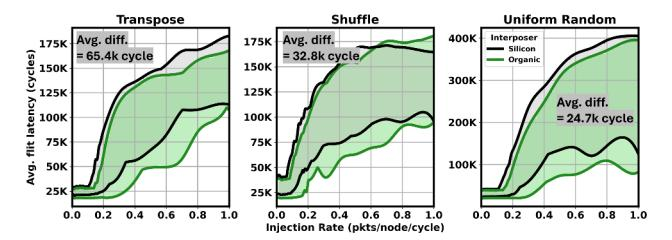
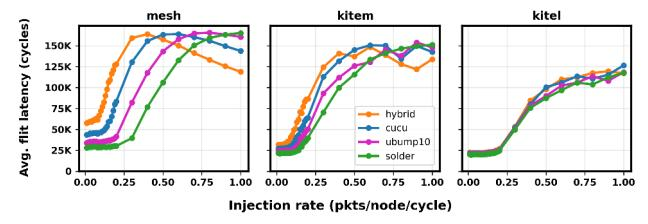
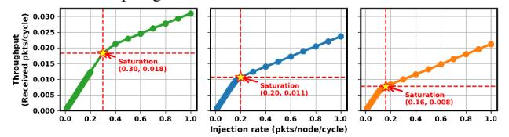

# ▶ Cross-layer path diversity and congestion redistribution.

Unified simulation exposes congestion behaviors that do not arise under isolated modeling. Topologies with dense lateral connectivity, such as mesh and concentrated mesh, provide multiple horizontal routing alternatives within each layer, enabling packets to traverse different intra layer paths. When traffic increases, vertical links and boundary routers between layers become the primary bottlenecks. In these topologies, packets can still be redirected through alternative lateral paths before reaching the congested vertical interfaces. This redistribution spreads traffic across multiple intra-layer routes, which temporarily alleviates localized congestion and delays the onset of rapid latency growth.

This behavior emerges from cross layer path diversity: the combined horizontal connectivity within layers and vertical inter layer links creates a larger global routing space whose utilization evolves with network pressure. In contrast, isolated models constrain congestion resolution to individual domains. Because NoC and NoI are simulated independently and coupled only through replayed injections, downstream congestion cannot influence upstream routing or queue formation. As a result, traffic redistribution across layers does not occur, and the congestion patterns observed in unified simulation cannot be reproduced.

▶ Technology-aware effects on zero-load and saturation behavior. As shown in Fig. 8 (left), tech-aware models report higher zero-load latency due to realistic boundary conversion overhead and higher inter-chiplet latency, whereas technology agnostic configurations assume uniform per hop delay and therefore underestimate baseline communication cost.

More importantly, technology awareness changes how congestion develops. As shown in Fig. 8 (right), the technology-agnostic configuration exhibits substantially smaller congestion growth because uniform link assumptions ignore the latency and bandwidth limitations of inter-chiplet links. This abstraction allows traffic to cross chiplet boundaries unrealistically easily, smoothing congestion formation. In contrast, technology-aware models capture the slower propagation and limited throughput of inter-chiplet links, causing congestion to accumulate near chiplet boundaries and producing steeper latency growth. Consequently, the technology-agnostic configuration underestimates end-to-end latency by 32.9K cycles on average (53.5% lower than Omelet).

▶ Interposer bottlenecks as global throughput limiters. Interposer links act as global throughput limiters in 2.5D and 3D systems because all cross-chiplet traffic must pass through shared interposer channels. Under unified simulation, once these links saturate, congestion propagates upward into the NoC and NoL layers, reducing the ability of the chiplets to inject new traffic, collapsing throughput across the entire stack. Isolated models cannot represent this cross-layer coupling; the NoC continues to scale its injection rate as if all outgoing traffic were accepted, even though the interposer would already be saturated in a real system. As a result, isolated modeling significantly overestimates sustainable throughput and fails to expose the true vertical bottleneck imposed by the interposer fabric.

Takeaway 1: Unified hierarchical modeling is essential for understanding 2.5D/3D integration behavior because the congestion and latency trends of 2.5D/3D systems arise from interactions across layers.

#### *B. Interposer Material Impact*

▶ Latency Analysis. Inter-stack communication in 3D systems must traverse the interposer-based link, making the interposer the primary communication layer for chiplet-to-chiplet traffic including bandwidth-intensive transfers such as compute chiplet–high bandwidth memory (HBM). However, in industry practice, two interposer materials are most commonly adopted: silicon and organic. These options provide different tradeoffs in wiring density, signaling reach, and compatible bonding technologies, which directly determine the effective bandwidth and per-hop latency of inter-die communication. For example, hybrid bonding is typically only feasible on silicon interposers due to the need for a controlled oxide interface, whereas organic interposers provide lower manufacturing cost at the expense of lower link density. Understanding how these materialdriven differences translate into system-level performance is therefore essential for architecture and packaging co-design.

Fig. 9: Interposer material latency range across topologies; average cycle difference computed between silicon and organic per topology.

Fig. 10: Comparison of (a) intrinsic EPB and (b) trafficactivated energy across topology and material configurations.

Fig. 9 shows system-level flit latency for silicon and organic interposers across multiple traffic patterns. Each pair of lines shows the lowest and highest latency among the seven evaluated topologies at each injection rate, and the shaded region between them represents the latency range across those topologies for the same interposer material. Across three representative traffic patterns, the average difference is 40.9K cycles. Silicon generally shows higher zero-load latency due to larger intrinsic link delay. However, its higher wiring density enables greater link parallelism, which can improve congestion tolerance. This is visible in the shuffle pattern, where silicon achieves lower latency than organic at higher injection rates. Such behavior cannot be captured by analytical or technology-agnostic models that represent inter-chiplet communication with a single fixed link parameter.

Takeaway 2: Interposer material fundamentally determines the latency and bandwidth limits of communication across chiplet stacks, shaping both baseline delay and system-wide congestion behavior.

▶ Energy Consumption Analysis. Fig. 10(a) reports the *intrinsic energy-per-bit (EPB)* of each topology–material pair, representing the average per-link energy cost independent of link activation. Fig. 10(b) shows the *traffic-activated energy* measured at each network's saturation point, where link utilization determines how much of the link is activated during communication.

The intrinsic EPB reflects topology- and material-dependent link characteristics: silicon interposers consistently exhibit higher per-bit energy, for a single link, in our specific configuration compared to organic interposers due to silicon's lossy electrical properties. However, the traffic-activated energy trends in (b) differ substantially from the intrinsic ranking. Although mesh appears the most energy-efficient on a per-link basis among the pairs, congestion activates a large fraction of its short links, increasing total switching activity across the network. In contrast, Kite-family topologies concentrate traffic onto a smaller set of long-range paths. While these links incur higher energy per transmitted bit individually, fewer links are

(a) Load-latency curve across different bonding technologies and different NoI topologies.

(b) Load–throughput curve with star markers indicating the saturation point where throughput begins to flatten due to congestion.

Fig. 11: Impact of bonding technologies.

activated, leading to lower total network energy under load.

Takeaway 3: Link's EPB alone can be misleading; energy evaluation requires congestion-aware modeling that accounts for traffic-driven link activation.

#### *C. Impact of Bonding Technology*

