# III. BCQ-BASED KV CACHE QUANTIZATION DESIGN

#### A. KV Value Distribution

As observed in prior research [29], [46] and shown in Fig. 3, the Key (K) and Value (V) caches exhibit distinct statistical properties. The Key cache demonstrates strong per-channel characteristics, where certain channels consistently present as outliers with significantly large magnitudes. By contrast, the Value cache exhibits highly dynamic data distributions, lacking this stable per-channel structure in its vector magnitudes and ranges. This fundamental divergence naturally suggests distinct quantization strategies. The stable outlier pattern in the Key cache makes per-channel quantization a suitable and effective approach. In contrast, the variable nature of the Value cache necessitates a more adaptive per-token quantization method.

## B. Binary-Coding Uniform and Binary-Coding Quantization

Following Section III-A, we employ a per-channel quantization strategy for the Key cache. The required statistics are global, depending on the distribution across all tokens, which prevents accurate on-the-fly estimation during autoregressive inference. Therefore, we pre-compute the quantization parameters, specifically the scaling factors and offsets, offline using a representative calibration dataset. Omni-LUT supports two distinct methods for this offline calibration, both designed to express the final quantized value in a hardware-friendly binary coding format.

**Binary-Coding Uniform Quantization (BC-UQ).** We first perform simple per-channel uniform quantization, finding a single scale and zero-point for each channel from the calibration data. To fit this into our binary-coding framework, we do not learn the scaling factors. Instead, we set them to a fixed

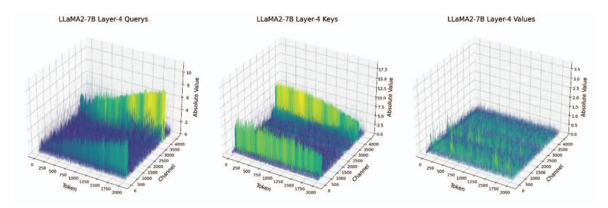

Fig. 3: Data visualization of Query, Key and Value at LLaMA2-7B Layer-4.

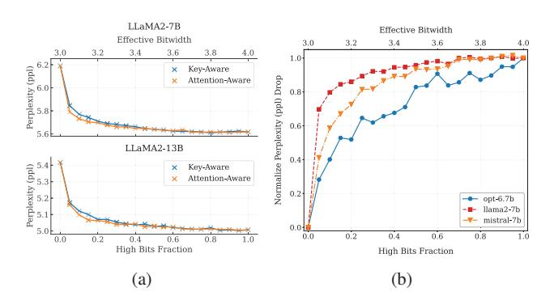

Fig. 4: (a) Impact of attention-aware quantization on perplexity across varying high-bit fractions. (b) Normalized perplexity drop as a function of high-bit fraction across various model architectures.

power-of-2 basis, and the entire basis is scaled by the uniform scaler:

$$z_{bcq} = z_u - \frac{2^b - 1}{2}$$

$$\alpha_{bcq} = [\alpha_u \cdot 2^{-1}, \alpha_u \cdot 2^0, \dots, \alpha_u \cdot 2^{b-2}]$$
(2)

This enables uniform quantization in the binary-coding format supported by the LUT-based GEMM accelerator.

Binary-Coding Quantization (BCQ). This is a theoretically more powerful method compared to uniform quantization because of its non-uniform feature. Instead of using a fixed basis, we learn the optimal scaling factors directly from the calibration data. Following prior work [70] on BCQ, we employ an alternating update approach to find the optimal parameters, as shown in Algorithm 1. This iterative process refines the scaling factors and the binary codes by alternating between two steps: first, fixing the codes and solving for the optimal scaling factors that minimize reconstruction error, and second, fixing the scaling factors and finding the new optimal binary codes. This method yields a more accurate representation, especially at low bit widths, at the cost of a more intensive offline calibration step. This calibration is performed once per model before deployment; its empirical

```
Algorithm 1: BCQ Alternating Optimization [70]

Input: Key calib. \mathbf{K}_{cal}, bit width B, rounds R
Output: scaling factors \boldsymbol{\alpha}^*, Binary codes \mathbf{B}^*

1 \boldsymbol{\alpha}, \mathbf{B} \leftarrow \text{GREEDY\_INIT}(\mathbf{K}_{cal}, B);
2 for r \leftarrow 1 to R do

3 \boldsymbol{\alpha} \leftarrow \text{LEAST\_SQUARES}(\mathbf{B}, \mathbf{K}_{cal}, \boldsymbol{\alpha});
4 \boldsymbol{\beta} \leftarrow \text{BST}(\mathbf{K}_{cal}, \boldsymbol{\alpha});
5 return \boldsymbol{\alpha}, \boldsymbol{B};
```

cost and sensitivity to the calibration dataset are evaluated in Section VI-A.

For the Value cache, as discussed in Section III-A, its distributions are highly token-dependent, so we apply online per-token BC-UQ, which is simple and fast enough to be feasible during inference.

## C. AS-Bit: Attention-Aware Sensitivity-Based Bit Allocation

While BC-UQ and BCQ are compatible with the binary-coding format of LUT-based GEMM accelerators, they use a fixed bit width for all channels. This design fails to exploit the flexibility of LUT-based GEMM accelerators that can handle variable bit widths. Moreover, we observe that such naive fixed-bit schemes suffer significant performance degradation, especially on smaller models. We hypothesize that this degradation occurs because not all Key channels are equally important for computing the attention scores. Each Key channel has its own distribution and thus contributes differently to the final  $QK^{\top}$  dot product. A fixed low-bit budget penalizes all channels uniformly, harming the few critical, high-sensitivity channels.

To address this issue, we propose *AS-Bit* (Attention-aware Sensitivity-based Bit allocation), an adaptive bit-allocation algorithm for the Key cache. The core idea is to assign higher bit width to channels that are more sensitive to quantization error, while assigning lower bit width to the remaining channels. We define the sensitivity of a channel based on its impact on the final attention score.

In the attention mechanism  $A = QK^{\top}$ , quantization error in the Keys,  $\Delta K$ , is scaled by the magnitude of the corresponding

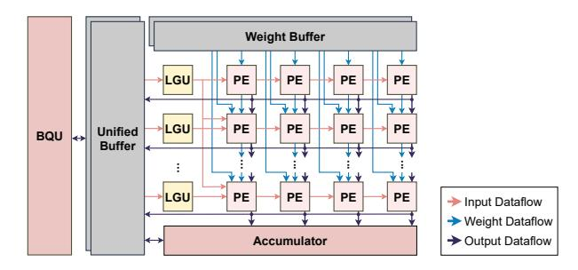

Fig. 5: System-level overview of Omni-LUT.

Query entries Q. Consequently, the effective sensitivity of a Key channel depends both on its intrinsic quantization error and on the energy of the corresponding Query channel. We capture this with the per-channel Query energy  $E[Q^2]_d$ :

$$E[Q^2]_d = \frac{1}{T_{\text{cal}}} \sum_{t=1}^{T_{\text{cal}}} (Q_{t,d})^2,$$
 (3)

where  $T_{\rm cal}$  is the number of calibration tokens and d indexes channels. As illustrated in Fig. 3, the Query also exhibits stable per-channel structure, making  $E[Q^2]_d$  a reliable sensitivity factor

We denote by  $MSE_b[d]$  the per-channel quantization error of the Keys at bit width b:

$$MSE_{b}[d] = \frac{1}{T_{cal}} \sum_{t=1}^{T_{cal}} (K_{t,d} - K_{q,b}[t,d])^{2},$$
 (4)

where  $K_{t,d}$  is the original Key and  $K_{q,b}[t,d]$  is the quantized-dequantized Key at bit width b.

Given a low bit width  $b_{\ell}$  and a high bit width  $b_{\hbar}$ , we measure the marginal gain of using the higher precision for channel d as

$$\Delta J_d = E[Q^2]_d \cdot \left( MSE_{b_\ell}[d] - MSE_{b_h}[d] \right). \tag{5}$$

Intuitively,  $\Delta J_d$  is the reduction in Key quantization error from  $b_\ell$  to  $b_h$ , weighted by how strongly the corresponding Query channel amplifies that error.

During offline calibration, the AS-Bit algorithm computes the Query energy  $E[Q^2]_d$  and the Key MSE for both bit width  $(MSE_{b_{\ell}}[d] \text{ and } MSE_{b_{h}}[d])$  by performing dual-path quantization on the Key calibration data. Using these metrics, it evaluates the marginal gain  $\Delta J_d$  for each channel and identifies the top k% of channels with the largest  $\Delta J_d$  values. These high-sensitivity channels are assigned the higher bit width  $b_h$ , while all remaining channels use  $b_\ell$ . As Fig. 4(a) confirms, AS-Bit allocation enables models to reach near highbit accuracy with minimal high-precision bits. This attentionaware method significantly reduces perplexity even when only 10-30% of channels use high-precision bits, and it does so more rapidly than approaches considering only Key MSE. Fig. 4(b) further shows that despite varying sensitivities across different models, the overall trend illustrates that high accuracy is maintainable even at low high-bit fractions.

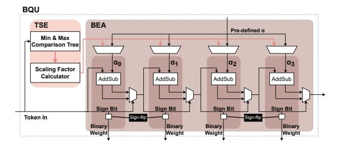

Fig. 6: Architecture of the Binary-coding Quantization Unit (BQU).

#### IV. OMNI-LUT HARDWARE IMPLEMENTATIONS

#### A. Omni-LUT Architecture Overview

Fig. 5 presents the system-level overview of the proposed Omni-LUT GEMM accelerator. The architecture comprises on-chip unified buffers for activations, dedicated weight buffers, a LUT Generation Unit (LGU), a Processing-Element (PE) array, an accumulator, and a Binary-coding Quantization Unit (BOU). The compute fabric is organized as a 32×4 PE array with a systolic array structure, supporting both weightstationary and output-stationary dataflows. Specifically, it can also be reconfigured into a 1D architecture to mitigate the low PE utilization issue in GEMV operations, as further discussed in IV-D. During operation, input activations and their corresponding scaling factors are fetched from the buffer and passed to the LGU. The LGU generates the scale-aware lookup table (detailed in IV-C), which is then streamed into the PE array. Concurrently, weight data is retrieved from the weight buffer and is either loaded and held within designated PEs or propagated downward along the PE columns, enabling flexible hybrid-stationary execution. Partial sums produced by the PE array are processed by the final accumulator and written back to the unified buffer. The BQU (detailed in IV-B) performs on-the-fly quantization for KV activations, reading data from the unified buffer and updating it with the resulting quantized values.

## B. Binary-coding Quantization Unit (BQU)

The BQU is a lightweight engine responsible for the online conversion of floating-point Key and Value activations into the BCQ representation. This output format is directly consumed by the LUT-based PEs. As illustrated in Fig. 6, the BQU is designed with two distinct paths to implement our adaptive quantization strategy:

- Key Path: Employs per-channel quantization, where scaling factors are calibrated offline and the BCQ bit planes are computed online.
- Value Path: Employs per-token uniform quantization, where both the scaling factors and the BCQ bit planes are computed online.

To support this dual-path algorithm, the BQU is internally divided into two primary hardware sub-blocks: the Token-Scale Estimator (TSE) and the BCQ Encoder Array (BEA).

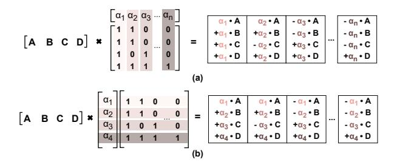

Fig. 7: Comparison of column-wise vs. row-wise scaling factor. (a) Column-wise scaling factor. (b) Row-wise scaling factor.

Token-Scale Estimator (TSE). The TSE computes the pertoken scaling factors that are used to quantize Value activations with binary-coding uniform quantization (BC-UQ). Its core component is a pipelined reduction tree that processes all elements of an incoming value token in parallel to find the minimum  $(x_{min})$  and maximum  $(x_{max})$  values. From these extrema, the TSE calculates two uniform quantization parameters—a zero-point  $(zp_v)$  and a step size  $(\delta_v)$ :

$$zp_v = \frac{x_{max} + x_{min}}{2}, \delta_v = \frac{x_{max} - x_{min}}{2^b - 1}$$
 (6)

where b is the target bit width for the quantized Value activation. A key aspect of our method is that the final BCO scaling factors,  $\{\alpha_i\}$ , are directly derived from this uniform step size. The TSE yields these factors by multiplying  $\delta_v$  with a set of pre-defined power-of-two base scales (e.g., {4, 2, 1, 0.5}) for q=4 bits). These token-specific scaling factors  $\{\alpha_i\}$  and zero point  $zp_v$  are then forwarded to the BCQ Encoder Array. BCQ Encoder Array (BEA). The BEA converts fullprecision Key and Value vectors into their quantized binarycoding representation. Given an input vector x, a zero-point vector zp, and scaling factors  $\{\alpha_i\}$ , the BEA produces a binary matrix  $B \in \{-1, +1\}^{q \times d}$  such that

$$x \approx zp + \sum_{i=1}^{q} \alpha_i \odot B_i \tag{7}$$

where d is the vector length and  $B_i$  is the i-th bit-plane.

The BEA implements a greedy residual algorithm. It first initializes the residual  $r^{(0)}$  and then iteratively refines it for each bit-plane  $i = 1, \ldots, q$ :

$$r^{(0)} = x - zp, (8)$$

$$r^{(0)} = x - zp,$$

$$B_i = \text{sign}(r^{(i-1)}), \quad r^{(i)} = r^{(i-1)} - B_i \cdot \alpha_i,$$
(8)

Each step decides whether to add or subtract  $\alpha_i$  to pull the residual closer to zero; the remaining is handled by subsequent, smaller  $\alpha_i$ . This greedy algorithm is unified for both paths. The distinction lies in the source of its inputs: for the Key Path, the per-channel  $zp_{k,c}$  and  $\alpha_{i,c}$  are fetched from offline-calibrated results; for the Value Path, the token-wise  $zp_v$  and  $\alpha_i$  are provided by the TSE.

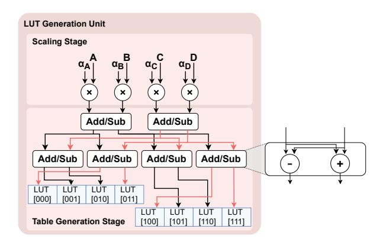

Fig. 8: Scale-aware LUT Generation Unit (LGU) of Omni-

**Runtime implication.** In our implementation, the BQU width is 128, which matches the maximum head dimension in the evaluated models, including OPT [79], LLaMA2 [64], LLaMA3 [25], Mistral [32], Mixtral [33], and Qwen3 [71]. Therefore, one Key or Value head vector can be quantized without splitting it into multiple passes. In other words, the online KV quantization does not add extra cycles.

## C. Scale-aware LUT Generation Unit (LGU)

The LGU is a critical component that builds the lookup tables used by the PE array. It is responsible for pre-computing the scaled partial sums required for our BCO-based dot product. These generated LUT entries are then streamed to the PEs and reused across many lookups. The design of our LGU is fundamentally motivated by the need to support the accuracy-optimal quantization direction, which prior works do not address.

Quantization direction and why it matters. Prior LUT-based GEMM accelerators [52] utilize a single scale after the lookup, which only supports column-wise scaling of the quantized matrix (Fig. 7(a)). However, the accuracy-optimal direction is row-wise (Fig. 7(b)):

- Weights: best with row-wise scaling, as reported by prior work [73];
- Keys: best with per-channel scaling [46]; when used in  $QK^T$ , this is equivalent to row-wise K;
- Values: best with per-token scaling; in  $Attn \times V$ , this is again row-wise with respect to V.

Post-lookup scaling cannot provide different scales for the four elements in the group, so it fails to support the desired direction. To clarify terminology: We use an  $A \times W$  formulation in this paper. Therefore, our "row-wise" scaling is equivalent to what prior work using a  $W \times A$  formulation might refer to as "column-wise" scaling.

Omni-LUT, therefore, performs scaling inside the LUT generator. For each bit-plane, the LGU first multiplies each activation in the 4-element group by its own scaling factor (row-/channel-/token-specific) using floating-point multipliers.

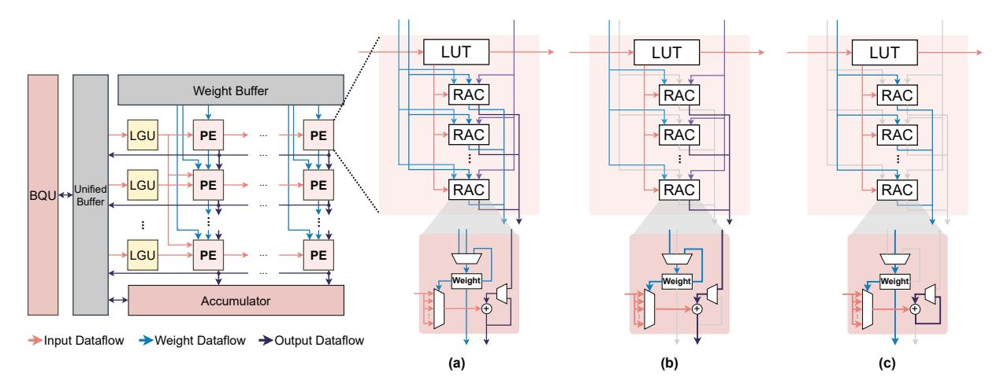

Fig. 9: Reconfigurable PE microarchitecture supporting WS and OS-V modes. (a) PE overview, showing the unified datapath shared by both execution modes. (b) WS dataflow, where weights are stored locally and partial sums propagate along the systolic chain during the GEMM-dominated prefill phase. (c) OS-V dataflow, where weights are streamed from row-level FIFOs and partial sums are accumulated locally to enable full-array GEMV parallelism during decode.

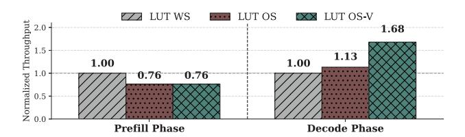

Fig. 10: Throughput comparison of different stationary approaches (OPT-6.7B, input tokens=4096, output tokens=512).

With these four scaled values, the LGU then enumerates all required combinations and writes the results as table entries. The LGU also performs zero-point compensation at this stage, eliminating the need for a final, separate addition to the partial sum; for the first bit-plane, it computes the dot product of the activation group and its corresponding per-row zero-point vector, adding this scalar result to every entry in the generated table. This placement both enables the accuracy-optimal direction and amortizes the scaling and offset costs. This scale-aware generation is the key enabler for Omni-LUT to extend LUT-based computation from AW-GEMM to AA-GEMM without sacrificing model accuracy.

LGU Microarchitecture. The LGU is a two-stage pipeline, as shown in Fig. 8. The scaling stage applies four scaling factors to the current bit-plane activations. The table generation stage forms the eight base entries for the 4-element group using a reuse-oriented adder/subtractor network; requiring only 6 adders and 6 subtractors. We also materialize a half-LUT [67]; the PE uses sign symmetry to obtain the complementary entries. The LGU operates in parallel with the PE array. After one LUT is generated, the LGU starts generating the LUT for the next activation group while the PE array consumes the current LUT. Therefore, LUT generation does not introduce additional stall cycles.

*D. Hybrid Stationary and GEMV-optimized LUT-based Systolic Array*

The core of Omni-LUT's compute fabric is a 32×4 systolic array, designed to accelerate the mpGEMM central to our LUT-based approach. This array multiplies floating-point activations (pre-processed by the LGU) with the quantized BCQ bit-planes of the weights and KV cache.

This array must handle two distinct computational patterns: compute-intensive GEMM in the prefill phase, and GEMV in the decode phase. A conventional 2D systolic array, designed for GEMM-heavy workloads, suffers from severe underutilization during this GEMV phase, as only a single row or column of PEs is active at a time. This creates a significant performance bottleneck. To identify the optimal architecture for these varying workloads, we evaluate three different stationary implementations of the LUT-based systolic array: a weight stationary approach (LUT WS), an output stationary approach (LUT OS), and a proposed GEMV-optimized output stationary approach (LUT OS-V). Our analysis in Fig. 10 quantifies this trade-off by comparing these three approaches. This figure shows that in the GEMM-heavy prefill phase, the LUT WS reaches the highest throughput, achieving 1.3× better performance than the OS-based approaches due to its high weight reuse. Conversely, in the decode phase, both traditional approaches are inefficient. Our proposed OS-V, however, is specifically designed for this bottleneck and achieves 1.49× and 1.68× higher throughput than OS and WS. This analysis confirms that no single approach is optimal for both phases. Therefore, Omni-LUT's array is designed as a hybridstationary system, dynamically reconfigurable to use the WS for prefill and the OS-V for decode.

**GEMV-Optimized OS (OS-V) Implementation.** Our OS-V mode reconfigures the  $M \times N$  array to compute a wide  $1 \times (M \times N)$  output tile from a single input vector, rectifying the low PE utilization of a conventional OS for GEMV. This is enabled by two key microarchitectural features:

- LUT Broadcast: The single LUT generated by the first row's LGU is broadcast vertically to all M rows of the PE array. The other LGUs are gated to save power.
- Parallel Weight FIFOs: Each of the rows is fed by its own dedicated Weight FIFO, bypassing the standard vertical PE-to-PE weight path. This allows all rows to be fed with unique weight data in parallel.

In this mode, each row processes its unique weight stream from its dedicated FIFO, and all PEs compute in parallel. This structure perfectly maps the GEMV operation, eliminating the PE utilization bottleneck. While this design adds the overhead of M-1 sets of Weight FIFOs, it is a necessary trade-off for optimizing GEMV.

**Hybrid PE.** To enable this dynamic switching between dataflows, the PE microarchitecture itself is hybrid, as shown in Fig. 9(a):

- In WS mode (Prefill, Fig. 9(b)): The PE uses its local register to store the binary weight. It receives an incoming partial sum, adds the result of its own LUT lookup (indexed by the local weight), and forwards the newly accumulated partial sum to the next PE.
- In OS-V mode (Decode, Fig. 9(c)): The PE bypasses its local weight register and instead uses the weight streamed from its row's dedicated Weight FIFO. The partial sum path is reconfigured to be output-stationary: the psum is accumulated in a local register within the PE.

The WS/OS-V switch is controlled by a mode register in each PE and the corresponding FIFO control logic. Changing the mode takes one cycle to update these registers. This switch happens only once per query, at the boundary between prefill and decode. Therefore, its effect on total latency is negligible. This hybrid datapath provides the flexibility to adapt to both GEMM and GEMV workloads with minimal hardware overhead. The core implementation of the PE is informed by prior work [52] to balance compute and table access energy; each PE contains a LUT built from a group of 4 activations, and the table is shared by 32 binary weights to Read and Accumulate (RAC) simultaneously.

#### V. METHODOLOGY

## A. Models and Datasets

We evaluate our quantization algorithm on OPT-1.3B, 6.7B, 13B [79], LLaMA2-7B, 13B [64], Mistral-7B [32], Mixtral-8x7B [33], LLaMA3-8B [25], and Qwen3 [71] models including Qwen3-8B, Qwen3-14B, and Qwen3-30B-A3B, covering MHA, GQA, and MoE architectures across edge-friendly and larger model scales. We report perplexity (PPL) and zero-shot reasoning accuracy. For calibration and PPL, we use WikiText-2 [49]: the training split for offline calibration and the test split for PPL. For zero-shot evaluation, we use PIQA [7],

TABLE I: GEMM engine specifications (500 MHz, 7 nm)

| Design       | Format   | PE Shape | Peak Tput.<br>(TOPS) | Area (mm <sup>2</sup> ) |
|--------------|----------|----------|----------------------|-------------------------|
| FPE          | W16KVA16 | 64x64    | 4.1                  | 0.64                    |
| Tender-int8  | W8KVA8   | 64x64    | 4.1                  | 0.20                    |
| FIGLUT       | W4KVA16  | 32x4     | 4.1                  | 0.39/1.03**             |
| Omni-LUT-KV4 | W4KV4A16 | 32x4     | 4.1                  | 0.53                    |
| Omni-LUT-KV3 | W4KV3A16 | 32x4     | 4.1/5.46*            | 0.53                    |

<sup>\*</sup>Omni-LUT-KV3: 4.1 TOPS (AW), 5.46 TOPS (AA).

Winogrande [58], and HellaSwag [77] to assess common-sense and plausibility reasoning. Our implementation is based on PyTorch and the Hugging Face transformers library [68]. During evaluation, we simulate KV cache quantization within each attention layer.

#### B. Quantization Baselines

We compare both KV cache-only and end-to-end quantization methods. For KV cache-only quantization methods, we select KIVI [46], KVQuant [29], and Oaken [37], which lower the bit widths of Keys and Values while keeping weights in full precision. We also include recent KV cache quantization methods available in modern inference software stacks, including QServe [45] and NVIDIA's NVFP4 KV cache quantization [2]. For the end-to-end quantization methods, we choose Atom [80] and Tender [41], which also quantize weights and sometimes activations. For a fair comparison, we use a BCQ-based weight quantization strategy for our method and, when applicable, apply the same weight configuration to baselines that do not originally quantize weights.

#### C. Hardware Setup

We evaluate Omni-LUT and baselines using post-synthesis area and power estimation together with a calibrated latency and energy model. All units are synthesized using Synopsys Design Compiler targeting a 500 MHz clock frequency in TSMC 7-nm technology. The synthesis results are used to obtain area reports, and power is estimated using Synopsys PrimeTime PX. To model diverse GEMM shapes, we calibrate our simulator using gate-level simulation with Synopsys VCS on kernels instantiated from real inference tensors. For each kernel, we obtain cycle counts and switching activity, which are annotated to the power analysis tool to estimate perkernel energy, and the resulting measurements are used to parameterize our simulator. On-chip buffers are implemented using SRAM macros in the same process, and off-chip DRAM energy is estimated using DRAMPower [10] configured for an LPDDR5 device [4] with 51.2 GB/s peak bandwidth across all

Throughout our simulation, we utilize FlashAttention [16], [17] algorithm to match realistic model serving implementations: intermediate attention matrices are not materialized to DRAM, and attention is computed in a tiled, streaming manner with a tile size of 256. We model kernel latency

 $<sup>**0.39\,\</sup>mathrm{mm}^2$  is FIGLUT's LUT core only; including the required FPE FP backend for AA-GEMM gives  $1.03\,\mathrm{mm}^2$  total.

TABLE II: Evaluation results of KV cache quantization on the WikiText-2, PIQA, Winogrande, and HellaSwag datasets.

| Task              |          | WikiText-2     |         |           |            |            |              |              | PIQA      |              | Winogrande | HellaSwag    |           |
|-------------------|----------|----------------|---------|-----------|------------|------------|--------------|--------------|-----------|--------------|------------|--------------|-----------|
| Metric            |          | Perplexity (↓) |         |           |            |            |              | Accuracy (%) |           | Accuracy (%) |            | Accuracy (%) |           |
| Model             | OPT-1.3B | OPT-6.7B       | OPT-13B | LLaMA2-7B | LLaMA2-13B | Mistral-7B | Mixtral-8x7B | OPT-6.7B     | LLaMA2-7B | OPT-6.7B     | LLaMA2-7B  | OPT-6.7B     | LLaMA2-7B |
| Baseline (FP16)   | 14.64    | 10.86          | 10.12   | 5.47      | 4.88       | 5.31       | 3.84         | 76.50        | 79.05     | 65.35        | 69.14      | 67.18        | 75.99     |
| Atom-KV4          | 15.43    | 10.97          | 10.18   | 5.59      | 4.96       | 5.40       | 4.04         | 76.44        | 76.88     | 64.72        | 65.90      | 67.11        | 72.41     |
| KVQuant-KV4       | 14.75    | 10.90          | 10.14   | 5.49      | 4.94       | 5.33       | 3.87         | 76.60        | 78.94     | 65.11        | 67.72      | 67.20        | 75.81     |
| KIVI-KV4          | 14.66    | 10.88          | 10.16   | 5.49      | 4.90       | 5.34       | 3.84         | 76.55        | 78.94     | 65.27        | 69.06      | 67.21        | 75.99     |
| Oaken-KV4         | 15.28    | 10.88          | 10.16   | 5.52      | 4.93       | 5.35       | 3.90         | 76.88        | 79.05     | 64.72        | 67.80      | 67.04        | 74.57     |
| QServe-KV4        | 15.70    | 10.95          | 10.28   | 5.66      | 5.12       | 5.50       | 4.04         | 76.71        | 79.16     | 64.25        | 67.01      | 66.66        | 74.72     |
| NVFP4-KV4         | 16.77    | 10.98          | 10.38   | 5.53      | 4.93       | 5.36       | 3.92         | 76.66        | 78.56     | 64.88        | 68.51      | 66.46        | 75.78     |
| Omni-LUT-KV4-BCQ  | 14.74    | 10.86          | 10.33   | 5.70      | 5.17       | 5.44       | 4.06         | 76.28        | 79.00     | 64.96        | 70.17      | 66.35        | 75.23     |
| Omni-LUT-KV4-BCUQ | 14.81    | 10.91          | 10.17   | 5.51      | 4.91       | 5.34       | 3.88         | 76.71        | 78.51     | 64.56        | 68.11      | 66.87        | 75.99     |
| Atom-KV3          | 16.87    | 11.19          | 10.48   | 6.43      | 5.54       | 5.89       | 5.24         | 76.17        | 76.39     | 64.01        | 61.48      | 66.46        | 68.96     |
| KVQuant-KV3       | 15.55    | 11.12          | 11.01   | 5.58      | 5.28       | 5.42       | 3.98         | 76.39        | 78.56     | 65.19        | 69.14      | 66.68        | 75.52     |
| Oaken-KV3         | 16.88    | 11.18          | 10.60   | 7.73      | 5.25       | 5.52       | 4.21         | 76.44        | 76.22     | 63.46        | 64.17      | 65.51        | 64.56     |
| QServe-KV3        | 19.81    | 12.02          | 11.16   | 7.64      | 7.54       | 6.20       | 5.08         | 75.68        | 73.99     | 61.80        | 59.75      | 64.85        | 65.36     |
| Omni-LUT-KV3-BCQ  | 15.22    | 11.02          | 12.37   | 6.11      | 5.61       | 5.70       | 4.33         | 76.33        | 78.78     | 64.09        | 69.61      | 64.64        | 73.67     |
| Omni-LUT-KV3-BCUQ | 15.45    | 11.12          | 10.36   | 5.68      | 5.06       | 5.48       | 4.08         | 76.12        | 77.97     | 64.64        | 67.17      | 66.09        | 74.36     |

TABLE III: Evaluation results of general LLM quantization on the WikiText-2, PIQA, Winogrande, and HellaSwag datasets.

| Task                | WikiText-2 |          |         |                |            | PIQA       |          | Winogrande   |          | HellaSwag    |          |              |
|---------------------|------------|----------|---------|----------------|------------|------------|----------|--------------|----------|--------------|----------|--------------|
| Metric              |            |          |         | Perplexity (↓) |            |            |          | Accuracy (%) |          | Accuracy (%) |          | Accuracy (%) |
| Model               | OPT-1.3B   | OPT-6.7B | OPT-13B | LLaMA2-7B      | LLaMA2-13B | Mistral-7B | OPT-6.7B | LLaMA2-7B    | OPT-6.7B | LLaMA2-7B    | OPT-6.7B | LLaMA2-7B    |
| Baseline (FP16)     | 14.64      | 10.86    | 10.12   | 5.47           | 4.88       | 5.31       | 76.50    | 79.05        | 65.35    | 69.14        | 67.18    | 75.99        |
| Tender-W8KVA8       | 14.84      | 10.96    | 10.15   | 5.76           | 5.09       | >500       | 75.79    | 77.20        | 64.80    | 67.56        | 66.94    | 73.75        |
| Tender-W4KVA4       | 25.39      | 14.16    | 13.30   | 123.10         | 101.30     | >500       | 70.89    | 49.56        | 59.27    | 49.80        | 59.58    | 27.59        |
| Atom-W4KVA4         | 15.63      | 11.07    | 10.23   | 5.73           | 5.07       | 5.49       | 75.68    | 76.44        | 63.61    | 64.80        | 66.55    | 71.25        |
| KVQuant-W4KV4       | 15.37      | 10.98    | 10.22   | 5.62           | 5.03       | 5.41       | 76.71    | 78.45        | 64.09    | 68.67        | 66.19    | 74.55        |
| KIVI-W4KV4          | 15.31      | 10.95    | 10.22   | 5.63           | 5.01       | 5.42       | 76.88    | 78.18        | 64.40    | 68.35        | 66.21    | 74.61        |
| Oaken-W4KV4         | 15.49      | 10.96    | 10.24   | 5.70           | 5.06       | 5.44       | 77.04    | 77.91        | 63.93    | 66.77        | 65.83    | 72.91        |
| Omni-LUT-W4KV4-BCQ  | 15.19      | 10.94    | 10.41   | 5.83           | 5.30       | 5.55       | 76.39    | 78.24        | 63.62    | 69.22        | 65.07    | 73.77        |
| Omni-LUT-W4KV4-BCUQ | 15.23      | 10.99    | 10.23   | 5.63           | 5.00       | 5.43       | 76.06    | 77.75        | 65.04    | 68.51        | 65.97    | 74.38        |

TABLE IV: Evaluation results of KV cache quantization for LLaMA3 and Qwen3 models compared to a uniform quantization baseline.

| Task                             |              | WikiText-2 (PPL↓) |               |                |  |  |  |  |  |
|----------------------------------|--------------|-------------------|---------------|----------------|--|--|--|--|--|
| Model                            | LLaMA3-8B    | Qwen3-8B          | Qwen3-14B     | Qwen3-30B-A3B  |  |  |  |  |  |
| Baseline (FP16)                  | 6.14         | 9.85              | 8.76          | 8.81           |  |  |  |  |  |
| Uniform-KV4<br>Omni-LUT-KV4-BCUQ | 6.38<br>6.26 | >500<br>9.91      | 10.49<br>8.82 | 14.12<br>8.87  |  |  |  |  |  |
| Uniform-KV3<br>Omni-LUT-KV3-BCUQ | 7.90<br>6.79 | >500<br>10.04     | 47.72<br>9.06 | 304.91<br>9.14 |  |  |  |  |  |

TABLE V: Comparison of different calibration datasets for Omni-LUT-KV4-BCUQ on zero-shot tasks with LLaMA2-7B.

| Task           | PIQA  | Winogrande | HellaSwag |
|----------------|-------|------------|-----------|
| Baseline       | 79.05 | 69.14      | 75.99     |
| WikiText-2     | 78.51 | 68.11      | 75.99     |
| C4 (En)        | 78.18 | 68.51      | 76.01     |
| The Pile (Val) | 78.35 | 69.46      | 75.9      |

using a roofline-style performance model that accounts for both compute time and DRAM access time. All experiments target an edge-serving setting and use batch size = 1.

We report results under two scopes. (i) Kernel-level results focus on GEMM kernels and the associated KV cache memory traffic, which are the primary targets of Omni-LUT. (ii) System-level results additionally include non-GEMM operators (e.g., Softmax, LayerNorm, and RoPE) executed on a vector processing unit (VPU), enabling end-to-end metrics, total inference latency and total inference energy.

#### *D. GEMM Engine Baselines*

We evaluate four GEMM hardware engines in our study: FPE, FIGLUT [52], Tender [41], and our proposed Omni-LUT architecture. The FPE design serves as the floatingpoint baseline, representing a W4A16KV16 (INT4 weight, FP16 activation, FP16 KV cache) configuration. It dequantizes the 4-bit weights to FP16 and performs conventional floating-point multiply–accumulate operations on a systolic array. FIGLUT represents a state-of-the-art LUT-based GEMM accelerator, which we also configure for a W4A16KV16 setup. FIGLUT can utilize LUT-based GEMM for AW operations but must fall back to a floating-point systolic array backend (identical to the FPE's) for all AA-GEMM operations. Tender serves as the pure-integer baseline, implementing a multi-scale systolic array. We configure Tender for a W8A8KV8 (INT8 weight/activation/KV) setup. All GEMM operations (both AW and AA) are performed using 8-bit integer multipliers, and it employs a 1-bit intra-PE shifter for dynamic partial sum rescaling. As such, Tender serves as a representative pureinteger compute baseline, in contrast to our Omni-LUT design that operates with FP16 activations. We use the 8-bit configuration for Tender because its sub-4-bit setting leads to unacceptable model-quality loss. The impact on accuracy is reported and discussed in VI-E. Omni-LUT is our proposed architecture and quantization method, which is evaluated in two configurations: Omni-LUT-KV3 (W4A16KV3), and Omni-LUT-KV4 (W4A16KV4). Both variants are in the same hardware setup but utilize 4-bit weights, FP16 activations, and 3-, or 4-bit KV cache quantization, respectively. Omni-LUT-KV3 naturally attains higher peak throughput for AA-GEMM

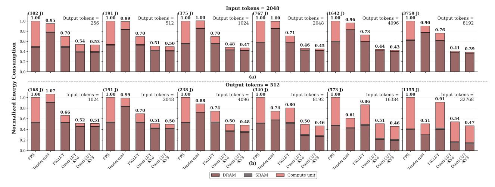

Fig. 11: Normalized energy breakdown (DRAM, SRAM, Compute) on OPT-6.7B, comparing GEMM accelerators. (a) Fixed input tokens (2048) and increasing output tokens (256-8K). (b) Fixed output tokens (512) and increasing input tokens (1K-32K).

because the KV cache is quantized with fewer bits, reducing the number of bit-planes processed by bit-serial datapath.

For fair comparison, we match the peak throughput across FPE, Tender, FIGLUT, and Omni-LUT-KV4. FPE and Tender use a 64×64 PE array, while FIGLUT and Omni-LUT use a 32×4 PE array. In FIGLUT and Omni-LUT, each PE constructs a lookup table from four activations and performs a parallel lookup for 32 binary weights. The detailed configurations and hardware specifications for all evaluated engines are summarized in Table I. We report the additional peak throughput of Omni-LUT-KV3 separately when analyzing the bit-width trade-offs.

## VI. EVALUATION

#### *A. Accuracy Evaluation*

Table II presents a comparison of various KV cache quantization methods across multiple baseline LLMs and evaluation metrics. From the results, we observe that our KV cache quantization method achieves only a 0.17 average perplexity increase at 4-bit and 0.75 at 3-bit when adopting BCQ, demonstrating competitiveness with state-of-the-art approaches. In particular, our method adopts a high fractional-bit ratio of 25%, resulting in an effective Key cache bit width of only 4.25 bits, without adding any extra bits to the Value cache. This is substantially more efficient compared to methods such as KIVI, KVQuant, and Oaken, which rely on sparsity-based outlier handling and yield a higher average KV cache bit width of 4.8–5.0 bits. Furthermore, Table III shows that quantizing both the model weights and the KV cache into low-bit formats, which enables full mpGEMM execution, can still maintain model accuracy that is competitive with other methods that quantize weights, KV cache, or even activations. This demonstrates that our unified low-bit quantization pipeline achieves favorable accuracy–efficiency trade-offs under practical inference workloads.

Table IV shows that our method supports modern transformer architectures such as the LLaMA3 and Qwen3 series while maintaining acceptable model inference accuracy. In Table V, we analyze the effect of different calibration datasets—including WikiText-2, The Pile [23], and C4 [56]—on the zero-shot task. Because the calibration process primarily captures the KV cache distribution within each attention layer, the specific dataset choice has a negligible impact on performance, provided that the proposed sampling method adequately represents the KV cache statistics. Although our method requires model-specific calibration in advance, the overhead is minimal; for example, calibrating LLaMA2-13B takes less than 10 minutes on an NVIDIA H200 GPU.

## *B. GEMM Kernel Performance Evaluation*

We evaluate GEMM kernel in isolation to focus on compute core efficiency and KV traffic reduction; non-GEMM operators are excluded in this section.

Energy Breakdown. Fig. 11 compares the normalized energy consumption of Omni-LUT against the GEMM accelerators, broken down into DRAM, SRAM, and compute energies on the OPT-6.7B model. The absolute energy of the FPE baseline is annotated above each subplot (in Joules (J)), allowing the normalized bars to be converted to absolute energy. Fig. 11(a) illustrates a fixed prefill workload, while the workload of the decode phase progressively increases, emphasizing decode-centric performance. By contrast, Fig. 11(b) illustrates a workload with fixed output tokens, while the prefill workload progressively scales, emphasizing prefill-centric performance.

When the workload of the decode phase progressively increases (Fig. 11(a)), the energy consumption of the accelerators becomes increasingly dictated by GEMV efficiency and memory traffic. Omni-LUT maintains the lowest total energy across all output tokens cases. At 8192 output tokens, that is, when the decode workload is highest, Omni-LUT-KV4 achieves a 59% energy reduction over FPE, 54% over Tender,

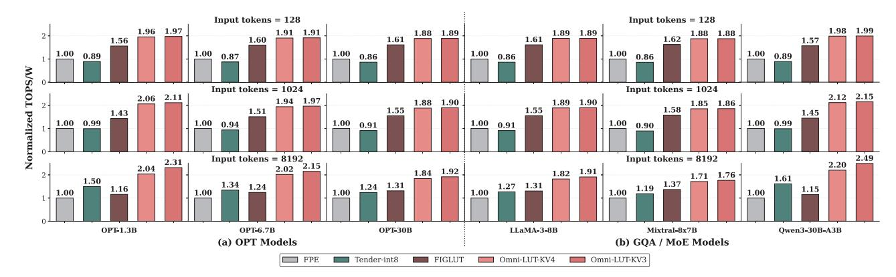

Fig. 12: Energy efficiency (TOPS/W) across (a) OPT scaling models and (b) GQA/MoE models, with 512 output tokens.

and 46% over FIGLUT. This significant advantage is largely due to optimizations in both memory and compute energy. On the memory side, our 3/4-bit KV cache quantization provides a substantial benefit compared with the 16-bit KV cache of FPE and FIGLUT and the 8-bit KV cache of Tender. Concurrently, Omni-LUT's compute energy advantage widens as the decode workload grows. This widening is a direct result of our GEMVoptimized systolic array, which maintains high PE utilization, while the standard 2D arrays of FPE, FIGLUT, and Tender execute GEMV inefficiently.

As the input token length T increases (Fig. 11(b)), energy increasingly reflects compute-intensive O(T<sup>2</sup>) AA-GEMM and the growing KV cache traffic. Omni-LUT retains a consistent DRAM-energy advantage across all context lengths, and achieves the lowest total energy in most settings up to 16384 input tokens. Specifically, at 8192 input tokens (a canonical long-context setting), Omni-LUT-KV4 reduces total energy by 50%, 32%, and 38% compared to FPE, Tender, and FIGLUT, corresponding to absolute savings of 170 J, 109 J, and 129 J per query, respectively. At the most extreme 32768-token input, the workload becomes strongly prefill-dominated, and Tenderint8 slightly surpasses Omni-LUT-KV4 in total energy, as Tender's highly efficient INT8 compute path outweighs Omni-LUT-KV4's remaining memory advantage in this extreme case. Notably, Omni-LUT-KV3 remains the lowest-energy configuration even at 32768 tokens, indicating that further reducing KV cache bit width restores the overall advantage under extreme long-context prefill.

Energy Efficiency. Fig. 12 illustrates the overall energy efficiency (TOPS/W) across (a) OPT scaling models (OPT-1.3B/6.7B/30B) and (b) modern architectures, including LLaMA3-8B, Mixtral-8x7B, and Qwen3-30B-A3B. We validate our method's generality under three context-length settings with output tokens fixed to 512: short-context (128 tokens, common chat), medium-context (1024 tokens, longer instructions or RAG [42]), and long-context (8192 tokens, document summarization or code analysis). Compared to OPT's Multi-Head Attention (MHA), these three modern models use Grouped-Query Attention (GQA), which reduces the number

TABLE VI: Absolute metrics (OPT-6.7B, input tokens=8192, output tokens=512)

| Design                     | FPE     | Tender | FIGLUT        | Omni-LUT<br>-KV4 | Omni-LUT<br>-KV3 |
|----------------------------|---------|--------|---------------|------------------|------------------|
| Peak GEMM<br>TOPS          | 4.1     | 4.1    | 4.1           | 4.1              | 4.1/5.46         |
| Peak GEMM<br>Compute Power | 1.75 W  | 0.46 W | 1.5 W/1.75 W∗ | 1.65 W/1.83 W∗∗  |                  |
| GEMM Compute<br>Energy     | 163.3 J | 55.8 J | 93.4 J        | 64 J             | 59.9 J           |
| Avg. GEMM<br>Compute Power | 0.83 W  | 0.28 W | 0.6 W         | 0.76 W           | 0.77 W           |
| Effective<br>GEMM TOPS     | 0.76    | 0.75   | 0.96          | 1.78             | 1.93             |

<sup>∗</sup>FIGLUT: 1.5 W for AW-GEMM on the LUT core, 1.75 W for AA-GEMM on the FPE backend.

of KV heads and therefore lowers KV cache memory traffic. However, GQA does not reduce the amount of attention computation itself, so efficient AA-GEMM execution is still important. Mixtral-8×7B and Qwen3-30B-A3B further adopt Mixture-of-Experts (MoE), where each token is routed to only a subset of experts instead of all feed-forward layers. MoE changes the feed-forward path, but does not reduce the AA-GEMM in attention or KV cache accesses.

In short and medium-context tasks (128 and 1024 tokens), LUT-based methods, including Omni-LUT and FIGLUT, demonstrate clear superiority over FPE and Tender. Our Omni-LUT achieves approximately 85-110% higher energy efficiency than the FPE baseline. The advantage over Tender is even more significant. The architectural trade-offs shift in the challenging long-context 8192 tokens regime. Here, FIGLUT's efficiency falls below Tender's in some cases, as FIGLUT must fall back to its floating-point systolic array backend for AA-GEMM. Crucially, when comparing configurations with equivalent peak throughput (Omni-LUT-KV4 vs. FIGLUT), our design outperforms FIGLUT by 1.25×–1.91× across different models.

<sup>∗∗</sup>Omni-LUT: 1.65 W for prefill WS mode, 1.83 W for decode OS-V mode.

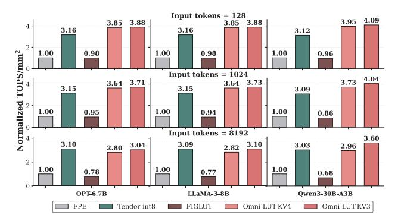

Fig. 13: Area efficiency (TOPS/mm<sup>2</sup>) across representative models and input tokens, with 512 output tokens.

Table VI reports absolute GEMM engine metrics for a representative long-context workload on OPT-6.7B. Under this setting, Omni-LUT-KV4 delivers 1.78 TOPS effective GEMM throughput while reducing GEMM compute energy to 64 J, compared to 0.96 TOPS and 93.4 J for FIGLUT. The baselines remain far below their peak throughput because decode GEMV underutilizes their conventional 2D systolic arrays. Omni-LUT reduces this utilization loss with its GEMV-optimized decode dataflow. After compute utilization improves, memory bandwidth becomes the next bottleneck; even so, Omni-LUT still achieves  $1.85 \times$  higher effective GEMM throughput than FIGLUT. These results reflect the combined benefits of sub-4-bit KV quantization and our hybrid-stationary LUT-based systolic array.

Omni-LUT-KV3 can further improve energy efficiency in long-context tasks by reducing both KV cache traffic and the compute cost of AA-GEMM. Our LUT-based GEMM datapath uses bit-slicing, where the compute cost of each matrix multiplication is proportional to the number of bit-planes processed from the quantized operand. With 3-bit Key/Value, Omni-LUT-KV3 processes three bit-planes for  $QK^T$  and for  $Attn \times V$ , compared to four bit-planes in Omni-LUT-KV4. This reduces the AA-GEMM work in attention by 25% relative to KV4, while also shrinking KV memory traffic, which is critical under the memory pressure of long contexts.

Area Efficiency. Fig. 13 presents the area efficiency, measured in normalized TOPS/mm², for all accelerators, across representative MHA, GQA and MoE models, with 512 output tokens. Tender provides an important reference because its pure-integer MAC array has a strong area advantage: Tender occupies only 0.20 mm², whereas Omni-LUT occupies 0.53 mm² (Table I). Even with this gap, Omni-LUT still achieves comparable or higher area efficiency in several evaluated settings, demonstrating that a LUT-based engine with FP16 activations can approach the area efficiency of a pure integer design. Compared with the floating-point baseline FPE, the gains are much larger. Omni-LUT-KV4 improves TOPS/mm² by  $2.8\times-3.9\times$  over FPE. The gains over FIGLUT are also substantial. FIGLUT uses its LUT datapath only for AW-

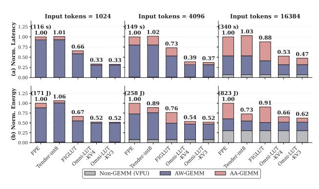

Fig. 14: End-to-end system (a) latency (b) energy evaluation on OPT-6.7B with fixed output tokens of 512.

GEMM and requires an additional floating-point systolic array backend for AA-GEMM, which increases total area and leaves attention limited by the floating-point backend. In contrast, Omni-LUT executes both AW-GEMM and AA-GEMM on the same LUT hardware, so it maintains higher area efficiency. Compared with Tender, the outcome depends on the prefill/decode balance. Omni-LUT's advantage over Tender largely comes from higher decode utilization enabled by the GEMV-optimized OS-V dataflow. As the input context increases and the workload becomes more prefill-dominated, the relative contribution of decode decreases. As a result, Omni-LUT remains above Tender in the 128 and 1024 settings, but Tender exceeds Omni-LUT in 8192 cases.

#### C. System-level Evaluation

To assess end-to-end impact under more realistic serving scenarios, we extend our evaluation beyond GEMM kernels. We include non-GEMM operators executed on a common vector processing unit (VPU) that is identical across all designs. Fig. 14 reports end-to-end inference (a) latency and (b) energy for OPT-6.7B with 512 output tokens, with input context length from 1024 to 16384. Each bar is normalized to FPE and decomposed into three components: Non-GEMM (VPU), AW-GEMM, and AA-GEMM.

At shorter contexts (1024 and 4096), AW-GEMM dominates both latency and energy. In this regime, LUT-based computations reduce the AW-GEMM cost, and Omni-LUT further reduces latency relative to FIGLUT due to its hybridstationary design and GEMV-optimized decode path, which reduces inefficiency when executing GEMV-shaped kernels. As the context length increases to 16384, the AA-GEMM portion becomes a larger fraction in both latency and energy. This reduces FIGLUT's advantage because it executes AA-GEMM on its floating-point systolic array backend, while Tender's low-cost INT8 MAC improves energy but provides limited latency benefit. In contrast, Omni-LUT executes AA-GEMM on the LUT datapath and reduces KV traffic via 3/4-bit KV quantization, leading to the lowest end-to-end latency and energy at long context lengths. Finally, according to Amdahl's law [3], as GEMM kernels are accelerated, the

TABLE VII: Omni-LUT compute-core area and energy breakdown (OPT-6.7B, input tokens=8192, output tokens=512).

| Module                   | Area (mm2) | Area share | Energy (J) | Energy share |
|--------------------------|------------|------------|------------|--------------|
| LUT PE Array             | 0.459      | 86.34%     | 57.68      | 90.09%       |
| LUT Generation Unit      | 0.017      | 3.11%      | 3.43       | 5.36%        |
| Binary-coding Quant Unit | 0.014      | 2.63%      | 0.16       | 0.25%        |
| FIFOs                    | 0.030      | 5.55%      | 2.48       | 3.87%        |
| Control Logic            | 0.013      | 2.37%      | 0.27       | 0.43%        |
| Total                    | 0.532      | 100%       | 64.02      | 100%         |

Non-GEMM fraction increases, but Omni-LUT's combined AW/AA improvements remain large enough to preserve a clear system-level advantage.

## *D. Hardware Overheads*

Table VII summarizes the area and energy breakdown of Omni-LUT's compute core. The PE array dominates both area (86.34%) and energy (90.09%). The LUT generation unit (LGU) accounts for 3.11% of area and 5.36% of energy. The binary-coding quantization unit (BQU) contributes only 2.63% of area and 0.25% of energy. Together with control logic, the online quantization and control overhead is 5% of area and below 1% of energy, indicating that the added hardware cost is small compared to the compute core.

#### *E. Bit-Width Trade-off*

Fig. 15 shows the accuracy–efficiency trade-off on LLaMA2-7B, using PPL and normalized TOPS/W. The Omni-LUT points sweep only the KV cache bit width (KV4/KV3/KV2) while keeping the rest of the computation configuration unchanged; reducing KV bit width improves TOPS/W by lowering KV traffic and reducing the bit-plane work of AA-GEMM. KV4 and KV3 improve TOPS/W with a small PPL increase over the FP16 baseline. In contrast, KV2 results in a significant quality drop (PPL=9.96) and is not considered a deployable operating point. Tender-int8 and Tender-int4 represent global precision points (W/K/V/A are INT8 or INT4, respectively); while Tender-int4 achieves the highest TOPS/W, it incurs catastrophic accuracy loss (PPL=123.1) and therefore is not treated as a baseline. Based on this trade-off, we use KV4 as the default configuration and KV3 as an optional efficiency point.

