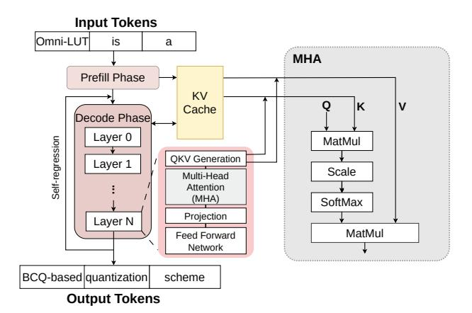
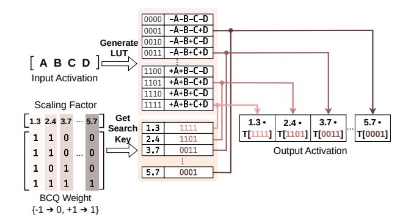

# Omni-LUT: Energy-Efficient LUT-based Accelerator with Hardware-Aware KV Cache Quantization

Cheng-Han Tsai Kuan-Chen Chou Yu-Hsin Wang Chieh-Dun Wen Tsung Tai Yeh

National Yang Ming Chiao Tung University

Hsinchu, Taiwan

{charlestsai1729.cs10, chouchou0518.cs10, hsin.cs13, aidan988.cs10}@nycu.edu.tw, ttyeh@cs.nycu.edu.tw

Abstract-Large language model (LLM) inference incurs substantial computation and energy consumption. Lookup-table (LUT)-based general matrix multiplication (GEMM) accelerators reduce this burden by replacing costly multiplications with table lookups. However, existing designs only support activation-weight GEMM (AW-GEMM) in LLM linear layers, while LUT execution for activation-activation GEMM (AA-GEMM) in attention has not been realized. As AA-GEMM is a major contributor to the computation and energy costs of LLM inference in longcontext scenarios, supporting both GEMM types-not just AW-GEMM-is crucial. To solve this problem, we propose Omni-LUT, a hardware-software co-designed LUT-based GEMM accelerator that supports both AW-GEMM in linear layers and AA-GEMM in attention with efficient LUT execution. Omni-LUT uses a hardware-aware Key-Value (KV) cache quantization design that combines offline calibration with lightweight online quantization, preserving model accuracy while enabling compatibility with LUT-based GEMM accelerators. It also supports a more accurate quantization direction by leveraging quantization compensation during LUT creation. Omni-LUT further comprises a phaseadaptive hybrid-stationary LUT-based systolic array to improve the efficiency of both the prefill and decode phases in LLMs. Across diverse long context workloads, Omni-LUT achieves  $1.25 \times -1.91 \times$  higher energy efficiency than the state-of-the-art (SOTA) LUT-based GEMM accelerator under an equal peakthroughput hardware setup, while maintaining competitive model accuracy compared with SOTA KV quantization methods.

#### I. INTRODUCTION

Recent advances in large language models (LLMs) [1], [9], [14], [25], [62], [63] have rapidly increased the demand for efficient inference on resource-constrained systems. Quantization has become a key technique for reducing model size, memory traffic, and computation cost, enabling the deployment of LLMs on edge and power-limited platforms [12], [30]. In particular, weight quantization has reduced LLM weights to 4-bit precision and even lower, while largely preserving model quality [19], [22], [24], [48], [66]. However, activation outliers make low-bit activation quantization more difficult, so activations typically remain in higher precision [6], [51]. As a result, weight-quantized LLM inference becomes a mixed-precision GEMM (mpGEMM) problem, where low-bit integer weights (2/3/4-bit integer (INT)) are multiplied by high-precision (16/32-bit floating-point (FP)) activations [50].

Conventional GEMM accelerators, including GPUs and TPUs [34], [35], do not natively support FP-INT mpGEMM efficiently. In practice, low-bit weights are dequantized into a higher-precision format before GEMM. Lookup-table (LUT)-

based mpGEMM instead precomputes partial products for combinations of multiple activations, replacing costly mixed-precision multiplication with table lookups and accumulation [28], [50], [52], [53], [67]. Therefore, LUT-based GEMM accelerators have demonstrated strong energy efficiency for activation-weight GEMM (AW-GEMM) in LLM linear layers.

While previous LUT-based GEMM accelerators [50], [52] can efficiently handle AW-GEMM in mixed-precision LLM inference, there has been little focus on activation-activation GEMM (AA-GEMM), where both GEMM operands are runtime activations. This gap becomes more important as context length increases. For a sequence of length T, AW-GEMM in linear layers scales as O(T), while AA-GEMM in attention scales as  $O(T^2)$  during prefill due to the Query-Key and attention score-Value multiplications across token pairs. During decode, AW-GEMM cost for each generated token does not scale with context length, whereas attention must read and compute over the full Key-Value (KV) cache, making both AA-GEMM cost and KV cache traffic grow with context length [16], [17]. Therefore, to remain efficient under long context serving, an LLM accelerator should support efficient LUT execution for both AW-GEMM and AA-GEMM.

Because AA-GEMM uses cached Keys and Values as operands, extending low-bit LUT execution to attention requires KV cache quantization. Naive low-bit KV quantization causes severe accuracy degradation because Key and Value activations contain substantial outliers. To address the challenge of outliers, prior outlier-aware [8], [18], [20], [38] and KV cache quantization methods [29], [46], [59] isolate these values, retain a subset of the data in original high precision. While such designs can improve accuracy, they also introduce dedicated dequantization or high-precision side processing. After dequantization, the computation also falls back to conventional, less energy-efficient FP×FP GEMM. Moreover, unlike offline weight quantization, KV activations are generated online during inference, so any practical solution must keep the runtime overhead of quantization very small. Even if the KV cache is converted into a hardware-friendly low-bit format, another barrier remains in LUT hardware. Existing LUT-based GEMM accelerators apply scaling after the table lookup, which does not support the accuracy-preferred quantization direction required by low-bit weights, Keys, and Values. Therefore, extending LUT execution from AW-GEMM to AA-GEMM requires both a LUT-consumable KV cache

quantization method and a scale-aware LUT generation mechanism.

To address these challenges, we propose Omni-LUT, a quantization-hardware co-design that extends LUT-based execution from AW-GEMM in linear layers to AA-GEMM in attention. On the quantization side, Omni-LUT uses hardware-aware binary-coding quantization for the KV cache without relying on high-precision outlier isolation. For the Key cache, Omni-LUT performs offline-calibrated per-channel binary-coding quantization (BCQ) and improves accuracy with Attention-aware Sensitivity-based Bit Allocation (AS-Bit), which assigns additional bit-planes to sensitive Key channels. For the Value cache, Omni-LUT uses online pertoken binary-coding uniform quantization (BC-UQ), which is simple yet sufficiently accurate for runtime deployment. A Binary-coding Quantization Unit (BQU) quantizes each generated Key and Value vector into binary-coding bit-planes used by the LUT processing elements. On the hardware side, Omni-LUT integrates the BQU and a scale-aware LUT Generation Unit (LGU) with a phase-adaptive hybrid-stationary LUT-based systolic array. The LGU embeds scaling and zero-point compensation into LUT construction. This enables the row-wise scaling direction needed by weights, Keys, and Values, so AA-GEMM can stay on the LUT datapath without sacrificing model accuracy. Together, the BQU and LGU provide the binary-coding bit-planes and scaleaware lookup tables needed by the systolic array to execute both AW-GEMM and AA-GEMM. The systolic array uses a weight-stationary (WS) dataflow for GEMM-dominated prefill and a general matrix-vector multiplication (GEMV)-optimized output-stationary variant (OS-V) for decode, sustaining high utilization across both phases.

Experiments show that Omni-LUT improves energy efficiency by  $1.25\times-1.91\times$  over the SOTA LUT-based GEMM accelerator under an equal peak-throughput hardware setup in long context workloads, while maintaining competitive model accuracy compared with SOTA KV cache quantization methods, and maintains strong hardware area efficiency. The contributions of this paper are summarized as follows:

- We propose Omni-LUT, a LUT-based GEMM accelerator that extends efficient low-bit LUT execution from AW-GEMM to AA-GEMM.
- We develop a hardware-aware KV cache quantization design, including offline-calibrated per-channel Key BCQ with AS-Bit and lightweight online per-token Value BC-UQ, that preserves model accuracy without relying on high-precision outlier processing.
- We introduce a scale-aware LUT Generation Unit that embeds scaling and zero-point compensation into LUT construction, enabling the accuracy-optimal quantization direction for weights, Keys, and Values.
- We design a phase-adaptive hybrid WS/OS-V LUT-based systolic array that improves utilization across GEMMdominated prefill and GEMV-dominated decode.

Fig. 1: Structure of LLM Inference.

#### II. BACKGROUND

## A. LLM Inference

As shown in Fig. 1, the LLM inference [65] consists of two phases: prefill and decode. The prefill phase is responsible for processing the entire input token sequence at once. During this prefill phase, the LLM generates the Query (Q), Key (K), and Value (V) activations for each token. The resulting K and V tensors for all input tokens are written back to memory, known as the KV cache. Because the prefill phase is used to process matrix multiplications involving a large number of input token sequences, it is typically computationally intensive, especially in the presence of long prompts (contexts) [13], [21], [54], [78]. Once the prefill is complete, the decode phase begins to generate the output token, processing one token at a time through an auto-regressive loop. For each iteration, the LLM takes the single token generated in the previous step as its input and must load the entire KV cache from memory. In each attention layer, the LLM generates the Q, K, and V activations for the newly generated token. The new O conducts the attention computations for all existing K and V pairs, including those stored in the KV cache from previous steps. Whenever a new output token is generated, this new key-value pair is appended to the cache. The decode phase is memoryintensive because each generated token requires reading the accumulated KV cache from memory.

## B. LLM Quantization

Quantization transforms the high-precision data, including the weights and activations of LLMs, into a low-bit data representation. A simple method is uniform quantization [22], [44], [45], [69], which maps a continuous value range to  $2^q$  discrete, evenly-spaced levels, meaning the step size between each level is constant. Uniform quantization [20], [29], [38], [73] is useful for evenly distributed data, but it fails when non-uniform data distributions are present, such as when the data contains significant outliers. The non-uniform quantization avoids this by allocating its discrete levels based on the data's

Fig. 2: LUT-based mpGEMM Operations

actual distribution, thereby reducing the quantization errors when outliers exist.

Binary-coding quantization (BCQ) [15], [70] is a type of non-uniform quantization method. It approximates a full-precision vector W by decomposing it into a high-precision scaling factor vector a and a binary-coding matrix B, where B contains only the values -1 and +1. This reconstruction, which is inherently non-uniform, is expressed as:

$$W_i \approx \sum_{j=1}^k B_{ij} \cdot a_j \tag{1}$$

where k denotes the number of binary bases used for the approximation,  $B_{ij}$  represents the binary coefficient for the i-th weight and the j-th basis, and  $a_j$  is the corresponding scaling factor. By extending the traditional BCQ representation with an offset and structured power-of-2 scalers, the BCQ method is adapted to be compatible with uniform quantization schemes.

Prior works [29], [46], [59], [60] reveal that the KV caches consist of distinct value distributions, posing a challenge in reducing their bit widths while maintaining LLM inference accuracy. To address this and minimize model accuracy loss, previous works often adopt a hybrid strategy: it uses perchannel quantization for the Key cache, validating the distinct value distributions found across its different channels, while applying per-token quantization to the Value cache. Prior research [29], [37], [46] also isolates these outliers, represents them in a higher-precision format, and performs additional calculations for these preserved outliers.

## C. LUT-based mpGEMM on LLMs

Recent quantization methods have significantly reduced the bit widths of weights in LLM to 2-4 bits, demonstrating that this low-bit weight quantization does not tremendously decrease the accuracy of LLM inference. However, commercial accelerators, such as GPUs and TPUs, do not natively support the resulting activation-weight (AW) mixed-precision GEMM (mpGEMM). This problem is typically addressed by additional dequantization operations that upscale the low-precision weights to match the high-precision activations; this approach leads to inefficiencies in LLM inference.

Instead of dequantizing low-precision weights, the LUTbased GEMM [53] precomputes the dot products of highprecision activations and low-precision weights, which are stored in the LUT. As shown in Fig. 2, the LUT-based GEMM divides activations into groups, and the dot products of a smallgrouped activation with low-bit weights are precomputed and stored in a LUT. Each dot product in the LUT is in a highprecision format. For instance, in Fig. 2, four activations are grouped, and the LUT preserves only 16 precomputed highprecision dot products. In each cycle, this group looks for binary values in one column of the quantized matrix to retrieve the corresponding values stored in the LUT. The number of LUT lookups is proportional to the length of the bits in the low-precision weight (i.e., the 2-bit weights require twice the LUT lookups to obtain the final dot products). The LUT is reused multiple times when conducting dot products between an activation tile and binary values in each column of the quantized matrix. The partial sum is yielded after completing each LUT lookup and is accumulated to produce the final results. Finally, a new LUT will be created when conducting the dot products of a new activation group. Our work utilizes LUT-based mpGEMMs for the computations of Key and Value activations to improve the efficiency of LLM inference.

