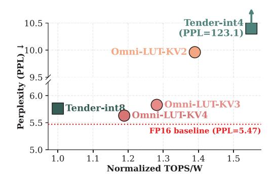

# VII. RELATED WORK

LLM Quantization. As LLM sizes and context lengths continue to grow, quantization has become a primary technique for reducing memory usage and compute cost during inference. A large body of prior work focuses on weight-only quantization [5], [18], [19], [22], [38], [39], [44], [61], [73]. Other methods quantize both weights and activations [41], [69], [72], [74], [80]. Tender [41] further proposes a decomposed quantization technique together with a customized hardware accelerator that supports INT4/INT8 AW-GEMM. Several works specifically target KV cache quantization, including KVQuant [29], Oaken [37], and KIVI [46]. Oaken [37] introduces an offline–online quantization scheme and employs a dense-and-sparse encoding

Fig. 15: Accuracy–efficiency trade-off (LLaMA2-7B, input tokens=8192, output tokens=256).

to efficiently store inlier and outlier values. Our Omni-LUT approach also focuses on low-bit KV cache quantization.

Mixed-precision LLM Accelerator. As quantization techniques proliferate, hardware support becomes increasingly critical, inspiring a range of customized accelerators [11], [26], [27], [36], [43], [47], [55], [57], [75], [76]. Mixedprecision accelerator designs aim to eliminate the dequantization overhead inherent in mpGEMM [31], [40], [50], [52]. FIGLUT [52] proposes a LUT-based GEMM accelerator that precomputes activation–weight products and stores them in lookup tables to accelerate low-bit LLM inference. The LUT Tensor Core [50] further introduces simplified bit-serial LUT units and elongated LUT tiling to maximize table reuse and sustain high mpGEMM efficiency across diverse bit-width combinations, demonstrating the applicability and potential of LUTs in mixed-precision accelerators.

## VIII. CONCLUSION

In this paper, we present Omni-LUT, a LUT-based GEMM accelerator that supports both low-bit AW-GEMM in LLM linear layers and low-bit AA-GEMM in attention. Omni-LUT combines hardware-aware KV cache quantization, scaleaware LUT generation, and a phase-adaptive WS/OS-V LUTbased systolic array, enabling LUT-based execution over the KV cache. Across diverse long-context workloads, Omni-LUT improves energy efficiency by 1.25×–1.91× over the state-of-the-art LUT-based GEMM accelerator FIGLUT under an equal peak-throughput hardware setup while maintaining model quality close to prior KV cache quantization methods.

## IX. ACKNOWLEDGMENT

This work is supported by grants from Google and the National Science and Technology Council in Taiwan (114- 2628-E-A49-017-MY3).

