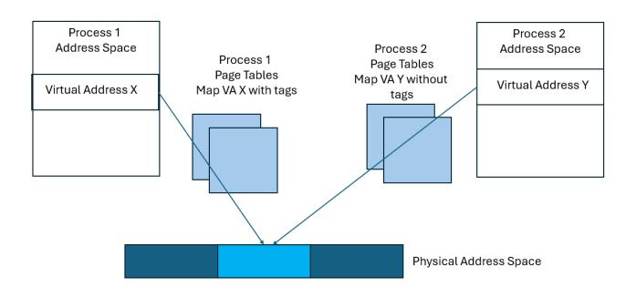

# Optimized Memory Tagging on AmpereOne® Processors

Shivnandan Kaushik, Mahesh Madhav, Nagi Aboulenein, Jason Bessette, Sandeep Brahmadathan, Benjamin Chaffin, Matthew Erler, Stephan Jourdan, Thomas Maciukenas, Ramya Jayaram Masti, Jon Perry, Massimo Sutera, Scott Tetrick, Bret Toll, David Turley, Carl Worth, Atiq Bajwa Ampere Computing, Portland, OR and Santa Clara, CA

*Abstract*—Memory-safety escapes continue to form the launching pad for a wide range of security attacks, especially for the substantial base of deployed software that is coded in pointer-based languages such as C/C++. Although compiler and Instruction Set Architecture (ISA) extensions have been introduced to address elements of this issue, the overhead and/or comprehensive applicability have limited broad production deployment. The Memory Tagging Extension (MTE) to the ARM AArch64 Instruction Set Architecture is a valuable tool to address memory-safety escapes; when used in synchronous tag-checking mode, MTE provides deterministic detection and prevention of sequential buffer overflow attacks, and probabilistic detection and prevention of exploits resulting from temporal use-after-free pointer programming bugs.

The AmpereOne® processor, launched in 2024, is the first datacenter processor to support MTE. Its optimized MTE implementation uniquely incurs no memory capacity overhead for tag storage and provides synchronous tag-checking with singledigit performance impact across a broad range of datacenter class workloads. This paper analyzes the complete hardwaresoftware stack of those workloads, identifying application memory management as the primary remaining source of overhead and highlighting clear opportunities for software optimization. The combination of an efficient hardware foundation and a clear path for software improvement makes the MTE implementation of the AmpereOne® processor highly attractive for deployment in production cloud environments.

#### I. INTRODUCTION

Memory safety continues to be a challenge for pointer based languages such as C/C++, where exploits of memory safety escapes provide a launching pad for a broad range of attacks [\[1\]](#page-11-0). The Google Chromium Project's analysis of critical and high severity security issues reported since 2015 attributed over 70% of these to memory safety, roughly evenly split between *spatial* exploits such as buffer overflow and *temporal* bugs such as pointer use-after-free [\[2\]](#page-11-1). Similar supporting data published for Microsoft products in a 2019 BlueHat presentation and for Google Android - attributed over 70% [\[3\]](#page-11-2) and 60% [\[4\]](#page-11-3) of vulnerabilities, respectively, to memory-safety escapes. While memory-safe languages such as Rust [\[5,](#page-11-4) [6\]](#page-11-5) are starting to gain adoption, the transition to these is slower than desired and memory safety remains a challenge for the broad base of C/C++ based software deployed in production environments [\[7–](#page-11-6)[9\]](#page-11-7).

Software techniques - such as address space layout randomization [\[10\]](#page-11-8) and stack canaries [\[11\]](#page-11-9) - for mitigating the impact of attacks exploiting memory-safety escapes have long been known and widely used. Similarly, hardware features such as Intel Control Flow Enforcement Technology (CET) [\[12\]](#page-11-10) for the x86 architecture and Pointer Authentication (PAC), Branch Target Identification (BTI) [\[13\]](#page-11-11) for the ARM AArch64 architecture are gaining traction. However, memory-safety violation detection and prevention solutions suitable for largescale deployment in production environments have remained elusive.

Specifically, software techniques such as Address Sanitizers in compilers (LLVM, GCC) and in the Linux Kernel have been developed for identifying memory-safety escapes during code development and testing [\[14](#page-11-12)[–16\]](#page-11-13). Historically, the x86 (Intel Memory Protection Extensions (MPX) [\[17\]](#page-11-14)) and SPARC (Application Data Integrity (ADI) [\[18,](#page-11-15) [19\]](#page-11-16)) architectures have also introduced ISA extensions to detect/prevent memorysafety escapes. However, these techniques have limited usage in production deployments due to their performance and memory footprint impact as well as the need to rewrite some portions of code, incorporating Application Binary Interface (ABI) changes [\[19\]](#page-11-16). In late 2025, the ChkTag feature was announced for the x86 architecture as a memory safety ISA extension with details of the architecture extension to become available later [\[20\]](#page-11-17).

In contrast, the ARM Architecture Memory Tagging Extension (MTE) introduced in ARMv8.5-A in 2018 [\[21\]](#page-11-18), [\[22\]](#page-11-19) is established as a promising architecture extension to detect/prevent memory safety escapes. The ISA extension allows associating tag values with pointers and physical memory. Based on comparison of the pointer tag value with the physical memory tag value for reads/writes, MTE enables deterministic detection and prevention of spatial sequential buffer overflow attacks and probabilistic detection and prevention of exploits resulting from temporal use-after-free pointer programming bugs [\[23\]](#page-11-20). Memory tag checking can typically be enabled without making any code changes to applications — at most needing to re-link the application with a tagging-enabled memory allocation library. This makes the feature attractive for use in production environments.

The AmpereOne® processor, launched in 2024, is the first datacenter System-on-Chip (SoC) that provides support for ARM MTE [\[24\]](#page-11-21). This paper provides details of its MTE implementation, which addresses the key memory capacity and performance overheads that have historically limited the deployment of memory-safety features. Through innovations in tag storage and core microarchitecture, the AmpereOne® processor delivers a hardware foundation designed to minimize the cost of tagging. Benchmarking results demonstrate that on this foundation, datacenter workloads can gain the benefits of MTE with only a single-digit percentage performance impact on a design that incurs no memory capacity overhead. This result establishes an efficient hardware baseline for what is fundamentally a hardware-software co-design effort. By mitigating the primary hardware costs, this work paves the way for the software ecosystem to further optimize allocators and runtimes, making performant, production-ready memory safety an achievable goal.

This paper is structured as follows. Section [II](#page-1-0) provides an architectural overview of the ARM Memory Tagging Extension. Section [III](#page-2-0) provides an overview of contemporary processor implementations of MTE targeted at handheld devices. Sections [IV](#page-2-1) and [V](#page-3-0) discuss aspects unique to a datacenter SoC MTE implementation and the tradeoffs among microarchitectural options. Section [VI](#page-5-0) provides details of the MTE implementation on the Ampere Computing AmpereOne® processor. Section [VII](#page-6-0) provides details on the performance impact of software use of MTE for a range of datacenter workloads, along with an analysis of the cause of performance deltas. Section [VIII](#page-10-0) includes a discussion of potential future enhancements to the Ampere MTE implementation and implications of future memory technology directions. Finally, Section [IX](#page-10-1) provides concluding thoughts on MTE and the optimized implementation in the AmpereOne® processor.

#### II. ARM MEMORY TAGGING EXTENSION OVERVIEW

The ARM Memory Tagging Extension (MTE) is a memorysafety feature that provides mechanisms for the detection and prevention of the two main classes of memory-safety escapes. Specifically, with appropriate software use of tag values, it provides deterministic detection and prevention of sequential buffer overflow attacks and probabilistic detection and prevention of exploits resulting from use-after-free and similar pointer programming bugs [\[22\]](#page-11-19). MTE provides the above capabilities with the following architecture elements:

- Physically addressable memory is partitioned into 16 byte *granules*. Software (typically the malloc implementation) assigns a 4-bit *allocation tag* to each granule using new tagging instructions. The architecture does not specify where allocation tags must be stored and leaves that choice to the SoC implementation.
- The pointer used to access the memory contains a 4 bit *address tag* located in the upper unused bits of the virtual address. The address tag is programmed by software (e.g. malloc) when a pointer to allocated memory is returned. The ARM architecture provides a top-byte-ignore capability (TBI) [\[25\]](#page-11-22) to indicate that the highest order byte - in which the address tag is located - not be used by the processor when performing address translation for the virtual address.
- The address tag is checked against the allocation tag before every memory read/write access. The architecture allows for mismatches between the allocation and address tags to be handled either *synchronously* or *asynchronously*.

Fig. 1: Buffer Overflow detection and mitigation with Memory Tagging

- The synchronous mode (SYNC) signals an exception on any mismatch and prevents the access from completing, similar to a page or permission fault.
- The asynchronous mode (ASYNC) allows the memory read/write to complete and sets a system register bit to indicate that a tag mismatch has occurred for later examination by software.

With a careful choice of allocation tag values for buffers located sequentially in memory, MTE can detect, and in the synchronous mode, prevent buffer overflow accesses. Given that 4-bits are available for a tag value, memory allocation software reuses tag values resulting in the probabilistic detection and (in synchronous mode) prevention of escapes resulting from pointer programming/temporal use-after-free bugs. [Figure 1](#page-1-1) illustrates a scenario where use of memory tagging can effectively detect and mitigate a buffer overflow. In the example, there are two separate but sequentially located allocations of memory from a heap - the first returned with a pointer/address P and the second with a pointer/address Q. Memory allocated for pointer P is tagged with allocation tag value of 4 and the tag value 4 is programmed in bits 56:59 of the pointer virtual address as the address tag. Similarly, memory allocated for pointer Q is tagged with an allocation tag value of 1 and the tag value 1 is programmed in bits 56:59 of the pointer virtual address as the address tag. References from pointer P and pointer Q within their allocated memory ranges "pass" since the address tag and the allocation tags match. However, for an access using Pointer P that goes past the end of its allocated memory range into the memory range for allocation Q, the address tag value of 4 does not match the allocation tag value of 1. In SYNC mode, the PE raises a tag mismatch fault and the access does not complete.

Microsoft published an analysis of the effectiveness of the deterministic and probabilistic protection provided by MTE for memory safety escapes reported in their CVEs [\[26\]](#page-11-23). The analysis supports the underlying value proposition for MTE, providing:

- Deterministic and durable protection for ~13% of memory-safety escapes reported (in the period covered by the report) associated with "Heap adjacent over-run/overread" exploits.
- Probabilistic protection for "use-after free" bugs (~26% of vulnerabilities reported in the period covered by the report) with attack probability reduced to 6% if all tag bits are used, and
- Probabilistic protection for "Heap out-of-bounds read or write (non-adjacent)" bugs (~27% of vulnerabilities reported in the period covered by the report) with attack probability reduced to 6% if all tag bits are used.

#### III. ARM MTE IN MOBILE PROCESSORS

Since the introduction of the ARM MTE architecture extension in 2018, several processors for handheld devices with support for MTE have been brought to market.

The Google Pixel 8 and Pixel 8 Pro [\[27\]](#page-11-24) phones, launched in October 2023, introduced support for ARM MTE with both synchronous and asynchronous tag-checking modes. MTE support is not enabled by default on the production phone software, but is available as a capability to application developers. MTE in SYNC mode has successfully found use-afterfree pointer bugs on these devices [\[28,](#page-11-25) [29\]](#page-12-0).

The Apple iPhone 17 and iPhone 17 Pro built on the Apple A19 and A19 Pro processors, respectively, and launched in September 2025, provide comprehensive support for the ARM MTE architecture extension [\[30\]](#page-12-1). Leveraging MTE support in the Apple A19 and A19 Pro processors, in conjunction with an extensive software investment in type-aware secure memory allocators and significant micro-architecture investments in the synchronous mode for MTE, the iPhone 17 and iPhone 17 Pro provide a comprehensive, always-on protection against attacks exploiting memory-safety escapes for the kernel and key user-mode processes. The use of the MTE SYNC mode is specifically called out as a requirement for effective protection from memory safety escapes.

Both the Google Pixel 8 and Apple A19 processors have MTE implementations purpose built for handheld devices. Meanwhile, the datacenter platform, and software environment for which the MTE support in the AmpereOne® processor is implemented, has unique differences from a handheld device's platform and software environment. The differences introduce a set of trade-offs, offering opportunities like the assurance of ECC-enabled memory configurations across all datacenter platforms, yet simultaneously posing challenges related to multi-tenancy and datacenter workload sensitivity to any memory bandwidth/latency degradation. Section [IV](#page-2-1) covers details on these considerations when building MTE support in a datacenter targeted SoC - specifically the need for MTE SYNC mode for effective protection from memory safety escapes.

#### IV. MTE CONSIDERATIONS FOR DATACENTER SOCS

The datacenter platform and operating environment create unique challenges while providing opportunities to develop support for MTE in an SoC. This section outlines these along with a discussion of the implications for MTE support.

#### *A. Memory Capacity and Reliability*

Financially, DRAM emerges as the most expensive ingredient in a datacenter platform. Meta's internal data reveals that DRAM's share of the total platform cost rose from 15% in their first generation to a notable 35% in their sixth generation platform [\[31\]](#page-12-2).

DRAM capacity is a key design point for datacenter platforms. Cloud Service Providers (CSPs) provide Platformas-a-Service (PaaS) capabilities through Virtual Machines (VMs) that are configured for different workload classes with guarantees on the number of cores and amount of memory available to software in each VM profile [\[32](#page-12-3)[–34\]](#page-12-4). Cloud service providers' datacenter platforms are designed to have the appropriate ratio of cores to total DRAM populated in the platform to support the optimal configuration of VM profiles from a Total Cost of Ownership (TCO) perspective. Any reduction of memory available to software has a direct impact on the density of provisioned VMs and the resulting cloud providers' TCO.

For the MTE architecture, employing a 4-bit tag per 16 bytes of data, the memory footprint for storing allocation tag values is ~3% of the total software-visible memory ((4 bits / (16 bytes \* 8 bits/byte + 4 bits)) = 3.03%). The SoC implementation needs to provide memory for tag storage for the entirety of the memory accessible to software [\[25\]](#page-11-22) given the potential for all of this memory to be tagged. Consequently, an implementation option that avoids reducing the capacity of software-available memory is highly desirable for MTE's production deployment.

Datacenter environments are characterized by a high volume of platform deployments, each with large memory footprints. Given this scale, robust memory reliability features are paramount to detect and correct memory failures and ensure the necessary up-time for datacenter platforms. Thus, comprehensive ECC support across all DIMM configurations, including SECDED and SymbolECC[1](#page-2-2) capabilities within the SoC, is considered a minimum requirement for deployed memory configurations [\[35\]](#page-12-5).

#### *B. Multi-Tenancy*

Data shared by Microsoft indicates that more than 90% of VM profiles supported in Azure datacenters are single vCPU, i.e., a single core is available to software running in the VM [\[36\]](#page-12-6). In platforms with a high core count SoC such

1SymbolECC is a proprietary Ampere feature, based on the Reed-Solomon algorithm. Its correction properties are comparable to what is known in the industry as Chipkill (IBM), SDDC (Intel), AdvancedECC (HP), STAR ECC (Synopsys), and ExtendedECC (Sun Microsystems).

as the AmpereOne® SoC with up to 192 cores, a very large number of VMs, each with different users/tenants, can be colocated and executing at the same time on the same platform. This multi-tenancy creates unique security challenges. The potential uniqueness of the software image in each VM creates a large surface area for memory-safety escapes. Furthermore, there is a risk that an exploit in one VM can expose other tenants on the same platform if the hypervisor and/or service operating system are exposed. Hence, both detection and immediate prevention of attacks are necessary in production deployments. This implies that the SYNC mode for MTE must be used and the SoC should implement SYNC support in a performant fashion. Production cloud environments already provide strong isolation across VMs, and between VMs and the hypervisor, using a range of primitives including ISA based memory management and virtualization capabilities; so using memory tagging provides an additonal detection and mitigation capability for IOMMU containment for DMA traffic and Confidential Computing technologies such as SEV-SNP [\[37\]](#page-12-7), TDX [\[38\]](#page-12-8) and ARM CCA [\[39\]](#page-12-9). Also, there is recent growing interest in the use of memory tagging for isolation of un-trusted code from the rest of the system [\[40\]](#page-12-10).

Multi-tenancy introduces complexities concerning colocated tenants' use of the MTE feature. Unlike the homogeneous environment of a handheld device, where a phone provider has control over MTE usage across the software stack, a cloud environment would enable each tenant to independently configure MTE for their respective software images. From the SoC perspective, enabling MTE for even a single tenant requires the SoC to operate under the assumption that all allocation tags are potentially valid and must be preserved during memory writes. Although tagged memory pages are explicitly identified in page tables in the ARM MTE architecture, commercial operating systems allow for physical memory to be mapped by multiple page tables. [Figure 2](#page-3-1) illustrates a scenario in which a physical address can be mapped into the address spaces of two different processes, one mapping with tagging enabled and the other without tagging. The first mapping at virtual address A in process 1 could be used to instantiate a valid set of tag values associated with the physical address space. A PE walking the page tables for virtual address Y in process 2 cannot assume that the target physical address does not have valid tag, even though the page table mapping indicates as such. Consequently, the SoC cannot solely rely on page table tagging attributes to determine tag preservation, and must conservatively maintain all tag values. This conservative approach can potentially introduce performance overheads impacting all co-located tenants. Given that various virtual machine profiles offered by cloud service providers include performance guarantees, it is critical for SoC implementations to minimize MTE-induced overhead, typically aiming for single-digit percentage performance impact.

#### *C. Goals for MTE support on the AmpereOne SoC*

In summary, the requirements of the datacenter operating environment motivated the following goals for the implemen-

Fig. 2: Necessity for Tag Value preservation by the Processing Element.

tation of MTE on the AmpereOne® SOC:

- Minimize or eliminate the memory capacity impact associated with MTE allocation tag storage without compromising memory reliability capabilities.
- Support the SYNC mode for tag checking as the primary usage mode, which is essential for production deployments.
- Optimize the micro-architecture implementation to minimize performance impact in SYNC mode.
- Reduce performance degradation for software configurations that do not utilize tag checking, even when MTE is globally enabled on the SoC.

