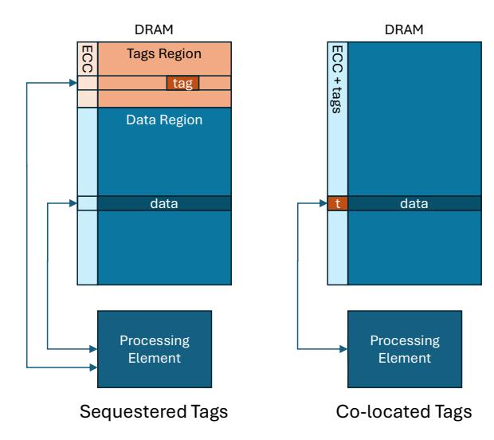

# V. TAGGING IMPLEMENTATION OPTIONS AND TRADEOFFS

Achieving these goals requires minimizing three categories of overhead:

- *Tag Storage Overhead*: Impact on available memory capacity due to the tag storage mechanism.
- *Tag Fetch Overhead*: Latency introduced by retrieving allocation tags during memory read/write operations for tag checking.
- *Tag Checking Overhead*: Computational cost associated with verifying the congruence between allocation and address tags.

#### *A. Tag Storage Considerations*

The organization of MTE allocation tags in memory is a critical design element because it determines the tag storage overhead, and therefore directly affects practicality of MTE deployments. Broadly, there are two ways to organize MTE allocation tags in memory. These are depicted in [Figure 3.](#page-4-0)

Statically allocate sequestered memory for tags: This option involves reserving a dedicated portion of the total physical memory for tag storage at system boot. Given that each 16 byte memory granule requires four bits for its tag, (4 bits / (16 bytes \* 8 bits/byte + 4 bits)) = 3.03% of the platform's physical memory must be exclusively reserved for tag data. While methods for partitioning memory at boot are well-established for various specialized usages, their application for MTE tag storage presents significant challenges. As discussed in Section [IV,](#page-2-1) tag storage must be reserved for the entire physical memory present on the platform, due to the infeasibility of predicting which memory regions will be tagged by software

Fig. 3: Comparison of Tag Storage Methods

at runtime. Consequently, sequestering 3% of the total memory directly impacts the density of VMs that a CSP can provision, leading to an increase in TCO. As cloud servers are equipped with terabytes of installed DRAM, this 3% reservation of memory translates into a substantial burden.

**Co-locate tag storage with data:** This option stores tags alongside the data in dedicated meta-data bits that are not otherwise usable as memory by software. This scheme eliminates the need to carve out software visible physical memory for tag storage up-front, and is favorable to datacenter deployments.

In server platforms populated with memory technology that has ECC support, one option to store allocation tags is to use a subset of the ECC bits. Since these bits are used only by the memory controller unit (MCU) to provide memory reliability features, use of these bits does not impact total memory capacity available to software and eliminates the impact on VM density and TCO degradation to the cloud service provider. AmpereOne® SoC servers use DDR5 registered DIMMs with ECC support providing access of 80 Byte Codewords (64B data + 16B of parity ECC), with a capability to correct a full symbol of 1 Byte. While this allows use of the ECC bits for tag storage, micro-architecture enhancements are needed in the MCU to provide the memory reliability capabilities needed in datacenter platforms using the remainder of the ECC bits available. This support is discussed later in Section VI-B. A similar technique for storing metadata in ECC bits is found in the Sun SPARC ADI implementation for Memory Tagging [18], the RISC-V based Rocket SOC from lowRISC.org [41], architectures for Confidential Computing [42] and GPU memory safety [43].

## B. Tag Fetching Considerations

The organization of MTE tags in memory also affects the tag fetch overhead and hence, the run-time performance of applications that use MTE. If tags are not co-located with their data, the CPU read requests to tagged memory will require separate reads to fetch the corresponding allocation tags; these

|                    | rugo ocquestereu |              | rugs ou-Locatea |              |  |
|--------------------|------------------|--------------|-----------------|--------------|--|
|                    | Coherent         | Memory       | Coherent        | Memory       |  |
|                    | Transactions     | Transactions | Transactions    | Transactions |  |
| Read Data and Tag  | 2                | 2            | 1               | 1            |  |
| Write Data and Tag | 2                | 1 + 1 (RMW)  | 1               | 1            |  |
| Read Tag Only      | 1                | 1            | 1               | 1            |  |
| Write Tag Only     | 1                | 1 (RMW)      | 1               | 1 (RMW)      |  |
| Read Data Only     | 1                | 1            | 1               | 1            |  |
| Write Data Only    | 1                | 1            | 1               | 1 (RMW)      |  |
|                    |                  |              |                 |              |  |

Tage Co. Located

Tage Soguestored

Fig. 4: Transaction Counts per Operation

tag reads consume additional memory bandwidth and also potentially increase memory latency for read operations. CPU reads to untagged memory will not require additional memory reads but may be indirectly affected by the increased traffic due to tagged memory reads. Co-locating tag storage with data allows reading the tags along with the data without generating additional memory traffic and hence, doesn't negatively impact memory bandwidth and latency. Figure 4 shows the relative impact on bandwidth consumption of the MCU and Mesh interconnect on each core cache miss, based on the choice of tag storage method. RMW indicates that the memory subsystem is required to perform a Read-Modify-Write to update the MTE tags. Previous work has demonstrated the performance impact of the increased traffic for memory tagging, in both CPU and GPU architectures [42–44].

## C. Tag Checking Considerations

Synchronous tag checking can introduce latency to memory load and store operations, contingent on the specific implementation. This latency arises because tag validation must complete within the CPU pipeline before the memory operation is allowed to commit. This requires pipeline enhancements to perform the check without significantly degrading overall pipeline throughput.

When tags are sequestered from data, both loads and stores can experience additional latency, as tag retrieval requires separate memory transactions. In contrast, if tags are colocated with data, the tag check for load operations incurs virtually no overhead, as tags and data arrive simultaneously. Thus, co-location offers distinct advantages by impacting only store operations with added latency.

A notable disadvantage of co-location, however, is that untagged write-only transactions must be converted into read-modify-write (RMW) operations to preserve existing tags. This conversion can introduce latency and increase bandwidth requirements, particularly if the RMW operation entails loading the cache line into core caches. These overheads may be mitigated by the potentially higher bandwidth of the core to perform RMWs compared to the MCU.

