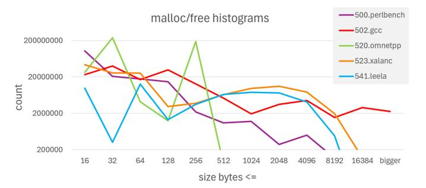

# VII. EVALUATION OF AMPERE'S MTE IMPLEMENTATION *A. Platform Configuration*

The System Under Test (SUT) utilized an Ampere Computing reference platform, designated as Mt. Mitchell [\[46\]](#page-12-16). This rack server was equipped with an AmpereOne® M SoC, featuring 192 cores operating at 3.2 GHz. Memory consisted of 512 GB of SK Hynix DDR5 modules, arranged in an 8x64 GB configuration and operating at 5200 MT/s. The configuration supported SymbolECC for RAS capabilities. For I/O, Samsung NVMe Solid State Drives (SSDs) provided storage, and Mellanox ConnectX 100GbE cards managed all network communications. To generate traffic, two 128-core Ampere Altra® Max servers served as client systems. The clients are configured to keep the servers fully active under a P99 service level agreement. Typically, there is a one-to-one correspondence between client and SUT cores to saturate the system for performance measurement.

#### *B. Software Environment and Workloads*

The Linux kernel has supported MTE since version 5.1.0 [\[47\]](#page-12-17), with corresponding support added to GNU Binutils in version 2.45 [\[48\]](#page-12-18) and to the GNU C Library (glibc) in version 2.33 [\[49\]](#page-12-19). Fedora 36 and later distributions ship their kernels with CONFIG\_ARM64\_MTE enabled by default. For the following experiments, the system under test operated on Fedora 40 with GNU/Linux 6.10.6 and glibc 2.39.

To assess MTE's performance impact, motivated by similar evaluations [\[50\]](#page-12-20), data was collected from a diverse range of real-world datacenter applications. These are industry-standard benchmarks, widely recognized for datacenter workload characterization and competitive performance evaluation. In all benchmark runs, all available cores on the SoC were fully utilized, to the extent each benchmark allowed.

Memory tagging-specific overheads for tag fetching and checking are identical for workloads running bare-metal or within a VM; no additional VM-exits are introduced by tag setting or checking. We measured the MTE performance in a VM for subset of the workloads early in the AmpereOne program and found that the virtualization overhead (primarily from stage-2 translations) slightly dilutes the MTE performance impact compared to a bare-metal configuration. Hence, the paper focuses on the worse case of the two, bare-metal workloads, to fully expose the performance impact.

A summary of the benchmarks utilized is provided below.

memcached / memtier [\[51,](#page-12-21) [52\]](#page-12-22): memcached is an open source in-memory NoSQL key/value distributed object caching database application. For performance evaluation, a client-server configuration was employed, using memtier\_benchmark-v1.3.0 load generators connected over a high-speed network to the server SUT. The SUT executed multiple independent instances of memcached-v1.6.21.

One important aspect of the SUT configuration was the allocation of CPU resources for IRQ handling. The Mellanox ConnectX NIC has 127 IRQs. If these network interrupts were handled by the same cores running memcached, it would lead to performance contention, particularly when running 192 memcached instances. This contention would result in significantly lower throughput and three times higher P99 latency. To mitigate this and adhere to latency SLAs, 20 SUT cores were explicitly dedicated to handling NIC IRQs, which left 172 cores to run memcached instances.

The workload parameters were set to a 64-byte payload size and a 1:10 set-to-get ratio. To generate traffic, two Ampere Altra® Max servers served as client systems, each configured to run 86 concurrent threads, totaling 172 client request threads. This setup aimed for a one-to-one correspondence between client threads and active SUT cores, for optimal system saturation indicative of a well-tuned cloud server.[2](#page-6-1)

Redis / memtier [\[52,](#page-12-22) [53\]](#page-12-23): Redis is an open source inmemory NoSQL key/value data store that functions as either a database or an application cache. The experimental setup employed a client-server configuration: multiple client systems, running the memtier\_benchmark-v1.3.0 load generation tool, connected over a high-speed network to the System Under Test. The SUT executes multiple, independent, single-threaded instances of Redis-v7.2.0 servers. While Redis workloads typically leverage the jemalloc memory allocation library [\[54\]](#page-12-24), jemalloc currently does not support memory tagging. Therefore, to evaluate tagging impact, Redis was linked with glibc to use the standard malloc memory allocator.

2The other cloud benchmarks' NIC and client setups were similarly tuned to achieve maximum server throughput in the baseline.

vbench (H.264 Video Transcoding Benchmark) [\[55\]](#page-12-25): vbench is a benchmark designed for evaluating H.264 video transcoding scenarios in cloud-based video-as-a-service (VaaS) applications. It assesses transcoding performance relevant to typical cloud video workflows, and employs 15 H.264-compressed input files, varying in resolution (480p to 4K) and frame rates (25 to 60 fps). For this analysis, the focus was on two distinct VaaS profiles, Upload and Video On Demand (VOD):

*Upload Profile:* Measures transcoding speed and output quality for a first-uploaded temporary file. The primary objective is to make the video available for subsequent processing with minimal delay, without degrading the quality of the original input. This profile's reference uses a single-pass encoding with a constant quality target, allowing the encoder to use a high bitrate to maintain quality.

*VOD Profile:* Simulates scenarios where quality degradation impacts user experience. It strictly mandates that the transcoded quality must not be degraded compared to the reference. This profile's reference is based on an average case, employing a two-pass encoding strategy with a fixed bitrate target, processing in the background for VOD preparation.

nginx / wrk [\[56,](#page-12-26) [57\]](#page-12-27): nginx is an open-source web server commonly employed as a reverse proxy, load balancer, or HTTP cache. To focus on server-side computational overhead, the SUT was configured with Brotli compression and the workload requests initiated server-side Lua scripts [\[58\]](#page-12-28). Given this CPU-bound scenario, a one-to-one client-server configuration is employed where a single client running the wrk-v4.1.0 load generator was sufficient to saturate the SUT. The client connected via a high-speed network to the SUT, which ran a single instance of nginx-v1.24 that spawned a worker process per core.

MySQL / sysbench [\[59,](#page-12-29) [60\]](#page-12-30): MySQL is an open source, SQLcompliant, relational database management system (RDBMS). For performance evaluation Sysbench v1.1, a multi-threaded load generation and benchmarking tool, is employed. Sysbench was used to establish a simple database schema, populate database tables, and generate multi-threaded SQL query workloads. These queries were directed to a single instance of the MySQL-v8.0.43 database server, running concurrently with Sysbench on the SUT and communicating via TCP over a local network interface.

PostgreSQL / HammerDB [\[61,](#page-12-31) [62\]](#page-12-32): PostgreSQL is an open source SQL-compliant, object-relational database management system (ORDBMS). For performance evaluation a client system running HammerDB-v4.3, a multi-threaded load generation and benchmarking tool to generate a TPC-C-like workload, was employed. This workload was transmitted over a high-speed network to the SUT, executing a single instance of the PostgreSQL v15.3 database server.

SPEC CPU® 2017 integer base [\[63\]](#page-12-33): SPEC CPU was run in refrate mode with 192 copies to saturate the system and estimate SPECrate®2017\_int\_base. The binaries were built with open-source community gcc-15.1.1 with these base optimization flags: -O3 -mcpu=ampere1a -flto.

#### *C. Performance Analysis*

Contemporary research [\[50\]](#page-12-20) has analyzed ARM MTE performance overheads using single-copy SPEC CPU, and a consolidated multi-tenant setup where both the server benchmark and client load generators are hosted on a single machine. In contrast, the measurements presented below are from 192-copy SPEC CPU and fully utilized server platforms with discrete client load generators. While both approaches are valid, this one closely emulates real-world cloud deployments operating at peak utilization, and offers a unique yet complementary perspective on MTE performance.

Three distinct system configurations are used for performance testing. Since MTE can be controlled at two levels, hardware (enabled/disabled in silicon) and software (tag checking enabled/disabled in user mode), this leads to the following three scenarios.

- A. MTE Disabled: The feature is disabled in silicon.
- B. MTE Enabled, No Tag Checking: MTE is enabled in silicon. The user-mode software does not use the tag checking enabled option for the glibc memory allocation library.
- C. MTE Enabled, With Tag Checking: MTE is enabled in silicon. The user-mode software is configured to use the tag checking enabled option for the glibc memory allocation library. Tag checking is enabled by setting the environment variable for SYNC mode: GLIBC\_TUNABLES=glibc.mem.tagging=3

This framework enables the performance analysis of two critical decisions: one for datacenter operators regarding hardware MTE enablement, and another for applications selecting to utilize MTE's memory safety features. In multi-tenant environments like cloud platforms, enabling MTE in hardware for one application or virtual machine could impose an inherent overhead on other co-located applications, even if they do not utilize MTE's tag checking. This "always-on" hardware overhead (B vs. A) is a critical consideration for cloud service providers. For an application intending to leverage MTE's safety features, the relevant overhead is the performance degradation when MTE with tag checking is fully active versus when MTE is available but tag checking is disabled (C vs. B).

To guide these two decisions, both performance ratios across the benchmarks are shown. [Figure 6](#page-8-0) presents the performance ratios and measurement metrics for each datacenter cloud workload. [Figure 7](#page-8-1) reports the ratios for each SPEC CPU 2017 benchmark in 192-copy refrate. To account for the inherent run-to-run variability observed in multi-threaded cloud workloads, each benchmark was executed five times. The resulting data were statistically analyzed using ministat [\[64\]](#page-12-34), which compares two small populations to compute performance ratios and their associated error bars using Student's *t*-test [\[65\]](#page-12-35). All statistical comparisons were performed at a 99% confidence level. Results designated as "on par" indicate that no statistically significant performance difference could be discerned between the compared populations.

| Performance comparison | Hardware MTE |        | + tag enable |        |       |
|------------------------|--------------|--------|--------------|--------|-------|
| Benchmark              | metric       | B/A    | +/-          | C/B    | +/-   |
| memcached / memtier    | Ops/s        | 1.076  | 0.044        | on par |       |
| Redis / memtier        | Ops/s        | on par |              | on par |       |
| vbench H.264 Upload    | Score        | 0.982  | 0.002        | 0.949  | 0.002 |
| vbench H.264 VOD       | Score        | 0.943  | 0.008        | 0.949  | 0.001 |
| nginx / wrk            | Req/s        | on par |              | 1.022  | 0.005 |
| MySQL / sysbench       | Req/s        | 0.963  | 0.015        | 0.964  | 0.014 |
| PostgreSQL / HammerDB  | Req/s        | on par |              | on par |       |

Fig. 6: Performance impact on datacenter workloads. B/A shows the performance ratio when enabling MTE hardware, and C/B is the subsequent ratio after enabling tag checking. Each result is from five runs processed through ministat; "on par" indicates no difference proven with 99% confidence.

When looking at the B vs. A comparisons, enabling MTE in hardware can introduce a small overhead even when applications are not using tagging, due to SoC mechanisms that preserve tag state through the memory hierarchy. This platform-level comparison is relevant for multi-tenant deployments where a cloud provider enables MTE across the fleet. Across the workloads evaluated in Figures [6](#page-8-0) and [7,](#page-8-1) that overhead was in the 1–6% range, while memcached exhibited a 7% improvement (with high variance). In this case, tagloads effectively become prefetches, since tag-checking is turned off. Since tags and data are co-located, cache lines are brought in to the L1 data cache which happen to be beneficial to the instruction stream being executed. The source of the MTE performance benefit to memcached was confirmed with PMU data, which showed a significant reduction in time spent waiting for L2 misses, without a significant change in other operations which can prefetch lines into the cache, such as hardware prefetches or wrong-path speculation. Practically, these numbers suggest that tenants not asking for tag checking experience only modest impact when the platform enables MTE support for other users.

Next, the comparison of C vs. B, which is the cost of turning on tag checking for applications. The overall performance impact of tagging is in the mid single-digit percentages with high confidence. Interestingly, in nginx shows a small but measurable speedup. This gain can be attributed to a prefetchlike effect: to perform tag checking, the cache line for a store is fetched earlier in the pipeline (prior to commit), allowing dependent memory operations to benefit from the prefetched line. When execution is limited by store latency and there is headroom in load-side bandwidth, this earlier fetch reduces the critical path and can improve overall throughput. The L2 prefetchers also get trained by tag-loads, which can lead to further benefits.

The primary sources of hardware slowdown stem from first-generation MTE integration in the AmpereOne® microarchitecture and pipelines. First, as also observed by [\[50\]](#page-12-20), store-to-load forwarding opportunities are reduced for tagchecked stores in the core. Second, the additional tag-read traffic increases pressure on L1D cache read ports, introducing structural hazards in the load/store pipeline. Refinements to address both of these issues have been incorporated into the

|                 | Performance comparison |              | Instructions committed |              |
|-----------------|------------------------|--------------|------------------------|--------------|
|                 | HW MTE                 | + tag enable | HW MTE                 | + tag enable |
| Benchmark       | B/A                    | C/B          | B/A                    | C/B          |
| 500.perlbench_r | 1.000                  | 0.927        | 1.000                  | 1.003        |
| 502.gcc_r       | 0.942                  | 0.698        | 1.000                  | 1.073        |
| 505.mcf_r       | 0.974                  | 0.971        | 1.000                  | 1.001        |
| 520.omnetpp_r   | 0.987                  | 0.913        | 1.000                  | 1.028        |
| 523.xalancbmk_r | 0.990                  | 0.855        | 1.000                  | 1.031        |
| 525.x264_r      | 0.987                  | 0.968        | 1.000                  | 1.000        |
| 531.deepsjeng_r | 0.980                  | 1.002        | 1.000                  | 1.000        |
| 541.leela_r     | 0.977                  | 0.982        | 1.000                  | 1.006        |
| 548.exchange2_r | 1.007                  | 0.989        | 1.000                  | 1.003        |
| 557.xz_r        | 0.995                  | 0.987        | 1.000                  | 1.000        |
| Geomean         | 0.984                  | 0.924        |                        |              |

Fig. 7: Performance impact on 192-copy Est. SPEC CPU® 2017 benchmark scores. B/A shows the performance ratio when enabling MTE hardware, and C/B is the subsequent ratio after enabling tag checking. Analysis shows that committed instructions can increase when requesting tag checking.

next generation of Ampere's CPU cores.

Enabling MTE on the SPEC CPU 2017 suite results in a geometric mean performance degradation of 7.6% on SPECrate, as detailed in [Figure 7.](#page-8-1) This figure is heavily influenced by significant regressions in 502.gcc and 523.xalanc, and to a lesser extent, 500.perlbench and 520.omnetpp. Our analysis of these four workloads indicates that the slowdown stems not from the hardware core issues cited above, but rather a combination of the following software factors:

Increased Instructions Committed: The right-most columns in [Figure 7](#page-8-1) show that the number of retired instructions increases when memory tagging is enabled. This growth is attributable to two principal sources.

First, at user level, malloc(3) and related allocator paths in glibc expand to manage tag initialization and maintenance, adding instructions in the hot paths of allocation and deallocation to set allocation tags on newly returned memory and to clear tags on free. This includes the function libc\_mtag\_tag\_region() in glibc.

Second, at the kernel interface, glibc disables use of brk(2) for its arenas when tagging is requested and instead relies on mmap(2). The brk(2) path, which primarily advances the program break to grow the heap (a simple move of a top-of-heap pointer), does not readily provide the page attributes or initialization required for MTE such as setting PROT\_MTE and preparing tag storage. In contrast, mmap(2) allows the allocator to request appropriately protected anonymous mappings, but it incurs higher instruction overhead: selecting a suitable virtual-address range, creating or merging VMAs (Virtual Memory Areas), updating page tables, honoring protection and flags, and triggering first-touch work and tag initialization. The kernel marks these pages as MTEcapable, and tag setup further increases instruction count and latency on first access.

[Figure 8](#page-9-0) illustrates this shift: with tagging enabled, calls that would have used brk(2) are replaced by mmap(2)

| system call count, 1-copy       | brk(2) | mmap(2) |
|---------------------------------|--------|---------|
| 502.gcc Mode B (HW MTE)         | 32142  | 94      |
| 502.gcc Mode C (+tag enable)    | 0      | 28313   |
| 520.omnet Mode B (HW MTE)       | 2147   | 92      |
| 520.omnet Mode C (+tag enable)  | 0      | 1937    |
| 523.xalanc Mode B (HW MTE)      | 3609   | 52      |
| 523.xalanc Mode C (+tag enable) | 0      | 3712    |

Fig. 8: Breakdown of memory allocation system calls on the SPEC CPU benchmarks which show an increase in instructions committed in Mode C.

based arena growth, increasing syscall and kernel work on the allocation path.

Eager Tag Initialization: Our investigation uncovered that 502.gcc and 523.xalanc allocate substantially large virtual address ranges while touching only a fraction of the space. Conventional allocators defer physical-page instantiation until first write; however, when an application requests MTE-tagged regions, these allocators perform eager tag initialization across the entire region before returning. This removes the benefits of lazy population and inflates first-touch costs, disproportionately affecting these workloads. The effect is amplified under homogeneous SPECrate runs, where identical phases execute in lock-step across cores, compounding the adverse behavior.

Transient Small-Object Allocations: The increased instruction execution detailed previously is not uniform; its magnitude depends heavily on an application's memory allocation patterns, specifically the frequency, size, and spatial locality of its allocations. The overhead is most acute in workloads characterized by frequent, small, and transient object allocations that result in a fragmented memory layout. With MTE enabled, each call to malloc incurs a semi-fixed instruction cost to initialize the allocation tag. While this per-call overhead is easily amortized over large, long-lived allocations, it becomes a dominant factor for workloads that perform millions of small, short-lived allocations, directly increasing the userspace instruction count. To validate this hypothesis, we intercepted memory management calls using LD\_PRELOAD to profile their frequency and size. [Figure 9](#page-9-1) plots the counts on a log scale for the five benchmarks exhibiting the largest increase in retired instructions. A strong correlation is evident: workloads with the most significant performance degradation are precisely those with the highest frequency of small-object allocations: 502.gcc, 520.omnetpp, 523.xalanc, followed by 500.perlbench. The other five benchmarks in CPU2017 have allocation counts too low to be visible on the chart's scale.

However, allocation frequency alone is insufficient to explain the full performance impact. For example, 500.perlbench also shows high allocation frequency but experiences a more modest slowdown. This suggests that the spatial pattern of allocations is a critical second factor. We hypothesize that workloads creating a fragmented virtual address space see

Fig. 9: Distribution of memory allocation sizes and frequencies (log scale) for key benchmarks in SPEC CPU (1-copy). The workloads exhibiting the highest rates of small- to medium-sized allocations directly correspond to those most impacted by MTE overhead. This plot visualizes the allocationintensive behavior that drives MTE performance degradation.

amplified overheads at both the kernel and hardware levels. A fragmented layout increases the number of distinct VMAs the kernel must manage, making mmap(2) calls and page fault handling more expensive. This degrades spatial locality, leading to more TLB misses and costly page table walks.

This hypothesis aligns with the observed behavior. Workloads like 502.gcc, which construct complex, graph-like data structures (e.g., abstract syntax trees), naturally produce a more disjoint and fragmented allocation pattern. This fragmentation is exacerbated by 502.gcc's frequent use of realloc(3). When these reallocations require moving data, their cost is amplified under MTE: the old memory region must be de-tagged and the new region must be tagged, effectively doubling the tag management overhead for a single high-level operation. In contrast, the more linear, stream-like processing in 500.perlbench with zero realloc's results in better memory locality and a less fragmented VMA layout, mitigating some of the kernel- and hardware-level penalties despite also having a high allocation rate of small objects. This finding is consistent with studies of other hardware-based memory safety features; prior research [\[66\]](#page-12-36) similarly identified the high frequency of heap operations in 502.gcc and 520.omnetpp as the primary performance limiter due to the overhead of extra operations added to the allocator's critical path.

Therefore, the most significant MTE-related slowdowns occur when a high frequency of small transient allocations is combined with a fragmented access pattern within a large memory footprint. This scenario creates a "perfect storm" that stresses many sources of overhead simultaneously: the userspace allocator, kernel memory management, reallocation of memory, and the hardware's address translation mechanisms.

To further validate the hypothesis that frequent, fragmented allocations are a primary source of overhead, we evaluated the performance of these workloads with jemalloc [\[54\]](#page-12-24), a memory allocator designed to mitigate fragmentation. It accomplishes this through techniques such as size-classed arenas, which are particularly effective for workloads with high rates of smallobject allocations. If our hypothesis is correct, the applications impacted by MTE should, in turn, derive benefit from a fragmentation-aware allocator like jemalloc.

| Mode B, rate-192 | jemalloc uplift |
|------------------|-----------------|
| 500.perlbench_r  | 1.044           |
| 502.gcc_r        | 1.030           |
| 505.mcf_r        | 1.055           |
| 520.omnetpp_r    | 1.093           |
| 523.xalancbmk_r  | 1.363           |
| 525.x264_r       | 0.991           |
| 531.deepsjeng_r  | 1.048           |
| 541.leela_r      | 1.006           |
| 548.exchange2_r  | 0.996           |
| 557.xz_r         | 1.008           |
| geomean          | 1.059           |

Fig. 10: Performance improvement from linking the jemalloc allocator with SPECrate CPU® 2017 benchmarks, running with 192 copies. The significant gains in allocation-intensive workloads provide evidence that MTE performance degradation can be caused by memory management overheads.

Our results confirm this correlation. In [Figure 10,](#page-10-2) we show jemalloc's performance improvement on 192-copy CPU 2017, with a tagging-disabled baseline (since jemalloc does not support tagging). The workloads that exhibited the largest MTE-related regressions (502.gcc, 523.xalanc, and 520.omnetpp) do gain substantial performance when linked and run with jemalloc. This finding provides strong evidence that the observed MTE slowdowns are not an intrinsic cost of tag checking itself, but are tightly coupled to the underlying memory allocation patterns and the efficiency of the memory management subsystem. This study provides motivation for the community to research custom heap allocators with tagging support and smarter policies, which can additionally assist with other types of security issues [\[67,](#page-12-37) [68\]](#page-12-38). Using type-based allocators or size-based allocators also aligns with Apple's direction of using a custom allocator for MTE, xzone malloc [\[69\]](#page-12-39), where small blocks' tags are reassigned on free but larger blocks' tags are reassigned lazily upon the next allocation [\[70\]](#page-12-40). The GNU Tools Cauldron 2025 sessions also acknowledged the issue with MTE and GLIBC malloc of small objects [\[71\]](#page-12-41).

## VIII. DISCUSSION AND FUTURE WORK

This section outlines future opportunities for improving the performance and scalability of a data-center scale MTE implementation based on the AmpereOne® SoC.

Co-location of tags with data by using a small number of ECC bits for tag storage has significant advantages for a datacenter SoC - no memory capacity impact and low performance overhead for a broad range of datacenter class workloads. However, as Sections [IV](#page-2-1) and [VII](#page-6-0) point out, there are impacts to enabling MTE in the platform hardware, even if tag checking is not being used by software. For the AmpereOne® SoC's ECC tag implementation, the small performance delta is due to the need to perform Read-Modify-Write operations when preserving tags for full-cacheline stores that would otherwise be Write-Only. Memory controller designs can consider optimizing this flow further to reduce total overhead. Also, as stated in Section [VI,](#page-5-0) the memory controller implementation in the AmpereOne® SoC for option *D* provides 100% of the fault detection, 100% correction of bounded faults, and 99.98% correction of unbounded faults. As outlined in [\[45\]](#page-12-15) the "level of 9's" correction of unbounded faults can be increased with additional support in the memory controller implementation. Such improvements can be achieved by carrying error information forward from one codeword to one or more subsequent codewords in the same cacheline. By using this technique, which depends on the extreme unlikelihood of errors occurring in different DRAM devices in the same cacheline, the level of 9's can be improved significantly, to as high as 99.9999%.

Some device classes with no knowledge of tags, such as PCIe devices, have the ability to directly access memory. While such accesses need to preserve allocation tags, doing so for an MTE implementation that co-locates tags with data has a very high degree of complexity for a performant implementation – with an extreme scenario involving read-modify-write transactions for each cache line with the associated significant impact on memory bandwidth. To deliver an optimal systemlevel solution, the AmpereOne® SoC MTE implementation stipulates that software either not share SW memory intended to be utilized for tagging with devices, or preserve tags around these memory access operations. Looking forward, the ubiquitous presence of System Memory Management Units (SMMUs) in all device-to-memory paths within datacenter SoCs presents an opportunity for architectural advancement. Future SMMU enhancements could incorporate tag awareness, allowing the SMMU to identify and manage device accesses to non-tagged memory regions more optimally. Such an architectural improvement would allow microarchitectural optimizations for these device accesses, thereby eliminating the current software dependence.

The AmpereOne® processor uses bits reserved in the mesh interconnect for metadata to transport tag values alongside the data. The ARM CHI-E extension added explicit support for tag management and transport in the mesh protocol [\[72\]](#page-12-42). Future Ampere devices that support the CHI-E mesh protocol will leverage the tag management support for transporting tag values with data using these protocol extensions.

Industry standards such as the Compute Express Link (CXL-3.1) provide profiles for CXL devices with memory, referred to as CXL.mem or CXL Type 3 configurations [\[73\]](#page-12-43). Enhancements to the specification for carrying metadata have been defined in the CXL 3.2 specification [\[74\]](#page-12-44). Future MTE implementations leverage these extensions to support memory tagging for the CXL.Mem/Type 3 devices. The support requires commercial availability of memory technology devices that support the CXL 3.2 metadata extension along with sufficient storage for tags in the metadata bits.

Similar to the CXL 3.2 extension, it is possible that future DRAM technologies add support for metadata transport. If such standards emerge, future MTE implementations may benefit from leveraging the metadata support for tag transport.

