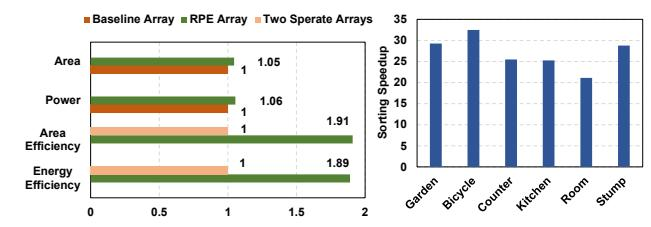
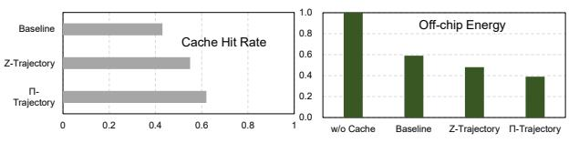

# C. Hardware Ablation Study

**Technique breakdown analysis.** We evaluate the impact of each optimization through four design variants: (i) Baseline (BS), consisting of a conventional  $16 \times 16$  rasterization array and a 32-parallel bitonic sorting network [20] following [25]. (ii) BS+AR, where the baseline rasterization array is replaced by axis-shared rasterization (AR). (iii) BS+AR+ OIT, which applies order-independent transmittance (OIT) to remove the sorting network. It conducts the MLP inference for decay factor computation, replacing the sorting. (iv) BS+AR+OIT+IP, which additionally integrates our interleaved pipeline (IP). All variants are compared under the same area budget for fairness. As shown in Fig. 13, axis-shared rasterization improves throughput by  $1.37\times$  on average. Adding order-independent transmittance further boosts throughput to 2.16×, while the full optimization achieves a 2.27× geometric mean throughput improvement.

Fig. 13. Throughput of variants isolating each optimization.

Reconfiguration analysis and sorting comparison. We

compare our reconfigurable design with a baseline PE array dedicated exclusively to rasterization, maintaining the same MAC count but without reconfigurability. Specifically, the baseline array comprises 6 MUL, 6 ADD, and 1 EXP unit per PE, whereas our reconfigurable array contains the same arithmetic units augmented by multiplexers to support reconfiguration. Experimental results in Fig. 14 (left) indicate that reconfiguration incurs only a 5% area overhead and a 6%

power overhead. The additional latency overhead is minimal, requiring two extra cycles—one for mode configuration and one for register clearing. Compared with a naive design using separate arrays for MLP inference and rasterization, our architecture delivers  $1.91\times$  higher area efficiency (throughput/area) and  $1.89\times$  higher energy efficiency (throughput/power), underscoring the effectiveness of the reconfigurable architecture. Relative to the 32-parallel bitonic sorting network [20] with hierarchical sorting [25], our reconfigurable PE array for MLP inference achieves a  $21.1\times\sim32.4\times$  speedup, as shown in Fig. 14 (right). This substantial speedup, combined with negligible quality degradation, demonstrates the effectiveness of order-independent transmittance as both an efficient and practical solution.

Fig. 14. Reconfiguration analysis and sorting speedup.

Tile schedule trajectory study. Fig. 15 (left) presents the average cache hit rate across scenes for three tile scheduling methods: the baseline trajectory, the Z-trajectory, and our generalized  $\pi$ -trajectory tile schedule. The baseline achieves a hit rate of 43%, the Z-trajectory 55%, and our method improves the hit rate to 62%. The corresponding off-chip access energy is shown on the right, with the configuration without cache normalized to 1. Thanks to the horizontal, vertical, and hierarchical locality utilized, our  $\pi$ -trajectory tile schedule achieves a  $2.56\times$ ,  $1.51\times$ , and  $1.23\times$  energy saving over no-cache setting, baseline trajectory, and Z-trajectory.

Fig. 15. Cache hit rate and energy comparison.

