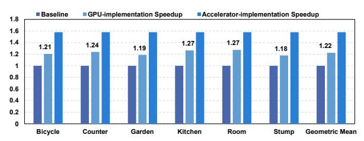

# E. GPU-implemented Optimization Evaluation

1) GPU-implemented axis-shared rasterization: Implementation. To further clarify the benefits of our co-designed accelerator, we implement axis-shared rasterization on an NVIDIA RTX 3090 GPU. Axis-shared rasterization consists of three stages: shared-term computation, broadcast, and combination, as described in Sec. III. To map this structure onto the GPU, we assign one  $16\times16$  thread block to each tile. Within each block, we introduce an explicit shared-term computation stage, where threads collaboratively compute the X-axis and Y-axis shared terms. These intermediate results are stored in shared memory. After synchronization, all threads reuse the shared terms to perform the combination stage in parallel.

Fig. 19. The effect of GPU-implemented axis-shared optimization.

1Since GSCore and MetaSapiens propose techniques to reduce the Gaussian count, and these techniques are compatible with our design. To guarantee fairness, we assume that all designs employ the same Gaussian reduction technique as GSCore.

Fig. 19 shows the performance improvement of a GPU-based implementation of axis-shared rasterization across scenes. The baseline is the original Gsplat implementation [51]. For reference, we include the performance of our accelerator implementation (right), which serves as an architectural upper bound. Because axis-shared rasterization reduces MAC count and hardware area, we normalize speedup by comparing latency under an equivalent area budget. The GPU implementation achieves a geometric mean speedup of 22%, substantially lower than the nearly 60% speedup delivered by our dedicated accelerator. Because rasterization is a non-GEMM workload, it cannot effectively utilize Tensor Cores and is therefore executed on CUDA cores. Compared with our accelerator, the GPU mapping exhibits limitations in both computational structure and memory behavior.

**Computational limitations.** (i) Axis-shared rasterization consists of an O(L) shared-term stage followed by an  $O(L^2)$ combination stage. This imbalance leads to substantial thread underutilization during the O(L) stage. In contrast, our accelerator exploits the O(L) edge and  $O(L^2)$  area relationship of the PE array, mapping shared-term computation to PE lines and the combination stage to the full array. This spatial decomposition enables near-full utilization across both stages. (ii) The GPU MAC configuration cannot fully accommodate the requirements of rasterization. The shared-term stage requires more multiplications than additions, whereas the combination stage involves addition-before-multiplication patterns that deviate from the standard fused multiply-add (FMA) pipeline. GPUs employ balanced multiplier-adder ratios and fixed FMA pipelines, making such irregular arithmetic sequences inefficient. Moreover, frequent exponential operations further increase computational pressure. In contrast, our accelerator adopts a dedicated datapath, allowing the reduced MAC count to translate directly into area and latency savings.

**Memory limitations.** (i) The shared terms must be written to and read from shared memory between stages, incurring non-negligible synchronization and access overhead. In contrast, our accelerator fully fuses the three stages into a registerto-register datapath without intermediate buffer or memory accesses. (ii) The GPU-based axis-shared rasterization trades additional storage for reduced MAC count. Because existing 3DGS GPU kernels already heavily utilize register files and shared memory, the additional reuse of shared terms increases register and shared-memory pressure, raising the risk of register spilling. In contrast, our dedicated accelerator pipeline carefully allocates registers, enabling shared terms to be produced and consumed in place, without extra storage. Overall, these computational and memory constraints highlight the limitations of deploying axis-shared rasterization on GPUs, further motivating a dedicated accelerator design.

2) GPU-implemented MLP-based OIT: The MLP-based OIT is also implemented on an NVIDIA RTX 3090 GPU using cuBLAS [37], and its latency is compared against the Radix sorting [31] implementation in Gsplat [51] as the baseline. As shown in Fig. 20, the GPU-implemented MLP-based OIT is slower, and exhibits a geometric mean latency of  $1.59 \times$ 

Fig. 20. Latency comparison between baseline sorting and MLP-based OIT.

that of the baseline sorting approach. Although our MLP is extremely lightweight, its inference on the GPU becomes memory bound. As discussed in Sec. V-B, the small MLP exhibits low arithmetic intensity, thereby limiting throughput under the GPU execution model. As a result, the theoretical arithmetic simplicity of the MLP does not translate into practical latency reduction on the GPU.

In our accelerator, the MLP-based OIT solves the challenge of sorting on edge devices, as described in Sec. II-B2. It is mapped onto the same unified PE array through a reconfigurable design, incurring negligible additional hardware overhead while eliminating inter-stage pipeline imbalance. Furthermore, the fine-grained interleaved pipeline effectively hides memory latency and mitigates the memory-bound bottleneck. These architectural optimizations collectively enable substantial speedup over the baseline GPU sorting approach, as reported in Sec. VI-D, further demonstrating the motivation of our dedicated accelerator design.

#### F. Applicability to Dynamic Scenes

Although our design primarily targets static 3DGS rendering, it is also meaningful to study the applicability of order-independent transmittance (OIT) to dynamic scenarios. We extend OIT from 1D image composition to 3D Gaussian splatting by incorporating view information, a natural question is whether it remains effective for dynamic scenes. To investigate this, we evaluate our MLP-based OIT on the Neu3D dataset [27], a widely used benchmark for real-world dynamic view synthesis, featuring high-resolution sequences (2704×2028) and spanning 10 seconds (300 frames). We adopt 4DGS [50] as the baseline for dynamic scene modeling. 4DGS models dynamic scenes using 4D primitives that generate standard 3D Gaussians at each timestamp, making the perframe rendering pipeline identical to that of static 3DGS. To account for temporal variations, we update the weights of the 10-parameter MLP every 30 frames. For a typical 300frame sequence, this produces 10 independent sets of MLP parameters covering the entire sequence.

TABLE V EVALUATION OF OUR OIT APPLIED TO DYNAMIC SCENES.

|          | Cook Spinach |        | Cut Beef |        | Flame Steak |        | Average |        |
|----------|--------------|--------|----------|--------|-------------|--------|---------|--------|
|          | PSNR         | SSIM   | PSNR     | SSIM   | PSNR        | SSIM   | PSNR    | SSIM   |
| Baseline | 32.88        | 0.9572 | 32.75    | 0.9575 | 32.78       | 0.9552 | 32.80   | 0.9566 |
| Our OIT  | 32.46        | 0.9566 | 32.29    | 0.9571 | 32.31       | 0.9550 | 32.35   | 0.9562 |

As shown in Table V, our MLP-based OIT maintains high fidelity, with only a 0.45 PSNR drop compared with the baseline. This result indicates that each localized MLP can

effectively capture evolving occlusion relationships within its time window. The additional overhead is minimal, requiring only 10×10 extra parameters, making the approach well suited for edge deployment. Looking forward, dynamic scene rendering is expected to involve longer sequences and richer temporal variations. While our results demonstrate the feasibility of the proposed method for dynamic scenes, extending it to longer sequences or scenes with more drastic geometric changes may require further adaptation, which we leave for future work.

