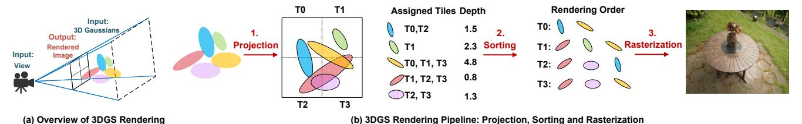

# I. INTRODUCTION

3D Gaussian Splatting (3DGS) [22] has emerged as a prominent technique for novel view synthesis, offering both high-quality reconstruction and efficient rendering performance. It has been widely adopted across diverse domains, including robotics [56], augmented and virtual reality (AR/VR) [45], [55], and autonomous driving [23]. In contrast to neural radiance fields (NeRF) [32], which implicitly represent 3D scenes using neural networks, 3DGS explicitly encodes scenes as a large set of 3D Gaussians with learnable positions, sizes, shapes, colors, and opacities. Owing to its lower algorithmic complexity, 3DGS achieves significantly faster rendering performance than NeRF, making it particularly suitable for interactive applications. However, achieving real-time 3DGS rendering on resource-constrained platforms, such as edge GPUs, remains a significant challenge. For instance, on an

This work was supported by the National Natural Science Foundation of China under Grant U25B2057 and Grant 92464302. Corresponding author: Guanghui He.

TABLE I COMPARISON WITH RELATED 3DGS ACCELERATORS.

|                        | GSCore [25]   | Meta. [29]    | GBU [52]  | Ours     |
|------------------------|---------------|---------------|-----------|----------|
| Ras. MAC Reduction     | X             | Х             | ✓         | 1        |
| Parallel Rasterization | ✓             | ✓             | X         | ✓        |
| Sorting Implementation | Hier. Bitonic | Hier. Bitonic | GPU-based | Replaced |

NVIDIA Jetson Orin Nano edge GPU [38], we observe only approximately 20 frames per second on the MipNeRF-360 dataset [1]. The stringent power and area constraints of AR/VR edge devices further exacerbate the difficulty of deploying 3DGS in practice.

Given a camera pose as input, 3DGS renders a scene represented by 3D Gaussians (ellipsoids) into a final image, as illustrated in Fig. 1(a). The rendering pipeline comprises three essential steps: projection, sorting, and rasterization (details are provided in Sec. II-A). Profiling results, presented in Fig. 2 (left), indicate that rasterization and sorting dominate the overall latency, consistent with prior studies [11], [25], [29], [52]. Existing approaches, including GSCore and MetaSapiens [25], [29], enhance efficiency via Gaussian count reduction but neglect the inherent computational redundancy in rasterization. GBU [52] decreases rasterization MACs using spatial transformations and sequential differential computation; however, this introduces inter-pixel dependencies, thereby compromising pixel-level parallelism. Another work, Lumina [11], reduces the computation of sorting and rasterization by exploiting the similarity between consecutive frames; however, it is applicable only to moving-view scenarios, whereas our method does not rely on this assumption. Moreover, in these methods, the overhead of sorting and the possibility of replacing it with a more efficient alternative remain insufficiently explored. A comparison with related 3DGS accelerators is presented in Table I. These limitations motivate a more in-depth analysis of rasterization and sorting, culminating in the two key challenges outlined below:

Challenge-1: Computational redundancy in rasterization.
 Most existing implementations adopt a pixel-wise mapping strategy, where each pixel is rasterized independently by a separate processing element (PE) in an accelerator or a

(b) 3DGS Rendering Pipeline: Projection, Sorting and Rasterization

Fig. 1. The rendering process of 3D Gaussian Splatting.

CUDA core in a GPU. While this approach offers high parallelism, it ignores the substantial overlap in intermediate computations shared across neighboring pixels. As a result, many common terms are redundantly recalculated along rows and columns, leading to unnecessary multiply-andaccumulate (MAC) operations. This redundancy significantly increases latency or PE overhead, making rasterization inefficient. A deeper analysis is provided in Sec. II-B1.

Challenge-2: Sorting scalability and pipeline imbalance. Hardware implementations of sorting often rely on parallel sorting modules [20], whose area and cost scale rapidly with input parallelism. Moreover, sorting and rasterization have inherently different computational complexities,  $O(N \log^2 N)$  for sorting versus O(N) for rasterization, posing challenges for maintaining pipeline balance. This imbalance is further exacerbated by large variations in the number of Gaussians per tile, which span up to two orders of magnitude in our profiling. Consequently, fixed-parallelism sorting modules either lead to resource underutilization on small workloads or cause rasterization bottlenecks for large workloads. A detailed analysis is provided in Sec. II-B2.

To address *Challenge-1*, we propose an *axis-shared ras*terization technique that eliminates redundant computations within each tile. The core idea is to compute common intermediate terms along the X- and Y-axes only once and then share these terms across all processing elements (PEs) within the tile. Each PE can then complete rasterization by simply combining the shared terms. This design reduces the number of MAC operations by 38% while preserving high parallelism. As a result, it enables either lower latency under the same PE resources or reduced PE overhead with equivalent latency. Building on this principle, we further design a highly efficient PE array architecture for rasterization.

To address Challenge-2, we adopt a hardware-algorithm co-design approach. On the algorithmic side, we re-examine the role of sorting in Gaussian Splatting, which traditionally enforces depth ordering for transmittance computation and ultimately determines the decay factor for color blending. Our key insight is that the decay factor can be computed directly without explicit sorting. By recognizing the analogy between 3DGS and image composition [40], and inspired by orderindependent transparency techniques [2], [30], we develop a novel order-independent transmittance (OIT) method tailored to 3DGS. This method, co-designed with the hardware, leverages a lightweight MLP to predict decay factors, mitigating workload imbalance while preserving image quality. On the hardware side, we introduce a unified and reconfigurable PE array that supports both rasterization and MLP inference, thereby removing the need for a costly sorting engine and sustaining consistently high utilization.

In conclusion, we make the following contributions:

- We identify two previously overlooked challenges in accelerating 3D Gaussian Splatting, (i) computational redundancy in rasterization and (ii) scalability and pipeline imbalance issues caused by sorting (Sec. II-B).
- We propose an axis-shared rasterization technique and a dedicated hardware design, eliminating redundant computations and reducing MAC operations by 38% (Sec. III).
- We develop a novel order-independent transmittance method that bypasses explicit sorting and enables efficient decay factor prediction with negligible quality loss (Sec. IV).
- We design a unified and reconfigurable hardware accelerator that supports both rasterization and MLP inference, achieving real-time 3DGS rendering with consistently high utilization (Sec. V).

