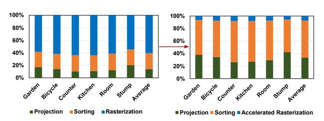
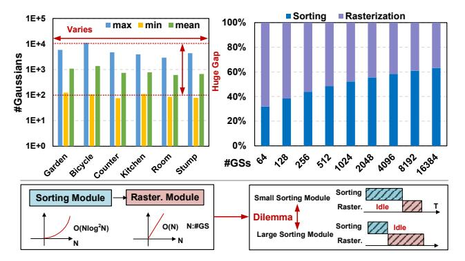

# II. BACKGROUND AND MOTIVATION

#### A. 3D Gaussian Splatting

3DGS parameters. 3DGS represents a 3D scene as a collection of Gaussians. For a given camera view, an image is rendered by splatting these Gaussians into 2D space following the standard 3DGS pipeline. Each Gaussian is defined by Equation (1), where p' denotes the 3D coordinates. In total, 59 parameters are required to describe each Gaussian: i) the mean (position)  $\mu'$  (3 parameters); ii) the size and shape, represented by the covariance matrix  $\Sigma'$ , which is determined by the scale s (3 parameters) and rotation q (4 parameters); iii) the opacity factor o (1 parameter); and iv) the view-dependent color, parameterized by spherical harmonics (SH) coefficients  $(16 \times 3 = 48 \text{ parameters}).$ 

**Rendering steps.** The overall rendering process takes the camera parameters, pose, and 3D Gaussians as input, and synthesizes a final image as output, as shown in Fig. 1(a). The rendering pipeline consists of three main steps-projection, sorting, and rasterization—as illustrated in Fig. 1(b). For projection, based on the camera parameters and pose, 3D Gaussians are projected into 2D Gaussians. Specifically, the 3D mean  $(\mu')$  and covariance  $(\Sigma')$  are projected into a 2D mean  $\mu$  (2 × 1) and a 2D covariance  $\Sigma$  (2 × 2). The depth (d) of each 3D Gaussian relative to the camera is also calculated (e.g., 0.8–4.8 in the figure). In addition to spatial attributes, color is represented by an RGB vector  $(3 \times 1)$ , computed from the SH coefficients and camera pose. Rendering is performed

at a fixed tile granularity of  $16 \times 16$  pixels. After projection, each 2D Gaussian is mapped to the tiles it overlaps. For example, in the toy case shown, the blue Gaussian overlaps tiles T0 and T1, while the green Gaussian overlaps only T1. For sorting, since the relative depth order determines occlusion and affects  $\alpha$ -blending, each tile sorts its intersecting Gaussians in ascending depth order (near to far). As shown in Fig. 1, the correct order for tile T0 is the blue Gaussian followed by the yellow. For rasterization, the pipeline computes each Gaussian's contribution to every pixel within a tile, ultimately synthesizing the final image. This process consists of  $\alpha$ -computation followed by  $\alpha$ -blending. The  $\alpha$ value is computed using Equation (2), where  $\mathbf{p}$  (2×1) denotes the pixel position,  $\mu$  and  $\Sigma$  are the projected 2D Gaussian mean and covariance, and o is the opacity factor. Based on the computed  $\alpha$  values,  $\alpha$ -blending determines the final pixel color C as defined in Equation (3) (left), where  $T_i$  denotes the accumulated transmittance, i indexes the sorted Gaussians, and  $c_i$  denotes each Gaussian's RGB color. The transmittance  $T_i$ is computed from all i-1 preceding Gaussians, as given in Equation (3) (right).

$$G(\mathbf{p}') = e^{-\frac{1}{2}(\mathbf{p}' - \boldsymbol{\mu}')^{\mathrm{T}} \boldsymbol{\Sigma}'^{-1} (\mathbf{p}' - \boldsymbol{\mu}')}, \tag{1}$$

$$\alpha = o \cdot e^{-\frac{1}{2}(\mathbf{p} - \boldsymbol{\mu})^{\mathrm{T}} \boldsymbol{\Sigma}^{-1}(\mathbf{p} - \boldsymbol{\mu})}, \tag{2}$$

$$C = \sum_{i=1}^{N} T_i \alpha_i c_i, \quad T_i = \prod_{i=1}^{i-1} (1 - \alpha_i)$$
 (3)

Fig. 2. 3DGS latency breakdown on GPU (left) and GPU with hardware accelerated rasterization(right).

**Profiling and analysis.** We conducted a detailed profiling of the three rendering steps on the NVIDIA Jetson Orin Nano GPU using the MipNeRF-360 dataset [1], as shown in Fig. 2 (left). The results indicate that projection, sorting, and rasterization account for 14.2%, 25.3%, and 60.5% of the total latency, respectively. Since sorting and rasterization together constitute nearly 90% of the latency, our work primarily targets the acceleration of these two steps. An analysis of the MAC count per Gaussian within the rasterization step shows that  $\alpha$ -computation requires 8 multiplications, 4 additions, and 1 exponential operation, whereas  $\alpha$ -blending requires 5 multiplications and 4 additions. This reveals that  $\alpha$ -computation is the most MAC-intensive operation, motivating our focus on optimizing it.

#### B. Challenge Analysis and Motivation

1) Challenge-1: Computational redundancy in rasterization.: As demonstrated in profiling, rasterization is the most time-consuming component in 3DGS. Within the rasterization

pipeline,  $\alpha$ -computation is the most MAC-intensive process, involving cascaded matrix-vector multiplications. The formula expansion for  $\alpha$  computing is shown in Fig. 3 (top), where  $\mu_i^x$  and  $\mu_i^y$  denote the center of the *i*-th Gaussian, x and y denote the coordinates of a pixel. The conic matrix  $(\Sigma^{-1})$ , which is defined as the inverse of 2D Gaussian's covariance matrix, is parameterized by  $a_i$ ,  $b_i$ , and  $c_i$ . According to the formulation, it requires 8 multiplications (MUL), 4 additions (ADD), and 1 exponential operation (EXP). Conventionally, prior work [25] designs a PE array for rasterization, where the computation for each pixel is mapped to one PE. In these designs, the PE structure reflects the theoretical MAC count derived from the  $\alpha$  computation formulation, as shown in Fig. 3 (bottom), with registers omitted for simplicity.

Fig. 3. The sources of redundant computing in rasterization.

To illustrate the source of redundancy, we decompose the exponent in the  $\alpha$  computation into three components, as shown in Fig. 3 (top): (i) the X-axis quadratic term, representing the squared distance between the pixel and the Gaussian center along the X-axis; (ii) the Y-axis quadratic term, representing the squared distance along the Y-axis; and (iii) the cross term, capturing the interaction between the X and Y coordinates. When mapping pixel computations onto the PEs of the rasterization array (Fig. 3, bottom), clear spatial redundancy emerges: within any row of pixels, the Y-axis quadratic terms remain identical across PEs, while within any column, the X-axis quadratic terms are shared. This analysis highlights substantial redundancy in both the X- and Y-axis quadratic terms. Yet conventional PE designs recompute these terms independently for every pixel, missing the opportunity to exploit this redundancy for computational savings, as illustrated in Fig. 3 (bottom right).

To avoid redundant computation, our key idea is to redesign the entire dataflow by precomputing the axis-shared terms. Each PE then performs only a simple combination of these precomputed values, thereby significantly reducing complexity while maintaining parallelism. This axis-shared rasterization is implemented through a dedicated hardware architecture (Sec. III) to improve the compute efficiency.

2) Challenge-2: Sorting scalability and pipeline imbalance issues. : According to Amdahl's Law [41], if only rasterization is accelerated while other steps remain on the

Fig. 4. The number of Gaussians varies across tiles and scenes and leads to pipeline imbalance issue.

GPU, sorting inevitably becomes the primary bottleneck, as shown in Fig. 2 (right). To quantitatively assess the impact of sorting on per-tile rendering, we profiled the MipNeRF-360 dataset [1]. We employed a trained Gaussian checkpoint at 7k iterations and used the validation set to measure the variation in Gaussian counts across tiles and scenes. As shown in Fig. 4 (top left), the per-tile Gaussian count ranges from approximately 80 to over 10,000, spanning more than two orders of magnitude. This variation occurs both within tiles of a single scene and across different scenes, presenting a fundamental challenge for efficient hardware design.

We further profile the latency of rasterization and sorting across different Gaussian counts per tile, following the hardware architecture of [25], as shown in Fig. 4 (top right). When the Gaussian count is small, the sorting latency can be less than half that of rasterization, whereas for large counts, it can grow to nearly twice as high. This trend can be explained through complexity analysis. Let N denote the number of Gaussians mapped to a tile. Sorting typically incurs  $O(N \log^2 N)$  complexity, as in bitonic sort [20], with hardware area scaling as  $k \log^2 k$  under input parallelism k, leading to rapidly increasing overhead as k grows. In contrast, rasterization is a MAC-dominated operation with linear complexity O(N). Due to this heterogeneity, sorting and rasterization cannot be efficiently unified into a single engine. Moreover, the disparity in computational complexity, combined with the large variance in Gaussian counts across tiles, inherently causes pipeline imbalance. As illustrated in the schedule of Fig. 4 (bottom), under a fixed area budget, a small sorting module becomes the bottleneck for tiles with many Gaussians, stalling rasterization and reducing utilization. Conversely, a larger sorting module with higher overhead shifts the bottleneck to rasterization for tiles with fewer Gaussians. Thus, designing an architecture that achieves balanced performance across diverse scenes and tile workloads remains a significant challenge.

To comprehensively address this challenge, we adopt an algorithm—hardware co-design strategy. At the algorithmic level, we revisit the role of sorting and entirely replace it with an order-independent transmittance method (Sec. IV). It exploits the high throughput of the PE array through reconfigurability, enabling uniform support for both transmittance computation

and rasterization (Sec. V). Consequently, regardless of the number of Gaussians per tile, the unified hardware sustains consistently high utilization.

