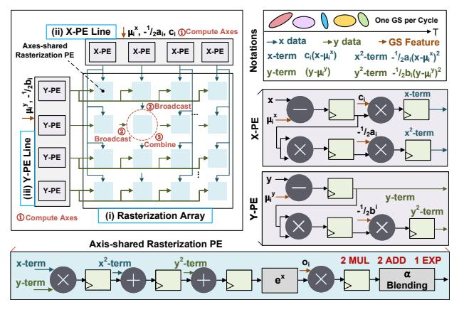

# III. AXIS-SHARED RASTERIZATION

**Inspiration and overview.** We propose axis-shared rasterization to address Challenge-1 (Sec. II-B1). The approach involves three stages: 1) computing shared terms along the X and Y axes, 2) broadcasting them to each PE, and 3) combining them in each PE to obtain the final result. To efficiently implement axis-shared rasterization, our key considerations involve (i) simplifying the control logic of the three-stage process, and (ii) minimizing or eliminating the additional storage required. For a tile of size  $L \times L$ , sharedterm computation has O(L) complexity, while the combination stage has  $O(L^2)$  complexity, with each shared term reused L times. This observation motivates the use of an  $L \times L$  array for the combination stage, supported by L-sized preprocessing modules for shared-term computation. Following these principles, Fig. 5 (top left) shows the design overview. For a  $16 \times 16$ tile, the design includes: (i) a  $16 \times 16$  rasterization array, (ii) a 16-element X-PE line, and (iii) a 16-element Y-PE line. The X-PE line computes X-axis shared terms, while the Y-PE line computes Y-axis shared terms. Each X-PE and each Y-PE broadcast their results to the corresponding rasterization PEs in the same row or column, repeated 16 times. The PE size is determined by the algorithm [22], and this broadcast overhead is small enough to implement and meet timing closure requirements.

Fig. 5. Hardware and computation flow of axis-shared rasterization.

Computation flow and PE structure. The rasterization array renders each Gaussian and computes its output to a  $16 \times 16$  tile of pixels continuously in each cycle. The Gaussian parameters are provided as input to the X-PE line and Y-PE line, which perform the axes computation, and the outputs from these PE lines are then fed to the rasterization PE array. To eliminate redundant processing of the Gaussian conic matrix parameters (e.g., computing the factor  $-\frac{1}{2}$ ), we directly store the parameter set  $\{-\frac{1}{2}a_i, -\frac{1}{2}b_i, c_i\}$ , where i denotes the index of each Gaussian.

The X-PE line receives the Gaussian parameters  $c_i$  and  $-\frac{1}{2}a_i$ , which are broadcast to all X-PEs. Internally, each X-

PE line generates 16 x-coordinates ( $x_0 \sim x_{15}$ ), which are automatically incremented by 16 when shifting to the next tile on the right. With notations shown in Fig. 5 (top right), the detailed X-PE structure is illustrated in Fig. 5 (right). For simplicity, the x index is omitted (similarly for y in the following description). Each X-PE consists of one adder and three multipliers. One computation branch calculates the term from X-axis (x-term) by computing  $(x - \mu_i^x)$  and multiplying it by  $c_i$ , while the other branch squares  $(x-\mu_i^x)$  and multiplies it by  $-\frac{1}{2}a_i$  to obtain the X-axis quadratic term ( $x^2$ -term). The Y-PE line receives the Gaussian parameter  $-\frac{1}{2}b_i$ , which is broadcast to each Y-PE. The y-coordinates  $(y_0 \sim y_{15})$  are similarly incremented by 16 when moving vertically between tiles. As shown in Fig. 5 (right), each Y-PE contains one adder and two multipliers. One computation branch produces the Yaxis term (y-term) by computing  $(y - \mu_i^y)$  directly, while the other squares  $(y - \mu_i^y)$  and multiplies it by  $-\frac{1}{2}b_i$  to generate the Y-axis quadratic term ( $y^2$ -term).

For the rasterization PE array, each PE receives vertical inputs from the corresponding X-PE and horizontal inputs from the corresponding Y-PE based on the pixel coordinates. As shown in Fig. 5 (bottom), each rasterization PE comprises only one adder and three multipliers. One multiplier is dedicated to multiplying the opacity factor  $o_i$  at the final stage, while the remaining MAC unit combines the inputs from the PE lines. Specifically, the multiplier computes the product  $x \times y$ , and the two adders subsequently add this result to the  $x^2$ -term and  $y^2$ term, respectively. Considering synchronization, the X-PE line initiates one cycle earlier than the Y-PE line, ensuring that the x term and y term arrive simultaneously at each rasterization PE during the first cycle, with the  $x^2$ -term and  $y^2$ -term arriving in the second and third cycles, respectively. After executing the exponential operation and multiplying by  $o_i$ , the computation of  $\alpha^i$  is completed, and the result is then fed into the  $\alpha$ blending unit. Due to the continuous processing of Gaussians, the computation of  $\alpha^{i+1}$  is completed in the subsequent cycle.

Overhead analysis. Compared to the GSCore implementation, our axis-shared rasterization requires an additional X-PE line and Y-PE line while significantly simplifying the design of the rasterization PE. To ensure a fair comparison, the MAC cost of the extra PE lines is amortized across the rasterization PE array. For  $\alpha$ -computation, the total number of multipliers is calculated as  $16 \times (3 + 2) = 80$  for the X-PE and Y-PE lines and  $16 \times 16 \times 2 = 512$  for the rasterization PE array, resulting in a total of 592. Similarly, the total number of adders is calculated as  $2 \times 16 = 32$  for the extra PE lines and  $16 \times 16 \times 2 = 512$  for the rasterization PE array, resulting in a total of 544. When averaged over a  $16 \times 16$ rasterization PE array, our axis-shared approach requires only 2.31 multipliers and 2.13 adders per PE. Compared with 8 multipliers and 4 adders in the GSCore implementation, the counts are reduced by 63% for the  $\alpha$ -computation stage. For the complete rasterization process including  $\alpha$ -blending, the GSCore design requires 12 multipliers and 8 adders per PE. In contrast, our design requires only 6.31 multipliers and 6.13 adders per PE after amortization. This corresponds to an overall MAC reduction of approximately 38%.

