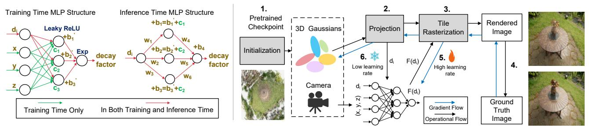

# IV. MLP-BASED ORDER-INDEPENDENT TRANSMITTANCE A. Algorithmic Motivation

The sorting process is challenging for on-chip deployment, as analyzed in *Challenge-2* (Sec. II-B2). But it is essential for the original 3DGS due to  $\alpha$ -blending, which depends critically on the relative depth order determined by the camera pose. However, reexamining the blending Equation (3), we observe that the ultimate objective of sorting is to compute the correct transmittance  $T_i$ . The Gaussians preceding the  $i_{th}$  Gaussian have smaller depth, and each contributes a factor of  $1-\alpha_j$  (for  $j=0,1,\ldots,i-1$ ) in the cumulative product. Since each  $\alpha$  lies in the interval (0,1), as the depth of the  $i_{th}$  Gaussian increases, the transmittance  $T_i$  decreases, thereby serving as a decay factor. This naturally raises the question: *Can we directly compute the decay factor based on depth?* 

Inspiration from image composition. The 3DGS paper [22] demonstrates that its  $\alpha$ -blending adopts the NeRF-style volumetric model, while reusing the classic graphics term [40]. " $\alpha$ " stems from the interpolation  $\alpha A + (1-\alpha)B$  [42], corresponding to the "over" operation of A over B. Thus, 3DGS blending is analogous to image composition. Fig. 6 illustrates a three-Gaussian example: 3DGS blends front-to-back, while image compositing is back-to-front. In this context,  $C_3$ ,  $C_2$ , and  $C_1$  represent accumulated colors obtained through successive over operations with colors and opacities  $(c,\alpha)$ , yielding results identical to 3DGS. This equivalence readily generalizes to any number of Gaussians.

Fig. 6. 3DGS  $\alpha$ -blending is analogous to image composition.

Because the "over" operation is non-commutative, depth sorting is computationally expensive. To address this, several order-independent transparency (OIT) techniques have been developed in computer graphics [2], [5], [6], [30], [34]. Among them, weighted OIT assigns weights via a monotonic decreasing function of depth  $F(d_i)$  and then accumulates colors C accordingly, producing images with negligible quality loss, as formulated in Equation (4). This success, together with the conceptual similarity between image composition and 3DGS  $\alpha$ -blending, motivates our exploration of order-independent transmittance (also abbreviated as OIT) for 3DGS.

$$C = \frac{\sum_{i=1}^{n} F(d_i)\alpha_i c_i}{\sum_{i=1}^{n} F(d_i)\alpha_i}$$
 (4)

$$C = \frac{\sum_{i=1}^{n} F(d_i, x, y, z) \alpha_i c_i}{\sum_{i=1}^{n} F(d_i, x, y, z) \alpha_i}$$
 (5)

Fig. 7. Neural network structure (left) and the training framework (right).

Variables and form of function. However, weighted OIT relies on manually selected and tuned decay functions  $F(d_i)$ . Recent work [18] demonstrates that sorting in 3DGS can be approximated by a fixed set of functions. However, their approach is restricted to handcrafted depth-based functions, which limits their ability to model complex dependencies and generalize across diverse scenes. In contrast, we observe that a defining characteristic of 3DGS is its view-dependent synthesis, where camera view critically influences rendering. For different views, even identical Gaussian depths may contribute differently to the final color, and our experiments will further demonstrate the significance of view information in Sec. VI-B. To capture this effect, we integrate view information into the input by extending Equation (4) into Equation (5), where (x,y,z) denotes the normalized view direction vector. This vector, determined only by the camera pose, captures the global viewing ray orientation and is independent of individual Gaussians. Crucially, the interplay between depth and view direction is highly nonlinear and difficult to capture with fixedform functions. In contrast, a Multi-layer Perceptron (MLP), leveraging its universal regression capability, can model these joint dependencies with high fidelity. Since 3DGS supports rapid per-scene training on desktop or server GPUs, jointly training a small MLP is both practical and computationally efficient, requiring around 30 minutes per scene according to our experiment (Sec. VI-A).

