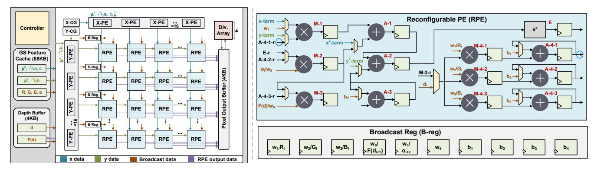
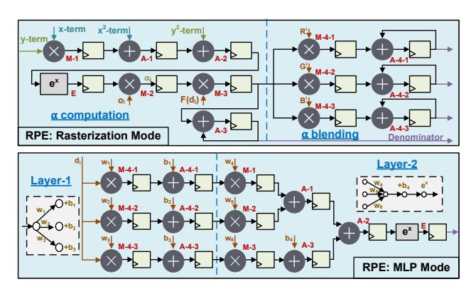
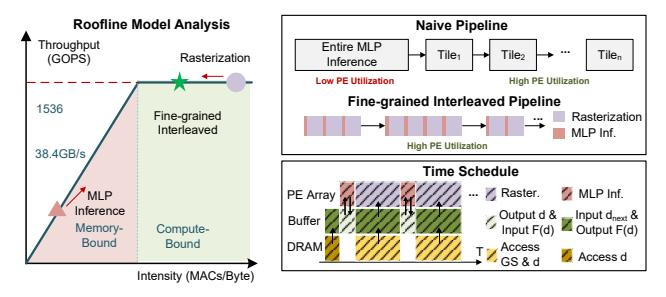

# A. Reconfigurable Hardware Design

**Overview.** Fig. 8 (left) illustrates the unified hardware architecture supporting both rasterization and MLP computation,

Fig. 8. Unified hardware architecture of rasterization and MLP inference (left), and the structure of modules (right).

with arrow notation shown at the bottom left. The architecture consists of two main components: dedicated computation and storage modules. The computation unit features a  $16 \times 16$  reconfigurable PE array with per-row broadcast registers, along with X-PE and Y-PE lines (introduced in Sec. III). Both PE lines receive x or y coordinates from the coordinate generator (CG), which conducts the tile schedule across the image. For storage, projected Gaussian (GS) features are placed in a feature cache (9 parameters per GS), whereas depth values and their decay factors  $F(d_i)$  are stored in a separate depth buffer to account for differing on-chip bandwidth demands. Finally, the numerator and denominator from Equation (5) are written to the pixel output buffer and normalized by the division array to produce the final pixel values.

**Reconfigurable PE.** Fig. 8 (right) shows the reconfigurable PE, consisting of 6 multipliers, 6 adders, and one exponential unit, all in FP16 precision. The multipliers and adders (MACs) are organized into two groups of three. In the first group, each MAC operates independently  $(M-\{1\sim 3\}, A-\{1\sim 3\})$ , while in the second group they operate cooperatively  $(M-4-\{1\sim 3\}, A-4-\{1\sim 3\})$ . Each MAC is paired with a register to ensure timing closure at high frequency. Some connections are denoted implicitly: the suffix -r marks a register output. For example, A-4-1-r (fourth wire on the left, blue circle) connects to the register output of the A-4-1 adder (second wire on the right, blue circle) in the same PE. Multiplexer control selects the datapath configuration, switching between rasterization mode (upper) and MLP mode (lower). The workflow and corresponding PE configurations are as follows:

Fig. 9. Reconfigurable PE for rasterization and MLP modes.

**Rasterization mode.** In rasterization mode, the PE is configured as shown in Fig. 9 (top). The PE array processes one GS per cycle for the  $16\times16$  tile pixels. The GS-feature buffer supplies GS position  $(\mu_i^x,\mu_i^y)$  and conic parameters  $(-\frac{1}{2}a_i,-\frac{1}{2}b_i,\ c_i)$  to the X-PE and Y-PE lines, where i is the GS index. The unique  $o_i$  is loaded into the broadcast register and broadcast 16 times to all PEs on the same line. Within each PE, M- $\{1\sim2\}$ , A- $\{1\sim2\}$ , and the exponential unit perform the rasterization, as shown in Fig. 5. The X-PE, Y-PE structure and  $\alpha$  computation workflow are described in Sec. III. The additional step is  $\alpha$ -blending, defined in Equation (5):

GS color features  $(R_i,G_i,B_i)$  are loaded into the broadcast register, which has 10 units, 5 of which are used in rasterization mode (Fig. 8, right bottom). The decay factor  $F(d_i)$ , sourced from the depth buffer, is also loaded into the broadcast register. After broadcasting  $R_i,G_i,B_i$ , and  $F(d_i)$  16 times to each line, the PEs compute Equation (5). Specifically, M-3 multiplies  $F(d_i)$  with  $\alpha_i$ , and A-3 accumulates  $F(d_i)\alpha_i$  across Gaussians to form the denominator. Meanwhile, M-4- $\{1 \sim 3\}$  multiplies  $F(d_i)\alpha_i$  with  $R_i,G_i,B_i$ , and A-4- $\{1 \sim 3\}$  accumulates the results across GSs for the RGB channels.

**MLP mode.** The MLP mode configuration of the PE is illustrated in Fig. 9 (bottom). In this mode, the PE array processes  $16 \times 16 = 256$  depth values per cycle, producing 256 corresponding F(d) outputs. Inputs are read from the depth buffer with high on-chip bandwidth, and the results are written back to the same buffer. The MLP weights reside in the broadcast register, fully utilizing all ten units. As shown,  $M\text{-}4\text{-}\{1\sim3\}$  and  $A\text{-}4\text{-}\{1\sim3\}$  compute the first layer, including bias addition. The second layer is handled by M-{1  $\sim$  3}, with A-{1  $\sim$  3} performing accumulation and bias addition. The exponential unit is reused to implement the exponential activation function. For simplicity, Leaky ReLU is omitted from the figure. It is implemented via sign detection and a 5-bit integer adder, subtracting 3 from the FP16 exponent when the input is a normal negative. For subnormal negative or positive values, the input remains unchanged.

#### B. Fine-grained Interleaved Pipeline

**Memory-bound issue.** Since our MLP inference only relies on the depth of each GS, irrelevant to the tile assignment, it is straightforward to compute the F(d) for the entire GSs, followed by tile-by-tile rasterization, as shown in the naive

Fig. 10. Roofline model analysis and pipeline comparison.

pipeline of Fig. 10 (top right). However, we observe that PE utilization is extremely low during MLP inference. The reason for this is that the operational intensity of MLP inference and rasterization differs significantly. For rasterization, each projected Gaussian comprises 9 parameters and performs  $256 \times 6$  MAC operations. In contrast, for MLP inference, 1 depth parameter only incurs 6 MAC operations, indicating a nearly 30—fold difference. Given a typical configuration for our architecture, as shown in Fig. 10 (left), rasterization is compute-bound, whereas MLP inference is heavily memory-bound [47]. This memory-bound issue also makes deploying our optimized order-independent transmittance algorithm directly to GPUs not an optimal choice.

**Optimization.** We propose a fine-grained interleaved pipeline that subdivides each tile into subtiles, as shown in Fig. 10 (right). The key idea is to overlap rasterization of the current subtile with memory access for MLP inference of the next. Fine-grained subtile processing is required because tiles contain variable numbers of GS while the depth buffer capacity is limited. Fig. 10 (bottom right) shows how the pipeline maps onto hardware. Starting with the first subtile, DRAM transfers GS depths d to the depth buffer, which then forwards them to the PE array for MLP inference. The resulting F(d) values are written back to the depth buffer. The PE array then rasterizes using F(d) from the depth buffer, while the buffer simultaneously loads depths for the next subtile, overlapping rasterization with memory access. This process repeats, fully hiding depth-access latency except for the first subtile.

