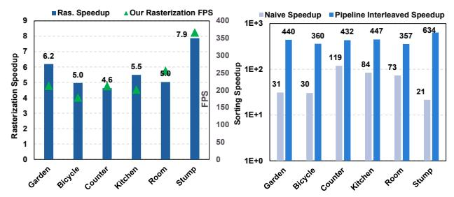
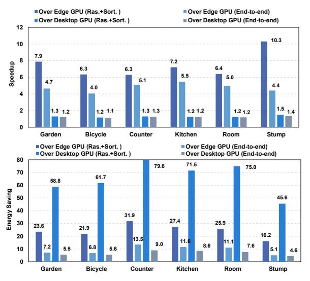
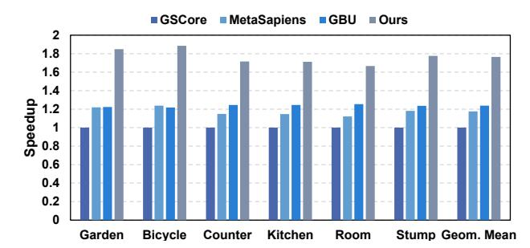

# D. Comparison with Other Implementations

1) Comparison with GPUs: Rasterization and sorting comparison. As shown in Fig. 16 (left), our design achieves a rasterization speedup of  $4.6 \sim 7.9 \times$  over the edge GPU, with throughput exceeding 150 frames per second (FPS) as indicated on the secondary axis. This speedup stems from axis-shared rasterization, which avoids redundant computations and reduces the MAC count, while our dedicated hardware architecture sustains high parallelism and PE utilization. Fig. 16 (right) compares sorting latency on the edge GPU with that of our MLP-based OIT inference, which replaces the sorting process. It shows that even the naive pipeline achieves a speedup of  $21 \sim 119 \times$  over the edge GPU, as order-independent transmittance converts the originally expensive sorting process into a lightweight MAC operation that is

Fig. 16. Speedup of rasterization and sorting over edge GPU.

efficiently executed by our PE array. By resolving the memory-bound bottleneck, our fine-grained interleaved pipeline further enhances PE utilization, with a speedup over 300×.

Overall comparison: We combine our rasterization and sorting optimizations for comprehensive analysis. To simulate practical applications, we report end-to-end performance by executing the Gaussian projection step on the edge GPU, extracting latency and energy consumption, and integrating them into our evaluation. As shown in Table III, our design occupies a much smaller area and is implemented using a less advanced technology node, yet it still achieves substantial speedup and energy savings. Fig. 17 (top) shows that our combined optimizations achieve a  $6.3 \sim 10.3 \times$  speedup over the edge GPU and a  $1.2 \sim 1.5 \times$  speedup over the RTX 3090 desktop GPU. For end-to-end speedup, where Gaussian projection dominates latency, our design achieves a  $4.0 \sim 5.5 \times$  improvement over the edge GPU and a 1.1  $\sim$  1.4 $\times$  improvement over the desktop GPU. Fig. 17 (bottom) illustrates that our combined optimizations yield  $16.2 \times \sim 31.9 \times$  energy savings over the edge GPU and  $45.6 \sim 79.6 \times$  savings over the desktop GPU. For end-to-end inference, the energy savings are  $5.1 \sim 13.5 \times$ over the edge GPU and  $4.6 \sim 9.0 \times$  over the desktop GPU. These improvements stem from our dedicated reconfigurable hardware design, MAC reduction via axis-shared rasterization, high parallelism with efficient PE utilization, and the adoption of the order-independent transmittance method.

Fig. 17. Overall speedup and energy saving over GPUs.

Fig. 18. Speedup over SOTA accelerators.

2) Comparison with SOTA accelerators: We compare our design with GSCore [25], GBU [52], and MetaSapiens [29], with a focus on the sorting and rasterization stages. All designs are based on a 28 nm process and operate at 1 GHz. To ensure fairness, all designs are normalized to the same area budget1. As shown in Fig. 18, taking GSCore as the baseline, our design achieves a  $1.67 \sim 1.88 \times$  speedup, enabled by the dedicated axis-shared rasterization and order-independent transmittance. MetaSapiens [29] mitigates pipeline imbalance through tile merging and an incremental pipeline, but at the cost of additional buffers and complex control, while still leaving rasterization redundancy unaddressed. Our design achieves a  $1.49 \sim 1.52 \times$  speedup over MetaSapiens. Compared with GBU, our design achieves a  $1.33 \sim 1.55 \times$  speedup. Although GBU also reduces rasterization MACs through sequential computation, it lacks sorting optimization. Furthermore, sequential computation introduces pixel dependencies that limit parallelism scalability, leading to additional overhead.

