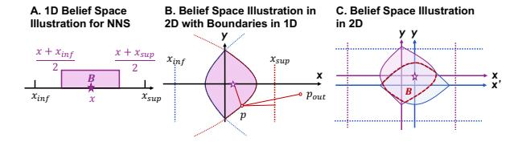

# *A. Design Motivation*

Section [IV](#page-4-0) illustrates the acceleration with dataflow for NNS in spatial data structure for one point. In this section, we will exploit the performance optimization potential between searches. Listing [2](#page-5-2) shows how NNS is performed in point cloud processing. PointCloudNNS shows the point-cloudwise NNS, which needs to iterate all points in the source point cloud (SrcPtCloud), to find the k nearest neighbors in the destination point cloud (DstPtCloud) for each. The scale of SrcPtCloud is greater than  $10^3$  points, so the most common parallel strategy is to bind different SrcPtCloud points to different threads for parallelization.

In point cloud data, the spatial proximity of points inherently reflects the locality of distinct objects, suggesting significant shared search paths in NNS due to geometric coherence among neighboring points. For traditional caches, the address is the only information used to exploit the locality. RSU enables the cache to obtain physical coordinate of each search which makes it possible to explore physical locality. Fig. 9 illustrates the idea: The searched nearest neighboring points (point 1,2,3,4 in Fig. 9) from a given point (Pos) most likely have a common non-root parent node ( $\square$  in Fig. 9).  $\square$ and all its parent nodes represent a three-dimensional space that encompasses all the searched, dubbed as shared space in Fig. 9. If the next search point is spatial proximity of the current one, the search process can likely initiate directly from the intermediate node instead of the root node. Therefore, this inspires us to design a dedicated hardware to buffer the shared space representation and memory address of \( \Boxed{\pi} \) for physical locality exploitation. We call it Path Buffer.

Fig. 9. Physical locality illustration and hardware logic design.

However, challenges exist in physical locality exploration:

- (i) Shared Space Reusing: As illustrated earlier in Fig. 4, if a new searching point is within the shared space represented by □, it does not guarantee that its nearest neighboring points is also in the space in Fig. 9.
- (ii) Search Paths Obtaining: Naive backtracking to find the shared parent need to save all the parents of all the searched node in stack, easily leading to stack overflow. Obtaining the search path to the target point with low computation and memory complexity is also a challenge.

Section V-B and V-C solve these two issues respectively.

### B. Shared Space Finding and Reusing

Based on the preceding analysis, we conclude that a critical challenge in spatial data structure searches lies in the gap between NNS and parent-child node relationships.

To address this issue, our key insight is that for any shared space S represented by an intermediate node, there exists a subspace-which we term the belief space (B)-such that if a searching point lies within B, its nearest neighbor is guaranteed to reside within S. Then we will focus on how to obtain valid B. Starting with the simplest case in 1D

space to figure out the key idea, we then present analysis and conclusions in a multidimensional space.

**Lemma 1** (1D Belief Space). For a one-dimensional region  $S = [x_{inf}, x_{sup}]$ , if there exists a point  $x \in S$ , then there exists a subregion  $B \subset S$ , such that  $\forall p \in B$  p's nearest point  $p_N \in S$ .

*Proof.* Fig. 10A directly shows the constructed results of  $B = [\frac{x_{inf} + x}{2}, \frac{x_{sup} + x}{2}]$ . For any  $p \in B$  and  $p_{out} \in (-\infty, x_{inf}) \cup (x_{sup}, \infty)$ ,  $|p - x| < |p_{out} - p|$ . Since there is at least one point x that is closer than any point outside S, the nearest neighbor of  $p \in B$  must be within S.

The proposed approach provides a constructive method: given any space S and a point  $x \in S$ , we can always construct the corresponding subregion B. The basic idea is to construct a range "where at least one neighboring point can be found" based on the relative relationships between boundaries and known points.

Fig. 10. The examples to illustrate the concept of brief space.

Fig. 10B and 10C further analyze this problem in two-dimensional space to intuitively demonstrate the construction method of B.

Fig. 10B first analyzes the case where S is bounded by two lines in only one dimension within a two-dimensional space. For any point in S, the distance from any  $p_{out}$  out of S to any p within S must be larger than the distance from line  $x_{inf}$  or  $x_{sup}$  to p. Therefore, we only need to consider the extreme case, i.e. the trajectories that are equidistant from the boundary line and x ( $\bigstar$  in Fig. 10B).

For  $x=x_{inf}$ , the boundary curve of B is the trajectory that is equidistant from point x and line  $x=x_{inf}$ . Naturally, this is a parabolic curve. By considering both boundaries simultaneously, we can derive the B of S in Fig. 10B: a conelike space constrained by two parabolas.

Furthermore, if both dimensions have the boundaries as shown in Fig. 10C, it is equivalent to the space enclosed by four parabolas. Correspondingly, we can extend this rule to 3D space and obtain a B verification rule suitable for program execution as introduced in Theorem 1.

**Theorem 1.** For a given point x within a space S, if the distance from the searching point to x is smaller than the distances from p to all S boundaries, p must be within B and can find its nearest neighbor within S.

Therefore, in the path buffer, we find the deepest shared parent node of the k nearest points ( $\square$  in Fig. 9) after each NNS and save the maximum and minimum values of different

dimensions of space S represented by the parent node. We also record the coordinates of founded nearest neighbor points x. For a new searching point p within S, if the distance between p and x is less than distances between p and any boundary of S, it represents that p is within the B and can definitely find its nearest neighbor in S. So we can directly perform its NNS from this point instead of the root node.

