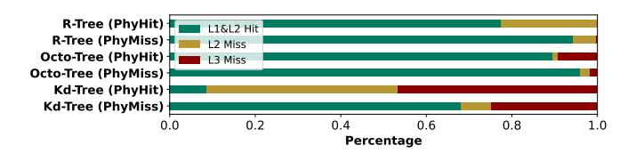

# VI. PREFETCHER DESIGN

RoboCortex accelerates spatial data structure search with dataflow on the one hand; on the other hand, softwarehardware interfaces redesign brings cache more opportunities for locality mining in semantic level. However, our evaluation finds that although physical locality mining improved NNS performance, the cache miss ratio increases (Fig. [13\)](#page-7-4).

Fig. 13. Cache miss rate gets higher with physical locality improvement due to the increasing of memory access irregularity. PhyHit/PhyMiss represents finding intermediate node in path buffer or not.

For irregular data structures, especially tree and graph, prefetching is inherently a difficult problem. Neither spatial prefetchers, which predict stride steps [\[5\]](#page-12-8), [\[27\]](#page-13-23), [\[45\]](#page-14-4), nor temporal prefetchers [\[4\]](#page-12-9), which mine repeated access sequences, provide effective memory access optimizations for this type of data structure. The reason lies in the fact that tree nodes linked by pointers do not have spatial continuity, and the searching process and control flow are closely related to data semantics. To solve this problem, runahead execution obtains the memory access sequence by running part of the program in advance [\[28\]](#page-13-24), [\[29\]](#page-13-25) but probably leading to manifest overhead.

Fortunately, in RoboCortex, the range of the next address to load can be obtained from RSU, so we can directly pass the child node address obtained by RSU to the prefetcher. Fig. [14](#page-8-0) shows the interaction from core pipeline to the prefetcher. In RSU's computing, the node is first loaded and its child nodes are all obtained. The next load raised by RSU will definitely appear in these child nodes. Therefore, a straightforward approach is to immediately pass the addresses of the child

Fig. 14. Prefetcher-RSU interaction in RoboCortex.

nodes to the prefetcher after loading, and let the prefetcher determine whether to prefetch the child nodes.

