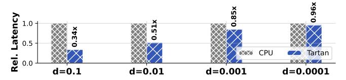
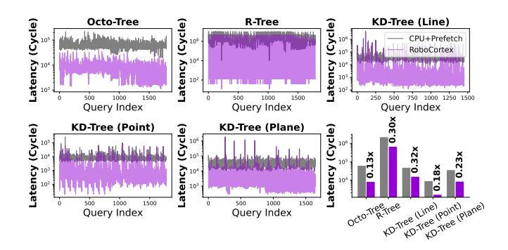
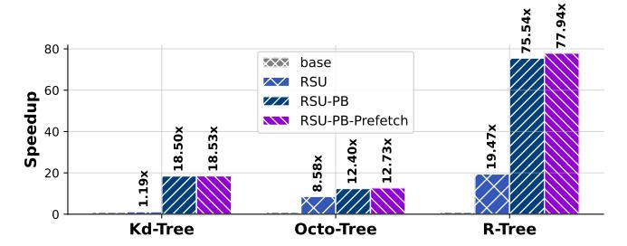
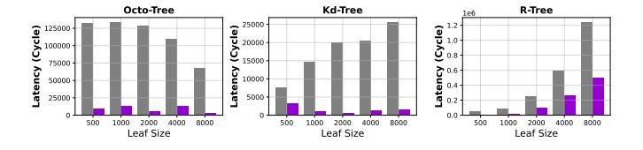

# VII. METHODOLOGY

Simulation System: We perform execution-driven simulation using zsim [\[40\]](#page-13-26) for evalution. We simulate an multicore system representative of mobile CPUs, with parameters shown in Table [II](#page-8-2) according to Nvidia Jetson AGX Orin [\[34\]](#page-13-27) for robotics and autonomous driving. The system uses outof-order cores, a three-level cache hierarchy with core-private L2 cache and a shared LLC, per-core prefetchers, and multichannel main memory as the default configuration.

Data Structures: We evaluate several representative spatial data structures for point cloud representation, including: Kd-Tree, Octo-Tree, and R-Tree with the PCL library.

TABLE II CONFIGURATION OF THE SIMULATED SYSTEM

| Module    | Configuration                                                                                                                                                                                             |
|-----------|-----------------------------------------------------------------------------------------------------------------------------------------------------------------------------------------------------------|
| Processor | 8 cores, x86-64 ISA, 3.5 GHz, OOO core: 2-level bpred with 4096×19-bit BHSRs + 32768×2-bit PHT, 4-wide is sue, 224-entry ROB, 97-entry issue window, 72-entry load buffer, 56-entry store buffer |
| L1 caches | 32 KB/core, 2-way set-associative, 4-cycle latency                                                                                                                                                        |
| L2 cache  | 256 KB/core, core-private, 8-way set-associative, 14-cycle latency, 16-entry stream/semantic prefetchers modeled                                                                                       |
| L3 cache  | shared 8 MB, 16-way set-associative, 45-cycle latency                                                                                                                                                     |
| Memory    | 2 controllers , DDR3-1600 (6400 MB/s per controller)                                                                                                                                                      |
| RSU       | 8×8 spatial fabric, 16-entry path buffers with LRU replace ment algorithm                                                                                                                              |

Baselines: We select different baselines for evaluation. To validate the overall workload performance, we select two baselines: base CPU [\[34\]](#page-13-27) in Table [II](#page-8-2) and robotics-oriented CPU Tartan [\[3\]](#page-12-1) with custom optimization for NNS. For certain design, we compare RSU with Terminus-like accelerator [\[22\]](#page-13-2) and compare our prefetcher with stream prefetcher [\[20\]](#page-13-28).

Fig. 16. Point cloud dataset for evaluation.

Dataset: As shown in Fig. [16,](#page-8-3) we select two types of point clouds for performance evaluation: point cloud in autonomous driving [\[24\]](#page-13-29) and object reconstruction [\[12\]](#page-13-30). Compared with the autonomous driving, the point cloud in the object reconstruction is more compact and theoretically has stronger physical locality. Our experiments will also verify this point.

#### VIII. EVALUATION

In this section, we first analyze the end-to-end performance improvement of a systematic workload after optimizing the nearest neighbor search (Section VIII-A). Then, we analyze the contributions of the three key components under different settings in NNS and provide recommendations for scheme selection in different scenarios (Section VIII-B). Finally, we conduct cost analysis of RoboCortex (Section VIII-C).

#### A. Systematic Evaluation

Fig. 17. End-to-end ICP(point-to-plane) performance comparison with CPU, Tartan [3], stream-prefetcher-based RoboCortex and RoboCortex. The labeled data represents the ratio of its latency to the basic CPU.

We first analyze the end-to-end performance of different hardware architectures using iterative closest point (ICP) as the workload. In this task, the critical performance bottleneck remains NNS, where NNS can occupy about 53.25% (ICP line) to 71.66% (ICP point) of the overall latency for one registration. We use basic CPU and Tartan as baselines, and compare the performance of stream prefetcher and the prefetcher proposed in this paper on RoboCortex. We use the suffixes "Stream" and "Semantic" to mark these two prefetchers respectively. To illustrate the source of the performance improvement, we separate the data into three groups:

- Initial Registration consists of three parts: initial spatial data structure building (Build), NNS, and Jacobi SVD factorization (SVD).
- Following Registration includes NNS and SVD, representing the following registrations.
- NNS Only compares pure NNS latency.

In the case of real-world registrations, the overall performance optimization ratio will gradually shift from the initial registration to the following registrations.

Fig. 17 shows that, for parallelizable parts, RoboCortex's optimizations for NNS can deliver a 2.27× end-to-end performance improvement and an 18%-28% optimization in end-to-end performance on the autonomous driving dataset. Tartan offers limited performance improvements for ICP, because Tartan's optimization for NNS comes from adaptive next-line prefetching. Such solution offers limited benefits for tasks with highly irregular addresses, such as spatial data structures.

Fig. 18. End-to-End task performance (NNS+SVD) evaluation for different registration types.

Next, we test the three possible modes of ICP (NNS+SVD) in Fig. 18. The difference lies in the required number of neighbor points and matrix iterative algorithms in the nearest neighbor search. For simplicity, we directly compare the results after removing data loading time. The results show that NNS with smaller k values yield more significant performance improvements (point-to-plane k=10, point-to-line k=5, point-to-point k=1).

Fig. 19. Accuracy vs. performance in previous works [3]. We set a 1.0 length cubic space and set the allowable error d to range from 0.0001 to 0.1 with 300 sampling points.

It should be noted that the experiments described above are based on results obtained from precise NNS. Tartan proposed an approximation algorithm [3] to trade accuracy for performance. To address this issue, we conducted supplementary experiments in Fig. 19, the results show that when the required search precision is sufficiently high, Tartan's performance converges with that of the baseline. Compared to Tartan, search optimization in RoboCortex does not come at the cost of accuracy.

Fig. 20. Speedup of RoboCortex over the multicore baseline when scaling 1-16 cores. Speedups are relative to the single-threaded CPU implementation.

Finally, we analyze the scalability of RoboCortex on end-to-end ICP workload. Fig. 20 shows the performance results for 1/8/16 cores. RoboCortex achieves significant performance improvements over both the baseline and Tartan. In summary, systematic experiments can yield the following takeaway message: *RoboCortex's NNS optimization directly reduces ICP* 

end-to-end latency by 18%-28%, indicating the CPU-side's great potential for point cloud processing.

#### B. Analytical Evaluation

Next, we will focus on analyzing the impact of different key factors on RoboCortex, as well as the different effects of RSU, physical locality exploration, and prefetching on performance.

Fig. 21. RoboCortex performance profits on different spatial data structures without data loading (scaled in log).

We start from analyzing RoboCortex's sensitivity to different data structures. In Fig. 21, we evaluated the performance of NNS on different spatial data structures compared to CPU with stride prefetcher. The results show that RoboCortex can deliver a performance improvement of 3.3-8.3× on different spatial data structures. It should be noted that different results also reflect differences in latency patterns between different data structures, which reflect differences in optimization reasons. For example, for Octo-Tree, the optimized performance is much lower than the baseline overall, while Kd-Tree does not show a significant reduction in minimum latency, but significantly reduces peak latency.

Fig. 22 and 23 analyze NNS performance of RoboCortex for three different types of spatial data structures on two datasets, autonomous driving and object reconstruction respectively. We compared four sets of experimental configurations: 'base' refers to the configuration without prefetchers, which is the same as the CPU configuration in Table II. In other three groups, we successively added RSU dataflow acceleration (RSU), physical locality mining based on Path Buffer (PB), and RSU-based prefetching (Prefetch) to the base CPU.

Fig. 22. Speedup of RoboCortex for autonomous driving

For the autonomous driving point clouds in Fig. 22, the results show a  $2.74-13.07 \times$  improvement in computing per-

formance across three different data structures. However, the benefits of RoboCortex's three optimization designs are not consistent across different data structures. For Kd-Tree, physical locality is the most important optimization strategy, while for Octo-Tree, the hardware acceleration effect of RSU itself is more important. Furthermore, the performance improvement that can be further provided by prefetching is also more significant for Kd-Tree and R-Tree, which can be verified by the results in Fig. 15 where the reduction of L3 cache miss and L2 cache miss of the two is more significant.

Fig. 23. Speedup of RoboCortex for object reconstruction.

Fig. 23 replaces the point cloud dataset with object reconstruction, we find that RoboCortex's computational performance improves significantly across all three data structures. The improvement is particularly significant for R-Trees. More compact point clouds not only provide richer physical locality, but also enable faster location of leaf nodes closer to the neighboring points, thereby avoiding the loading of excessive non-leaf nodes. Another reason lie in that bounding box-based data structure requires child node's location for decision-making. To avoid repeated loading, speculative approach is preferred: defaulting both child nodes to continue, let child node to decide whether it should have been pruned or not. Dispersed point clouds may increase invalid searches, reducing pruning efficiency and increasing searching latency.

The above results allow us to summarize the preferences between different data and data structures firstly: Compact/Disperse point clouds show preference for data structures based on bounding box/splitting domain. Besides that, we observe that in more disperse point cloud scenarios, prefetching yields even more pronounced performance improvements.

Fig. 24. Leaf size over latency (Grey: CPU, Purple: RoboCortex).

When we analyze the performance of RoboCortex in autonomous driving point cloud with different number of leaf nodes, we observe interesting features. Fig. 24 illustrates that when selecting specific points through random sampling, both

Kd-Tree and R-Tree (binary tree) exhibit a notable increase in depth as the data size grows, leading to a substantial rise in search latency. In contrast, as the number of points increases, the data distribution becomes progressively denser, allowing RoboCortex to demonstrate more effective performance optimization under large-scale point sets. Meanwhile, due to the structural nature of the Octree, the variation in depth within a defined spatial region is relatively small, resulting in an overall stable performance trend with no significant fluctuations. This suggests that for spatial data structures, the relationship between density and sparsity may be a more critical factor than the sheer number of points.

Fig. 25. RSU evaluation compared with Terminus-like accelerator [22] on object reconstruction datasets.

In Fig. 25, we further analyze the RSU and demonstrate the performance difference between RSU and previous work. In this experiment, we ignore the performance benefits brought by PB and prefetch, focusing only on the performance improvement and architectural considerations of the RSU itself. The main differences between RSU and Terminus lie in their support for explicit stacks and non-pure searching function. For spatial data structures, previous works struggled to effectively implement backtracking and shared state management, so NeedExpand could (i) be implemented with a fixed threshold and searches are performed speculatively in parallel ("Threshold" in Fig. 25) with a large number of redundant searches or (ii) to preserve shared state ("Ld&St" in 25) through frequent consistent reads and writes to memory. In that, the experiment setting represents:

- "RSU-Only": recursive search with explicit hardware-based stack used in RoboCortex.
- "Ld&St": recursive search utilizing software-based stack used in Terminus.
- "Threshold": approximate the recursive search as a simple non-recursive DFS.

Fig. 25 shows that both redundant searches and frequent memory access hinder dataflow from fully unlocking computing performance.

These results allow us to draw the following conclusions: RSU is advantageous in complex search logic and physical locality prefers compact point clouds.

