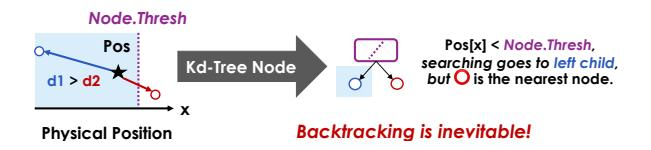

# <span id="page-1-0"></span>A. Spatial Data Structures for Point Cloud

Spatial data structures are a group of data structures to store geometric information [32], serving as the primary representation for point cloud data. Fig. 2 illustrates three representative spatial data structures: Kd-Tree, Octo-Tree, and R-Tree.


<span id="page-1-1"></span>Fig. 2. Tree-based spatial data structure.

The common feature of the above three data structures is that each non-leaf node represents a physical space, and the space represented by its children must be contained within the parent node's space, leaf nodes correspond to points in the point cloud. The differences between data structures lie in the spatial partitioning method. The Kd-Tree partitions the search space by alternately splitting each non-leaf node along different dimensions with a plane, bisecting the point distribution at each level [6]. For Octo-Tree, each node has 8 child nodes, representing 8 sub-cubes divided by half of the edge lengths of the three dimensions [7]. R-Tree is a bottom-up construction method where each parent node represents the bounding box for all its child nodes [16]. In all, Kd-Tree and Octo-Tree are organized based on top-down split domains, and R-Tree is organized based on bottom-up bounding boxes.


<span id="page-2-2"></span>Fig. 3. Native GPUs offer limited performance improvement for spatial data structures. (A) is evaluated with GPU (NVIDIA RTX 2060) and Intel i7-1165G7. (B) RTNN evaluation for NNS on NVIDIA RTX 3090. (C) is modeled with Gem5 taking NVIDIA Jetson Orin NX as the template. (D) For a VP-Tree based CUDA ICP program, even ignoring tree construction overhead, CPU-GPU data movement accounts for a non-negligible portion of the total latency on different cases.

As discussed in the introduction, the performance bottleneck in point cloud processing stems primarily from NNS operations in spatial data structures, which exhibit a time complexity of  $O(N\log M)$ . Although the search process offers substantial parallelism across N searching points, conventional GPU-based acceleration yields limited benefits on most data structures. As shown in Fig. 3A, our experimental results reveal that GPU offloading achieves limited speedup (less than  $2\times$ ) across various data structures [13], even with performance degradation due to frequent branch divergence. Prior works [14], [15] have demonstrated that the utilization of SM cores is very low due to extensive recursions and branches.

Although a few BVH-based search algorithms can address this issue by resuing Nvidia GPU ray tracing accelerators [49], they suffer from several limitations: first, this method restricts the selection of spatial data structures; second, they are not supported for edge computing devices such as the Jetson series [33]; third, limited scalability. As shown in Fig. 3B: when the search batch increases, latency on batch=1024 is already 405.6 times larger than when batch=64, posing limitations for large-scale spatial data structure search.

This inefficiency arises from the large memory access of the spatial data: a single LiDAR frame typically ranges from 8MB to 16MB or more. Our Gem5-based evaluation (Fig. 3C) shows that transferring data from the CPU to the GPU incurs significantly higher latency compared to processing directly in the L1 cache hierarchy. Fig. 3D further validates this on a

CUDA-based NNS program, CPU-GPU data movement takes 16.24%-42.57% of the overall latency on different cases.

Therefore, in this paper we focus on spatial data structure acceleration on CPUs to address the prevalence of such workloads. We argue that near-cache acceleration, as proposed in prior work [3], [22], [30], is a more efficient approach for spatial data structure acceleration optimizing. We also devote a dedicated discussion to BVH-tree acceleration on GPUs to demonstrate the generality of our approach.

#### B. Inevitable Backtracking in Spatial Data Structure



<span id="page-2-1"></span>Fig. 4. Example for the necessity of backtracking when searching.

We use an example to demonstrate the distinct challenges of spatial data structure from other 1D index data structures like B+ trees [23] and skip list [38]. In one word, Containment ≠ proximity, backtracking is unavoidable

Listing 1 takes Kd-Tree as an example to illustrate the searching of spatial data structure to find the nearest neighbors of Pos. The overall structure of the program is a depthfirst search (DFS) with pruning (Parts 1&3), which is the common structure of spatial data structure for NNS. The key distinction among spatial data structures lies in their child node selection strategies (Part 2). For Kd-Tree, searching is based on the positional relationship between the position of Pos in a particular dimension (Pos[Node.Axis]) and the splitting threshold (Node. Thresh). If it is less than the threshold, go to the left child nodes. However, DFS with backtracking cannot find the optimal results in the spatial data structure. Fig. 4 gives a counterexample. Although the coordinates of the \*\pi\$ on the x-axis are smaller than the threshold (Node.Thresh), searching then goes to ∘ according to Listing 1. But ★'s nearest neighbour point is o instead of o. Therefore, a heuristic discriminant function NeedExpand needs to be designed to decide whether to perform pruning or not and backtracking is needed in spatial data structure. In Kd-Tree, it ensures that the distance from the search point to the split surface is less than the maximum value of the found points, indicating the current branch is more likely to find closer points.

```
def KdTreeNNS(Pos, Node, ResList):
    # Part 1. Leaf Node Processing (Common)
    if Node.IsLeaf():
        ComputeDisForLeaf(Pos, Node)

# Part 2. Extension Rule (Kd-Tree Specific)
    if Pos[Node.Axis] < Node.Thresh:
        sup_child = Node.Left
        inf_child = Node.Right
    else:
        sup_child = Node.Right
    inf_child = Node.Left
# Part 3. Recursion (Common)
KdTreeNNS(Pos, sup_child, ResList)\nif NeedExpand(Pos, Node, ResList):</pre>
```

```
KdTreeNNS(Pos, inf_child, ResList)

def NeedExpand(Pos, Node, ResList):
\nif ResList.size() < k_: return true

d = Pos[Node.Axis] - Node.Thresh
\nif d * d < ResList.MaxDis() * Alpha:

return true
\nelse:

return false
```

Listing 1. Nearest neighbor search (NNS) algorithm based on Kd-Tree.

There are two key challenges that make existing dataflow-based data structure accelerators (like Terminus [22] or METAL [21]) not work:

- (i) Recursion support: Current accelerators only supports hash-based searching for tree-based data structure and does not support explicit recursion and backtracing. NNS is neither a non-backtracking search similar to B+ trees nor a breadth-first search, but rather requires DFS to ensure the search priority of different branches.
- (ii) Non-pure function: The search function of spatial data structure with shared ResList is not a pure function, stateless dataflow may not meet the requirements.

Therefore, additional dedicated hardware components need to be introduced for spatial data structure to implement the searching functions.

In summary, spatial data structures cannot simply traverse a single search path from the root to the target leaf node, unlike traditional index structures (e.g., B+ trees). Instead, they must support recursion and backtracking to handle complex spatial searches. Such inherent computational overhead poses a fundamental limitation for modern data structure searching accelerators, which are often optimized for backtracking-free access patterns. Section II-C will introduce them in details.

#### <span id="page-3-1"></span>C. Related Works

Here, we present the closest prior work to RoboCortex, which includes two categories: accelerators for certain spatial data structure and accelerators for irregular data structures.

Ray-Tracing-based Tree Traversal Accelerators. There are some tree search accelerators implemented using GPU-based ray tracing units. RTNN [49] performs neighbor search with ray tracing unit on GPUs. [8], [9] further optimize this with software-hardware co-design. However, due to the limitation of ray tracing unit, these methods can only perform bounding volume hierarchy(BVH) tree. TTA/TTA+ [1] achieved the generalization of tree search by adding operation units and computing modules in the GPU. However, the physical locality, i.e. the redundancy among searches for large-scale point cloud registration concerned by this paper, has not been fully exploited.

Irregular data structure acceleration. There have been some studies on data structures operating acceleration. täkō [42] avoids redundant computation by offloading the computational logic to cache and changing the programming interface to load results instead of intermediate data. Similarly encapsulating the data structure searching into semantic instruction are Xcache [43] and METAL [21], but they are

TABLE I COMPARISON WITH SOTA DESIGN

<span id="page-3-2"></span>

| Name             | Data<br>Structure<br>Acceleration | Recursive<br>Searching<br>Support | Avoid<br>Redundant<br>Search | Irregular<br>Pattern<br>Prefetch |
|------------------|-----------------------------------|-----------------------------------|------------------------------|----------------------------------|
| METAL [21]       | ✓                                 | Some                              |                              |                                  |
| täkō [42]        | $\checkmark$                      |                                   | ✓                            |                                  |
| Pipette [30]     | $\checkmark$                      | Some                              |                              | $\checkmark$                     |
| Terminus [22]    | $\checkmark$                      | Some                              |                              |                                  |
| Tartan [3]       | $\checkmark$                      |                                   |                              | $\checkmark$                     |
| TTA [49]         | $\checkmark$                      | $\checkmark$                      |                              | $\checkmark$                     |
| VoxelCache [11]  | $\checkmark$                      | Some                              |                              |                                  |
| RTNN [49]        | $\checkmark$                      | BVH-Only                          |                              |                                  |
| Treelet [8], [9] | $\checkmark$                      | BVH-Only                          |                              | $\checkmark$                     |
| Ours             | $\checkmark$                      | ✓                                 | ✓                            | $\checkmark$                     |

designed for domain-specific architectures. Pipette [30], Fifer [31], and Terminus [22] achieve speedups for irregular data structures along similar path, but they do not support explicit recursion and take redundant computation avoidance into consideration. As a robotics-specific CPU, Tartan [3] also optimizes point cloud tasks, but mainly focuses on prefetching, whose improvement is relatively limited compared to the above schemes. PointISA [18] accelerates massive distance calculations and sorting via ISA extensions, but its lazy NNS method heavily relies on sampling and redundancy searching can not be avoided. VoxelCache [11] has designed a near cache accelerator specifically for Voxel-based tree traversal, and has also carried out targeted cache replacement optimization. QuickNN [36] and BitNN [17] are NNS-oriented accelerators, but focusing on split domain based data structure only. Table I summarizes the differences between RoboCortex and prior systems, which lack one or several of the three features for spatial data structure.

#### III. SYSTEM OVERVIEW

<span id="page-3-0"></span>In this section, we introduce the general architecture of RoboCortex. Fig. 5 illustrates the framework. RoboCortex is a core-private acceleration framework. The CPU uses specific instructions to offload the spatial data structure searching logic and blocks the instructions. Once RoboCortex has completed execution, it returns the corresponding results and commit the instruction in the core pipeline. From a software perspective, RoboCortex is a memory unit that uses NNS coordinates as the key to retrieve the nearest neighbors.


<span id="page-3-3"></span>Fig. 5. Architecture overview of RoboCortex.

The instruction is designed as a very long instruction word: NNS Pos, RootAddr, Num, OAddr.

- Pos represents the point in the source point cloud for searching.
- RootAddr represents the root node address of the data structure being searched (destination point cloud).
- Num denotes the number of near neighbors in destination point cloud to be searched.
- OAddr indicates the start address of the searching result (output address).

Our design goal is to make the searching process of the spatial data structure directly completed by the memory system. To achieve this goal, three main components contribute to RoboCortex as shown in Fig. 5:

- RSU is the core hardware module that offloads search functions from software to a programmable dataflow array. RSU takes Pos and RootAddr as inputs and implements a sequential write of the searched results to OAddr near the L1 data cache.
- Path Buffer is a memory unit that pre-searches RootAddr for avoiding redundant search before RSU.
   If a node is found that Pos will pass through, replace RootAddr with its address.
- **Prefetcher** is allowed to obtain potential target addresses earlier, taking intermediate result of the RSU as the input.

In the following parts, section IV focuses on the primitives and micro-architectural design of RSU, section V will show how to avoid redundant searching based on the RSU, and finally section VI will present RSU-based prefetching.

