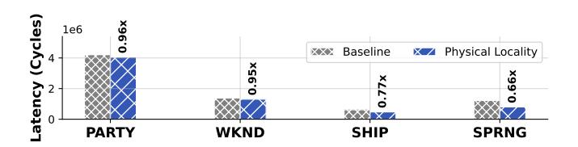

# C. Cost Evaluation

Finally, we analyze the cost of key designs in this paper. In RoboCortex, the path buffer is the design that needs to be analyzed for size. Fig. 26 shows the sensitivity of different

data structures to path buffer size. The results show that data structures such as Octo-Tree, which are not highly sensitive to physical locality optimization, do not show significant performance improvements with increases in path buffer size. However, for R-Tree and Kd-Tree, performance speedup increases almost linearly with buffer size. Considering the area overhead, we choose a fixed path buffer size of 16 in this paper and used the LRU strategy for replacement.

Fig. 26. Path buffer size influence for nearest neighbor searching. The speedup represents the performance improvement ratio over baseline CPU (40B for each item in INT32).

Fig. 27. Stack depth for each round for one RSU with simulation. The results reveals that size 36 can be enough for large scale point cloud registration.

Then, we analyze whether explicit stack would result in excessive hardware overhead. Fig. 27 shows the results. We find that the stack depth did not exceed 36 when execution, indicating the stack depth in this paper is acceptable. Taking the results of Fig. 27 and 26 all into consideration, the total buffer overhead introduced by RoboCortex can be controlled within 512B, which is much smaller than the size of the L1 cache in contemporary mobile CPUs (32-128KB) [34], [35]. Therefore, the memory overhead introduced by RoboCortex is acceptable.

We also implement the RTL of RSU and path buffer, then synthesize the corresponding area report with Synopsys Design Compiler. The UMC 28nm library is used for evaluation. The results reveal that, the CGRA part of RSU is 1.195 mm², taking 98.19% of the RSU. The path buffer takes 0.344 mm². Considering the scaling from 28nm to 8nm, our design only introduces an area overhead of approximately 2.3 mm² in total for the multi-core SoC comparable to Jetson Orin AGX (12 Cortex®-A78AE CPU cores with about 25mm² combining with 8nm 200mm² GA10b GPU), which is entirely acceptable for modern SoCs.

#### IX. DISCUSSION

### A. Application and Hardware Scope

In this paper, we mainly focus on the optimization and investigation of nearest neighbor search in spatial data structure on the CPU-side. However, we argue that the physical

locality method highlighted in this work possesses general applicability across existing spatial data structures on difference platforms. To demonstrate that our approach is not limited to point clouds and CPUs, we implemented an optimization for BVH traversal in ray tracing on Vulkan-Sim [39], a GPU simulator with dedicated ray tracing cores, achieving further performance improvements compared to current state-of-the-art approaches [8].

Fig. 28. Performance profits with leveraging physical locality in [8] with different objects for ray tracing on Vulkan-Sim [39].

While prior works [8], [9] achieve notable acceleration of BVH tree traversal via dedicated ray tracing cores and optimize BVH traversal locality and efficiency through treelet-based prefetching, our proposed physical locality differs by exploiting locality across consecutive search operations. Consequently, it can further enhance search performance on top of [8], thereby demonstrating the generalizability of our approach.

As illustrated in Fig. 28, even though the aforementioned work has already been extensively optimized for ray tracing, our method still achieves an additional performance improvement of 4%-34%. This experiment indicates that our proposed scheme is orthogonal to existing research and applies beyond point clouds—to ray tracing and potentially other spatial-data-structure-dominated domains—supporting the generality of spatial-data-structure-oriented acceleration and physical locality exploitation. However, we also note that the current formulation of our approach is not universally applicable to all search problems across all spatial data structures; these limitations will be discussed in detail in the next section.

#### B. Limitations

This work takes point cloud processing as a thread and focuses on the search problem in spatial data structures. From a query perspective, it addresses the problem of using **point** as the key and **point** as the value, with **minimum distance** as the criterion. The concept of physical locality generalizes this problem to scenarios where the query target is an **intermediate node**, thereby achieving versatility in the application of spatial data structures. However, the premise of this generalization lies in the need to construct a stable inclusion relationship: *the target leaf node must be contained within this intermediate node*.

Consequently, this approach can be naturally generalized to bounding volume-based collision detection problems, such as ray tracing [39] and obstacle avoidance [19], [44]. However, for nearest neighbor search, if the key is a **line** and the point-line distance is the criterion, the point-based belief

space proposed in this paper does not ensure the inclusion relationship. Therefore, it necessitates further specialization into a more specific belief space.

Overall, we argue that the presence of similar traversal paths across multiple searches is a general characteristic worthy of exploitation in all spatial data structures. In future work, we will further conduct comprehensive analyses on other spatial search problems.

#### X. CONCLUSION

This paper presents RoboCortex, a novel architecture for accelerating **spatial data structure** search through near-cache acceleration. We formulate the problem as spatial data structure optimization and take point cloud as the primary case; our evaluation shows that RoboCortex achieves 2.74-13.07× speedup for autonomous driving and 12.73-77.94× speedup over baselines for object reconstruction in NNS across different data structures. This paper also provides a detailed theoretical analysis of physical locality; the approach generalizes beyond point clouds, as illustrated by our ray tracing (BVH) experiments and discussion.

#### ACKNOWLEDGMENT

This work is supported by the China National Natural Science Foundation (No. T24B2007) and the STI 2030—Major Projects under Grant 2021ZD0200300.

### REFERENCES

- [1] Arvind and R. Nikhil, "Executing a program on the mit tagged-token dataflow architecture," *IEEE Transactions on Computers*, vol. 39, no. 3, pp. 300–318, 1990.
- [2] H. Baek, H. Lee, J.-Y. Kim, S. Jung, M. Choi, and J. Kim, "Trends in 3d point cloud contents sampling in mobile ar/vr platforms," in 2022 IEEE VTS Asia Pacific Wireless Communications Symposium (APWCS), 2022, pp. 171–175.
- [3] M. Bakhshalipour and P. B. Gibbons, "Tartan: Microarchitecting a robotic processor," in 2024 ACM/IEEE 51st Annual International Symposium on Computer Architecture (ISCA), 2024, pp. 548–565.
- [4] M. Bakhshalipour, P. Lotfi-Kamran, and H. Sarbazi-Azad, "Domino temporal data prefetcher," in 2018 IEEE International Symposium on High Performance Computer Architecture (HPCA), 2018, pp. 131–142.
- [5] M. Bakhshalipour, M. Shakerinava, P. Lotfi-Kamran, and H. Sarbazi-Azad, "Bingo spatial data prefetcher," in 2019 IEEE International Symposium on High Performance Computer Architecture (HPCA), 2019, pp. 399–411.
- [6] J. L. Bentley, "Multidimensional binary search trees used for associative searching," *Commun. ACM*, vol. 18, no. 9, p. 509–517, Sep. 1975. [Online]. Available: https://doi.org/10.1145/361002.361007
- [7] P. Chen, M. Li, Z. Wan, Y.-S. Hsiao, M. Yu, V. J. Reddi, and Z. Liu, "Octocache: Caching voxels for accelerating 3d occupancy mapping in autonomous systems," in *Proceedings of the 30th ACM International Conference on Architectural Support for Programming Languages and Operating Systems, Volume* 2, ser. ASPLOS '25. New York, NY, USA: Association for Computing Machinery, 2025, p. 704–718. [Online]. Available: https://doi.org/10.1145/3676641.3716263
- [8] Y. H. Chou and T. M. Aamodt, "Treelet accelerated ray tracing on gpus," in Proceedings of the 30th ACM International Conference on Architectural Support for Programming Languages and Operating Systems, Volume 2, ser. ASPLOS '25. New York, NY, USA: Association for Computing Machinery, 2025, p. 1334–1347. [Online]. Available: https://doi.org/10.1145/3676641.3716279
- [9] Y. H. Chou, T. Nowicki, and T. M. Aamodt, "Treelet prefetching for ray tracing," in 2023 56th IEEE/ACM International Symposium on Microarchitecture (MICRO), 2023, pp. 742–755.
- [10] S. Dave and A. Shrivastava, "Ccf: A cgra compilation framework," 2018.

- [11] S. Durvasula, R. Kiguru, S. Mathur, J. Xu, J. Lin, and N. Vijaykumar, "Voxelcache: Accelerating online mapping in robotics and 3d reconstruction tasks," in *Proceedings of the International Conference on Parallel Architectures and Compilation Techniques*, ser. PACT '22. New York, NY, USA: Association for Computing Machinery, 2023, p. 239–251. [Online]. Available:<https://doi.org/10.1145/3559009.3569675>
- [12] EPFL Computer Graphics and Geometry Laboratory, "Statues Dataset: A Large-Scale 3D Shape Dataset," [https://lgg.epfl.ch/statues](https://lgg.epfl.ch/statues_dataset.php) dataset. [php,](https://lgg.epfl.ch/statues_dataset.php) 2020, accessed: 2023-11-15. [Online]. Available: [https://lgg.epfl.](https://lgg.epfl.ch/statues_dataset.php) ch/statues [dataset.php](https://lgg.epfl.ch/statues_dataset.php)
- [13] FeeZhu, "Icp - iterative closest point algorithm implementation," [https:](https://github.com/FeeZhu/ICP.git) [//github.com/FeeZhu/ICP.git,](https://github.com/FeeZhu/ICP.git) 2023.
- [14] T. Foley and J. Sugerman, "Kd-tree acceleration structures for a gpu raytracer," in *Proceedings of the ACM SIGGRAPH/EUROGRAPHICS Conference on Graphics Hardware*, ser. HWWS '05. New York, NY, USA: Association for Computing Machinery, 2005, p. 15–22. [Online]. Available:<https://doi.org/10.1145/1071866.1071869>
- [15] M. Goldfarb, Y. Jo, and M. Kulkarni, "General transformations for gpu execution of tree traversals," in *Proceedings of the International Conference on High Performance Computing, Networking, Storage and Analysis*, ser. SC '13. New York, NY, USA: Association for Computing Machinery, 2013. [Online]. Available: <https://doi.org/10.1145/2503210.2503223>
- [16] A. Guttman, "R-trees: a dynamic index structure for spatial searching," in *Proceedings of the 1984 ACM SIGMOD International Conference on Management of Data*, ser. SIGMOD '84. New York, NY, USA: Association for Computing Machinery, 1984, p. 47–57. [Online]. Available:<https://doi.org/10.1145/602259.602266>
- [17] M. Han, L. Wang, L. Xiao, H. Zhang, T. Cai, J. Xu, Y. Wu, C. Zhang, and X. Xu, "Bitnn: A bit-serial accelerator for k-nearest neighbor search in point clouds," in *2024 ACM/IEEE 51st Annual International Symposium on Computer Architecture (ISCA)*, 2024, pp. 1278–1292.
- [18] M. Han, L. Wang, L. Xiao, H. Zhang, B. Jiang, X. Xie, J. Zhu, S. Wei, and L. Liu, *PointISA: ISA-Extensions for Efficient Point Cloud Analytics via Architecture and Algorithm Co-Design*. New York, NY, USA: Association for Computing Machinery, 2025, p. 1867–1881. [Online]. Available:<https://doi.org/10.1145/3725843.3756122>
- [19] Y. Han, Y. Yang, X. Chen, and S. Lian, "Dadu series - fast and efficient robot accelerators," in *2020 IEEE/ACM International Conference On Computer Aided Design (ICCAD)*, 2020, pp. 1–8.
- [20] I. Hur and C. Lin, "Memory prefetching using adaptive stream detection," in *2006 39th Annual IEEE/ACM International Symposium on Microarchitecture (MICRO'06)*, 2006, pp. 397–408.
- [21] A. M. A. Kumar, A. Prasanna, J. Balkind, and A. Shriraman, "Metal: Caching multi-level indexes in domain-specific architectures," in *Proceedings of the 29th ACM International Conference on Architectural Support for Programming Languages and Operating Systems, Volume 2*, ser. ASPLOS '24. New York, NY, USA: Association for Computing Machinery, 2024, p. 715–729. [Online]. Available:<https://doi.org/10.1145/3620665.3640402>
- [22] H. R. Lee and D. Sanchez, "Terminus: A programmable accelerator for read and update operations on sparse data structures," in *2024 57th IEEE/ACM International Symposium on Microarchitecture (MICRO)*. IEEE, Nov. 2024, p. 1233–1246. [Online]. Available: <http://dx.doi.org/10.1109/MICRO61859.2024.00092>
- [23] P. L. Lehman and s. B. Yao, "Efficient locking for concurrent operations on b-trees," *ACM Trans. Database Syst.*, vol. 6, no. 4, p. 650–670, Dec. 1981. [Online]. Available:<https://doi.org/10.1145/319628.319663>
- [24] Y. Liao, J. Xie, and A. Geiger, "Kitti-360: A novel dataset and benchmarks for urban scene understanding in 2d and 3d," *IEEE Transactions on Pattern Analysis and Machine Intelligence*, vol. 45, no. 3, pp. 3292– 3310, 2023.
- [25] D. Lv, X. Ying, Y. Cui, J. Song, K. Qian, and M. Li, "Research on the technology of lidar data processing," in *2017 First International Conference on Electronics Instrumentation and Information Systems (EIIS)*, 2017, pp. 1–5.
- [26] M. Mercaldi, S. Swanson, A. Petersen, A. Putnam, A. Schwerin, M. Oskin, and S. J. Eggers, "Instruction scheduling for a tiled dataflow architecture," in *Proceedings of the 12th International Conference on Architectural Support for Programming Languages and Operating Systems*, ser. ASPLOS XII. New York, NY, USA: Association for Computing Machinery, 2006, p. 141–150. [Online]. Available: <https://doi.org/10.1145/1168857.1168876>

- [27] P. Michaud, "Best-offset hardware prefetching," in *2016 IEEE International Symposium on High Performance Computer Architecture (HPCA)*, 2016, pp. 469–480.
- [28] O. Mutlu, J. Stark, C. Wilkerson, and Y. Patt, "Runahead execution: an alternative to very large instruction windows for out-of-order processors," in *The Ninth International Symposium on High-Performance Computer Architecture, 2003. HPCA-9 2003. Proceedings.*, 2003, pp. 129–140.
- [29] A. Naithani, J. Feliu, A. Adileh, and L. Eeckhout, "Precise runahead execution," in *2020 IEEE International Symposium on High Performance Computer Architecture (HPCA)*, 2020, pp. 397–410.
- [30] Q. M. Nguyen and D. Sanchez, "Pipette: Improving core utilization on irregular applications through intra-core pipeline parallelism," in *2020 53rd Annual IEEE/ACM International Symposium on Microarchitecture (MICRO)*, 2020, pp. 596–608.
- [31] ——, "Fifer: Practical acceleration of irregular applications on reconfigurable architectures," in *MICRO-54: 54th Annual IEEE/ACM International Symposium on Microarchitecture*, ser. MICRO '21. New York, NY, USA: Association for Computing Machinery, 2021, p. 1064–1077. [Online]. Available: [https://doi.org/10.1145/3466752.](https://doi.org/10.1145/3466752.3480048) [3480048](https://doi.org/10.1145/3466752.3480048)
- [32] J. Nievergelt and P. Widmayer, *Spatial data structures: Concepts and design choices*. Springer Berlin Heidelberg, 1997, p. 153–197. [Online]. Available: [http://dx.doi.org/10.1007/3-540-63818-0](http://dx.doi.org/10.1007/3-540-63818-0_6) 6
- [33] NVIDIA Community. (2023) Optix support for jetson orin devices. NVIDIA Developer Forums. [Online]. Available: [https://forums.](https://forums.developer.nvidia.com/t/optix-support-for-jetson-orin-devices/250038/5) [developer.nvidia.com/t/optix-support-for-jetson-orin-devices/250038/5](https://forums.developer.nvidia.com/t/optix-support-for-jetson-orin-devices/250038/5)
- [34] NVIDIA Corporation, "NVIDIA Jetson Orin," [https://www.nvidia.cn/](https://www.nvidia.cn/autonomous-machines/embedded-systems/jetson-orin/) [autonomous-machines/embedded-systems/jetson-orin/,](https://www.nvidia.cn/autonomous-machines/embedded-systems/jetson-orin/) 2022, accessed: 2023-11-15. [Online]. Available: [https://www.nvidia.cn/autonomous](https://www.nvidia.cn/autonomous-machines/embedded-systems/jetson-orin/)[machines/embedded-systems/jetson-orin/](https://www.nvidia.cn/autonomous-machines/embedded-systems/jetson-orin/)
- [35] PhoneDB, "Apple A18 (APL1V08/T8142 "Tupai") Processor Detailed Specifications," [https://phonedb.net/index.php?m=processor&](https://phonedb.net/index.php?m=processor&id=992&c=apple_a18_apl1v08_t8142__tupai&d=detailed_specs) id=992&c=apple a18 apl1v08 t8142 [tupai&d=detailed](https://phonedb.net/index.php?m=processor&id=992&c=apple_a18_apl1v08_t8142__tupai&d=detailed_specs) specs, 2024, accessed: 2024-07-28. [Online]. Available: [https://phonedb.net/index.php?m=processor&id=992&c=apple](https://phonedb.net/index.php?m=processor&id=992&c=apple_a18_apl1v08_t8142__tupai&d=detailed_specs) a18 apl1v08 t8142 [tupai&d=detailed](https://phonedb.net/index.php?m=processor&id=992&c=apple_a18_apl1v08_t8142__tupai&d=detailed_specs) specs
- [36] R. Pinkham, S. Zeng, and Z. Zhang, "Quicknn: Memory and performance optimization of k-d tree based nearest neighbor search for 3d point clouds," in *2020 IEEE International Symposium on High Performance Computer Architecture (HPCA)*, 2020, pp. 180–192.
- [37] R. Prabhakar, J. Zhou, D. Gandhi, Y. Choi, M. Khayatzadeh, K. Kim, U. Durairajan, J. Park, S. Sarkar, and J. L. Shin, "16.4: Sambanova sn40l: A 5nm 2.5d dataflow accelerator with three memory tiers for trillion parameter ai," in *2025 IEEE International Solid-State Circuits Conference (ISSCC)*, vol. 68, 2025, pp. 288–290.
- [38] W. Pugh, "Skip lists: a probabilistic alternative to balanced trees," *Commun. ACM*, vol. 33, no. 6, p. 668–676, Jun. 1990. [Online]. Available:<https://doi.org/10.1145/78973.78977>
- [39] M. Saed, Y. H. Chou, L. Liu, T. Nowicki, and T. M. Aamodt, "Vulkansim: A gpu architecture simulator for ray tracing," in *2022 55th IEEE/ACM International Symposium on Microarchitecture (MICRO)*, 2022, pp. 263–281.
- [40] D. Sanchez and C. Kozyrakis, "Zsim: fast and accurate microarchitectural simulation of thousand-core systems," in *Proceedings of the 40th Annual International Symposium on Computer Architecture*, ser. ISCA '13. New York, NY, USA: Association for Computing Machinery, 2013, p. 475–486. [Online]. Available: <https://doi.org/10.1145/2485922.2485963>
- [41] B. C. Schwedock and N. Beckmann, "Leviathan: A unified system for general-purpose near-data computing," in *2024 57th IEEE/ACM International Symposium on Microarchitecture (MICRO)*, 2024, pp. 1278–1294.
- [42] B. C. Schwedock, P. Yoovidhya, J. Seibert, and N. Beckmann, "tak¨ o:¯ a polymorphic cache hierarchy for general-purpose optimization of data movement," in *Proceedings of the 49th Annual International Symposium on Computer Architecture*, ser. ISCA '22. New York, NY, USA: Association for Computing Machinery, 2022, p. 42–58. [Online]. Available:<https://doi.org/10.1145/3470496.3527379>
- [43] A. Sedaghati, M. Hakimi, R. Hojabr, and A. Shriraman, "Xcache: a modular architecture for domain-specific caches," in *Proceedings of the 49th Annual International Symposium on Computer Architecture*, ser. ISCA '22. New York, NY, USA: Association

- for Computing Machinery, 2022, p. 396–409. [Online]. Available: <https://doi.org/10.1145/3470496.3527380>
- [44] D. Shah and T. M. Aamodt, "Collision prediction for robotics accelerators," in *2024 ACM/IEEE 51st Annual International Symposium on Computer Architecture (ISCA)*, 2024, pp. 566–581.
- [45] S. Somogyi, T. Wenisch, A. Ailamaki, B. Falsafi, and A. Moshovos, "Spatial memory streaming," in *33rd International Symposium on Computer Architecture (ISCA'06)*, 2006, pp. 252–263.
- [46] A. ten Pas, M. Gualtieri, K. Saenko, and R. Platt, "Grasp pose detection in point clouds," *Int. J. Rob. Res.*, vol. 36, no. 13–14, p. 1455–1473, Dec. 2017. [Online]. Available:<https://doi.org/10.1177/0278364917735594>
- [47] Y. Tong, X. Zhang, R. Wang, Z. Song, S. Wu, S. Zhang, Y. Wang, and J. Yuan, "Tc2 li-slam: A tightly-coupled camera-lidar-inertial slam system," *IEEE Robotics and Automation Letters*, vol. 9, no. 9, pp. 7421– 7428, 2024.
- [48] J. Vahrenhold, *B-trees*. Springer New York, 2016, p. 244–250. [Online]. Available: [http://dx.doi.org/10.1007/978-1-4939-2864-4](http://dx.doi.org/10.1007/978-1-4939-2864-4_57) 57
- [49] Y. Zhu, "Rtnn: accelerating neighbor search using hardware ray tracing," in *Proceedings of the 27th ACM SIGPLAN Symposium on Principles and Practice of Parallel Programming*, ser. PPoPP '22. New York, NY, USA: Association for Computing Machinery, 2022, p. 76–89. [Online]. Available:<https://doi.org/10.1145/3503221.3508409>